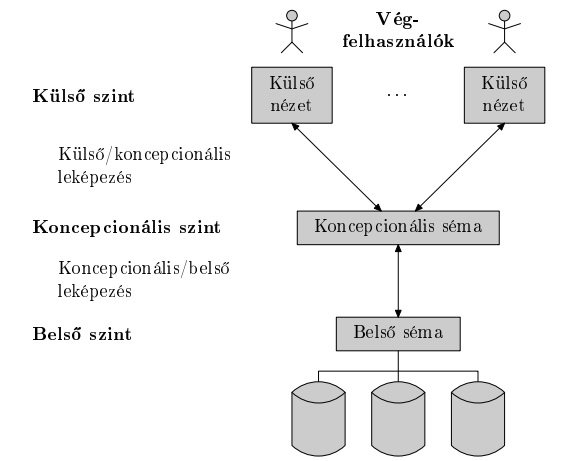
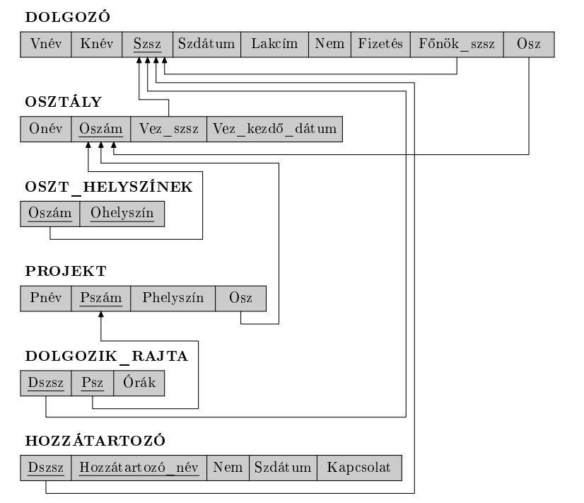
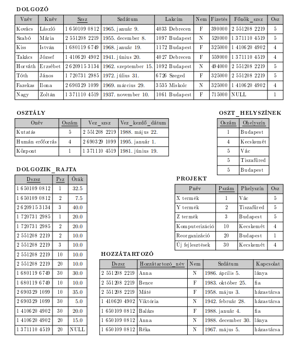
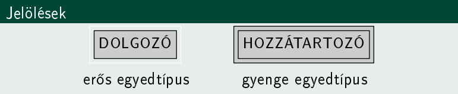
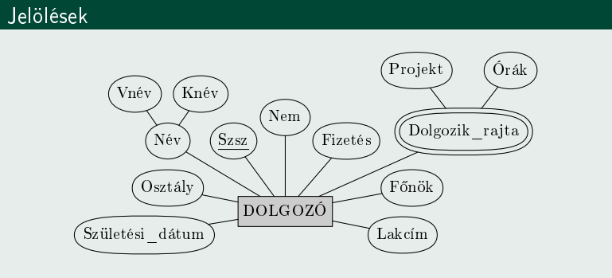
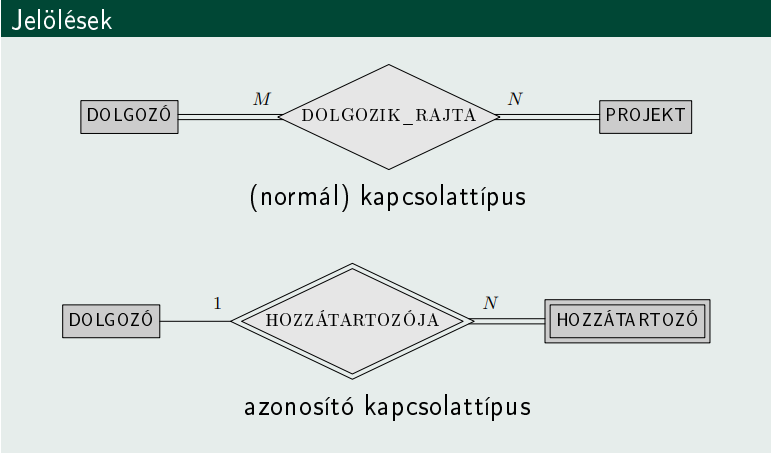
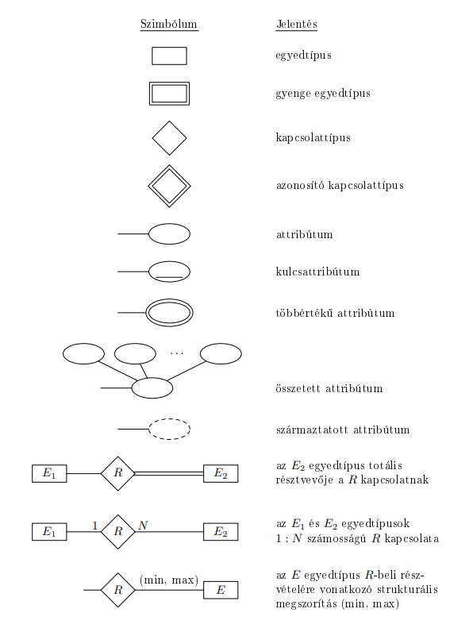
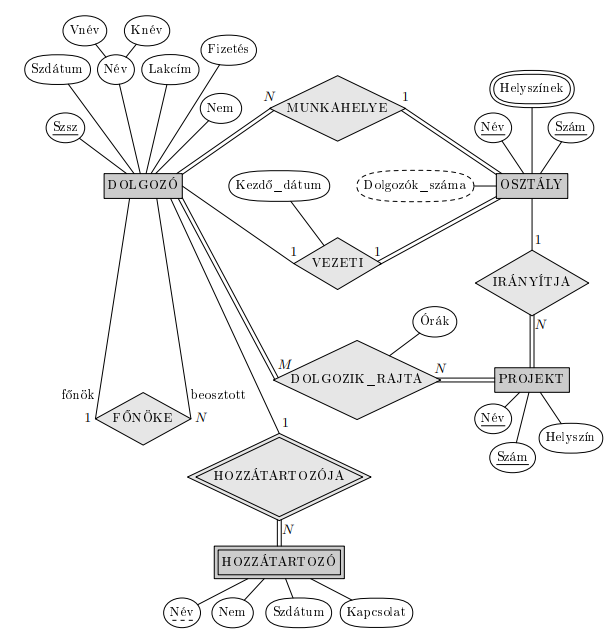

[⬅ Vissza a főoldalra](../../zarovizsga.md)

# 1. tétel: Adatbázisrendszerek. Adatbázis, adatbázisrendszer, adatbázis-kezelő rendszer (DBMS) fogalma és jellemzői. Egyed, tulajdonság és kapcsolat fogalma és tulajdonságai. Relációs, objektum-relációs és NoSQL adatbázisok jellemzése. A funkcionális függés fogalma. Koncepcionális adatbázis-tervezés, az ER modell és leképezése relációs modellre. Az SQL elemei: DDL, DML, DCL, egyszerű lekérdezések és táblák összekapcsolása

---

### Adatbázis, adatbázisrendszer, adatbázis-kezelő rendszer (DBMS) fogalma és jellemzői.

**Adatbázis** - egymással logikailag összefüggő egymáshoz kapcsolódó, belső jelentéssel lévő adatok összessége.
Speciális célra tervezett, felépített és közzétett adatok együttese.
**Formálisan**: adatmodell és egyettulajdonság/kapcsolat előfordulások összege

**Adat -** olyan ismert tény, amely számszerűsíthető és implicit (magától értetődő) jelentése van.

**Kisvilág -** a valós világ egy része, amelyről az adatbázis az adatokat tárolja.

**Adatbázis-kezelő rendszer (DBMS) -** olyan szoftvercsomag/rendszer, amely számítógépes adatbázisok létrehozását és karbantartását támogatja.

**Adatbázisrendszer -** A DBMS szoftver magával az adatokkal együtt. Néha az alkalmazásokat is beleértjük.

**Adatmodell -** fogalmak olyan összessége, amely leírja az adatbázis szerkezetét, azokat a műveleteket, melyekkel ez a szerkezet módosítható, és bizonyos megszorításokat, melyeket az adatbázisnak ki kell elégítenie.

**Adatmodellek típusai:**

- **Koncepcionális** - olyan fogalmakkal dolgzoik, amelyek közel vannak ahhoz, ahogy a legtöbb felhasználó gondolkodik az adatokról.

- **Fizikai** - olyan fogalmakkal dolgozik, amelyek azt írják le ahogy az adatok eltárolódnak a számítógépben.

- **Implementációs** - olyan fogalmakkal dolgozik, amelyek a fenti két típus között helyezkednek el. A legtöbb DBMS implementáció ezt használja (pl. relációs).

**DBMS sémák:**

- **Belső séma**: szerkezet és elérési utak fizikai tárolásának leírása.

- **Koncepcionális séma**: a teljes adatbázis szerkezetének és megszorításainak leírása.

- **Külső séma**: különböző felhasználói nézetzek leírása.

**DBMS architektúrák:**

- **Centralizált**: egy helyen minden, DBMS, hardver, alkalmazói programok, távoli terminálokon keresztül érik el a felhasználók, a feldolgozás központosított.

- **Két rétegű kliens-szerver architektúra:** több különböző célfeladatra dedikált szerverből és kliensekből áll. A kliensek szükség szerint érik el a szervereket.

- **Három rétegű kliens-szerver architektúra:** általánosan elterjedt a webalkalmazások számára. A két réteg egy közbenső réteggel egészül ki, alkalmazás-szerver/web-szerver.

---

### Egyed, tulajdonság és kapcsolat fogalma és tulajdonságai.

**Egyed** - a valós világnak azon eleme, mely a modellezés tárgyát képzi.

**Egyedtípus** - azonos tulajdonságokkal rendelkező egyedek absztrakciója

**Tulajdonság** - egyednek a modellezés szempontjából lényeges jellemzője

**Tulajdonságtípus** - azonos szerepű tulajdonságok absztrakciója

**Kapcsolat** - két vagy több egyedtípus közt fennálló viszony.

**Kapcsolattípus** - két, vagy több egyedtípus közt egyértelműen meghatározott viszony.

**Bachmann-féle fogalomrendszer**

|             | absztrakt        | konkrét                 |
| ----------- | ---------------- | ----------------------- |
| egyed       | egyedtípus       | egyed-előfordulás       |
| tulajdonság | tulajdonságtípus | tulajdonság-előfordulás |
| kapcsolat   | kapcoslattípus   | kapcsolat-előfordulás   |

**Tulajdonságtípusok osztályzása**

- Szerkezet:
  - egyszerű, vagy atomi (pl. születési hely)
  - összetett (pl. lakcím)

- Hány értéket vehet fel egyszerre:
  - egyértékű (pl. születési dátum)
  - többértékű (pl. felvett kurzusok)

- Tárolása:
  - tárolt
  - származtatott

**NULL érték:** nem alkalmazható, nem értelmezett.

**Kapcsolattípusok osztályozása**:

- kapcsolat foka: bináris, ternáris, ...
- bináris kapcsolat számossága: 1:1, 1:N, N:M
- bináris kapcsolat szorossága: kötelező, félig kötelező, opcionális

---

### Relációs, objektum-relációs és NoSQL adatbázisok jellemzése.

**Alapfogalmak:**

- **Sor/Rekord**: Minden egyes sor adatelemei a modellezett kisvilág egy egyed-előfordulásáról vagy egy kapcsolat-előfordulásáról tartalmaznak adatokat.

- **Oszlop**: minden egyes oszlop fejléccel rendelkezik, amely az illető oszlopban lévő adatok jelentéséről ad információt.

- **Relációséma**: A relációséma azt írja le, hogy egy reláció milyen attribútumokból áll. Jelölése: $R(A_1, A_2, \dots, A_n)$ ahol $R$ a reláció neve, $A_1, A_2, \dots, A_n$​ pedig az attribútumok nevei. Minden attribútumhoz tartozik egy tartomány, amely megadja, hogy az adott attribútum milyen értékeket vehet fel; ezt az attribútum tartományának nevezzük, és $\text{dom}(A_i)$-vel jelöljük. Az attribútumok száma a reláció foka.
  Pl.: $\text{HALLGATÓ(Név, Neptun\_kód)}$

- **Reláció**: Egy $R(A_1, A_2, \dots, A_n)$ relációsémához tartozó reláció a séma konkrét adatait tartalmazza. Ezt általában $r(R)$-rel vagy egyszerűen $r$-rel jelöljük. A reláció rekordokból, más néven sorokból álló halmaz: $r = \{t_1, t_2, \dots, t_m\}$. Minden rekord egy $n$ elemű rendezett lista, vagyis egy olyan $n$-es, amelyben az egyes értékek megfelelnek a megfelelő attribútumok tartományának. Tehát $t_i = <v_{i1}, v_{i2}, \dots, v_{in}>$ahol minden $v_{ij}$ vagy az $A_j$ attribútum tartományából származik, vagy egy speciális $\text{NULL}$ érték.
  Pl.: $r(\text{HALLGATÓ}) = \{\text{<"Kis Anna", "ABC123">, <"Nagy Péter", "XYZ456">\}}$
  Vagyis amíg a relációséma nem változik, addig a reláció mindig a valós világ pillanatnyi állapotát tükrözi.

- **Megszorítások csoportosítása:**
  - **Modellalapú / implicit**: az adatok matematikai relációba szerveződnek

  - **Sémaalapú / explicit**: adatmodell sémáiban közvetlenül kifejezett megszorítások, pl. tartomány-, kulcs-, NULL-érték megszorítás

  - **Szemantikus / üzleti megszorítások**: mi számít értelmesen helyes adatnak, nem lehet leírni expliciten, pl. alkalamzott fizetése nem lehet nagyobb mint a menedzseré

- **Relációs adatbázisséma:** $S = \{R_1, R_2, \dots, R_m\}$ relációséma-halmaz, valamint integritási megszorítások halmazának együttese.

- **Relációs adatbázis:** $\text{DB}=\{r_1, r_2, \dots, r_m\}$ relációk halmaza, ahol minden $r_i$ az $R_i$ séma egy relációja, és minden $r_i$ reláció kielégíti az integritási megszorításokat.

- **Műveletek:** INSERT, DELETE, MODIFY

---

- **ODB**: objektumorientált adatbázis. Az adatokat objektumok formájában tárolja.

- **ODBMS**: objektumorientált adatbázis-kezelő rendszer.

- **ORDBMS**: objektum-relációs adatbázis-kezelő rendszer.  
  A hagyományos relációs adatbázis-kezelők objektumorientált bővítése.

- **Fő jellemző és előny**:
  - a tervező meg tudja adni az összetett objektumok szerkezetét,
  - és az ezeken végezhető műveleteket is.

- **Miért jelent meg**:
  - igény volt komplex adatbázisokra,
  - igény volt összetett, tetszőleges adattípusokra,
  - igény volt az ilyen adatokhoz tartozó műveletekre.

- **OID (Object Identifier)**: objektumazonosító.  
  Minden objektumhoz tartozik egy egyedi azonosító, amely az objektum teljes élete során megmarad.

- **Perzisztencia**: állandóság.  
  Az objektumok eltárolódnak az adatbázisban, később visszakereshetők, és más programokkal is megoszthatók.

- **Tranziencia**: ideiglenesség.  
  A nem perzisztens objektumok csak átmenetileg léteznek.

- **Elnevezési mechanizmus**: az objektum egy állandó névvel tehető elérhetővé.

- **Elérhetőségi mechanizmus**: egy objektum akkor is perzisztens lehet, ha egy másik perzisztens objektumból hivatkozásokon keresztül elérhető.

- **Összetett objektumok támogatása**:  
  az objektumok tetszőlegesen összetett szerkezetűek lehetnek, ezért az összetartozó információ nem feltétlenül szóródik szét sok relációba.

- **Extent**: azonos típusú objektumok kollekciója.  
  Az extent célja, hogy az adott típus objektumait összefogja, és gyakran ezek perzisztens tárolását is biztosítsa.

- **Extentekre vonatkozó megszorítás**:  
  az altípus extentje részhalmaza a szülőtípus extentjének.

- **Kapcsolatok kezelése**:  
  az objektumok közötti kapcsolatok hivatkozásokkal is megadhatók, nem csak kulcsértékekkel.

- **Verziókezelés**:  
  egy objektum időbeli történetének nyomon követése.

- **Sémaevolúció**:  
  a séma módosíthatósága időben.

  ***

- **CAP tétel**: egy elosztott rendszer az alábbi 3 alapvető képességből legfeljebb kettőt megvalósít:
  - **Konzisztencia / Consistency**: minden csomópont adott időpillanatban ugyanazt látja

  - **Rendelkezésre állás / Availability**: minden kérésre érkezik válasz (Sikeres / sikertelen)

  - **Particionálástűrés / Partition Tolerance:** a rendszer egy tetszőleges üzenet elvesztése, vagy a rendszer egy részének esetén is tovább működik

- **Lehetőségek:**
  - **Particionálástűrés elhagyása** $\Rightarrow$ centralizált, minden egy helyen, skálázhatósági problémát okoz

  - **Rendelkezésre állás elhagyása** $\Rightarrow$ az érintett szolgáltatások megvárják egy esemény bekövetkezésekor, amíg az adatok konzisztenciája helyreáll, ezalatt elérhetetlenné válnak

  - **Konzisztencia elhagyása** $\Rightarrow$ ez írja le legjobban a valóságot, rendelkezésre állás fontosabb.

- **Konzisztenciafajták**:
  - **kliens oldali** - hogyan figyeljük meg az adatok változását
  - **szerver oldali** - hogyan áramlanak a módosítások a rendszeren keresztül

  - **erős konzisztencia** - ha egy írási művelet sikeresen befejeződött, akkor az utána következő olvasások már mindenhol a legfrissebb értéket adják vissza.

  - **gyenge konzisztencia** - a rendszer nem garantálja, hogy egy későbbi olvasás már a legfrissebb értéket adja vissza,vagyis egy módosítás után egy ideig még régi érték is visszajöhet. Azt az időszakot, amíg a rendszer nem garantálja minden megfigyelő számára az új érték láthatóságát, **inkonzisztenciaablaknak** nevezzük.

  - **esetleges konzisztencia** - ha egy adaton egy idő után nem történik újabb módosítás, akkor előbb-utóbb minden olvasás ugyanazt, vagyis a legutolsó értéket fogja visszaadni.

- **ACID**  
  _Atomicity, Consistency, Isolation, Durability_
  - **Erős konzisztencia** – az adatok mindig pontosak és egységesek

  - **Pesszimista ütemezés** – ütközések megelőzése zárolással

  - **Bonyolult séma-evolúció** – a struktúra nehezen változtatható

  - **Commit központú működés** – a tranzakciók vagy teljesen lefutnak, vagy visszagörgetés történik

  - Megbízható, de lassabb működés

- **BASE**  
  _Basically Available, Soft-state, Eventually consistent_
  - **Egyszerű és gyors** – a sebesség és elérhetőség az elsődleges

  - **Esetleges konzisztencia** – az adatok idővel válnak egységessé

  - **Optimista ütemezés** – ütközések utólagos kezelése

  - **Könnyű evolúció** – rugalmas séma, gyors változtatások

  - **Körülbelüli válaszok** – elfogadható, ha nem teljesen pontos az eredmény

---

- **NoSQL adatbázistípusok**
  - **Kulcs-érték modell**
    - Az adatokat **kulcs–érték párok** formájában tárolja
    - Egyszerű, gyors lekérdezések és nagy skálázhatóság
    - Tipikus példák: **Redis**, **Riak**

  - **Oszlopcsalád / BigTable modell**
    - Az értékeket **többszintű map-of-maps** szerkezetben tárolja
    - Adatok **oszlopcsaládokba és oszlopokba** rendezve, **időbélyeggel ellátott verziókkal**
    - Nagy mennyiségű strukturált adat kezelésére ideális
    - Tipikus példák: **Cassandra**, **HBase**

  - **Dokumentum modell**
    - Az adatok **dokumentumokban** (pl. JSON, BSON) tárolódnak
    - Rugalmas, **séma nélküli vagy dinamikus séma**
    - Beépített indexelés, összetett lekérdezések támogatása
    - Tipikus példák: **MongoDB**, **CouchDB**

  - **Gráf modell**
    - A kapcsolatok és egyedek **csomópont–él struktúrában** jelennek meg
    - A modell a **kulcs-érték** megközelítésből fejlődött tovább
    - Többdimenziós, **transzparens kapcsolatok** és hálózatok modellezésére alkalmas
    - Tipikus példák: **Neo4j**, **ArangoDB**

$\quad$

- **NoSQL adatmodellezés**:
  - **Alkalmazásorientált megközelítés** – a séma és az adatstruktúra az alkalmazás igényeihez igazodik, nem fordítva

  - **Mélyebb megértést igényel** – a hatékony modell kialakításához ismerni kell az adatszerkezeteket és algoritmusokat

  - **Adattöbbszörözés és denormalizáció** az alapértelmezett – az adatok másolatban is tárolódhatnak a lekérdezések gyorsítása érdekében

---

### Funkcionális függés

**Definíció**: Az $R$ két attribútumhalmaza, $X$ és $Y$ között, $X \rightarrow Y$-nal jelölt funkcionális függés előír egy megszorítást azokra a lehetséges rekordokra, amelyek egy $R$ fölötti $r$ relációt alkothatnak. A megszorítás az, hogy bármely két, $r$-beli $t_1$ és $t_2$ rekord esetén, amelyekre $t_1[X] = t_2[X]$ teljesül, teljesülnie kell $t_1[Y] = t_2[Y]$-nak is.

**Másképp**: Egy relációban (táblában) funkcionális függés van két attribútumhalmaz között, ha az egyik csoport értékei egyértelműen meghatározzák a másik csoport értékeit. Azaz, ha két rekordban (sorban) az X attribútumok értékei megegyeznek, akkor a hozzájuk tartozó Y attribútumértékeknek is meg kell egyezniük.

**Példa:**

Tegyük fel, hogy van egy reláció (tábla) a diákokról:

| $\text{DiákID}$ | $\text{Név}$ | $\text{Születési\_dátum}$ |
| --------------- | ------------ | ------------------------- |
| 1               | Anna Kovács  | 2004-05-12                |
| 2               | Béla Nagy    | 2003-10-21                |

Ebben:

- A $\text{DiákID} \rightarrow \text{Név, Születési\_dátum}$ függés fennáll, mert a $\text{DiákID}$ egyértelműen meghatározza a diák nevét és születési dátumát.
- Ha két rekordban ugyanaz a DiákID szerepelne, akkor kötelezően ugyanaz volna a Név és a Születési_dátum is.

Viszont a $\text{Név} \rightarrow \text{ Születési\_dátum}$ függés nem biztos, mert lehet több azonos nevű diák, különböző születési dátummal.

---

Ha egy relációra, $R$-re meg van adva az a megszorítás, hogy bármely $r(R)$ relációpéldányban **nem szerepelhet két rekord** ugyanazzal az $X$ attribútumhalmazzal,  
akkor $X$ **szuperkulcs** $R$-nek.  
Ez azt is jelenti, hogy az $X$ értékek **egyértelműen meghatároznak** minden más attribútumot a relációban, tehát fennáll $X \rightarrow Y$ az $R$ attribútumhalmazainak bármely $Y$ részhalmazára.

Másképp: ha $X$ szuperkulcs, akkor minden $Y$-ra igaz, hogy $X \rightarrow Y$.

**Fontos megjegyzések:**

- Ha $X \rightarrow Y$ teljesül, az **nem feltétlen jelenti**, hogy $Y \rightarrow X$ is igaz.

- Ha **mindkettő** fennáll — tehát $X \rightarrow Y$ és $Y \rightarrow X$ is teljesül —, akkor **kölcsönös funkcionális függésről** beszélünk.
- Ha pedig **sem $X \rightarrow Y$**, sem **$Y \rightarrow X$** nem igaz, akkor **$X$ és $Y$ funkcionálisan független** attribútumhalmazok.

**Armstrong axiómák:**

Elemi:

- **reflexivitás**: Ha $X \supseteq Y$, akkor $X \rightarrow Y$

- **augmentivitás**: $\{X \rightarrow Y\} \models XZ \rightarrow YZ$

- **tranzitivitás**: $\{X \rightarrow Y, Y \rightarrow Z\} \models X \rightarrow Z$

Levezethető az elemiekből:

- **dekompozíció**: $\{X \rightarrow YZ\} \models X \rightarrow Y$

- **additivitás**: $\{X \rightarrow Y, X \rightarrow Z\} \models X \rightarrow YZ$

- **pszeudotranzitivitás**: $\{X \rightarrow Y, WY \rightarrow Z\} \models WX \rightarrow Z$

---

### Koncepcionális adatbázis-tervezés, az ER modell és leképezése relációs modellre.

A valós világ követelményeiből kiindulva készítjük el a szemantikailag helyes, DBMS-független adatmodellt.

**Lépések:**

- Kisvilág meghatározása
- Követelményelemzés
- Egyedtípusok felismerése
- Tulajdonságok megadása
- Kapcsolattípusok feltérképezése

**Eredmény:** Véges számú egyedtípusok, tulajdonságtípusok, kapcsolattípusok együttese.

---

Azokat az egyedtípusokat, amelyek nem rendelkeznek saját kulcsattribútumokkal, **gyenge egyedtípusoknak** nevezzük. Azokat az egyedtípusokat amelyeknek van kulcsattribútumuk, **erős egyedtípusoknak** nevezzük.

Az ER modell kezeli az egyszerű és összetett, az egyértékű és többértékű, valamint a tárolt és származtatott tulajdonságtípusokat.

**ER modell leképzése**:

1. Erős egyedtípusok leképzése

2. Gyenge egyedtípusok leképzése

3. Bináris 1:1 számosságú kapcsolatok leképzése
   1. külső kulcs használata

   2. összevonás

   3. kereszthivatkozás v kapcsoló reláció használata

4. Bináris 1:N számosságú kapcsolattípusok leképzése

5. Bináris N:M számosságú kapcsolattípusok leképzése

6. Többértékű attribútumok leképzése

7. N-edfokú kapcsolattípusok leképzése

---

### Az SQL elemei: DDL, DML, DCL, egyszerű lekérdezések és táblák összekapcsolása

**DDL (Data Definition Language) - Adatleíró nyelv**
A DBA és adatbázis tervezők használják a koncepcionális sémák meghatározására.
Táblák, indexek, nézetek, megszorítások létrehozása/módosítása/törlése.
Példák: CREATE TABLE, ALTER TABLE, DROP TABLE, CREATE INDEX.

**DML (Data Manipulation Language) - Adatmanipulációs nyelv**
Az adatbázis tartalmának kezelésére szolgál: keresés, beszúrás, törlés, frissítés.
Halmazorientált (SQL) vagy rekordorientált nyelvek.
Példák: SELECT, INSERT, UPDATE, DELETE.

**DCL (Data Control Language) - Adatvezérlő nyelv**
Jogosultságok kezelésére: felhasználói fiókok, engedélyek adása/visszavonása.
Biztonsági feladatokra.
Példák: GRANT, REVOKE.

2025-ös adatb labor feladatok: [itt](../../anyag/adatb/Adatb.%20labor%20zh%202025.05.docx)
