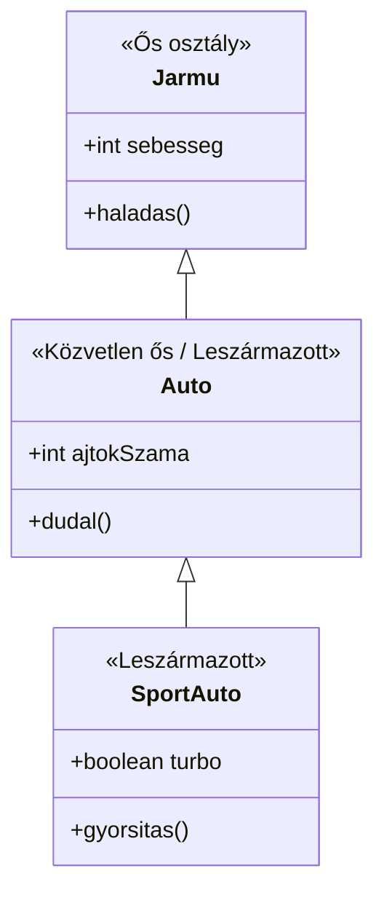
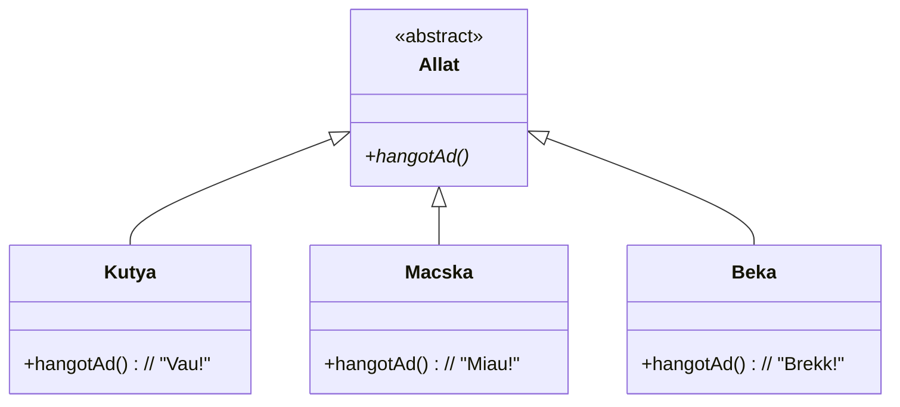
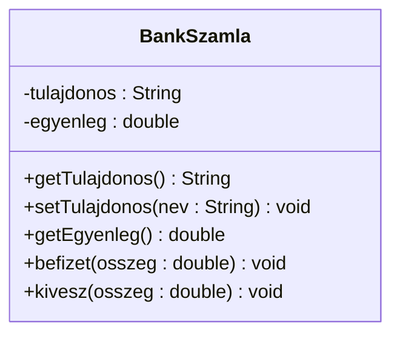
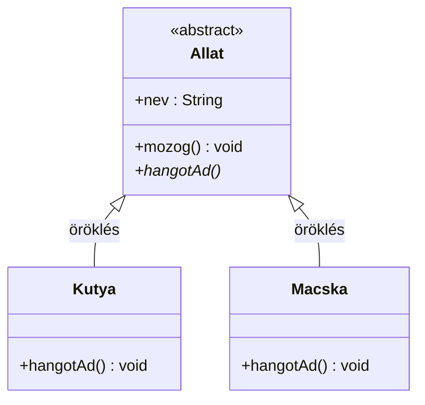
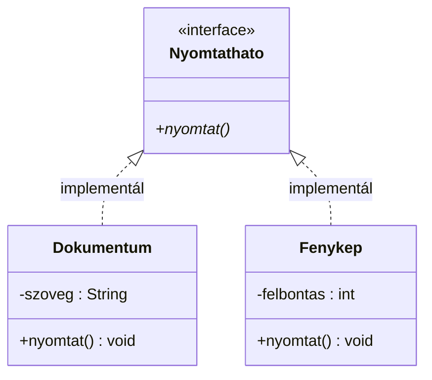
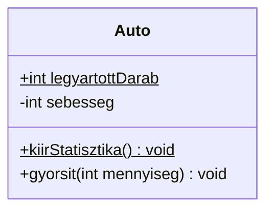

[⬅ Vissza a főoldalra](../../zarovizsga.md)

## 3. tétel: Az objektumorientált paradigma alapfogalmai. Osztály, objektum, példányosítás. Öröklődés, osztályhierarchia. Polimorfizmus, metódustúlterhelés. A bezárási eszközrendszer. Absztrakt osztályok és interfészek. Típustagok.

A **programozási paradigmák** olyan módszerek, fogalmak, elvek, technikák és eszközök összessége, amelyek meghatározzák egy programozási nyelvben a **program szervezésének** és **végrehajtásának** módját.

**Objektumorientált programozási paradigma**  
A program működése **objektumok** kommunikációján alapul. Az objektumok tartalmazzák az **adatokat** (attribútumok) és a **viselkedést** (metódusok), amelyek közötti **üzenetváltás** szervezi a program logikáját.

---

### Osztály, objektum, példányosítás.

Az **osztály** egy **összetett, felhasználói adattípus**, amely:

- **Adattagokból** (attribútumok, mezők, tulajdonságok) áll – tárolják az objektum **állapotát**

- **Metódusokból** (függvények, viselkedés) áll – meghatározzák az objektum **képességeit**

```java
public class Auto {
    private int id;
    private String marka;

    // Konstruktor
    public Auto(int id, String marka){
        this.id = id;
        this.marka = marka;
    }

    // Getter
    public String getMarka() {
        return this.marka;
    }

}
```

#### Láthatósági szintek:

- **private** - csak az osztályon belül látható
- **default** - csomag szinten látható (package-private)
- **protected** - csomag + öröklés útján
- **public** - mindenhol látható

#### Objektum (példány)

Az objektum egy adott osztály konkrét példánya, amely megvalósítja az osztály által meghatározott attribútumokat (az objektum állapotát reprezentáló változókat) és metódusokat (az objektum viselkedését megvalósító függvényeket).

#### Példányosítás (`new` operátor):

A példányosítás során a `new` kulcsszó használatával aktiváljuk az osztály konstruktorát. Ez a folyamat hozza létre a tényleges objektumot a memóriában, amely ezután használatra kész lesz.

**Példa:**

```java
Auto bmw = new Auto(1, "BMW");  // példányosítás
bmw.getMarka();
```

---

### Öröklődés, osztályhierarchia.

**Az öröklődés** egy olyan objektumorientált programozási eszköz, amellyel egy meglévő (**szülő**) osztályból új (**leszármazott**) osztályokat hozhatunk létre az alapok újraírása nélkül. Amikor például egy általános "Jármű" osztályból származtatunk egy specifikus "Autó" osztályt, az automatikusan megkapja az ős összes tulajdonságát és viselkedését. Ezt a megörökölt, közös alapot a leszármazott osztályban szabadon bővíthetjük egyedi jellemzőkkel, vagy igény szerint felül is írhatjuk az eredeti működést. Ennek a hierarchikus felépítésnek köszönhetően a kódunk újrahasznosítható, logikus és sokkal könnyebben karbantartható lesz, hiszen a közös funkciókat elegendő egyetlen központi helyen módosítani.

#### Alapfogalmak

- **Osztályhierarchia:** Egymásból leszármazó osztályok hierarchikus rendszere.
- **Közvetlen ős:** Egy szinttel magasabban lévő osztály (a közvetlen szülő).
- **Ős:** Az osztályhierarchiában magasabban lévő bármely osztály (szülő, nagyszülő stb.).
- **Leszármazott:** Az osztályhierarchiában alacsonyabban lévő, származtatott osztály (gyermek).

#### Példa az osztályhierarchiára



---

### Polimorfizmus, metódustúlterhelés. A bezárási eszközrendszer.

#### Polimorfizmus

**A polimorfizmus (többalakúság)** az objektumorientált programozásban azt jelenti, hogy különböző osztályok objektumait egy közös ősosztályon keresztül, egységesen tudjuk kezelni. A program **nem a hivatkozás típusa, hanem a tényleges objektum alapján** dönti el, hogy melyik megvalósítás fusson le.

Ilyen esetekben az ősosztály gyakran **absztrakt**, hiszen egy általános fogalomnak (pl. "Állat") nincs konkrét viselkedése, csupán egy vázat ad a leszármazottaknak.

- **Egységes kezelés:** Egy általános `Allat` típusú hivatkozásban tarthatunk kutyát, macskát és békát is.
- **Egyedi viselkedés:** A `hangotAd()` metódus hívásakor a kutya ugat, a macska nyávog, a béka pedig brekeg.
- **Kötelező megvalósítás:** Mivel az ősosztály és a metódusa absztrakt, a leszármazottaknak kötelező megírniuk a saját, konkrét működésüket.

##### Osztálydiagram

Az alábbi ábrán az `Allat` osztály absztrakt, a _`hangotAd()`_ pedig az absztrakt metódust jelöli, amit a gyermek osztályok konkrétan megvalósítanak.



---

#### Metódustúlterhelés

**A metódustúlterhelés (overloading)** azt jelenti, hogy egy osztályon belül több, teljesen azonos nevű metódust hozunk létre, amelyek kizárólag a bemeneti paramétereikben (azok típusában, számában vagy sorrendjében) térnek el egymástól.

- **Statikus kötés:** A polimorfizmussal ellentétben itt már a kód írásakor, **fordítási időben** eldől, hogy a több azonos nevű függvény közül pontosan melyik fog lefutni. A fordító a függvényhíváskor megadott konkrét argumentumok alapján választja ki az egyetlen odaillő metódust.
- **Fontos szabály:** A metódusok visszatérési típusa nem képezi a szignatúra részét, tehát pusztán a visszatérési érték megváltoztatásával nem lehet túlterhelni egy metódust, a paraméterlistának mindenképp el kell térnie.

**Példa:** Képzeljünk el egy `Szamologep` osztályt, ahol számokat akarunk összeadni. Bár a művelet neve logikusan mindig `osszead` lesz, a bemenő adatok mennyisége vagy típusa változhat:

```Java
// 1. Két egész szám összeadása
osszead(int a, int b)

// 2. Három egész szám összeadása
osszead(int a, int b, int c)

// 3. Két tizedestört összeadása
osszead(double a, double b)
```

Amikor meghívjuk az `osszead(5, 10)` függvényt, a rendszer a statikus kötés miatt azonnal az 1-es verziót fogja lefuttatni, mivel két egész számot adtunk meg bemenetként. Ha viszont az `osszead(1.5, 2.5)` formát használjuk, automatikusan a 3-as verzió fut le.

---

#### Egységbezárás

**Az egységbezárás (encapsulation)** az objektumorientált programozás egyik alapelve, amely azt jelenti, hogy az objektum adatait és a hozzájuk tartozó műveleteket egy egységbe zárjuk, és megvédjük a közvetlen külső hozzáféréstől. Az objektum belső állapota rejtve marad, ezért az adatokhoz általában nem közvetlenül, hanem csak az osztály által biztosított nyilvános metódusokon keresztül lehet hozzáférni.

Az egységbezárás célja, hogy az adatok csak ellenőrzött módon legyenek elérhetők és módosíthatók. Ez azt jelenti, hogy az osztály vagy objektum felhasználója nem ismeri a belső megvalósítás részleteit, csak azt, hogy milyen műveleteket végezhet el. Az osztály adatelemeit ezért rendszerint csak a saját metódusain keresztül érhetjük el, például `getter` és `setter` metódusok segítségével.

- **Adatvédelem:** A belső adatok nem módosíthatók tetszőlegesen kívülről.
- **Ellenőrzött hozzáférés:** Az osztály szabja meg, hogyan lehet egy adatot lekérni vagy megváltoztatni.
- **Implementáció elrejtése:** A felhasználónak nem kell ismernie a belső működést.
- **Biztonságosabb működés:** Csökken a hibák és a helytelen módosítások lehetősége.

Az alábbi ábrán a `BankSzamla` osztály belső adatai rejtettek, és csak publikus metódusokon keresztül érhetők el vagy módosíthatók.



### Absztrakt osztályok és interfészek. Típustagok.

#### Absztrakt osztály

**Az absztrakt osztály** egy olyan osztály, amelyet nem lehet közvetlenül példányosítani, csak leszármaztatni belőle. Arra szolgál, hogy közös tulajdonságokat és műveleteket adjon meg a leszármazott osztályok számára, miközben bizonyos metódusoknak csak a nevét és célját határozza meg, a konkrét megvalósítást pedig a gyermekosztályokra bízza.

Az absztrakt osztály tehát egyfajta közös sablon vagy váz, amely önmagában még nem teljes. Tartalmazhat már kész, működő metódusokat is, de lehetnek benne absztrakt metódusok is, amelyeknek nincs implementációjuk, ezért a leszármazott osztályoknak kötelező ezeket megvalósítaniuk.

- **Nem példányosítható:** Nem hozhatunk létre belőle közvetlenül objektumot.
- **Csak leszármaztatásra szolgál:** A használatához egy alosztályt kell létrehozni.
- **Közös alapot ad:** Az azonos tulajdonságokat és viselkedéseket egy helyen foglalja össze.
- **Kötelező megvalósítás:** Az absztrakt metódusokat a leszármazott osztályoknak implementálniuk kell.

Tegyük fel, hogy van egy `Allat` nevű absztrakt osztály. Általánosan minden állat tud `mozogni()`, de a `hangotAd()` működése állatonként eltérő. Ezért a `hangotAd()` csak elő van írva az absztrakt osztályban, a konkrét megvalósítást pedig például a `Kutya` és a `Macska` osztály adja meg.



```java
abstract class Allat {
    String nev;

    public Allat(String nev) {
        this.nev = nev;
    }

    public void mozog() {
        System.out.println(nev + " mozog.");
    }

    public abstract void hangotAd();
}

class Kutya extends Allat {
    public Kutya(String nev) {
        super(nev);
    }

    @Override
    public void hangotAd() {
        System.out.println(nev + ": Vau!");
    }
}

class Macska extends Allat {
    public Macska(String nev) {
        super(nev);
    }

    @Override
    public void hangotAd() {
        System.out.println(nev + ": Miau!");
    }
}

```

---

#### Intefész

**Az interfész** az objektumorientált programozásban egy szerződés vagy viselkedési szabályrendszer, amely kizárólag azt írja elő, hogy az őt megvalósító (implementáló) osztályoknak milyen műveletekkel (metódusokkal) kell rendelkezniük, de azok pontos működését nem definiálja.

Míg az öröklődés egy _"Ez egy..."_ kapcsolatot fejez ki (pl. a kutya _egy_ állat), addig az interfész egy _"Képes valamire..."_ kapcsolatot (pl. az autó és a madár is _képes_ mozogni, bár nincs közös ősük).

- **Minden metódus absztrakt:** Az interfészben nincsenek kifejtett kódtörzsek, csak a metódusok neve, paraméterei és visszatérési értéke van meghatározva (kivéve a modern nyelvek újabb fejlesztéseit, mint a default metódusok).
- **Csak konstansok:** Nem tartalmazhat normál, módosítható változókat (állapotot), csak konstans értékeket.
- **Nem példányosítható:** Mivel nincs benne tényleges működés, nem lehet belőle közvetlenül objektumot létrehozni.
- **Kötelező megvalósítás:** Ha egy osztály implementál egy interfészt, akkor kötelezően meg kell írnia az összes benne szereplő (absztrakt) metódus konkrét viselkedését.
- **Többszörös megvalósítás:** Míg egy osztály csak egyetlen ősosztályból örökölhet, addig akárhány interfészt implementálhat, így teljesen független osztályokat ruházhatunk fel közös képességekkel.

Az alábbi ábrán a `Nyomtathato` interfész csak egy `nyomtat()` műveletet vár el. Bár a `Dokumentum` és a `Fenykep` teljesen más adatszerkezetek, mindkettő ki tudja nyomtatni magát, mert mindkettő implementálja az interfészt.



### Típustagok

Az objektumorientált programozásban megkülönböztetjük az objektumhoz (példányhoz) és magához az osztályhoz (típushoz) tartozó tagokat.

**1. Példányszintű tagok:**
Ezek a "hagyományos" adattagok és metódusok. Minden alkalommal, amikor a `new` operátorral létrehozunk egy új objektumot, a memóriában létrejön ezeknek a tagoknak egy teljesen új, saját másolata.

- **Példányváltozó:** Minden egyes létrehozott objektumban külön létező adattag, amely az adott példány egyedi állapotát tárolja. Például egy `Auto` osztálynál az `aktualisSebesseg`, mivel minden autónak független, saját sebessége van.
- **Példánymetódus:** Egy konkrét objektumhoz tartozó művelet, amely az adott példány belső adatait (változóit) használja vagy módosítja. Például a `gyorsit()` metódus, amely kizárólag annak a konkrét autónak a sebességét növeli, amelyiken meghívtuk.

**2. Osztályszintű (statikus) tagok:**
A Java-ban a `static` kulcsszóval jelölt elemek nem az egyes objektumokhoz, hanem magához az osztályhoz tartoznak. Bármennyi objektumot is példányosítunk, az osztályszintű tagból **csak egyetlen egy** létezik a memóriában, amin az összes példány osztozik. Osztályszintű elemeket akár úgy is meghívhatunk, hogy egyetlen objektumot sem hoztunk létre (Pl: `Osztalynev.tagnev`).

- **Osztályváltozó:** Magához az osztályhoz tartozik, az összes példány osztozik rajta, így a memóriában csak egyetlen közös másolat létezik belőle. Például `keszitettAutokSzama`, amely globálisan követi az összes legyártott autót.
- **Osztálymetódus:** Az osztályhoz tartozó művelet, amelynek meghívásához nincs szükség példányosításra, mert nem egy konkrét objektum állapotával dolgozik. Példa: `Math.max(a, b)`, hiszen egy egyszerű számításhoz nem kell "Matematika" objektumot létrehozni.

**Példa:**



```java
public class Auto {
    public static int legyartottDarab = 0; // Osztályváltozó (static): Közös az összes példányra.

    private int sebesseg; // Példányváltozó: Minden autónak sajátja van.

    public Auto() {
        this.sebesseg = 0;
        Auto.legyartottDarab++;
    }

    public void gyorsit(int plusz) { // Példánymetódus: A konkrét autó sebességét növeli.
        this.sebesseg += plusz;
    }

    public static void kiirStatisztika() { // Osztálymetódus (static): Nincs köze egyetlen konkrét autóhoz sem.
        System.out.println("Összesen " + legyartottDarab + " autó készült.");
    }
}

Auto bmw = new Auto();
Auto audi = new Auto();
bmw.gyorsit(50);
Auto.kiirStatisztika();
```
