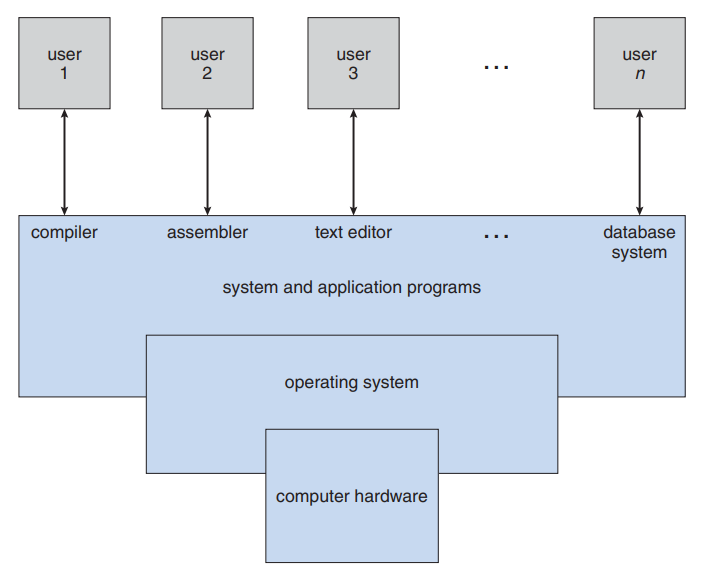
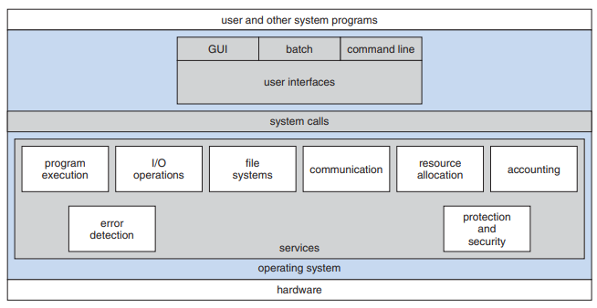
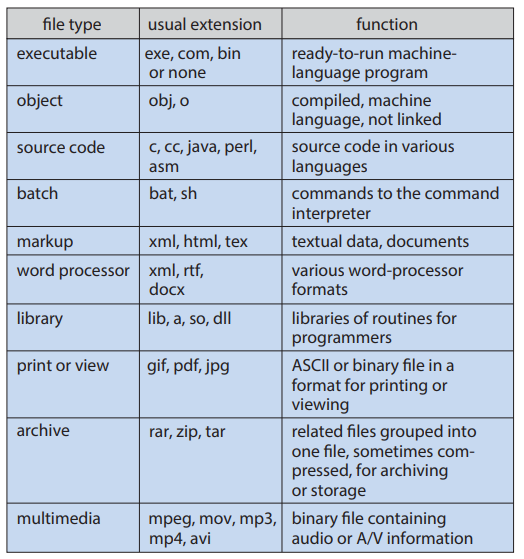
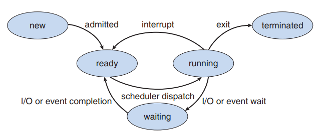
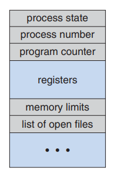

[⬅ Vissza a főoldalra](../../zarovizsga.md)

## 4. tétel: Operációs rendszerek fogalma, felépítése, osztályozásuk. Fájlok és fájlrendszerek. Speciális fájlok Unix alatt. Átirányítás, csővezetékek. Folyamatkezelés. Jelzések, szignálok. Ütemezett végrehajtás.

### Operációs rendszerek fogalma

- **Alapvető definíció (Közvetítő szerep):**
  - Egy program, amely a számítógép hardverét kezeli.
  - Közvetítő a felhasználó és a hardver között.
  - Fő célja: kényelmes és hatékony környezet biztosítása a programok futtatásához.

- **Rendszerszemlélet - Erőforrás-kezelő:**
  - Az OS feladata a hardveres erőforrások (CPU-idő, memória, fájltároló, I/O eszközök) elosztása.
  - Kezeli az egymással versengő folyamatok kéréseit a hatékony és igazságos működés érdekében.

- **Felhasználói / Vezérlési szemlélet - Irányító program:**
  - Menedzseli és felügyeli a felhasználói programok végrehajtását.
  - Fő célja: a szoftveres hibák és a számítógép nem megfelelő használatának megelőzése.
  - Felügyeli az I/O eszközök működését és az azokkal való kommunikációt.

### Számítógépes rendszer felépítése

Egy számítógépes rendszert absztrakt módon négy fő komponensre bonthatunk:

- **Hardver:** A rendszer fizikai erőforrásait biztosítja (CPU, memória, I/O eszközök).
- **Operációs rendszer:** Irányítja és koordinálja a hardver használatát az alkalmazások és a felhasználók között. Önmaga nem végez hasznos munkát, csupán absztrakciót és megfelelő környezetet biztosít a programok futtatásához.
- **Alkalmazási programok:** Ezek segítségével oldják meg a felhasználók a konkrét problémáikat (pl. szövegszerkesztők, böngészők).
- **Felhasználók:** Emberek, gépek vagy akár más számítógépek, amelyek a rendszert használják.

#### A felhasználói szemszög (User View)

A felhasználók elvárásai attól függnek, hogy milyen felületen és környezetben dolgoznak a számítógéppel:

- **Személyi számítógépek (PC-k) és mobilok:** Mivel ezeket az eszközöket jellemzően egyetlen felhasználó használja, a fő cél a munka és a játék élményének maximalizálása.
  - Számukra a legfontosabb a **teljesítmény** és a **felhasználóbarátság**.
  - Az **erőforrás-kihasználtság** – vagyis az, hogy a szoftver- és hardvererőforrások hogyan vannak megosztva – egyáltalán nem érdekli őket, az OS dolga, hogy a hardveres részleteket elrejtse (absztrakció).
- **Mainframe-ek és miniszámítógépek:** Itt több felhasználó csatlakozik terminálokon keresztül egy közös géphez. Ebben a környezetben az operációs rendszer elsődleges feladata az **erőforrás-kihasználtság optimalizálása**, hogy senki ne kapjon indokolatlanul nagy részt a CPU-ból vagy a memóriából.
- **Munkaállomások:** Ezek a rendszerek kompromisszumot kötnek; egyensúlyozniuk kell a dedikált, egyéni teljesítmény biztosítása és a hálózatos erőforrások (pl. fájlszerverek) optimális megosztása között.

### Operációs rendszerek felépítése

Az operációs rendszer szolgáltatások és interfészek hierarchikus összessége, amely biztosítja a programok végrehajtásához szükséges környezetet. A szerkezet a felhasználói igényektől halad a hardver felé.

- **Felhasználói felület (User Interface):** Az OS legfelső rétege, amely lehetővé teszi a felhasználó számára a rendszerrel való interakciót. Főbb típusai: a parancssoros (CLI), a grafikus (GUI) és a kötegelt (Batch) interfész.
- **Rendszerhívások (System Calls):** Ez a réteg képezi a hidat a felhasználói alkalmazások és az OS szolgáltatásai között. Biztosítja az utat a programok számára a kernel funkcióinak eléréséhez.
- **Szolgáltatási réteg:** Az OS belső funkcióinak összessége, amely a rendszer hatékonyságát és a felhasználói kényelmet szolgálja (pl. programvégrehajtás, I/O műveletek, fájlrendszer-kezelés, kommunikáció, hibakezelés és erőforrás-elosztás).

## 

#### A rendszer központi összetevői

**Kernel**
Az operációs rendszer magja, amely a számítógép bekapcsolásától kezdve folyamatosan fut.

- Közvetlenül felügyeli a hardvert.
- Felelős a legkritikusabb feladatokért: folyamatok ütemezése (scheduling), memória-menedzsment és a fájlrendszer fizikai kezelése.
- Biztosítja a folyamatok közötti védelmet és elszigetelést.

**Eszközillesztők (Device Drivers)**
Speciális szoftvermodulok, amelyek a hardvereszközök és az operációs rendszer közötti kommunikációs interfészt valósítják meg.

- Elrejtik a hardver specifikus részleteit a kernel és az alkalmazások elől.
- Lehetővé teszik az I/O műveletek egységes kezelését.

**Felhasználói réteg és alkalmazások**
Az a környezet, ahol a felhasználói programok és a rendszer segédprogramjai futnak.

- Itt történik az alkalmazások (pl. szövegszerkesztők, fordítóprogramok) futtatása.
- Az itt futó programok csak rendszerhívásokon keresztül érhetik el a hardveres erőforrásokat, így garantálva a rendszer stabilitását és biztonságát.

### Különböző operációs rendszer felépítések

#### Egyszerű struktúra

A legkorábbi operációs rendszereket nem tervezték nagynak és komplexnek, így struktúrájuk is korlátozott.

- **Példa (MS-DOS):** Arra tervezték, hogy a lehető legkisebb helyen a legnagyobb funkcionalitást nyújtsa. A modulok nincsenek szigorúan elkülönítve.
- **Hiányzó védelem:** Nem támogatja a hardveres dual-mode (felhasználói és kernel mód) elkülönítést. Az alkalmazások közvetlenül hozzáférhetnek az alapvető I/O rutinokhoz és a hardverhez.
- **Sebezhetőség:** Mivel nincs védelem, egyetlen meghibásodott felhasználói program könnyen felülírhatja az operációs rendszert, ami az egész gép összeomlásához vezethet. Egyidejűleg csak egy folyamat futását támogatja.

---

#### Monolitikus rendszerek

Az operációs rendszer minden funkciója a hardver és a rendszerhívási interfész (system call interface) között helyezkedik el egyetlen nagy blokkban.

- **Példa (Eredeti UNIX):** Két fő részre bomlik: rendszerprogramokra és a kernelre. A kernel egyetlen hatalmas program, ami felelős a CPU ütemezésért, a fájlrendszerért, az eszközök kezeléséért stb.
- **Előny (Teljesítmény):** Mivel minden egyetlen címtérben (kernel módban) van, a belső kommunikáció és a rendszerhívások rendkívül gyorsak, kevés overhead-del járnak.
- **Hátrány:** Az egész rendszer átláthatatlan, nehéz implementálni, bővíteni és karbantartani.

---

#### Rétegzett architektúra

Az operációs rendszert kisebb, szigorúan meghatározott szintekre (rétegekre) bontják a könnyebb kezelhetőség érdekében.

- **Felépítés:** A legalsó réteg (0. réteg) maga a hardver, a legfelső réteg (N. réteg) pedig a felhasználói felület.
- **Adatrejtés (Separation of concerns):** Egy adott réteg kizárólag az eggyel alatta lévő réteg szolgáltatásait és funkcióit használhatja fel. A belső adatstruktúrák és hardveres részletek rejtve maradnak a felsőbb szintek elől.
- **Előny:** Sokkal egyszerűbb a tervezés és a hibakeresés (debugging). Ha az 1. réteg már tesztelt és működik, akkor a 2. réteg fejlesztésekor felmerülő hiba csakis a 2. rétegből származhat.
- **Hátrány:** Alacsonyabb teljesítmény. Egy felhasználói kérésnek több rétegen kell keresztülhaladnia (minden réteghatáron paramétereket kell másolni), mire eléri a hardvert. Nehéz pontosan definiálni a rétegek sorrendjét.

---

#### Mikrokernel architektúra

Az operációs rendszer méretének csökkentése a cél: minden nem kritikus komponenst kivesznek a kernelből, és azokat felhasználói szintű (user-space) folyamatokként futtatják.

- **Példa:** Mach operációs rendszer.
- **A kernel feladata:** A mikrokernel szinte csak a folyamatok közötti kommunikációt (message passing), az alapvető memóriakezelést és a CPU ütemezést végzi.
- **Előny (Bővíthetőség és Biztonság):** Nagyon könnyű új szolgáltatásokat hozzáadni (nem kell a kernelt újrafordítani). Ha egy szolgáltatás (például egy videokártya-illesztő) összeomlik, a rendszer többi része érintetlen marad, a gép nem fagy le.
- **Hátrány:** Teljesítménycsökkenés. A felhasználói programok és a rendszer-szolgáltatások közötti gyakori üzenetküldés rengeteg kontextusváltást (context switch) és kommunikációs overheadet okoz.

---

#### Moduláris architektúra

A legmodernebb operációs rendszerek a betölthető kernel modulokat használják, amely egy objektumorientált megközelítés.

- **Példa (Linux, Solaris):** A kernel csak a legkritikusabb alapfunkciókat tartalmazza, de képes futásidőben (on-demand), igény szerint új modulokat (fájlrendszereket, drivereket) betölteni.
- **Hasonlóság a mikrokernellel:** A mag kicsi marad, a funkciók logikailag jól elkülönülnek, és szabványos interfészeken keresztül kommunikálnak.
- **Különbség a mikrokerneltől (Teljesítmény):** Itt minden betöltött modul kernel módban (egy közös címtérben) fut, így megmarad a monolitikus rendszerek gyorsasága (nincs üzenetküldési overhead).

---

#### Hibrid rendszerek

A gyakorlatban egyetlen modern operációs rendszer sem követ tisztán egyetlen modellt; különböző architektúrákat ötvöznek a biztonság, a teljesítmény és a használhatóság egyensúlya érdekében.

- **Példa (Windows):** Alapvetően monolitikus a teljesítmény miatt, de mikrokernel vonásokat is mutat azzal, hogy az operációs rendszer "személyiségeit" különálló alrendszerként (subsystem), felhasználói módban futtatja.
- **Példa (Apple Mac OS X):** A rendszermag (Darwin) hibrid. Egyrészt tartalmaz egy Mach mikrokernelt (ami a memóriakezelésért, szálakért és IPC-ért felelős), másrészt egy BSD UNIX monolitikus kernelt (ami a POSIX API-t, fájlrendszert és hálózatot biztosítja), ezen felül pedig dinamikusan betölthető modulokat (kexts - I/O Kit) is használ.

---

### Operációs rendszerek szolgáltatásai és feladatai

A rendszer zavartalan működése és az erőforrások kezelése érdekében az operációs rendszer az alábbi alapvető feladatokat látja el:

- **Folyamatkezelés**
- **I/O rendszerkezelés**
- **Memóriakezelés**
- **Fájlkezelés**
- **Tárhelykezelés**
- **Biztonság és védelem**

---

### Operációs rendszerek osztályozása

Az operációs rendszereket számos szempont és környezet alapján kategorizálhatjuk:

- **Felhasználók száma szerint:**
  - Egyfelhasználós: (pl. DOS)
  - Többfelhasználós: (pl. Linux, Windows)
- **Hardver méret szerint:**
  - Mikrogépes: (pl. Windows, Unix alapú PC-k)
  - Kisgépes: (pl. Unix)
  - Nagygépes (Mainframe): nagyvállalati központi rendszerek
- **Processzorkezelés szerint:**
  - Egyfeladatos: (pl. DOS)
  - Többfeladatos (Multitasking): (pl. Unix)
- **Cél szerint:**
  - Általános célú
  - Speciális: (pl. beágyazott, valós idejű rendszerek)
- **Felépítés szerint:**
  - Monolitikus: (pl. DOS, eredeti Unix)
  - Rétegzett architektúra: (elméleti megközelítés)
  - Mikrokernel architektúra: (pl. Mach, MacOS részei)
  - Moduláris: (pl. Linux)
  - Hibrid: (pl. Windows, Mac OS X)
- **Felhasználói felület szerint:**
  - Szöveges (CLI): (pl. DOS)
  - Grafikus (GUI): (pl. Windows)
- **Jogállás szerint:**
  - Nyílt forráskódú: (pl. Linux)
  - Zárt forráskódú / Kereskedelmi: (pl. Windows)

---

### Fájlok, fájlrendszerek

#### A fájl fogalma

A fájl az operációs rendszer szempontjából egy **folytonos logikai címtér**.

- A számítógép a fizikai tárolóeszközök (mágneslemezek, SSD-k stb.) működését absztrahálja egy logikai tárolási egységgé.
- A fájl egymással összefüggő információk névvel ellátott gyűjteménye a másodlagos háttértáron.
- Tartalmazhat adatot (számikus, alfabetikus, alfanumerikus, bináris) vagy programokat (futtatható állományok, forráskódok).

#### Fájl attribútumai (File Attributes)

A fájl nevén és adatain kívül az operációs rendszer különféle metaadatokat (attribútumokat) is tárol a fájlról:

- **Név (Name):** Az egyetlen olyan információ, amelyet az emberi felhasználó is olvasható formában lát.
- **Azonosító (Identifier / ID):** Egy egyedi belső címke (általában egy szám), amely a fájlrendszeren belül azonosítja a fájlt (a felhasználó számára rejtett).
- **Típus (Type):** Arra szolgál, hogy a különböző formátumokat (pl. szöveg, futtatható fájl, archívum) támogató rendszerek megfelelően tudják kezelni azokat.
- **Hely (Location):** Egy mutató (pointer) az eszközre és a fájl pontos fizikai helyére a tárolón.
- **Méret (Size):** A fájl aktuális mérete (bájtban, szavakban vagy blokkokban megadva).
- **Jogosultság és védelem (Protection):** Hozzáférés-szabályozási adatok, amelyek meghatározzák, hogy ki végezhet olvasási, írási vagy futtatási műveleteket a fájlon.
- **Időbélyegek és felhasználói adatok (Time, date, and user identification):** Létrehozás, utolsó módosítás és utolsó olvasás dátuma; ezek biztonsági, monitorozási és használati statisztikákhoz szükségesek.

#### Fájlműveletek (File Operations)

Az operációs rendszer rendszerhívásokat (system calls) biztosít a fájlok kezeléséhez. Az alapvető műveletek a következők:

- **Létrehozás (Create):** Hely keresése a fájlrendszerben, majd bejegyzés létrehozása a könyvtárban (directory) az új fájl nevével és helyével.
- **Írás (Write):** A fájl nevének és a kiírandó információnak a megadása. A rendszer egy _írási mutatót_ (write pointer) tart karban, hogy tudja, hol tart a művelet.
- **Olvasás (Read):** A fájl nevének és annak a memóriablokknak a megadása, ahová a fájl tartalmát be kell tölteni (egy _olvasási mutató_ segítségével).
- **Fájlon belüli pozicionálás (Reposition / Seek):** Az olvasási/írási mutató áthelyezése egy adott értékre a fájlon belül. (Ez nem jár I/O művelettel, csak könyvtár/mutató manipulációval).
- **Törlés (Delete):** A fájl megkeresése a könyvtárban, a könyvtárbejegyzés törlése, valamint a fájl által elfoglalt lemezterület felszabadítása (visszaadása a szabad területek listájába).
- **Csonkolás (Truncate):** A fájl tartalmának teljes törlése, de az attribútumok (pl. név, jogosultságok) megtartása. A fájl hossza ilyenkor nullára (0) csökken.

**Megnyitás és Bezárás (Open / Close):**
Ahhoz, hogy az OS ne keresse meg a fájlt a könyvtárban minden egyes olvasásnál és írásnál, a folyamatoknak használat előtt meg kell nyitniuk a fájlt (`open()`). Ilyenkor a fájl adatai bekerülnek a memóriában lévő nyitott fájlok táblájába (open-file table). Használat után a fájlt be kell zárni (`close()`).

#### Gyakori fájltípusok és kiterjesztések

---

### Fájlrendszer

#### Alapvető fogalom és felépítés

- A fájlrendszer az operációs rendszer leginkább látható része, amely a háttértárolókon lévő adatok és programok tárolását, elérését és rendszerezését biztosítja.
- **Két fő komponensből áll:**
  - **Fájlok halmaza:** amelyek a tényleges (egymással összefüggő) adatokat tárolják. Maga a fájl az operációs rendszer szemszögéből egy **absztrakt adattípus**.
  - **Könyvtárstruktúra (Directory structure):** amely rendszerezi a fájlokat, és nyilvántartja a velük kapcsolatos információkat (metaadatokat, attribútumokat és a fizikai helyüket).

#### Működési elv (Szektorok és blokkok)

- Az operációs rendszer elvonatkoztat a tárolóeszközök fizikai tulajdonságaitól, és a fájlokat, mint logikai tárolási egységeket képezi le a fizikai médiára.
- A lemezes háttértárak fix méretű egységekkel, úgynevezett **blokkokkal** (fizikai rekordokkal) dolgoznak, amelyek méretét a lemez **szektorainak** mérete határozza meg (jellemzően 512 bájt).
- A fájlrendszer feladata, hogy a logikai adatfolyamot ezekbe a fizikai blokkokba "csomagolja", összekapcsolja őket, és pontosan nyilvántartsa, hogy a lemez melyik blokkja/szektora melyik fájlhoz tartozik (allokációs módszerek, pl. láncolt vagy indexelt allokáció).

#### Példák ismert fájlrendszerekre a könyv alapján

- **NTFS / Veritas:** Naplózó (log-based / journaling) fájlrendszerek, amelyek a metaadat-módosításokat egy naplófájlba írják a rendszerösszeomlások utáni gyors és konzisztens helyreállítás érdekében.
- **ext3 / ext4:** A Linux leggyakoribb standard fájlrendszerei (az ext3 szintén naplózó).
- **ZFS / WAFL:** Fejlett fájlrendszerek, amelyek sosem írják felül a meglévő blokkokat (hanem új blokkba írnak, és frissítik a mutatókat), valamint a ZFS folyamatos ellenőrzőösszegeket (checksum) használ a teljes adatintegritás biztosítására.
- _(Megjegyzés: A FAT/FAT32 is egy klasszikus, láncolt allokációt használó fájlrendszer, amely egy File Allocation Table-ben tartja nyilván a blokkokat.)_

---

### Speciális fájlok Unix alatt

A Unix-alapú rendszerek egyik legfontosabb alapelve, hogy minden erőforrást – legyen az hardver, memória vagy kommunikációs csatorna – egységesen fájlként kezelnek. Ez lehetővé teszi, hogy a rendszer ugyanazokat az alapvető műveleteket (olvasás, írás) használja szinte mindenhez.

#### Hivatkozások (Linkek)

Olyan bejegyzések a fájlrendszerben, amelyek egy már létező fájlra mutatnak.

- **Hard link:** Egy fájlhoz rendelt második név. Az adat addig marad meg a lemezen, amíg az összes hozzá tartozó hard linket le nem törlik.
- **Symbolic link (Szimbolikus link):** Egy olyan mutató, amely csak az eredeti fájl elérési útvonalát tartalmazza. Ha az eredeti fájlt törlik vagy áthelyezik, a szimbolikus link használhatatlanná válik.

#### Eszközfájlok (Device Files)

A hardvereszközök a fájlrendszeren keresztül, jellemzően a `/dev` könyvtárban érhetőek el.

- **Karakteres eszközök:** Olyan hardverek, amelyek az adatokat folyamatosan, bájtonként kezelik (például a billentyűzet vagy a terminál).
- **Blokkos eszközök:** Olyan tárolóeszközök, amelyek az adatokat rögzített méretű csomagokban, úgynevezett blokkokban mozgatják (például a merevlemezek).

#### Virtuális speciális fájlok

Ezek a fájlok nem fizikai eszközöket képviselnek, hanem a rendszer belső funkcióit látják el:

- **/dev/null (Az adatnyelő):** Minden beleírt adatot megsemmisít, olvasáskor pedig azonnal jelzi, hogy a fájl üres. Felesleges kimenetek elnyelésére használatos.
- **/dev/random (A véletlengenerátor):** Folyamatosan véletlenszerű bájtokat állít elő, ami elengedhetetlen a titkosítási folyamatokhoz és a biztonságos kulcsok létrehozásához.
- **/dev/zero (A nullázó):** Megnyitáskor végtelen mennyiségű nulla (0x00) karaktert szolgáltat. Gyakran használják tárolóterületek alaphelyzetbe állítására vagy üres fájlok létrehozására.

#### Kommunikációs fájlok (IPC)

A folyamatok közötti adatcserét segítő speciális állományok:

- **Nevesített csővezeték (Named pipe / FIFO):** Olyan átmeneti tároló, amely lehetővé teszi, hogy az egyik program kimenete közvetlenül egy másik program bemenetévé váljon. Az adatok "érkezési sorrendben" (First-In, First-Out) haladnak át rajta.
- **Socket (Hálózati végpont):** A hálózaton keresztüli adatforgalom kezelésére szolgáló végpont. Segítségével a különböző gépeken futó alkalmazások úgy tudnak egymással kommunikálni, mintha helyi fájlokat írnának vagy olvasnának.

---

### I/O Átirányítás (I/O Redirection)

Az operációs rendszer minden futó folyamat számára három alapvető adatcsatornát (fájlleírót) biztosít. Ezek az úgynevezett szabványos adatfolyamok, amelyek alapértelmezés szerint a terminálhoz kapcsolódnak, de tetszőlegesen átirányíthatók fájlokba vagy más eszközökre.

#### Alapértelmezett adatfolyamok

1.  **stdin (Standard Input):** Szabványos bemenet (fájlleíró: 0). Alapesetben a billentyűzetről érkező adatokat fogadja.
2.  **stdout (Standard Output):** Szabványos kimenet (fájlleíró: 1). Alapesetben a képernyőre küldi a program normál eredményeit.
3.  **stderr (Standard Error):** Szabványos hibaüzenet-kimenet (fájlleíró: 2). Szintén a képernyőre ír, de a normál kimenettől elkülönítve kezeli a hibajelzéseket.

#### Átirányítási műveletek

Az átirányítás lehetővé teszi, hogy a bemenet ne a billentyűzetről jöjjön, vagy a kimenet ne a képernyőn jelenjen meg, hanem egy fájlba kerüljön.

- **Bemenet átirányítása (`<`):**
  - `parancs < fájl`: A program a billentyűzet helyett a megadott fájlból olvassa az adatokat.
- **Kimenet átirányítása és felülírása (`>`):**
  - `parancs > fájl`: A szabványos kimenetet a fájlba írja. Ha a fájl már létezik, a tartalma törlődik (felülíródik).
- **Kimenet hozzáfűzése (`>>`):**
  - `parancs >> fájl`: A kimenetet a fájl végéhez írja, megőrizve annak eredeti tartalmát.
- **Hibaüzenetek átirányítása (`2>`):**
  - `parancs 2> fájl`: Csak a hibaüzeneteket (stderr) irányítja a fájlba, a normál kimenet (stdout) megmarad a képernyőn.
- **Összevont átirányítás (`&>`):**
  - `parancs &> fájl`: Mind a normál kimenetet, mind a hibaüzeneteket ugyanabba a fájlba menti.

#### Adatfolyamok összekapcsolása

Gyakran szükséges az egyik adatfolyamot a másikhoz irányítani, hogy közösen kezelhessük őket.

- **stderr irányítása az stdout-hoz (`2>&1`):**
  - A hibaüzenetek oda kerülnek, ahová a normál kimenet már irányítva van. Ez hasznos, ha egyetlen fájlba akarunk naplózni mindent.
- **stdout irányítása az stderr-hez (`1>&2`):**
  - A normál kimenetet a hibaüzenetek csatornájára tereli.

> **Megjegyzés:** Az átirányításokat az operációs rendszer parancsértelmezője (shell) kezeli a rendszerhívások (mint az `open()`, `close()` és `dup2()`) segítségével, még mielőtt a konkrét program futása elindulna.

---

### Csővezetékek – Névtelen vagy közönséges csővezetékek

A csővezeték az egyik legnépszerűbb módszer a folyamatok közötti kommunikációra. Lehetővé teszi, hogy két folyamat „termelő-fogyasztó” módban dolgozzon együtt: az egyik folyamat kimenete közvetlenül a másik folyamat bemenetévé válik.

#### Alapvető tulajdonságok

- **Egyirányú kommunikáció:** Az adatok csak egy irányba áramlanak. Az egyik végén beírják az adatokat (termelő), a másik végén pedig kiolvassák (fogyasztó).
- **Ideiglenes létezés:** A névtelen csővezetékek csak addig léteznek, amíg a benne részt vevő folyamatok futnak. Amint a folyamatok befejeződnek, a csővezeték megszűnik.
- **Szülő-gyermek kapcsolat:** Unix-alapú rendszerekben ezeket a csővezetékeket jellemzően olyan folyamatok használják, amelyek szülő-gyermek viszonyban állnak egymással.

#### Használat a parancssorban

A parancssorban (shell) a függőleges vonal (`|`) szimbólum jelöli a csővezetéket. Segítségével bonyolult műveleteket is elvégezhetünk több egyszerű program összekapcsolásával (láncolás).

**Példák:**

- **`dir | sort`**
  - A `dir` parancs kilistázza a fájlokat, de ahelyett, hogy a képernyőre írná, továbbadja az adatokat a `sort` programnak, ami sorba rendezi azokat.
- **`dir | sort > \temp\lista.txt`**
  - A lista elkészül, a rendezés megtörténik, majd a végeredmény nem a képernyőn jelenik meg, hanem elmentődik a `lista.txt` fájlba.
- **`dir | sort | more`**
  - Itt három program van összekötve: a lista elkészül, sorba rendeződik, a `more` parancs pedig gondoskodik róla, hogy a végeredményt oldalanként (olvasható ütemben) lássuk.

> **Lényege:** A csővezetékek segítségével elkerülhető, hogy minden lépés után ideiglenes fájlokba kelljen menteni az adatokat; az információ folyamatosan áramlik egyik programtól a másikig.

---

### Folyamatkezelés

#### Folyamat

A folyamat alapvető definíciója szerint egy **végrehajtás alatt álló program**. Míg a program egy passzív entitás (például egy fájl a háttértáron), addig a folyamat egy aktív entitás, amely rendelkezik egy utasításszámlálóval (program counter), ami meghatározza a következő végrehajtandó utasítást.

**Egy program, több folyamat:**
Fontos különbséget tenni a program és a folyamat között. Egy program (például egy böngésző) önmagában csak egy fájl, de ha többször indítjuk el, minden példánya külön folyamatnak minősül, saját belső állapottal.

#### A folyamat memóriaszerkezete

Egy folyamat a memóriában több jól elkülöníthető részből (szegmensből) áll:

- **Text szegmens:** Itt található a tényleges programkód (utasítások).
- **Adatszegmens (Data section):** Itt tárolódnak a globális változók.
- **Stack (Verem):** Ideiglenes adatokat tárol, például függvényparamétereket, visszatérési címeket és lokális változókat.
- **Heap (Halom):** Dinamikusan, a program futása közben lefoglalt memóriaterület.

#### Folyamatállapotok (Process States)

Ahogy egy folyamat végrehajtódik, változik az állapota. A könyv öt alapvető állapotot különít el:

1.  **Új (New):** A folyamat éppen létrehozás alatt áll.
2.  **Futó (Running):** Az utasítások végrehajtása zajlik a CPU-ban.
3.  **Várakozó (Waiting / Blocked):** A folyamat valamilyen eseményre vár (például egy I/O művelet befejeződésére vagy egy jelre).
4.  **Készen álló (Ready):** A folyamat várakozik, hogy hozzárendeljék egy processzorhoz.
5.  **Befejezett (Terminated):** A folyamat befejezte a végrehajtást.

#### Folyamatvezérlő blokk (PCB - Process Control Block)

Az operációs rendszer minden egyes folyamatot egy **Process Control Block** (más néven Task Control Block) segítségével reprezentál. Ez egy olyan adattábla, amely minden fontos információt tartalmaz a folyamat kezeléséhez:

- **Folyamat állapota:** (Új, kész, futó stb.)
- **Utasításszámláló (Program counter):** A következő végrehajtandó utasítás címe.
- **CPU regiszterek:** Itt menti el a rendszer a processzor belső állapotát, amikor a folyamatot félbeszakítják, hogy később onnan folytathassa, ahol abbahagyta.
- **CPU-ütemezési információk:** Prioritás, sorban állási mutatók.
- **Memóriakezelési információk:** A folyamathoz tartozó laptáblák vagy szegmenstáblák adatai.
- **Elszámolási információk:** CPU-használati idő, időkorlátok, folyamatazonosító (PID).
- **I/O állapotinformációk:** A folyamat által megnyitott fájlok listája és a lefoglalt I/O eszközök.

#### Folyamathierarchia (Process Hierarchy)

A folyamatok az operációs rendszerekben (különösen a Unix-alapú rendszerekben) egy jól definiált fa-struktúrát alkotnak. Minden folyamatot egy egyedi szám, a **folyamatazonosító (PID)** azonosít.

- **Szülő-gyermek viszony:** Minden folyamatnak pontosan egy szülője van (aki létrehozta), de egy folyamatnak több gyermeke is lehet.
- **Az ősfolyamat (`init`):** A rendszer indulásakor jövő létre a legelső folyamat, az `init` (modern rendszereken gyakran `systemd`). Ennek a **PID-je mindig 1**. Minden más felhasználói folyamat közvetve vagy közvetlenül az `init` leszármazottja.

#### Speciális folyamatállapotok

A folyamatok életciklusa során előfordulhatnak olyan állapotok, amikor a folyamat már nem végez munkát, de még jelen van a rendszerben.

- **Zombi folyamat (Zombie process):** Olyan folyamat, amely már befejezte a futását (terminált), de a szülő folyamata még nem kérdezte le a kilépési állapotát. Ilyenkor a folyamat adatai törlődnek, de a bejegyzése a folyamattáblában megmarad, amíg a szülő el nem olvassa azt.
- **Árva folyamat (Orphan process):** Ha egy szülő folyamat hamarabb fejeződik be, mint a gyermekei, a gyermekek "árván" maradnak.
  - **Örökbefogadás:** Az operációs rendszer ezt úgy kezeli, hogy az árva folyamatokat az `init` (PID 1) folyamathoz rendeli hozzá (az `init` lesz az új szülőjük). Az `init` rendszeresen ellenőrzi ezeket, és gondoskodik a szabályos lezárásukról.

#### Végrehajtási módok

A folyamatok futhatnak különböző módon, attól függően, hogy a felhasználó közvetlenül látja-e őket:

- **Előtérben (Foreground):** A folyamat lefoglalja a terminált/felhasználói felületet, várni kell a befejezésére.
- **Háttérben (Background):** A folyamat a háttérben fut, miközben a felhasználó tovább tud dolgozni más programokkal.

#### Folyamatok kezelése parancsokkal (Unix/Linux)

A könyv és a gyakorlat több eszközt is említ a folyamatok monitorozására:

- **`ps`:** Kilistázza az aktuálisan futó folyamatokat és azok adatait (pl. PID, memória- és CPU-használat).
- **`pstree`:** Vizuálisan, fa-szerkezetben jeleníti meg a folyamatok közötti szülő-gyermek hierarchiát.
- **`top`:** Valós idejű listát ad a legtöbb erőforrást fogyasztó folyamatokról.

---

### Jelzések / Szignálok

A szignál egy szoftveres megszakítás, amellyel a rendszer értesíti a folyamatot, hogy egy adott esemény bekövetkezett. Linux alatt kb. 60-féle szignál létezik (szabványos és valós idejűek).

- **Működése:** Amikor egy szignál megérkezik, a folyamat vagy végrehajtja az alapértelmezett műveletet (pl. leállás), vagy egy saját jelkezelő függvénnyel (signal handler) reagál rá.
- **Példák billentyűzetről:**
  - `Ctrl+C` (SIGINT): Megszakítja a folyamatot.
  - `Ctrl+Z` (SIGSTP): Megállítja (felfüggeszti) a folyamatot.
- **A `kill` parancs:** Neve ellenére nemcsak terminálásra jó. PID alapján bármilyen szignált küldhetünk vele egy folyamatnak (például a `kill -9` azonnali, kényszerített leállítást jelent).

---

### Ütemezett végrehajtás (Linux)

Linux rendszereken lehetőség van parancsok késleltetett vagy rendszeres futtatására:

- **at:** Egyszeri végrehajtást tesz lehetővé egy meghatározott jövőbeli időpontban.
- **crontab:** Ismétlődő feladatok ütemezésére szolgál. Egy táblázatban rögzíthető, hogy melyik parancs milyen időközönként (naponta, hetente stb.) fusson le.

---

### CPU ütemezés (CPU Scheduling)

A modern operációs rendszerek célja a **multiprogramozás**, azaz a CPU kihasználtságának maximalizálása. Mivel a folyamatok gyakran várnak I/O műveletre, az ütemező ilyenkor átadja a CPU-t egy másik folyamatnak.

#### Mikor dönt az ütemező?

Az ütemezési döntések négy esetben születnek:

1.  **Futó -> Várakozó:** (pl. I/O kérésnél) – _Nem-preemptív._
2.  **Futó -> Kész:** (pl. megszakítás, időszelet lejárta) – _Preemptív._
3.  **Várakozó -> Kész:** (pl. I/O befejeződött) – _Preemptív._
4.  **Befejezés (Terminate):** – _Nem-preemptív._

Az ütemezési döntések aszerint csoportosíthatók, hogy az operációs rendszernek van-e joga "erőszakkal" elvenni a processzort egy futó folyamattól, vagy meg kell várnia, amíg a folyamat magától lemond róla.

#### Nem preemptív (vagy kooperatív) ütemezés

Ebben a modellben, ha egy folyamat megkapta a CPU-t, addig birtokolja azt, amíg:

- Befejezi a futását (**Terminated** állapot).
- Várakozó állapotba kerül (**Waiting**), például egy I/O művelet miatt.

**Jellemzői:**

- A folyamat "önként" adja vissza a vezérlést az operációs rendszernek.
- **Előnye:** Egyszerű a megvalósítása, nincsenek versenyhelyzetek (race conditions) az osztott adatoknál, mert egy folyamatot nem szakítanak félbe adatfeldolgozás közben.
- **Hátránya:** Egy hibás, végtelen ciklusba került program teljesen lebéníthatja a rendszert, mivel az OS nem tudja visszavenni a CPU-t. (Régebbi rendszerek, mint a Windows 3.1 használták).

#### Preemptív ütemezés

A modern operációs rendszerek (Linux, Windows, macOS) szinte kivétel nélkül ilyenek. Az ütemező bármikor megszakíthatja a folyamat futását, hogy a CPU-t egy másik folyamatnak adja.

**Jellemzői:**

- Akkor fordul elő, amikor egy folyamat **Futó -> Kész** állapotba kerül (például lejárt az időkerete/timeslice), vagy egy **Várakozó -> Kész** állapotba (például befejeződött egy I/O művelet és egy fontosabb folyamat várt rá).
- **Előnye:** Jobb válaszidőt és igazságosabb erőforrás-elosztást biztosít. Megakadályozza, hogy egy folyamat kisajátítsa a processzort.
- **Kihívások:**
  - **Osztott adatok:** Ha a folyamatot akkor szakítják félbe, amikor épp egy közös adatstruktúrát módosít, az adatok inkonzisztenssé válhatnak.
  - **Kernel mód:** Kritikus kérdés, hogy mi történik, ha a folyamat éppen egy rendszerhívást hajt végre (kernel módban van), amikor a preempció történne. A legtöbb modern OS már "preemptible kernel"-lel rendelkezik, ami lehetővé teszi a biztonságos váltást ilyenkor is.

#### Dispatcher (Kiosztó)

A dispatcher az a modul, amely ténylegesen átadja a CPU vezérlését a rövid távú ütemező által kiválasztott folyamatnak.

- **Feladatai:**
  - Kontextus-váltás (Context switch): aktuális állapot mentése, új betöltése.
  - Váltás felhasználói módba (User mode).
  - Ugrás a program megfelelő helyére a folytatáshoz.
- **Dispatch Latency:** Az az idő, amíg a dispatcher megállítja az egyik folyamatot és elindítja a másikat. Ennek a lehető legrövidebbnek kell lennie.

#### Ütemezési szempontok (Criteria)

Az algoritmusok jóságát az alábbi mutatókkal mérjük:

- **CPU kihasználtság (CPU utilization):** A CPU-t a lehető legfoglaltabbá kell tenni (ideális esetben 40-90%).
- **Áteresztőképesség (Throughput):** Egységnyi idő alatt befejezett folyamatok száma.
- **Körülfordulási idő (Turnaround time):** Egy folyamat elindítása és befejezése között eltelt összes idő.
- **Várakozási idő (Waiting time):** Az az idő, amit a folyamat a kész sorban (ready queue) várakozással töltött.
- **Válaszidő (Response time):** Az első kéréstől az első válasz megérkezéséig eltelt idő (interaktív rendszereknél kritikus).

### CPU-ütemezési algoritmusok

Az ütemező feladata eldönteni, hogy a „készen álló” (ready) folyamatok közül melyik kapja meg a processzort. A választáshoz különböző stratégiákat használhat:

- **First-Come, First-Served (FCFS):**
  - A legegyszerűbb módszer: aki előbb érkezik, az kapja meg a CPU-t.
  - **Probléma:** Konvoj-effektus alakulhat ki, amikor egy hosszú folyamat feltartja az összes utána érkező rövidebbet, ami magas várakozási időt eredményez.

- **Shortest-Job-First (SJF):**
  - Mindig azt a feladatot választja, amelyiknek a legrövidebb a következő CPU-igénye (löketideje).
  - Ez adja a legkisebb átlagos várakozási időt.
  - **Nehézség:** Előre nehéz pontosan megmondani, mennyi ideig fog futni egy program, ezért ezt becsülni kell.
  - Létezik preemptív változata is: ha érkezik egy rövidebb feladat, mint ami éppen fut, az OS félbeszakítja a futót.

- **Round Robin (RR):**
  - Kifejezetten időosztásos rendszerekhez készült, igazságos elosztást biztosít.
  - Minden folyamat kap egy kis időegységet (időszelet / time quantum). Ha ez letelik, a folyamatot félbeszakítják, és a sor végére kerül, a CPU-t pedig a következő folyamat kapja meg.
  - **Fontos:** Ha az időszelet túl nagy, az FCFS-szerűvé válik. Ha túl kicsi, a rengeteg folyamatváltás (kontextus-váltás) felemészti a gép teljesítményét.

- **Prioritásos ütemezés (Priority Scheduling):**
  - Minden folyamat kap egy számot (prioritást), és a legmagasabb kapja meg először a CPU-t.
  - **Starvation (Kiéheztetés):** Az alacsony prioritású feladatok lehet, hogy soha nem kerülnek sorra, ha mindig jön egy fontosabb.
  - **Aging (Öregítés):** Megoldás a kiéheztetésre; minél régebb óta vár egy folyamat, annál feljebb tolják a prioritását.

- **Többszintű sorok (Multilevel Queue):**
  - A folyamatokat különböző csoportokba (sorokba) osztják (pl. interaktív programok vs. háttérben futó számítások).
  - Minden sornak saját ütemezési szabálya lehet (pl. a felső sor RR, az alsó FCFS).
  - A **Multilevel Feedback Queue** esetén a folyamatok mozoghatnak is a sorok között (pl. ha egy program túl sokáig használja a CPU-t, "megbüntetik" és egy alacsonyabb prioritású sorba teszik).

---

### Többprocesszoros ütemezés (Multiple-Processor Scheduling)

Ha több CPU is van a gépben, az ütemezés sokkal bonyolultabb:

- **Processzor-affinitás:** A rendszer igyekszik egy folyamatot ugyanazon a processzoron tartani, ahol korábban futott, mert annak gyorsítótárában (cache) már ott lehetnek az adatai. A költöztetés lassítaná a gépet.
- **Load Balancing (Terheléselosztás):** Figyelni kell, hogy minden CPU-nak legyen munkája.
  - _Push migration:_ Egy ellenőr folyamat "átnyomja" a munkát a túlterhelt CPU-ról az üresre.
  - _Pull migration:_ Az üres CPU "elhúzza" magához a várakozó feladatot másoktól.
- **Típusok:**
  - _Aszimmetrikus (AMP):_ Egy "főnök" processzor osztja szét a munkát a többinek.
  - _Szimmetrikus (SMP):_ Minden processzor önállóan dönt, és saját maga ütemezi a feladatokat egy közös listából.
