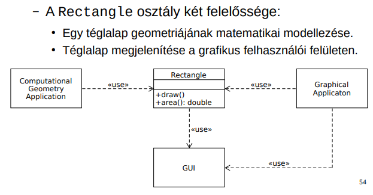
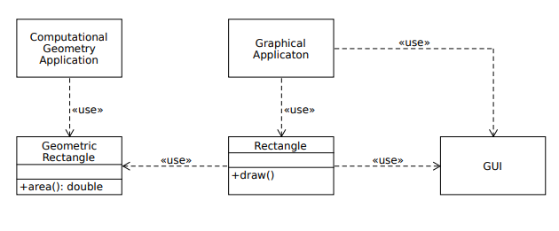
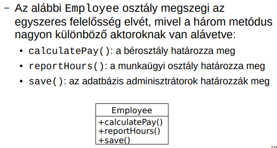
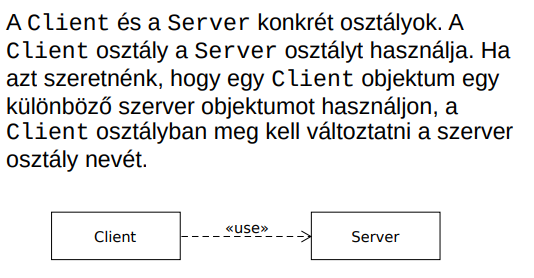
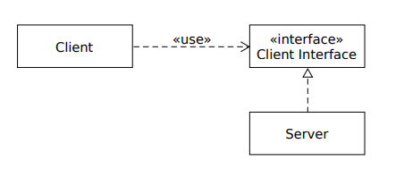
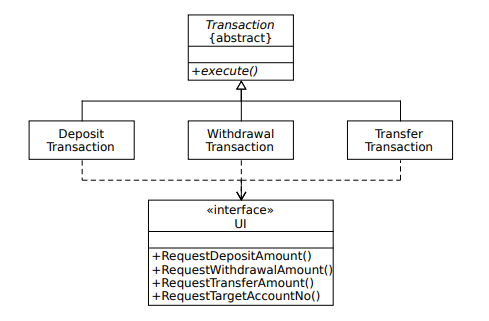
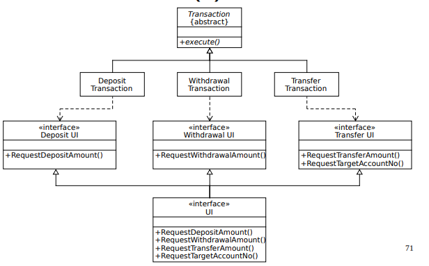
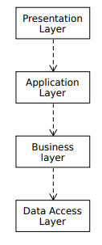
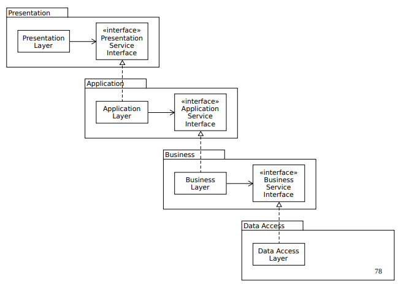
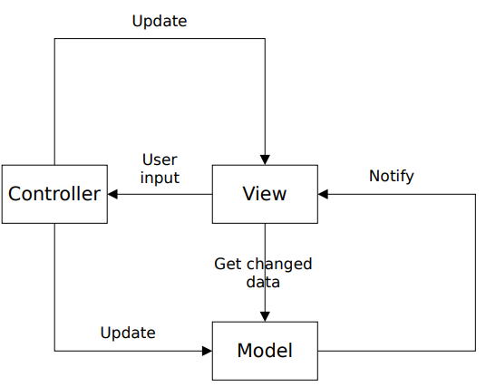

[⬅ Vissza a főoldalra](../../zarovizsga.md)

## 5. tétel: Verziókezelés, verziókezelő rendszerek. Szoftvertesztelési alapfogalmak (tesztszintek, teszttípusok, teszttervezési módszerek). Objektum orientált tervezési alapelvek (GoF, SOLID). Függőségbefecskendezés. Architekturális minták (MVC). Tervezési minták. Szabad és nem szabad szoftverek. Szoftverlicencek, szabad és nyílt forrású licencek fajtái.

### Verziókezelés, verziókezelő rendszerek

**Verziókövetés/kezelés**: azon eljárások és módszertanok összessége, amelyek biztosítják egy adathalmaz – szoftverfejlesztés esetén a forráskód – különböző változatainak rendszerezett nyilvántartását és menedzselését. Mivel egy programon gyakran több fejlesztő dolgozik párhuzamosan, elengedhetetlen a módosítások precíz összehangolása és nyomon követése.

**Verziókezelő rendszerek:** olyan szoftveres eszközök (például a Git), amelyek automatizálják a verziókövetést. Lehetővé teszik, hogy a rendszerbe vont állományok teljes élettartama átlátható legyen: bármely korábbi állapot visszakereshető és visszaállítható, a különböző változatok közötti eltérések pedig sorról sorra összehasonlíthatók.

---

### Szoftvertesztelési alapfogalmak

**Szoftvertesztelés**: célja a szoftverek minőségének megállapítása és a működés közbeni meghibásodási kockázat csökkentése. Annak a dinamikus verifikálása, hogy a program várt módon viselkedik egy tesztesetek véges halmazán. Tesztelés csak hibák jelenlétét mutatja meg, nem hiányát.

- **Verifikáció:** annak ellenőrzése, hogy a szoftver megfelel-e a vele szemben támasztott követelményeknek
- **Validáció:** annak ellenőrzése, hogy a szoftver megfelel-e az ügyfél elvárásainak.

---

#### Hibák típusai:

- **Tévedés/tévesztés (error/mistake)**: rossz eredményt adó emberi tevékenység. Egy személy egy tévedést/tévesztést követ el, mely egy hibát vezethet be a szoftver kódjába vagy munkatermékbe.
- **Hiba (defect/fault/bug)**: tökéletlenség vagy hiányosság egy munkatermékben, melynél nem teljesülnek a követelmények/előírások. Ha végrehajtásra kerül a hiba, akkor meghibásodást okozhat, de nem minden esetben.
- **Meghibásodás (failure)**: esemény, melynél egy komponens/rendszer nem lát egy megkövetelt funkciót a megszabott határok között.

---

#### Szoftvertesztelés alapelvei:

- A tesztelés a hibák jelenlétét mutatja meg, nem a hiányukat
- Lehetetlen a kimerítő tesztelés
- A kora tesztelés időt és pénzt takarít meg
- A hibák csoportosulnak
- A tesztek elkopnak
- A tesztelés környezetfüggő
- A hibamentesség egy tévhit

**Teszteset**: tesztfeltételek alapján meghatározott előfeltételek, bemenetek, tevékenységek, elvárt eredmények, utófeltételek halmaza. Tesztfeltétel: egy komponens/rendszer tesztelhető vonatkozás, melyet a tesztelés alapjául választunk.

- **Magas szintű teszteset**: _absztrakt_ előfeltételekkel, bementi adatokkal, elvárt eredményekkel, utófeltételekkel és _lépésekkel rendelkezik_.
  **Példa**: Sikeres bejelentkezés ellenőrzése érvényes adatokkal.
- **Alacsony szintű teszteset**: _konkrét_ előfeltételekkel, bemeneti adatokkal, elvárt eredményekkel, utófeltételekkel és _lépések részlete leírásával rendelkezik_.
  **Példa:** Bejelentkezés a "teszt@email.hu" címmel és "Jelszo123!" jelszóval, majd kattintás a "Belépés" gombra.

**Tesztadat**: tesztvégrehajtáshoz szükséges adatok. A konkrét értékek alacsony szintű tesztesetekké teszik a magas szintű teszteseteket. Ugyanaz a magas szintű teszteset különböző tesztadatokat használhat különböző végrehajtásoknál.

---

#### Tesztelési szintek:

- **Egység/komponens tesztelés (Component / Unit testing)**
  - Függetlenül tesztelhető komponensekre összpontosít
  - Általában az a fejlesztő végzi, aki a kódot írja.
  - Gyakran a kód megírása után írnak és hajtanak végre egységteszteket.
- **Komponensintegrációs tesztelés (Component / Unit integration testing)**
  - A komponensek közötti kommunikációra és interfészekre összpontosít.
  - Gyakran a fejlesztő felelősége, egységtesztelés után végzik, általában automatizált.
  - Magára az integrációra kell koncentrálnia, nem a komponensek működésére
- **Rendszertesztelés (System testing)**
  - A rendszer egészének viselkedésére összpontosít.
  - Jellemzően független tesztelők végzik specifikációkra támaszkodva.
- **Rendszerintegrációs tesztelés (System integration testing)**
  - A rendszerek közötti kommunikációra és interfészekre összpontosít.
  - Kiterjedhet külső szervezetekkel való interakciókra.
  - Rendszertesztelés után, vagy folyamatban lévő rendszertesztelési tevékenységgel párhuzamosan történhet, általában a tesztelők felelőssége.
  - Olyan tesztkörnyezetre van szükség, amely hasonló a működési környezethez.
- **Elfogadási tesztelés (Acceptance testing)**
  - Azt határozza meg, hogy a rendszer kész-e a telepítésre és a használatra
  - Gyakran az üzemeltetők felelőssége
  - Kiadása előtt néha odaadják potenciális felhasználóknak egy kis kiválasztott csoportjának (_alfa tesztelés_) és/vagy reprezentatív felhasználók egy nagyobb halmazának (_béta tesztelés_)

---

#### Teszttípusok:

- **Funkcionális tesztelés**: rendszer által nyújtott funkciók tesztelése.
  **Példa:** Működik-e a "Kosárba" gomb és a bankkártyás fizetés?
- **Nem funkcionális tesztelés**: annak tesztelése, hogy a rendszer mennyire jól teszi a dolgát (használhatóság, teljesítmény, biztonság)
  **Példa:** Összeomlik-e a weboldal, ha egyszerre 10 000 ember használja? (Teljesítmény/Terheléses teszt)
- **Fehér-dobozos tesztelés**: rendszer belső felépítésén vagy megvalósításán alapuló tesztek
  **Példa:** A fejlesztő által írt egységtesztek (Unit test), amik a kód összes elágazását lefedik.
- **Fekete-dobozos tesztelés**: rendszer vizsgálata, a belső szerkezet ismerete nélkül
  **Példa:** Keresés egy weboldalon a felhasználói felületen keresztül.
- **Változással kapcsolatos tesztelés**: olyan tesztek, amikor módosítások történnek egy rendszerben egy hiba kijavításához vagy új funkció hozzáadásához / módosításához. Szükséges minden tesztelési szinten. Fajtái:
  - **Megerősítő tesztelés**: annak megerősítése, hogy a hiba sikeresen kijavításra került.
  - **Regressziós tesztelés**: a változások által okozott akaratlan mellékhatások érzékelése.

---

#### A jó egységtesztek ismertetőjegyei: **FIRST**

- **Gyors (Fast)**: a tesztek gyorsak kell, hogy legyenek.
- **Független (Independent)**: a tesztek nem függhetnek egymástól.
- **Megismételhető (Repeatable)**: a tesztek bármely környezetben megismételhetők kell, hogy legyenek.
- **Önérvényesítő (Self-Validating)**: a teszteknek logikai kimenete kell, hogy legyen. Vagy átmennek, vagy megbuknak.
- **Jól időzített (Timely)**: a teszteket időben kell megírni, közvetlenül a tesztelendő kód előtt.

---

#### Egységtesztek szervezése: az AAA minta

- **Elrendez (Arrange)**: felelős a tesztelt rendszer és függőségei egy kívánt állapotba állításáért.
- **Cselekszik (Act)**: ez szolgál a tesztelt rendszer metódusainak meghívására, függőségek átadására, kimeneti érték elkapására.
- **Kijelent (Assert)**: ez szolgál a kimenet ellenőrzésére (visszatérési érték, végső állapot)

---

### Objektumorientált tervezési alapelvek

#### DRY (Don’t Repeat Yourself) elv:

- A tudás minden darabkájának egyetlen, egyértelmű, hiteles reprezentációja kell, hogy legyen egy rendszerben
- Ellenkezője a WET (We enjoy typing, write everything twice, waste everyone’s time)
- Ismétlések fajtái:
  - **Kényszerített ismétlés**: fejlesztők szerint nincs választásuk, a környezet láthatólag megköveteli az ismétlést
  - **Nem szándékos ismétlés**: a fejlesztők nem veszik észre, hogy információkat duplikálnak
  - **Türelmetlen ismétlés**: a fejlesztő lustaságából fakad, ismétlés könnyebb útnak látszik
  - **Fejlesztők közötti ismétlés**: egy csapatban / különböző csapatokban többen duplikálnak egy információt.
- **Kódismétlés** – azonos forráskódrész, mely egynél többször fordul elő egy programban. Nem minden kódismétlés információ ismétlés!
- A megsértés nem mindig kódismétlés formájában jelenik meg. Pl:

```java
class Line {
    Point start;
    Point end;
    double length; // DRY elv megsértése
}
```

Kiküszöbölhető a `length` adattag egy metódusra való kicserélésével.

```java
class Line {
    Point start;
    Point end;

    double length(){
        return start.distanceTo(end);
    }
}
```

- A jobb teljesítmény érdekében választható a DRY elv megsértése.
- **Reprezentációs ismétlés**: a kód gyakran függ a külvilágtól, mely mindig a DRY elv valamiféle megsértését vonja maga után.

---

**KISS (Keep it simple, stupid) elv**: az egyszerűségre való törekvés

**YAGNI (You aren’t gonna need it) elv**:

- Extrém programozás (XP) alapelve
- „Mindig akkor implementálj valamit, amikor tényleg szükséged van rá, soha ne akkor, amikor csak sejted, hogy kell”
- Csak azon képességekre vonatkozik, melyek egy feltételezett lehetőség támogatásához kerülnek beépítésre a szoftverbe, nem vonatkozik a szoftver módosítását könnyítő törekvésekre.
- Csak akkor járható stratégia, ha a kód könnyen változtatható.

---

**Csatoltság**:

- Egy szoftvermodul függésének mértéke egy másik szoftvermodultól
- **Szoros csatoltság**: bonyolultságot növeli, megnehezíti a kód, módosítását, karbantarthatóságot és újrafelhasználhatóságot csökkenti.
- **Laza csatoltság**: a kódot kiterjeszthetővé teszi, a kiterjeszthetőség pedig karbantarthatóvá, lehetővé teszi a párhuzamos fejlesztést.

---

#### GoF (Gang of Four) alapelvek

- Interfészre programozzunk, ne implementációra.
- Részesítsük előnyben az objektum-összetételt az öröklődéssel szemben.

| Öröklődés                                                                                                                  | Objektum-összetétel                                                                                  |
| -------------------------------------------------------------------------------------------------------------------------- | ---------------------------------------------------------------------------------------------------- |
| **Pro:**                                                                                                                   | **Pro:**                                                                                             |
| Használata egyszerű, programozási nyelv közvetlenül támogatja.                                                             | Az objektumokat csak az interfészükön keresztül érhetjük el, nem szegjük meg az egységbezárás elvét. |
| Könnyebbé teszi az újrafelhasznált megvalósítás módosítását is.                                                            | Bármely objektumot lecserélhetünk egy másikra futásidőben, amíg típusaik egyeznek.                   |
|                                                                                                                            | Az osztályok és osztályhierarchiák kicsik maradnak.                                                  |
| **Con:**                                                                                                                   | **Con:**                                                                                             |
| A szűlőosztályoktól örökölt megvalósításokat futásidőben nem változtathatjuk meg, mert az öröklődés már fordításkor eldől. | A tervezés során több objektumunk lesz.                                                              |
| A szülőosztályok alosztályaik fizikai ábrázolását is meghatározzák, legalább részben.                                      |                                                                                                      |
| Az implementációs függőségek gondot okozhatnak az alosztályok újrafelhasználásánál.                                        |                                                                                                      |

**Példa öröklődésre:**

```java
class Animal {
    public void speak() {
        System.out.println("Some generic animal sound");
    }
}

class Dog extends Animal {
    @Override
    public void speak() {
        System.out.println("Woof!");
    }
}

public class Main {
    public static void main(String[] args) {
        Dog dog = new Dog();
        dog.speak(); // Kiírja: Woof!
    }
}
```

**Példa objektum-összetételre:**

```java
interface SoundBehavior {
    void speak();
}

class DogSound implements SoundBehavior {
    public void speak() {
        System.out.println("Woof!");
    }
}

class AnimalSound implements SoundBehavior {
    public void speak() {
        System.out.println("Some generic animal sound");
    }
}

class Dog {
    private SoundBehavior sound;

    public Dog() {
        this.sound = new DogSound();
    }

    public void setSound(SoundBehavior sound) {
        this.sound = sound;
    }

    public void speak() {
        sound.speak();
    }
}

public class Main {
    public static void main(String[] args) {
        Dog dog = new Dog();
        dog.speak(); // Kiírja: Woof!

        // Dinamikusan változtatjuk a viselkedést
        dog.setSound(new AnimalSound());
        dog.speak(); // Kiírja: Some generic animal sound
    }
}
```

---

#### SOLID alapelvek

- **Single Responsibility Principle – Egyszeres felelősség elve**
  - _Egy osztálynak egy oka legyen a változásra_
  - Egynél több felelősség esetén a felelősségek csatolttá válnak. Egy felelősségben történő változások gyengíthetik vagy gátolhatják az osztály azon képességét, hogy eleget tegyen a többi felelősségének.
    - Példa megsértésre:
      
    - Problémák:
      - a számítógépes geometriai alkalmazásnak tartalmaznia kell a grafikus felhasználói felületet
      - ha a grafikus alkalmazás miatt változik a Rectangle osztály, az szükségessé teheti a számítógépes geometriai alkalmazás összeállításának, tesztelésének, telepítésének megismétlését.
    - Megfelelő változat:
      
  - Egy modul egy, és csak **egyetlen aktornak** (emberek egy olyan csoportja, akik azt akarják, hogy a szoftver ugyanúgy változzon) van alárendelve.
    - Megsértése:
      

- **Open/Closed Principle – Nyitva zárt elv**:
  - A szoftver entitások legyenek nyitottak a bővítésre, de zártak a módosításra.
  - Nyitott a bővítésre: a modul viselkedése kiterjeszthető
  - Zárt a módosításra: modul viselkedésének kiterjesztése nem eredményezi a modul forráskódjának változását.
  - Megsértése:
    
  - Megfelelő változat:
    

- **Liskov Substitution Principle – Liskov-féle helyettesítési elv**
  - Ha az S típus a T típus altípusa, nem változhat meg egy program működése, ha benne a T típusú objektumokat S típusú objektumokkal helyettesítjük.
  - Megsértése:

    ```java
    class Bird {
        void fly() {
            System.out.println("Flying");
        }
    }

    class Ostrich extends Bird {
        @Override
        void fly() {
            throw new UnsupportedOperationException("Ostriches can't fly");
        }
    }
    ```

- **Interface Segregation Principle – Interfész szétválasztási elv**
  - _Nem szabad arra kényszeríteni az osztályokat, hogy olyan metódusoktól függjenek, melyeket nem használnak._
  - **Vastag interfész:** ésszerűen szükségesnél több tagfüggvénnyel és baráttal rendelkező interfész. Problémái: sok felelősséget tartalmaznak, különböző metódusokat külön kliensek használnak, nem szándékos csatoltságot okoznak a kliensek között.
  - **Interfész szennyezés:** szükségtelen metódusokkal egy interfész szennyezése.
  - Megsértése:
    
  - Megfelelő változat:
    

- **Dependency Inversion Principle – Függőség megfordítási elv**
  - Magas szintű modulok (üzleti logika) ne függjenek alacsony szint moduloktól (pl. fájlkezelés, adatbázis, I/O). Mindkettő absztrakciótól (interfésztől) függjön.
  - **Probléma**: magas szintű modulok függenek az alacsony szintű moduloktól. Ha alacsony szinten változás van, az hatással lesz a magas szintre is. Ez csökkenti az újrafelhasználhatóságot.
  - **Előnye**: a magas szintű modul független az implementáció részleteitől, könnyebb cserélni, tesztelni, újrafelhasználni a komponenseket. Az implementációk csak a saját interfészüket ismerik, nem a hívóikat.
  - **Megsértése**:
    
  - **Megfelelő változat:**
    

---

### Függőség befecskendezés

- Olyan szoftvertervezési elvek és minták összessége, melyek lazán csatolt kód fejlesztését teszik lehetővé.
- Egy objektumra egy olyan szolgáltatásként tekintünk, melyet más objektumok kliensként használnak.
- Az objektumok közötti kliens-szolgáltató kapcsolatot függésnek nevezzük. Ez a kapcsolat tranzitív.
- **Függőség**: kliens által igényelt szolgálatás, mely a feladatának ellátásához szükséges.
- **Függő**: olyan kliens objektum, melynek függőségekre van szüksége a feladatának ellátásához.
- **Objektum gráf**: függő objektumok és függőségeinek összessége
- **Befecskendezés**: egy kliens függőségeinek megadása
- **DI konténer**: függőség befecskendezési funkcionalitást nyújtó programkönyvtár.
- **Tiszta DI**: függőség befecskendezés alkalmazásának gyakorlata DI konténer nélkül.
- **Példák:**
  - nincs függőség befecskendezés

    ```java
    public interface SpellChecker {
        boolean check(String text);
    }

    public class TextEditor {
        private SpellChecker spellChecker;

        public TextEditor() {
            spellChecker = new HungarianSpellChecker();
        }
    }
    ```

  - függőség befecskendezés konstruktorral

    ```java
        public class TextEditor {
            private SpellChecker spellChecker;

            public TextEditor(SpellChecker spellChecker) {
                this.spellChecker = spellChecker;
            }
        }
    ```

  - függőség befecskendezés interfésszel

    ```java
    public interface SpellCheckerSetter {
        void setSpellChecker(SpellChecker spellChecker);
    }

    public class TextEditor implements SpellCheckerSetter {
        private SpellChecker spellChecker;

        public TextEditor() {}

        @Override
        public void setSpellChecker(SpellChecker spellChecker) {
            this.spellChecker = spellChecker;
        }
    }
    ```

- **Előnyei**: kiterjeszthetőség, karbantarthatóság, tesztelhetőség

---

### Architekturális minták

- Szoftverrendszerek alapvető szerkezeti felépítésére adnak sémákat.
- Előre definiált alrendszereket biztosítanak, meghatározzák ezek felelősségi köreit, valamint szabályokat és irányelveket tartalmaznak a közöttük lévő kapcsolatok szervezésére vonatkozólag.

##### MVC (Model-View-Controller) – Modell-nézet vezérlő:

- **Környezet**: rugalmas ember-gép (grafikus) felülettel rendelkező interaktív alkalmazások.
- **Probléma**: gyakori az igény a felhasználói felületek változására
- **Megoldás**: három részre osztás:
  - A modell komponens az adatokat és funkcionalitást csomagolja be, független a kimenet ábrázolásmódjától vagy az input viselkedésétől.
  - Nézet komponensek jelenítik meg az információkat a felhasználónak.
  - A vezérlő fogadja a bemenetet, mely szolgáltatáskérésekké alakít a modell vagy nézet felé.
- A modell elválasztása több nézetet is lehetővé tesz ugyanahhoz a modellhez.
- A nézet elválasztása a vezérlő komponenstől kevésbé fontos.
- A modell a szakterület valamilyen információját ábrázoló objektum, mely adatokat csomagol be.
- Példa:
  
- **Változatok**:
  - Hierarchikus modell-nézet vezérlő (HMVC)
  - Model-template-view (MTV)
  - Model-view-presenter (MVP)
  - Model-view-viewmodel (MVVM)

---

#### Tervezési minták

- Középszintű minták, kisebb léptékűek az architekturális mintáknál.
- Meghatározzák egy alrendszer felépítését.
- Függetlenek programozási nyelvektől/paradigmáktól.
- **Osztályzás** céljuk szerint:
  - **Létrehozási minták**: az objektumok létrehozásával foglalkoznak
    - **Elvont gyár**: kapcsolódó vagy egymástól függő objektumok családjának létrehozására szolgáló felületet biztosít a konkrét osztályok megadása nélkül.

    ```java
    public interface KingdomFactory {
        Castle createCastle();
        King createKing();
        Army createArmy();
    }

    public class ElfKingdomFactory implements KingdomFactory {

        @Override
        public Castle createCastle() {
            return new ElfCastle();
        }

        @Override
        public King createKing() {
            return new ElfKing();
        }

        @Override
        public Army createArmy() {
            return new ElfArmy();
        }

    }
    ```

    - **Egyke (Singleton):** Egy osztályból csak egy példányt engedélyez, és ehhez globális hozzáférési pontot ad meg.

    ```java
    class Singleton {
        private static final Singleton INSTANCE = new Singleton();

        private Singleton() {}

        public static Singleton getInstance() {
            return INSTANCE;
        }
    }
    ```

    - **Építő:** Az összetett objektumok felépítését függetleníti az ábrázolásuktól, így ugyanazzal az építési folyamattal különböző ábrázolásokat hozhatunk létre.

    ```java
    class Pizza {
        String dough, sauce;
    }

    class PizzaBuilder {
        private Pizza pizza = new Pizza();

        public PizzaBuilder dough(String d) { pizza.dough = d; return this; }
        public PizzaBuilder sauce(String s) { pizza.sauce = s; return this; }

        public Pizza build() { return pizza; }
    }

    // -------------------

    Pizza pizza = new PizzaBuilder().dough("vékony").sauce("paradicsomos").build();
    ```

    - **Gyártófüggvények**: Felületet határoz meg egy objektum létrehozásához, az alosztályokra bízva, melyik osztályt példányosítják. A gyártófüggvények megengedik az osztályoknak, hogy a példányosítást az alosztályokra ruházzák át.

    ```java
    abstract class_hour {
        abstract String create();  // Gyártófüggvény
    }

    class Dog extends class_hour {
        String create() { return "Kutya"; }
    }

    class Cat extends class_hour {
        String create() { return "Macska"; }
    }

    class Factory {
        static class_hour make(String type) {
            if (type.equals("kutya")) return new Dog();
            else return new Cat();
        }
    }

    // -------------------

    class_hour a = Factory.make("kutya");
    System.out.println(a.create());
    ```

  - **Szerkezeti minták**: azzal foglalkoznak, hogy hogyan alkotnak osztályok és objektumok nagyobb szerkezeteket.
    - **Díszítő**: Az objektumokhoz dinamikusan további felelősségi köröket rendel. A kiegészítő szolgáltatások biztosítása terén e módszer rugalmas alternatívája az alosztályok létrehozásának.

    ```java
    interface Ital {
        String nev();
    }

    class Kave implements Ital {
        public String nev() { return "Kávé"; }
    }

    class Tej implements Ital {
        private Ital ital;

        public Tej(Ital ital) { this.ital = ital; }

        public String nev() { return ital.nev() + " + tej"; }
    }
    ```

    - **Illesztő:** Az adott osztály interfészét az ügyfelek által igényelt interfésszé alakítja. E módszerrel az egyébként összeférhetetlen interfészű osztályok együttműködését biztosíthatjuk.

    ```java
    interface UjDolog {
        void megy();
    }

    class RegiDolog {
        void indul() {
            System.out.println("Mukodik");
        }
    }

    class Adapter implements UjDolog {
        private RegiDolog regi = new RegiDolog();

        public void megy() {
            regi.indul();
        }
    }
    ```

  - **Viselkedési minták**: az osztályok vagy objektumok egymásra hatását, valamint a felelősségek elosztását írják le.
    - **Bejáró**: Az összetett objektumok elemeinek soros elérését a háttérben megbúvó ábrázolás felfedése nélkül biztosító módszer kialakítása.

    ```java
    class Bejaro {
        private String[] elemek = {"A", "B", "C"};
        private int i = 0;

        boolean hasNext() {
            return i < elemek.length;
        }

        String next() {
            return elemek[i++];
        }
    }

    // -------------------

    Bejaro b = new Bejaro();

    while (b.hasNext()) {
        System.out.println(b.next());
    }
    ```

    - **Sablonfüggvény:** Egy adott művelet algoritmusának vázát elkészíteni, amelynek egyes lépéseit alosztályokra ruházzuk át. Így az alosztályok az algoritmus egyes lépéseit felülbírálhatják, anélkül, hogy az algoritmus szerkezete módosulna.

    ```java
    abstract class Ital {
        final void keszit() {
            forral();
            izesit();
        }

        void forral() {
            System.out.println("Forral");
        }

        abstract void izesit();
    }

    class Tea extends Ital {
        void izesit() {
            System.out.println("Tea");
        }
    }

    // -------------------

    Ital i = new Tea();
    i.keszit();
    ```

    - **Megfigyelő**: Objektumok között egy sok-sok függőségi kapcsolatot létrehozni, így amikor az egyik objektum állapota megváltozik, minden tőle függő objektum értesül erről és automatikusan frissül.

    ```java
    interface Observer {
        void update();
    }

    class User implements Observer {
        public void update() {
            System.out.println("Uj video!");
        }
    }

    class Channel {
        Observer user;

        void subscribe(Observer u) {
            user = u;
        }

        void uploadVideo() {
            user.update();
        }
    }

    // -------------------
    Channel c = new Channel();
    c.subscribe(new User());
    c.uploadVideo();
    ```

---

### Szoftverlicencek, szabad és nyílt forrású licencek fajtái.

#### Szabad és nyílt forrású szoftverek (FOSS - Free and Open Source Software)

A nyílt forráskódú fejlesztés alapelve, hogy a forráskód szabadon elérhető, ez azonban nem jelenti azt, hogy bárki bármit korlátozások nélkül megtehet vele. A kód jogilag a fejlesztő tulajdona marad, aki a felhasználás feltételeit és korlátozásait a nyílt forráskódú licencben határozza meg. A szabad és nyílt forrású licencek két fő kategóriába sorolhatók:

- **Permissive (megengedő) szabad licencek**: Ezek a licencek minimális korlátozást szabnak a szoftver újrafelhasználására, így az adott kód akár zárt forráskódú, üzleti (kereskedelmi) alkalmazásokba is beépíthető.
- **Copyleft (szabad, de "fertőző") licencek**: A szabad szoftver mozgalom alapját képezik. Bár a szoftver szabadon módosítható, a licenc szigorúan kiköti, hogy a módosított vagy az arra épülő szoftvert is kötelező azonos (nyílt) licenc alatt továbbadni.

#### Nem szabad (zárt / üzleti / proprietary) szoftverek

Ezeknél a szoftvereknél a forráskód nem módosítható szabadon, továbbá az eszköz használata fizetős vagy valamilyen módon korlátozott
