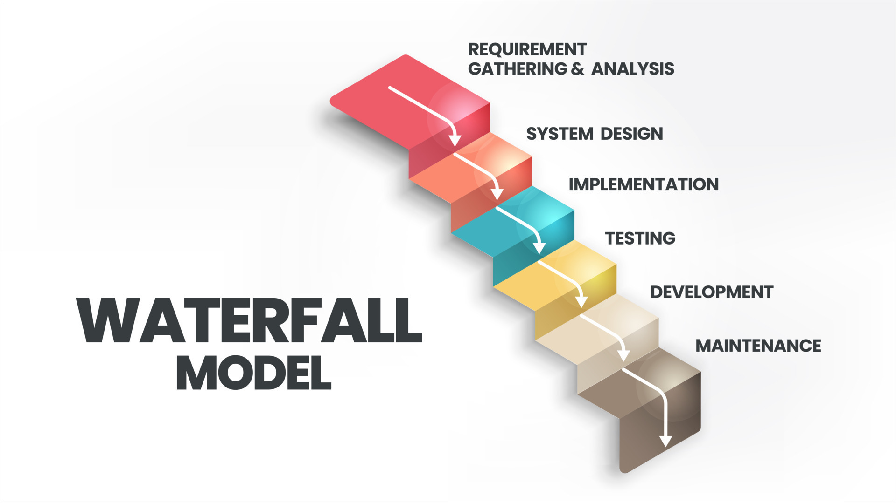
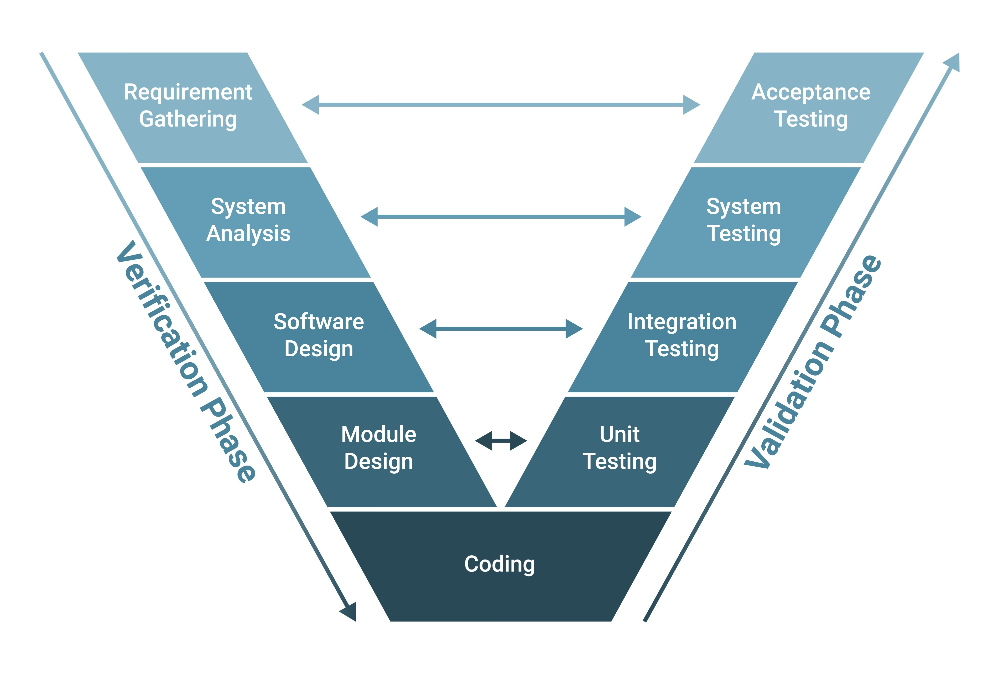
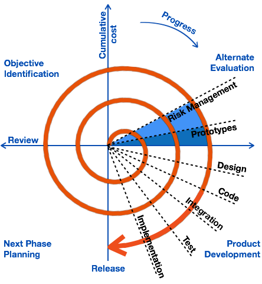
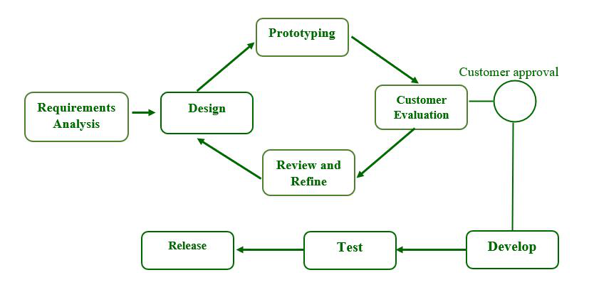
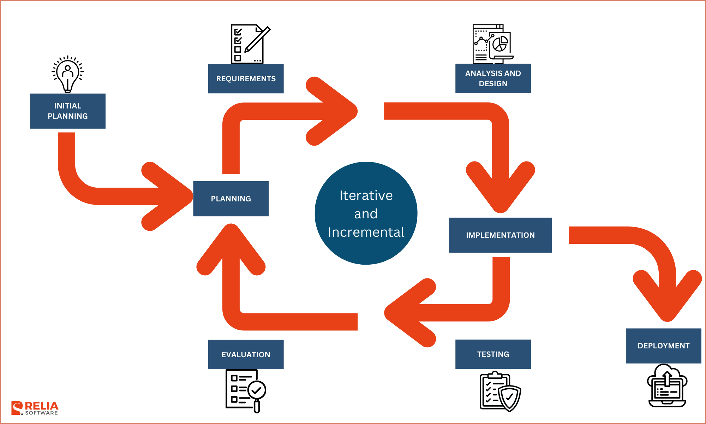
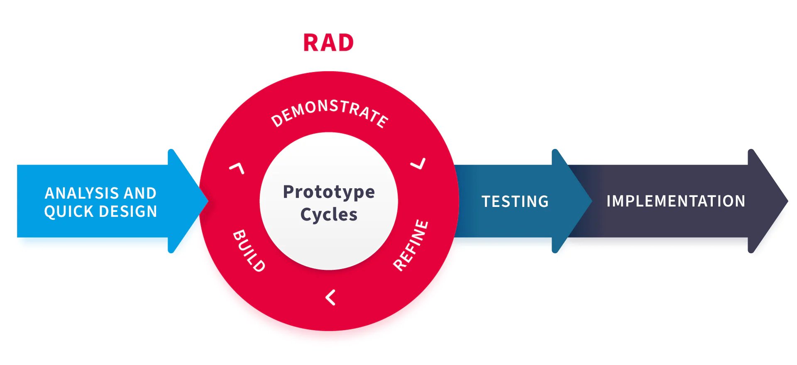

[⬅ Vissza a főoldalra](../../zarovizsga.md)

## 6. tétel: Hagyományos szoftverfejlesztési módszertanok: vízesés modell, V-modell, spirális fejlesztési modell, prototípus alapú fejlesztés, iteratív és inkrementális módszertanok, gyors alkalmazásfejlesztés. Agilis szoftverfejlesztési módszertanok: az agilis szoftverfejlesztés alapjai, az agilis kiáltvány, valamint egy szabadon választott agilis módszertan részletes bemutatása.

---

### Vízesés modell

- **Lényege:** Hagyományos, szigorúan **lineáris** szoftverfejlesztési módszertan.
- **Folyamat:** A fázisok egymásra épülnek, csak előrefelé haladnak. Egy szakaszt teljesen le kell zárni (és dokumentálni) a következő megkezdése előtt.
- **Fázisok:** Követelményelemzés → Tervezés → Implementáció (Kódolás) → Tesztelés → Üzembe helyezés.
- **Hátránya:** **Rugalmatlan**. Menet közben módosítani nagyon nehéz és költséges (a visszalépés nem támogatott). A megrendelő csak a legvégén látja a működő terméket.
- **Mikor ideális?** Kőbe vésett, fix követelmények esetén, ahol a változás kizárt (pl. életkritikus rendszerek: NASA, orvosi műszerek, beágyazott rendszerek).

---

### V-modell

- **Lényege:** A vízesés modell továbbfejlesztett változata, amely a **tesztelésre** helyezi a fő hangsúlyt. A folyamatábra egy "V" betűt formáz (bal ág: Verifikáció/Tervezés, jobb ág: Validáció/Tesztelés).
- **Folyamat:** A bal oldalon haladunk lefelé a tervezéssel, de **minden tervezési fázisnak megvan a maga tesztelési párja** a jobb oldalon. A tesztelési terveket már a tervezési fázisokkal egy időben elkészítik.
- **Párosítások (példa):** Követelményelemzés ↔ Elfogadási teszt; Rendszertervezés ↔ Rendszerteszt; Modultervezés ↔ Egységteszt.
- **Előnye:** Rendkívül magas minőségbiztosítás. Mivel a teszteket már az elején megtervezik, nagyon alapos és fegyelmezett a kód ellenőrzése.
- **Hátránya:** A vízeséshez hasonlóan **nagyon rugalmatlan**. Ha a megrendelő menet közben változtatni akar, az egész "V" ágat újra kell tervezni, ami drága és lassú.
- **Mikor ideális?** Életkritikus, szigorúan ellenőrzött projekteknél, ahol a követelmények kőbe vannak vésve, és a hibátlanság kötelező (pl. orvosi műszerek, légirányítási szoftverek, katonai rendszerek).

---

### Spirális fejlesztési modell

- **Lényege:** Az első jelentős **iteratív** (ismétlődő ciklusokra épülő) modell, amely ötvözi a vízesés modell fegyelmezettségét a prototípus-készítés rugalmasságával.
- **Folyamat:** A fejlesztés spirál alakban halad belülről kifelé. Minden egyes "kör" (ciklus) egy új fejlesztési fázist jelent, aminek a végén mindig egy működő, értékelhető **prototípus** jön létre a megrendelő számára.
- **Fő jellegzetessége (Kockázatelemzés):** A modell legfontosabb egyedi tulajdonsága, hogy minden egyes ciklus kötelezően tartalmaz egy nagyon alapos **kockázatelemzési szakaszt** (technikai, pénzügyi vagy ütemezési kockázatok szűrése).
- **Előnye:** A folyamatos prototípusok miatt gyors a visszacsatolás, és a komoly problémák (kockázatok) már a korai fázisokban kiderülnek, mielőtt túl sok pénzt égetnének el.
- **Hátránya:** A projekt irányítása bonyolult és drága, a siker pedig nagymértékben függ a kockázatelemzők szakértelmétől.
- **Mikor ideális?** Kifejezetten **nagy, drága és bonyolult rendszerek** fejlesztésénél (pl. új operációs rendszerek, komplex vállalati architektúrák), ahol hatalmas a kockázat, és a követelmények nem teljesen tiszták az induláskor.

---

### Prototípus alapú modell

- **Lényege:** Közvetlen válasz a vízesés modell rugalmatlanságára. A végleges kódolás előtt a megrendelő **működő (vagy annak tűnő) előzetes verziókat** kap a kezébe.
- **Folyamat:** Gyors követelményfelmérés → Prototípus megépítése → Ügyfél kipróbálja → Visszajelzés (feedback) → Finomítás. Ezt addig ismétlik, amíg a modell tökéletes nem lesz, és csak utána kódolják le a végleges, stabil rendszert.
- **Fő előnye (A visszacsatolás ereje):** A megrendelő sokszor papíron nem tudja megfogalmazni, mit akar. Ha viszont egy tapintható, kattintható szoftvert használ, **pontos és valós visszajelzést** tud adni. Az elvárások és a valóság így gyorsan fedésbe kerülnek.
- **Hátránya:** Az ügyfél gyakran azt hiszi, hogy a "szépen kinéző" prototípus már maga a kész program (nem érti, hogy a háttérrendszer még hiányzik). A sok finomítás miatt a projekt könnyen elhúzódhat.
- **Mikor ideális?** Erősen interaktív alkalmazásoknál, ahol a felhasználói felület (UI/UX) és a felhasználói élmény a legfontosabb, illetve ha az ügyfél az elején még "nem tudja pontosan, mit akar".

---

### Inkrementális / Iteratív modell

- **Lényege:** A hatalmas, egybefüggő feladatot kisebb, jól kezelhető darabokra (inkrementumokra) és ismétlődő fejlesztési ciklusokra (iterációkra) bontja. A rendszer nem a legvégén áll össze, hanem lépésről lépésre, darabonként épül fel.
- **Folyamat:** A munkát egyenlő hosszúságú fázisokra bontják (mint egy sorozat epizódjai). Minden ciklus végén egy újabb, kibővített, működő verziót adnak ki (konstans prototípus / release). Ezt az ügyfél kipróbálja, majd a folyamatos visszajelzések alapján történik a következő ciklus újratervezése.
- **Előnye (Könnyű változtathatóság):** Mivel a tervezés és a visszacsatolás folyamatos, a modell rendkívül gyorsan tud reagálni a változó igényekre. A megrendelő már a projekt korai szakaszában kap valami használhatót.
- **Kapcsolata a Vízeséssel:** Nem feltétlenül a vízesés szöges ellentéte, a kettő kiválóan **keveredhet (hibrid modellek)**. Például: a projekt globális tervezése és az architektúra kitalálása történhet vízesés-szerűen, de a konkrét kódolás és tesztelés már iteratív fázisokban zajlik.
- **Mikor ideális?** Olyan projekteknél, ahol a főbb üzleti célok tiszták, de a részletek még homályosak, és fontos, hogy az alapfunkciókkal (MVP - Minimum Viable Product) minél hamarabb piacra tudjanak lépni.

---

### Gyors alkalmazásfejlesztés (RAD - Rapid App Development) – Rövid vizsgavázlat

- **Lényege:** A sebességre és a gyors prototípus-készítésre fókuszál a hosszas, papíralapú tervezés helyett. A szoftvert nem a legvégén kezdik el kódolni, hanem a legelső prototípus folyamatos, ismétlődő finomításával jutnak el a hibátlan végtermékig.
- **Folyamat:** Alapkövetelmények → Felhasználói tervezés (gyors prototípus) → Építés és visszajelzés. A felhasználó azonnal teszteli a prototípust, a fejlesztők pedig akárhányszor újratervezik/finomítják azt a feedback alapján, amíg tökéletes nem lesz.
- **Előnyei:**
  - **Gyorsaság:** Drasztikusan csökkenti a fejlesztési időt.
  - **Korai feedback:** A megrendelő végig bevonva marad, minimalizálva a félreértéseket.
  - **Könnyű integráció:** A folyamatos tesztelés miatt a végén kevés a meglepetés, és a kódkomponensek jól újrahasznosíthatók.
- **Hátrányai:**
  - Csak **erősen modularizálható** (egymástól független, legókockaként összerakható) rendszereknél működik.
  - Kiváló, tapasztalt (és emiatt drága) szakembereket és nagyon jó előzetes modellezést igényel.
- **Mikor ideális?** Szűk határidős projekteknél, ahol a szoftver jól darabolható (pl. különálló menüpontok, funkciók), és az ügyfélnek van ideje és hajlandósága folyamatosan tesztelni a köztes verziókat.

---

### Agilis szoftverfejlesztés alapjai

**Az alapelképzelés**
Az agilis módszertanok célja a korábbi merev rendszerek (pl. vízesés modell) hibáinak kiküszöbölése:

- **Kevesebb bürokrácia:** Minimálisra csökkenti a felesleges procedúrákat és az adminisztrációt.
- **Hatékonyabb erőforrás-kihasználás:** A fókusz a valós, értékteremtő munkán van.
- **Ügyfél és változás a fókuszban:** Nem a tervhez ragaszkodnak vakon, hanem az ügyfél igényeihez, amelyek menet közben is változhatnak.
- **Gyors iterációk:** A fejlesztés rövid szakaszokban történik (minden iteráció egy önálló, lezárt mini-projekt).
- **Inkrementális növekedés:** A szoftver lépésről lépésre épül fel, folyamatosan bővül.
- **Konklúzió:** A siker kulcsa a megrendelővel való **folyamatos kommunikáció**, a rendszeres egyeztetés, valamint a periodikus és iteratív fejlesztési ciklusok. A végső cél a maximális ügyfélelégedettség (Customer Satisfaction).

---

#### Az Agilis Kiáltvány (Agile Manifesto) 4 alapértéke

Az agilis szemlélet szerint, bár a jobb oldalon lévő dolgoknak is van értékük, **a bal oldalon lévőket többre értékelik**:

1. **Egyének és interakciók** a folyamatokkal és eszközökkel szemben.
2. **Működő szoftver** az átfogó dokumentációval szemben.
3. **Ügyféllel való együttműködés** a szerződéses egyeztetésekkel szemben.
4. **Változásokra való reagálás** a tervek merev követésével szemben.

---

#### Az Agilis szoftverfejlesztés 12 alapelve

1. **Ügyfélelégedettség:** Legfőbb prioritásunk az ügyfél elégedettsége, amit az értéket képviselő, működő szoftver korai és folyamatos szállításával érünk el.
2. **Változások befogadása:** Üdvözöljük a változó követelményeket, még a fejlesztés késői szakaszában is. Az agilis folyamatok a változást az ügyfél versenyelőnyére fordítják.
3. **Gyakori szállítás:** Működő szoftvert szállítunk gyakran, pár héttől pár hónapig terjedő időközönként, a rövidebb időskálát előnyben részesítve.
4. **Folyamatos együttműködés:** Az üzleti szakembereknek és a fejlesztőknek naponta együtt kell dolgozniuk a projekt során.
5. **Motivált egyének:** Építsd a projekteket motivált egyénekre. Add meg nekik a szükséges környezetet és támogatást, és bízz meg bennük, hogy elvégzik a munkát.
6. **Személyes kommunikáció:** Az információ átadásának leghatékonyabb és legeredményesebb módja a fejlesztőcsapaton belül a személyes beszélgetés.
7. **Működő szoftver:** A haladás és a siker elsődleges mércéje maga a működő szoftver.
8. **Fenntartható tempó:** Az agilis folyamatok a fenntartható fejlesztést támogatják. A szponzoroknak, a fejlesztőknek és a felhasználóknak képesnek kell lenniük egy állandó, tartható munkatempó megőrzésére.
9. **Technikai kiválóság:** A technikai kiválóságra és a jó tervezésre való folyamatos odafigyelés növeli az agilitást (a rugalmasságot).
10. **Egyszerűség:** Az egyszerűség – vagyis az el nem végzett (felesleges) munkák maximalizálásának művészete – elengedhetetlen.
11. **Önszerveződő csapatok:** A legjobb architektúrák, követelmények és tervek az önszerveződő csapatoktól származnak.
12. **Rendszeres finomhangolás:** A csapat rendszeres időközönként visszatekint (retrospektív), elemzi, hogyan válhatna hatékonyabbá, majd ehhez igazítja a viselkedését és a folyamatait.

---

### A Scrum keretrendszer

A Scrum a legelterjedtebb Agilis keretrendszer, amely egyértelmű szabályrendszert ad a komplex termékek iteratív fejlesztéséhez.

#### Az alapvető felosztás: Disznók és Csirkék

A klasszikus Scrum analógia szerint a projektben résztvevőket két csoportra bontjuk (egy rántottás reggeli példája alapján):

- **Disznók (Pigs):** Akik a "húsukat adják", azaz teljesen elkötelezettek, ők végzik a munkát és ők viselik a kockázatot (Fejlesztők, Scrum Master).
- **Csirkék (Chickens):** Akik csak "bevonódnak", vagy anyagi érdekük fűződik a projekthez (pl. a Stakeholderek, befektetők, megrendelők).

#### Szerepkörök és a köztük lévő dinamika

A Scrum csapat önszerveződő. Három hivatalos szerepkör létezik:

- **Product Owner (Terméktulajdonos) – "A Korbács":**
  - A megrendelőt helyettesíti (aki általában nem ér rá), és komoly domain tudással rendelkezik az adott szektorról (pl. postai rendszerek). Fontos: **nem a megrendelőnek dolgozik!**
  - Ő határozza meg a prioritásokat, egyedül ő kezeli a feladatlistát (Product Backlog). Ő dönti el, melyik User Story a legfontosabb, gyakorlatilag ő hajtja a projektet előre.

- **Scrum Master (Scrum Mester) – "A Pajzs":**
  - A folyamat felelőse, aki ismeri a csapattagokat és a vezetőket is. **Ő nem főnök**, de ő intézi el a dolgokat és ő hárítja el az akadályokat.
  - Legfontosabb feladata: **megvédeni a csapatot a kiégéstől** (ő tartja a pajzsot). Hatalmas a felelőssége: ha a projekt sikertelen, általában őt rúgják ki.
  - _Szakmai alapszabály:_ A PO és az SM elméletben lehetne ugyanaz a személy, de **nem szabad**, mert ellentétesek az érdekeik. Az egyik hajtja az embereket, a másik ez ellen védi őket.

- **Development Team (Fejlesztőcsapat):**
  - Lapos hierarchiájú szakértői gárda, ők végzik a tényleges munkát és vállalnak felelősséget.

#### Tervezés és Becslés (Planning & Estimation)

- **Product Backlog és Sprint Backlog:** A követelmények listája. A _Grooming_ (finomítás) és a tervezés során a PO dönti el, mi kerüljön át a nagy listából az aktuális Sprint feladatai közé.
- **Becslés (Planning Poker):** Ezzel a módszerrel becsülik meg, hogy egy User Story hány sprintbe kerül.
  - **Embernap vs. Story Pont:** Az embernap egy ember napi 8 óra munkája (amiben benne van a kávézás és a "Tiktok pörgetés" is). Egy csapat kapacitása általában 7-8 story pont sprintenként (ez lehet 1 nagy, vagy 2 kisebb story). A nagyokat mindig érdemes kisebbekre bontani.

#### Események

A Scrum kötött idejű eseményekkel dolgozik:

- **Sprint:** Maga az iteratív fejlesztési rész (általában 1-4 hét), ahol a magas prioritású feladatokkal foglalkozunk először.
- **Daily Stand Up Meeting (Napi állóértekezlet):**
  - **Szigorú szabályok:** Maximum 15 perc, és kötelezően állva kell tartani.
  - **3 kérdés mindenkinek:**
    $1.$ Mit csináltál tegnap?
    $2.$ Mit fogsz ma csinálni?
    $3.$ Milyen akadályokba ütköztél?
  - **Kik vehetnek részt?** Szigorúan csak a "Disznók". Maximális őszinteség kell (nem mondhatod meg a tulajdonos előtt, ha a csapattársad "gyökér"). A PO határeset: ha részt vesz, disznóvá válik, ha nem, csirke marad.
- **Sprint Review (Bemutató):**
  - A Sprint végén átadjuk/bemutatjuk a kész, működő prototípust.
  - A PO-nak ezt el kell fogadnia. Ha nem fogadja el a storyt, elméletben újra kell indítani a sprintet, ami a Scrumban megengedhetetlen hiba.
- **Sprint Retrospective (Visszatekintés):**
  - A Sprint lezárása. Itt értékelik a csapatműködést (mi ment jól, mi rosszul). Itt már a feszültségoldás a lényeg: "esszük a pizzát, sörözünk, megy a bowling". Meg kell köszönni a munkát, mosolyogni és mindenre bólintani.

---

### Az eXtreme Programming (XP) keretrendszer

Az XP egy Agilis módszertan, amelynek alapfilozófiája: **vegyük a szoftverfejlesztés bizonyítottan jó gyakorlatait, és tekerjük fel őket az "extrém" végletekig.**
_Ha a kódátnézés jó, csináljuk folyamatosan (Páros programozás). Ha a tesztelés jó, teszteljünk kódolás előtt (TDD)._

#### Szerepkörök és a köztük lévő dinamika

Az XP-ben nincsenek bonyolult hierarchiák, a csapat szorosan együttműködik az üzleti oldallal:

- **Helyszíni Ügyfél (On-site Customer) – "Az Iránytű":**
  - A Scrumban lévő Product Ownerhez hasonló, de az XP ezt a végletekig viszi: az ügyfélnek (vagy képviselőjének) **fizikailag a csapattal egy irodában kell ülnie**, vagy azonnal elérhetőnek kell lennie.
  - Nincs hetekig tartó e-mailezés. Ő mondja meg a "Mit" (üzleti igények, sztorik), de nem szól bele a "Hogyan"-ba.
- **Fejlesztő (Developer) – "A Motor":**
  - Nincsenek elkülönült "tesztelő", "dizájner" vagy "architekt" szerepkörök. Minden fejlesztő keresztfunkcionális, mindenki csinál mindent.
- **Edző (Coach) – "A Lelkiismeret":**
  - A Scrum Master XP-s megfelelője, de a fókusz itt a **technikai fegyelmen** van. Ő figyel arra, hogy a csapat ne lustuljon el, ne sumákolja el a tesztírást, és betartsa az XP szigorú szabályait.

#### Tervezés és Becslés

- **A Tervezési Játék (The Planning Game):** Ez egy közös "játék" az ügyfél és a fejlesztők között. Az ügyfél "játssza ki" a funkciókat (User Story-kat) az üzleti érték alapján, a fejlesztők pedig megbecsülik a költséget és az időt.
- **Spike (Felderítés):** Ha a csapat kap egy feladatot, amiről fogalma sincs, hogyan oldja meg, nem tippelgetnek. Írnak egy gyors, **eldobható kísérleti kódot** (ez a Spike), csak azért, hogy megértsék a problémát és pontosan tudjanak becsülni.

#### A legfontosabb XP Gyakorlatok

Ezek azok a szigorú technikai szabályok, amiktől az XP azzá válik, ami:

- **Páros Programozás (Pair Programming):**
  - Két ember ül egy monitor előtt. Az egyik a **"Sofőr"** (ő gépel, a részletekre figyel), a másik a **"Navigátor"** (ő diktál, a nagyobb képet, az architektúrát nézi és azonnal észreveszi a hibát).
  - _Szakmai titok:_ A menedzserek gyakran utálják, mert úgy tűnik, az egyik ember "csak nézi a képernyőt", de a valóságban a hibák drasztikus csökkenése miatt hosszútávon sokkal olcsóbb.
- **Tesztvezérelt Fejlesztés (TDD - Test-Driven Development):**
  - A logika teljes megfordítása. Tilos kódot írni anélkül, hogy ne lenne rá teszt.
  - **A "Red-Green-Refactor" ciklus:** Először megírjuk a tesztet $\Rightarrow$ az elhasal (Piros, hiszen még nincs kód) $\Rightarrow$ megírjuk a legminimálisabb kódot, amivel a teszt átmegy (Zöld) $\Rightarrow$ utána letisztázzuk, szépítjük a kódot (Refaktorálás).
- **Közös Kódtulajdon (Collective Code Ownership):**
  - Nincs olyan, hogy "ez a te kódod, én nem nyúlok hozzá". A kód mindenkié. Bárki, bármikor belenyúlhat bármelyik modulba, ha hibát lát, mert a felelősség is közös.
- **Folyamatos Integráció (CI - Continuous Integration):**
  - A fejlesztők naponta többször feltöltik a munkájukat a közös tárhelyre. A rendszer ezt azonnal, automatikusan leteszteli.
  - _Célja:_ Ezzel küszöbölik ki az IT iparág leghíresebb kifogását: _"De hát az én gépemen még működött!"_
- **Fenntartható Tempó (Sustainable Pace):**
  - **A túlóra szigorúan tilos.** Az XP abból indul ki, hogy egy fáradt fejlesztő csak szemetet kódol, ami később visszanyal. Maximum heti 40 óra, hogy a minőség tartós maradjon.

#### Az 5 alapérték (Filozófia)

A fentieket ez az 5 érték tartja egyben: **Kommunikáció** (ügyféllel, egymással), **Egyszerűség** (mindig a legegyszerűbb megoldást választjuk), **Visszacsatolás** (a tesztek és az ügyfél azonnal jelez), **Bátorság** (merjünk letörölni és újraírni egy rossz kódot), **Tisztelet** (egymás és a közös munka iránt).
