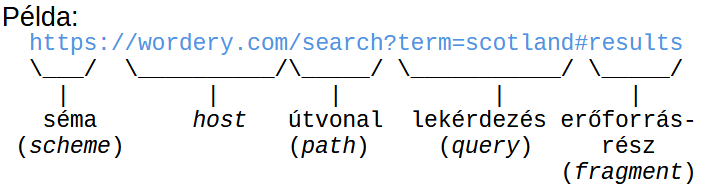
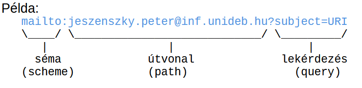

[⬅ Vissza a főoldalra](../../zarovizsga.md)

## 7. tétel: A web működésének alapjai. Web szabványok és szabványügyi szervezetek. URI-k és felépítésük. HTTP: kérések és válaszok felépítése, metódusok, állapotkódok, tartalomegyeztetés, sütik. A web jelölőnyelvei: XML és HTML dokumentumok felépítése. Stíluslap nyelvek. JSON.

---

### Webes Alapfogalmak

- **Erőforrás:** Bármilyen entitás, amely URI-val azonosítható (pl. egy dokumentum, kép vagy szolgáltatás). _Információ erőforrás:_ Olyan erőforrás, amelynek minden lényeges jellemzője átvihető egyetlen üzenetben.
- **URI (Uniform Resource Identifier):** A weben használt, erőforrásokat azonosító globális karaktersorozat.
- **World Wide Web:** Az az információs tér, amelyben a hálózatba kötött erőforrásokat URI-k azonosítják.
- **Reprezentáció:** Egy erőforrás adott pillanatbeli állapotát leíró adat (pl. egy weboldal HTML vagy JSON formátumban).
- **Tartalomegyeztetés:** Az a mechanizmus, amikor egy erőforrás több formátumban is elérhető, és a szerver kiválasztja a kliens számára legmegfelelőbb reprezentációt.
- **Hivatkozás feloldása:** Az URI gyakorlati felhasználása az erőforrás elérésére (legyen az letöltés, módosítás, létrehozás vagy törlés).
- **Felhasználói ágens:** A felhasználó nevében cselekvő kliensoldali szoftver (a legtipikusabb példája a webböngésző).

---

### Web Szabványok és Típusaik

A szabvány olyan dokumentált követelmény-, irányelv- vagy specifikáció-halmaz, amely biztosítja, hogy a különböző rendszerek és technológiák egységesen és rendeltetésszerűen működjenek együtt.

**A szabványok három fő típusa:**

1.  **De facto (tényleges):** Nem hivatalos szervezet hozta létre, hanem a piaci dominancia és a széleskörű használat emelte szabvánnyá. _(Példa: QWERTY billentyűzetkiosztás, TeX dokumentumformázó)_
2.  **De jure (jogi):** Törvényi, állami vagy hivatalos nemzetközi szervezet által kötelezően előírt szabvány. _(Példa: SI nemzetközi mértékegységrendszer)_
3.  **Önkéntes közmegegyezés:** Szakmai vagy magánintézmények által közösen kidolgozott szabványok. _(Példa: TCP/IP protokoll, HTML, CSS)_

---

### Szabványosító Szervezetek

#### 1. IANA (Internet Assigned Numbers Authority)

Az internet "számkiosztó hatósága". Feladata az internet zavartalan működéséhez szükséges globális azonosítók kezelése:

- Kiosztja és koordinálja az IP-címeket.
- Felügyeli a DNS gyökérzónákat (pl. `.int`, `.arpa`).
- Nyilvántartja a különböző internetes protokollokhoz tartozó portokat és kódokat.

#### 2. IETF (Internet Engineering Task Force)

Az internet architekturális és protokoll-szintű fejlesztéséért felelős nyílt szervezet.

- Fő fókuszuk a TCP/IP protokollcsalád fejlesztése és karbantartása.
- Nincs formális tagság; a munkát nyitott munkacsoportokban végzik, amihez bárki csatlakozhat.

#### 3. W3C (World Wide Web Consortium)

A legfőbb nemzetközi közösség, amely a webes technológiák szabványosításáért (pl. HTML, CSS, XML) felel. 1994-ben alapították az MIT-n.

- **Alapelvei:**
  - _„Web mindenkinek”_ (függetlenül a hardvertől, szoftvertől, nyelvtől vagy fizikai képességektől – fókuszban az akadálymentesítés és nemzetköziesítés).
  - _„Web mindenhol”_ (eszközfüggetlen hozzáférés PC-n, mobilon, okoseszközökön).

**A W3C technikai dokumentumainak érettségi szintjei (Standards Track):**

- **Munkaterv (Working Draft - WD):** Áttekintésre szánt korai verzió, amelyből nem feltétlenül lesz szabvány.
- **Előzetes javaslatterv (Candidate Recommendation - CR):** Áttekintett fázis, célja a gyakorlati implementációs tapasztalatok gyűjtése.
- **Javaslatterv (Proposed Recommendation - PR):** Érett, jól tesztelt dokumentum, amely már csak a végső jóváhagyásra vár.
- **Ajánlás (Recommendation - REC):** A hivatalosan elfogadott, széles körben alkalmazott webszabvány.
- _Egyéb státuszok:_ **Csoport feljegyzés** (félbehagyott munka), **Túlhaladott** (van újabb verziója), **Elavult** (már nem releváns a piacon), **Visszavont** (a W3C hivatalosan nem támogatja többé).

#### 4. WHATWG (Web Hypertext Application Technology Working Group)

Egy iparági szereplőkből (Apple, Mozilla, Google, Microsoft) álló közösség, amely a HTML és a modern webalkalmazásokhoz szükséges "élő szabványok" folyamatos fejlesztését végzi (pl. DOM, Fetch, WebSockets).

---

### URI-k és Felépítésük

**URI (Uniform Resource Identifier - Egységes Erőforrás-azonosító)**

- **Lényeg:** Egy karaktersorozat, amely egy absztrakt vagy fizikai erőforrást azonosít (akár a való világ tárgyait is).
- **Felügyelet:** Az URI sémákat az IANA (Internet Assigned Numbers Authority) adminisztrálja.
- **Kinézet:** Általános formája: `sémanév:sémaspecifikus_rész`. A pontos szintaxist mindig az adott séma specifikációja határozza meg.
- **Gyakori sémák:** `http:`, `https:`, `file:`, `mailto:`, `about:`
- **Típusok (URL és URN):** Az URL (Locator) és az URN (Name) az URI specifikus alkategóriái. Míg az URN csak megnevezi az erőforrást (pl. egy könyv ISBN száma), az URL a hálózati elérhetőségének pontos helyét és módját is megadja.

---

**Az URI Általános Szintaxisa**

Teljes formátuma: `séma:[//authority]path[?lekérdezés][#erőforrásrész]`




**Az egyes komponensek részletesen:**

- **Séma:** Meghatározza a protokollt vagy a célt. Ezt mindig egy kettőspont zárja le.
- **Jogosultság (Authority):** Két perjel (`//`) vezeti be. Meghatározza, hogy az URI további része milyen fennhatóság alá tartozik.
  - _Felépítése:_ `[felhasználói_adatok '@'] host [:port]`
  - _Példa:_ `user:pass@www.pelda.hu:80` (A HTTP alapértelmezett portja a 80).
- **Útvonal (Path):** A hierarchikus adatokat tartalmazza, a mappaszinteket perjel (`/`) választja el.
  - Az első `?` vagy `#` karakterig (illetve az URI végéig) tart.
  - Fájlrendszerekhez hasonlóan használhatók benne a `.` (aktuális mappa) és `..` (szülő mappa) jelölések.
  - _Szabály:_ Ha nincs Authority megadva, az útvonalnak üresnek kell lennie, vagy perjellel (`/`) kell kezdődnie.
- **Lekérdezés (Query):** Nem hierarchikus kiegészítő adatokat, paramétereket tartalmaz.
  - Kérdőjellel (`?`) kezdődik, és a `#` karakterig vagy az URI végéig tart.
  - Általában kulcs-érték párokból áll (`név=érték`), amelyeket és-jel (`&`) választ el egymástól.
- **Erőforrásrész-azonosító (Fragment):** Egy másodlagos erőforrást (például egy adott bekezdést a weboldalon belül) azonosít.
  - Kettőskereszttel (`#`) kezdődik, és az URI végéig tart.
  - Jelentését mindig az elsődleges erőforrás letöltött reprezentációja (és annak médiatípusa) határozza meg.

---

### HTTP (Hypertext Transfer Protocol)

Az HTTP egy állapotmentes, alkalmazásszintű, kérés-válasz (request-response) alapú protokollcsalád, amely a webes kommunikáció alapját jelenti.

**Főbb jellemzők**

- **Egységes interfész:** Szabványosított üzenetküldésen alapuló interakciót biztosít az erőforrásokkal.
- **Kliens-Szerver modell:** A működés a kliens (kérés küldője) és a szerver (válaszadó) közötti üzenetcserére épül.
- **Állapotmentes (Stateless):** Az egymást követő kéréseket a rendszer függetlenül kezeli, a szerver alapértelmezetten nem "emlékszik" az előző tranzakciókra.
- **Kiterjeszthető:** Új protokollverzió kiadása nélkül is bővíthető új metódusokkal, állapotkódokkal és fejlécmezőkkel.
- **Evolúció (HTTP/2 és HTTP/3):** Bár az alapokat a HTTP/1.1 fektette le, a modern web már a HTTP/2 és HTTP/3 protokollokat használja, amelyek az egyidejű (multiplexált) adatátvitel révén jelentősen gyorsítják az oldalak betöltését.

---

**Az HTTP Üzenetek Felépítése**

- **Vezérlő adatok (Start-line):** Az üzenet elsődleges célját határozza meg.
  - _Kérés esetén (Request line):_ Metódus, cél (URI), protokoll verziója.
  - _Válasz esetén (Status line):_ Protokoll verziója, állapotkód, opcionális indoklás.
- **Fejléc (Header):** A tényleges tartalom (Body) előtt küldött metaadatok, kulcs-érték párok formájában.
- **Tartalom (Body/Payload):** A továbbított adat (pl. maga a letöltött HTML fájl vagy a beküldött űrlap adatai). Nem minden üzenet tartalmazza.
- **Lezáró szakasz (Trailer):** Opcionális metaadatok a tartalom átvitele után.

```HTTP
HTTP KÉRÉS (Kliens küldi)

GET /index.html HTTP/1.1      <-- Vezérlő adat: Metódus (GET), Cél URI, Protokoll verzió
Host: www.pelda.hu            <-- Fejléc: A célkiszolgáló domain neve (kötelező)
Accept-Language: hu-HU        <-- Fejléc: A kliens által kért nyelv
                              <-- Üres sor: Jelzi a fejlécek végét (itt nincs tartalom)
```

```HTTP
HTTP VÁLASZ (Szerver küldi)

HTTP/1.1 200 OK               <-- Vezérlő adat: Protokoll, Állapotkód (200=Siker), Indoklás
Content-Type: text/html       <-- Fejléc: A visszaküldött adat formátuma
Content-Length: 39            <-- Fejléc: A tartalom pontos mérete bájtokban
                              <-- Üres sor: Jelzi a fejlécek végét
<html><body>Szia</body></html><-- Tartalom (Body): Maga a lekért adat (pl. weboldal kódja)
```

---

**HTTP Metódusok**

- **GET:** Információ lekérése. A cél-erőforrás reprezentációját kéri be (a `Range` fejléc használatával az erőforrás csak egy része is lekérhető).
- **HEAD:** Megegyezik a GET-tel, de a szerver _nem küldhet tartalmat (Body-t)_ a válaszban. Sávszélesség-kímélő módon használható metaadatok (fejlécek) ellenőrzésére.
- **POST:** Adatok küldése a cél-erőforrásnak feldolgozásra (pl. űrlap elküldése, új bejegyzés létrehozása, adatok hozzáfűzése).
- **PUT:** Egy cél-erőforrás állapotának létrehozása, vagy ha már létezik, annak teljes felülírása/helyettesítése.
- **DELETE:** A megadott cél-erőforrás (és a hozzá tartozó funkcionalitás) törlése a szerverről.

---

**Állapotkódok**

- **1xx (Információs):** A kapcsolat létrejött, a kérés feldolgozása folyamatban van (átmeneti válasz).
- **2xx (Siker):** A kérés sikeresen megérkezett, a szerver értelmezte és elfogadta (pl. _200 OK_).
- **3xx (Átirányítás):** A kérés teljesítéséhez a kliensnek további műveleteket kell végeznie (pl. automatikus átirányítás egy másik URL-re).
- **4xx (Kliens hiba):** A kérés nem teljesíthető a kliens hibájából (pl. rossz szintaxis, vagy _404 Not Found_ - nem található az erőforrás).
- **5xx (Szerver hiba):** A szerver nem tudott teljesíteni egy amúgy érvényes, jól megfogalmazott kérést (pl. _500 Internal Server Error_).

---

**Tartalomegyeztetés**

Egy adott webcímhez (URI) gyakran több változat is tartozik (pl. angol vagy magyar nyelv, PNG vagy WebP kép). A tartalomegyeztetés az a folyamat, amely során a kliens (böngésző) és a szerver megegyezik abban, hogy a sok változat közül melyik kerüljön letöltésre.

**1. Proaktív (Szerver vezérelt) egyeztetés**

A kliens már az első kérésben elküldi a preferenciáit (pl. milyen nyelvet vagy formátumot támogat). A **szerver dönt** arról, hogy a raktáron lévő változatok közül melyiket küldi vissza.

- **Előnyök:**
  - **Gyors:** Nincs plusz hálózati kör, azonnal megkapjuk a választ (1 kérés = 1 válasz).
  - A döntési logika a szerveren van, a kliensnek nem kell bonyolult választó algoritmust futtatnia.
- **Hátrányok:**
  - **Felesleges adatforgalom:** A kliensnek minden kéréshez hozzá kell fűznie a teljes kívánságlistáját.
  - **Pontatlanság:** A szerver csak tippelni tud, előfordulhat, hogy nem a legjobb verziót küldi.
  - **Gyorsítótárazás (Cache):** Nehezebb cache-elni, mert a válasz kliensfüggő.

**2. Reaktív (Kliens vezérelt) egyeztetés**

A szerver nem dönt a kliens helyett. Ehelyett visszaküld egy listát az elérhető változatokról (pl. "Van magyar és angol verzióm"). A **kliens választ**, majd egy újabb kérésben lekéri a konkrét fájlt.

- **Előnyök:**
  - **Pontos:** A kliens tudja a legjobban, mire van szüksége, így biztosan a jó verziót kapja.
  - Hasznos, ha a szerver nem tudja megállapítani a kliens képességeit.
- **Hátrányok:**
  - **Lassabb:** Két kérés-válasz körre van szükség (lista lekérése + konkrét fájl lekérése).
  - A HTTP nem biztosít ehhez tökéletes, automatikus mechanizmust (sokszor manuális beavatkozást, pl. nyelvválasztó gombot igényel).

---

**Tartalomegyeztetési Fejlécmezők (Headers)**
Ezekkel a mezőkkel mondja el a kliens (böngésző) a proaktív egyeztetés során, hogy mik az igényei:

- **`Accept`:** Támogatott fájlformátumok (pl. `text/html`, `image/webp`).
- **`Accept-Charset`:** Támogatott karakterkódolás (pl. `UTF-8`).
- **`Accept-Encoding`:** Támogatott tömörítési eljárások (pl. `gzip`).
- **`Accept-Language`:** Preferált nyelvek listája (pl. `hu-HU`, `en-US`).
- **`User-Agent`:** A kliens szoftver és operációs rendszer azonosítója.

---

### HTTP Sütik (Cookies)

**Lényeg:**
A süti egy név-érték pár és a hozzá tartozó metaadatok (attribútumok) összessége. A szerver küldi el a böngészőnek (felhasználói ágensnek) a válasz `Set-Cookie` fejlécében. A böngésző ezt eltárolja, majd a későbbi kérések során visszaküldi a szervernek.

**Fő felhasználási területek:**

- **Munkamenet-kezelés (Session management):** Pl. felhasználói bejelentkezések, kosár tartalmának megjegyzése.
- **Testreszabás:** Pl. felhasználói preferenciák, nyelvi beállítások, sötét mód megjegyzése.
- **Webes követés (Tracking):** Pl. látogatói analitika és célzott hirdetések megjelenítése.

---

**Működési mechanizmus:**

1. **Létrehozás:** A szerver elküldi a `Set-Cookie` fejlécet az adatokkal és az attribútumokkal (amik a süti hatáskörét és élettartamát szabályozzák).
2. **Tárolás:** A böngésző elmenti a sütit a kapott attribútumok alapján.
3. **Visszaküldés:** Minden további releváns HTTP kérésnél a böngésző a `Cookie` fejlécben visszaküldi a szervernek az érvényes (még nem lejárt) sütiket. _Fontos: ilyenkor már csak a név-érték párokat küldi, az attribútumokat nem!_
4. **Felülírás:** Ha a böngésző olyan új `Set-Cookie` fejlécet kap, amelynek a _Neve_, a _Domain_ és a _Path_ attribútuma pontosan megegyezik egy már letárolt sütiével, akkor automatikusan lecseréli a régit az újra.

---

**Fontos Attribútumok:**

- **`Expires`:** A süti lejáratának pontos dátuma (mikor törlődjön).
- **`Max-Age`:** A süti élettartama másodpercben kifejezve (ha ez jelen van, felülírja az `Expires`-t).
- **`Domain`:** Megadja, hogy melyik domain névhez (pl. _pelda.hu_) tartozik a süti.
- **`Path`:** Megadja az URL specifikus útvonalát (pl. _/admin_), ahol a süti érvényes.
- **`Secure`:** Ha be van állítva, a süti kizárólag titkosított (HTTPS) kapcsolaton keresztül utazhat a hálózaton.
- **`HttpOnly`:** A sütit csak hálózati (HTTP/HTTPS) kéréseken keresztül lehet elérni, a böngészőben futó JavaScript (kliensoldali kód) nem férhet hozzá. Ez az XSS (Cross-Site Scripting) támadások elleni védekezés fontos eszköze.

---

### Web jelölőnyelvei: XML, HTML, DOM

**Jelölőnyelvek (Markup Languages):** Olyan mesterséges nyelvek, amelyek szöveges dokumentumok szerkezeti és szemantikai (jelentéstani) leírására szolgálnak, a szövegbe ágyazott címkék (tagek) segítségével.

---

#### XML (Extensible Markup Language - Bővíthető jelölőnyelv)

Általános célú, szigorú szabályrendszerű jelölőnyelv. Kifejezetten adatstruktúrák tárolására, leírására és cseréjére hozták létre (azt írja le, hogy _mi_ az adat, nem azt, hogy hogyan nézzen ki).

- **Szintaxis és "Jól formázottság" (Well-formedness):** Az XML rendkívül szigorú. Minden nyitó taget be kell zárni, az elemek nem keresztezhetik egymást (szigorú hierarchia), és kötelező egyetlen közös gyökérelem (root) megléte.
- **Előnyei:**
  - Egyszerű, sima szöveges formátum (ember és gép számára is olvasható).
  - Nyílt, gyártó- és platformfüggetlen (tökéletes univerzális adatcserére különböző rendszerek között).
  - Bővíthető: a fejlesztő saját címkéket (tageket) definiálhat benne.
  - A nagyvállalati szférában sokáig de-facto szabvány volt.
- **Hátrányai:**
  - Bőbeszédű (redundáns): a sok nyitó/záró tag miatt nagy a fájlméret és a sávszélesség-igény.
  - A szigorú szintaxis miatt bonyolultabb a feldolgozása (manapság a modern webes kommunikációban a JSON sok helyen kiszorította).

**Felhasználási típusai:**

1.  **Dokumentumközpontú XML:** Folyó szöveg, jelölésekkel kiegészítve. Az elemek sorrendje kritikus. Emberi fogyasztásra szánt, változatos szerkezetű (pl. XHTML, DocBook, RSS-hírcsatornák).
2.  **Adatközpontú XML:** Erősen strukturált, nagy számú adatelemből áll. A sorrend kevésbé fontos, kifejezetten gépi feldolgozás a célja (pl. SVG vektoros képek, SOAP webszolgáltatások üzenetei, szoftveres konfigurációs fájlok).

---

#### HTML (HyperText Markup Language)

A web elsődleges leíró nyelve. Míg az XML az adatokat definiálja, a HTML az adatok böngészőbeli **strukturálására és megjelenítésére** fókuszál. A statikus dokumentumoktól a modern dinamikus webalkalmazásokig minden erre épül.

- **Szemantikus web (HTML5):** A modern HTML-ben az elemeknek, attribútumoknak pontos jelentése (szemantikája) van. Egy `<article>`, `<header>` vagy `<nav>` tag nemcsak formáz, hanem elmondja a böngészőnek, a felolvasóprogramoknak és a keresőmotoroknak, hogy _mi az a tartalom_.
- **Alapszabály:** Tilos az elemeket a rendeltetésüktől eltérő céllal használni (például nem használunk `<table>` táblázatot az oldal vizuális elrendezésére, arra a CSS való).
- **Tartalommodell:** Minden elemnek van egy szigorú szabályrendszere, hogy mit tartalmazhat (pl. egy bekezdés `<p>` nem tartalmazhat egy blokk-szintű `<div>` elemet).
- **Szerepköre:** A HTML adja az oldal csontvázát és tartalmát (a CSS a külalakot, a JavaScript a viselkedést).

---

#### DOM (Document Object Model)

A DOM egy nyelv- és platformfüggetlen alkalmazásprogramozási interfész (API). Amikor a böngésző letölt egy HTML vagy XML dokumentumot, azt a memóriában egy hierarchikus fa-struktúraként (DOM fa) építi fel.

- **A DOM fa felépítése:**
  - _Document node:_ Maga a teljes dokumentum, a fa gyökere.
  - _Element node:_ A HTML címkék (pl. `<html>`, `<body>`, `<h1>`, `<a>`).
  - _Attribute node:_ Az elemek tulajdonságai (pl. egy link `href="URL"` attribútuma).
  - _Text node:_ A címkék közötti tényleges, olvasható szöveg.
- **Miért elengedhetetlen?** A DOM köti össze a weboldalt a programozási nyelvekkel (legfőképp a JavaScripttel). Ezen az API-n keresztül tud a JavaScript rácsatlakozni a HTML-re: a kód képes a DOM fát bejárni, elemeket keresni, módosítani a tartalmukat/stílusukat, törölni őket, vagy újakat hozzáadni valós időben – mindezt anélkül, hogy a teljes weboldalt újra kellene tölteni.

---

### CSS (Cascading Style Sheets) Alapfogalmak

A CSS strukturált (HTML/XML) dokumentumok megjelenítésének leírására szolgáló stíluslap nyelv.

- **Lényege:** A tartalom (HTML) és a formázás (CSS) élesen elválik egymástól.
- **Verziókezelés:** Nincsenek hagyományos verziói (mint pl. HTML5), hanem **szintjei** és **moduljai** vannak.
  - A _CSS Level 1_ elavult, a _Level 2_ (2.1) az alap specifikáció.
  - A _Level 3_ modulárisan frissíti a kettest.
  - _CSS 4_ mint egységes verzió nem létezik, csak önálló modulok érték el a 4-es szintet.

---

#### A Dobozmodell (Box Model)

A CSS egy dobozfát állít elő, ahol minden elemhez nulla vagy több téglalap alakú dobozt generál a `display` tulajdonság alapján.

Minden doboz négy fő részből áll: tartalom (content), belső margó (padding), keret (border) és külső margó (margin).

- **Méretezés (`box-sizing`):**
  - `content-box` (alapértelmezett): a megadott szélesség (`width`) és magasság (`height`) szigorúan csak a tartalomra vonatkozik, a keret és a belső margó (padding) ehhez még hozzáadódik.
  - `border-box`: a megadott méretek a szemmel látható méretet jelentik, vagyis magukba foglalják a tartalom, a padding és a border méretét is.

---

#### Szintaxis és Szabályok

- **Deklarációs blokk:** Kapcsos zárójelek `{ }` között lévő `név: érték` párok, amelyeket pontosvessző választ el.
- **Shorthand property:** Összevont tulajdonságok, amelyekkel egyszerre több érték adható meg (pl. a `margin` beállítja a `margin-top`, `-right`, `-bottom`, `-left` értékeket egyszerre).
- **Hibakezelés:** A CSS rendkívül elnéző. Ha szintaktikai hibát talál, csak a minimálisan szükséges érvénytelen részt dobja el, és folytatja a feldolgozást.

---

#### Kiválasztók (Selectors)

Mintaillesztésre szolgálnak, ezek mondják meg, hogy a szabály mely elemekre vonatkozik.

- **Alap kiválasztók:**
  - **Típus:** A HTML elem neve (pl. `p`, `a`).
  - **Osztály (Class):** `.osztalynev`.
  - **ID:** `#azonosito`.
  - **Általános:** `*` (minden elemre illeszkedik).
  - **Attribútum:** `[att=érték]` (pl. `input[type="text"]`).
- **Kombinátorok:**
  - **Leszármazott:** Szóköz (pl. `thead th` – a thead-en belüli összes th).
  - **Gyermek:** `>` (csak a közvetlen gyermekek).
  - **Szomszéd testvér:** `+` (a közvetlenül utána következő elem).
- **Pszeudo-osztályok (`:`) és Pszeudo-elemek (`::`):**
  - **Dinamikus pszeudo-osztályok:** A felhasználói interakciók alapján működnek (pl. `:link`, `:visited`, `:hover`, `:active`).
  - **Szerkezeti pszeudo-osztályok:** A dokumentumban elfoglalt hely alapján választ (pl. `:first-child`, `:nth-child()`).
  - **Pszeudo-elemek:** A dokumentum olyan részei, amik nem jelölnek külön elemet (pl. `::first-line`, vagy újat generálnak, mint a `::before`, `::after`).

---

#### Kaszkád, Specifikusság és Öröklés

Ezek a szabályok döntik el, mi történik, ha egy elemhez több, egymásnak ellentmondó stílus is tartozik.

- **Specifikusság:** Egy három számú `(a, b, c)` vektor alapján dől el, melyik szabály erősebb.
  - `a`: ID kiválasztók száma.
  - `b`: Osztályok, attribútumok, pszeudo-osztályok száma.
  - `c`: Típusok és pszeudo-elemek száma.
- **Kaszkád folyamata (Sorrendiség):** Ha több szabály verseng, a győztest az alábbi sorrend dönti el:
  1.  **Eredet:** (`!important` felülír mindent, utána Szerzői stílus > Felhasználói stílus > Böngésző alapértelmezett stílusa).
  2.   **Specifikusság:** Az erősebb szabály nyer. A hierarchia csúcsán az elemen belüli (inline) stílus áll (pl. `<p style="...">`), ezt követi a vektor alapján az ID, az osztályok, majd a típusok.
  3.  **Előfordulási sorrend:** (amelyik később szerepel a kódban, az a legerősebb).
- **Öröklés:** Bizonyos értékeket a gyermek elemek megkapnak a szülőtől (pl. betűtípus `font-family`), míg másokat (pl. margó `margin`) nem.

---

#### CSS Előfeldolgozók (pl. SASS)

Programozási lehetőségekkel egészítik ki a CSS-t, amiből a végén sima CSS fájlt generálnak (fordítanak).

- Támogatják az egysoros megjegyzéseket (`//`), változókat (`$size: 2em;`), beépített függvényeket, valamint a szabályok egymásba ágyazását.

---

### JSON (JavaScript Object Notation)

A JSON egy könnyűsúlyú, szöveges és nyelvfüggetlen adatcsere formátum.

- **Lényege:** Strukturált adatok ábrázolására szolgál. Ember számára könnyen írható és olvasható, a szoftverek számára pedig egyszerűen generálható és feldolgozható.
- **Eredete:** Az ECMAScript programozási nyelvből származik. A szintaxisán alapul, de nem teljesen kompatibilis vele.

#### Adattípusok a JSON-ben

A JSON kétféle típust különböztet meg: primitív és strukturált típusokat.

**1. Primitív típusok:**

- **Számok:** Nincs korlátozás a tartományukra és pontosságukra.
- **Sztringek (Szöveg):** Idézőjelek határolta Unicode karaktersorozatok. Bármely karaktert tartalmazhatják, de az idézőjelet, a backslash-t és a vezérlő karaktereket le kell védeni. Használhatók a szokásos escape szekvenciák (pl. `\n`, `\t`), vagy hexadecimális megadások (`\unnnn`) is.
- **Logikai értékek**
- **Null**

**2. Strukturált típusok:**

- **Tömbök:** Tetszőleges számú érték rendezett sorozata. Lehet üres is, és a benne lévő elemek típusa eltérhet egymástól.
- **Objektumok:** Tetszőleges számú név-érték pár (tag/member) összessége.

#### JSON és XML Összehasonlítása

A JSON gyakran az XML alternatívája, mivel ugyanazokat az előnyöket nyújtja, de az XML hátrányai nélkül.

**Közös tulajdonságok:**

- Egyszerűek (bár a JSON még egyszerűbb).
- Ember számára könnyen értelmezhetők, szoftver számára pedig könnyen feldolgozhatók.
- Nyíltak és kiválóan támogatják az interoperabilitást.
- Önleíró, univerzális adatcsere formátumok.

**Fő különbségek:**

- **Fókusz:** A JSON adatorientált, míg az XML dokumentumorientált.
- **Méret:** A JSON kevésbé bőbeszédű, így sokkal alkalmasabb adatszerkezetek tömör ábrázolására.
- **Infrastruktúra:** Az XML ugyanakkor dokumentumközpontú alkalmazásokhoz jobb, mivel kiterjeszthető és sokkal kiforrottabb infrastruktúrával rendelkezik.
