[⬅ Vissza a főoldalra](../../zarovizsga.md)

## 8. tétel: Számítógép-hálózatok osztályozási szempontjai. Hálózati rétegmodellek. IP technológia címzési rendszere, és vezérlése. Forgalomirányítás elve és az útválasztási kategóriák jellemzése. TCP és UDP mechanizmusok.

---

### Hálózati alapfogalmak

A számítógép-hálózat nem más, mint önálló (autonóm) gépek összekapcsolt rendszere, amelyeket azért kötnek össze, hogy közösen elvégezzenek valamilyen feladatot.

#### A hálózatépítés fő céljai

- **Kommunikáció:** Lehetőséget biztosít emberek és gépek közötti adatcserére.
- **Erőforrásmegosztás:** Közös használatú eszközök (pl. nyomtatók) és adatok elérése.
- **Skálázhatóság:** A rendszer könnyen bővíthető újabb elemekkel.
- **Takarékosság és megbízhatóság:** Olcsóbb és biztonságosabb üzemeltetés a megosztott és többszörözött erőforrások révén.

#### A hálózat összetevői

1.  **Hardveres elemek:** Számítógépek, perifériák (nyomtatók, szkennerek).
2.  **Összekötő berendezések:** Kapcsolók (switchek), forgalomirányítók (routerek), valamint a fizikai vezetékek és kábelek.
3.  **Szoftveres elemek:** Protokollok, hálózati operációs rendszerek és alkalmazások, amelyek a működést vezérlik.

---

### Kommunikációs alapfogalmak

A hálózati kommunikációhoz szükség van eszközökre, amelyek üzenetet küldenek és fogadnak, valamint egy útra, amin az üzenet halad.

- **Csomópont (Node):** Minden olyan eszköz a hálózatban, amelynek saját címe van és képes kommunikálni.
  - **Végpont (End-node):** A kommunikáció forrása vagy célja (pl. egy PC vagy egy okostelefon).
  - **Hálózati csomópont (Network-node):** Olyan köztes eszköz, amely csak továbbítja a jeleket (pl. egy switch).
- **Adatátviteli elemek:**
  - **Közeg:** Az anyag vagy eszköz, amin a jel halad (pl. rézkábel, optikai szál vagy a levegő).
  - **Csatorna:** Az a konkrét útvonal vagy frekvenciasáv, amit az adat használ.
  - **Ütközés:** Az a hibahelyzet, amikor két eszköz egyszerre próbál jelet küldeni ugyanazon a csatornán, így a jelek zavarják egymást.

- **Jelek kezelése:**
  - **Moduláció / Demoduláció:** A digitális adatok (számítógép) és az analóg jelek (pl. telefonvonal) közötti átalakítás.
  - **Multiplexelés:** Több különálló beszélgetés vagy adatfolyam átküldése egyetlen közös vezetéken úgy, hogy azok ne keveredjenek össze.

---

### Kapcsolási módok

A hálózatok különböző módon építhetik fel az utat az adatok számára:

1.  **Vonalkapcsolt:** A kommunikáció idejére egy fix, dedikált fizikai utat foglal le a két fél között. Amíg tart a kapcsolat, senki más nem használhatja azt az utat. (Hagyományos telefonhálózat).
2.  **Üzenetkapcsolt:** Az üzenetet a köztes csomópontok először teljes egészében letárolják, majd továbbküldik a következő pontra ("Store-and-forward"). (Régi telex rendszerek).
3.  **Csomagkapcsolt:** Az adatot kis darabokra, úgynevezett csomagokra bontják. Minden csomag külön-külön, akár más-más útvonalon is eljuthat a célhoz, ahol végül újra összeállnak. (Az internet alapműködése).

---

### Számítógép-hálózatok osztályozási szempontjai

A hálózatokat az alábbi négy fő szempont szerint csoportosítjuk:

#### 1. Lefedett fizikai terület mérete szerint

- **BAN (Body Area Network):** Hálózat az emberi testen vagy a testben (pl. agy-számítógép interfész / BCI).
- **PAN (Personal Area Network):** Személyi hálózat, egyéni használatra szánt eszközök kapcsolata.
- **SOHO (Small Office / Home Office):** Otthoni vagy kiscéges hálózat.
- **LAN (Local Area Network – Helyi hálózat):**
  - Kiterjedése viszonylag kicsi (néhány km$^2$), jellemzően egy intézményre korlátozódik.
  - Kiépítését és menedzselését maga az intézmény végzi.
  - Jellemzői: Állandó hozzáférés, nagy átviteli sebesség (10 – 10 000 Mbps).
  - Biztonság: A technológiából és a rövid távolságból adódóan magas.
  - Eszközei: Repeater, Bridge, Switch, Router.
  - Átviteli közeg: Huzalozott (csavart érpár, koaxiális kábel, optikai szál) vagy vezeték nélküli (rádióhullám).
- **MAN (Metropolitan Area Network – Városi/területi hálózat):**
  - Területe egy várost vagy néhány kerületet fed le (pl. egyetem több telephelye, bankfiókok).
  - Két vagy több LAN hálózatot kapcsol össze, jellemzően szolgáltatótól bérelt vonalakon keresztül.
  - Technológiája leggyakrabban megegyezik a LAN-éval.
- **WAN (Wide Area Network – Nagyterületi hálózat):**
  - Nagy, földrajzilag elkülönített területek között működik.
  - Lehetővé teszi távoli erőforrások (e-mail, WWW, fájlátvitel) elérését és valós idejű együttműködést.
- **GAN (Global Area Network):** Globális hálózat, maga az Internet.

#### 2. Adatátviteli ráta (sebesség) szerint

- **Klasszikus hálózatok:** A sebesség kbps és Mbps nagyságrendű.
- **Nagysebességű hálózatok:** Az átviteli ráta 100 Mbps-tól a Tbps tartományig terjed.

#### 3. Tulajdonjog szerint

- **Magán hálózat (Private Network):** Egy szervezet vagy magánszemély kizárólagos tulajdonában és kezelésében lévő hálózat.
- **Nyilvános hálózat (Public Network):** Hálózati szolgáltatók által fenntartott, bárki számára elérhető szolgáltatás.

#### 4. Mobilitás szerint

- **Rögzített (Fixed Network):** A csomópontok rögzített fizikai helyen helyezkednek el.
- **Mobil (Mobile Network):** Mozgásban lévő csomópontok közötti kommunikációt tesz lehetővé.

---

### Hálózati rétegmodellek

A hálózati architektúrák alapja a rétegeltség, amely lehetővé teszi a komplex kommunikációs feladatok részekre bontását.

#### Általános rétegelt architektúra

- **Rétegek és protokollok:** Minden réteg egy-egy jól definiált feladatot lát el, és azonos szintű (távoli) rétegekkel kommunikál protokollok segítségével.
- **Interfészek:** A szomszédos rétegek (alatta/felette) függőleges interfészeken keresztül adnak át adatokat és szolgáltatásokat.
- **PDU (Protocol Data Unit):** Az adott réteghez tartozó egységnyi adat (pl. keret, csomag, szegmens).

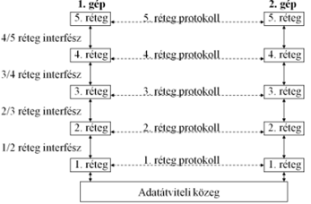

**Adatkezelési folyamatok:**

1.  **Tokozás (Encapsulation):** Az adatok felülről lefelé haladnak. Minden réteg hozzáadja a saját vezérlő információit (fejrész/header), és szükség esetén darabolja az adatot.
2.  **Kicsomagolás (Decapsulation):** A fogadó oldalon az adatok lentről felfelé haladnak, minden réteg lefejti a rá vonatkozó fejlécet, és továbbadja a tiszta üzenetet a felette lévőnek.

---

#### ISO-OSI Referenciamodell (7 réteg)

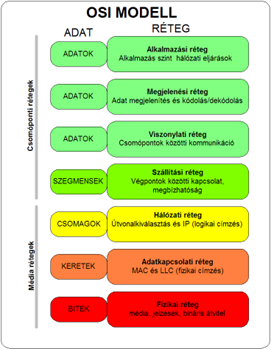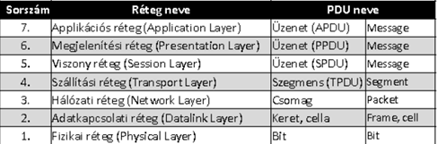

Az OSI (Open Systems Interconnection) modell hét rétegre bontja a hálózati kommunikációt. Az alsó rétegek (1-3) a hálózaton belüli adatmozgatásért, a felső rétegek (4-7) pedig a végpontok közötti adatkicserélésért és az alkalmazások kiszolgálásáért felelnek.

##### 1. Fizikai réteg (Physical Layer)

- **Feladata:** A bitek továbbítása a fizikai közegen keresztül. Meghatározza a mechanikai és elektromos jellemzőket.
- **Részletek:** Itt dől el a feszültségszint, az időzítés, a csatlakozók lábkiosztása és a kábelek típusa (réz, optika, rádióhullám).
- **Eszközök:** Hub, Repeater (ismétlő), kábelek, transzceiverek.
- **Egység:** Bit.

##### 2. Adatkapcsolati réteg (Data Link Layer)

- **Feladata:** Hibamentes átvitel biztosítása két közvetlenül kapcsolódó csomópont között.
- **Részletek:** Része a keretezés (framing), a hibafelismerés (CRC ellenőrzés) és a fizikai címzés (MAC cím). Két alrétegre oszlik:
  - **LLC (Logical Link Control):** Logikai kapcsolat vezérlése.
  - **MAC (Media Access Control):** Közeghozzáférés-vezérlés.
- **Eszközök:** Switch (kapcsoló), Bridge (híd).
- **Egység:** Keret (Frame).

##### 3. Hálózati réteg (Network Layer)

- **Feladata:** Az útvonalválasztás (routing) és a logikai címzés kezelése több hálózaton keresztül.
- **Részletek:** Meghatározza, merre menjen a csomag a forrástól a célig. Itt történik a logikai (IP) címek kezelése és a hálózatok közötti forgalomirányítás.
- **Eszközök:** Router (forgalomirányító).
- **Egység:** Csomag (Packet).

##### 4. Szállítási réteg (Transport Layer)

- **Feladata:** Végpontok közötti (end-to-end) megbízható adatátvitel biztosítása.
- **Részletek:** Felügyeli a sorrendiséget, a hibajavítást és a folyamatszabályozást. Itt különül el a megbízható, nyugtázott átvitel (TCP) és a gyors, de nem garantált átvitel (UDP).
- **Protokollok:** TCP, UDP.
- **Egység:** Szegmens (Segment).

##### 5. Viszony réteg (Session Layer)

- **Feladata:** Kommunikációs csatornák (szekciók) felépítése, kezelése és lebontása az alkalmazások között.
- **Részletek:** Kezeli a párbeszédek szinkronizációját (ellenőrzőpontok beiktatása) és a dialógusvezérlést (ki beszélhet éppen).

##### 6. Megjelenítési réteg (Presentation Layer)

- **Feladata:** Az adatok szintaktikai és szemantikai egységesítése.
- **Részletek:** Gondoskodik arról, hogy a különböző kódolású rendszerek megértsék egymást. Itt történik az adatok kódolása (pl. ASCII), titkosítása és tömörítése.

##### 7. Alkalmazási réteg (Application Layer)

- **Feladata:** Közvetlen interfész biztosítása a hálózati szolgáltatások és a felhasználói programok között.
- **Részletek:** Itt futnak a hálózati alkalmazások protokolljai, mint a webböngészés (HTTP), fájlátvitel (FTP), vagy a névfeloldás (DNS).

---

#### TCP/IP vs. OSI Modell

Az internet gyakorlatában használt TCP/IP modell összevont rétegeket használ:

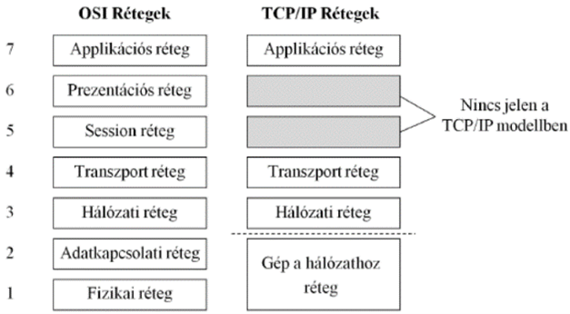

---

#### Hibrid Referenciamodell

Az oktatásban gyakran használt 5 rétegű modell, amely az OSI alsóbb rétegeit és a TCP/IP felsőbb rétegeit ötvözi:

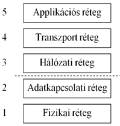

### Hálózati köztes csomópont típusok

A hálózati kommunikáció során a végpontok közötti adatátvitelt különböző aktív hálózati eszközök (köztes csomópontok) segítik. Az alapján csoportosítjuk őket, hogy az OSI modell melyik rétegében működnek:

- **Repeater (Ismétlő):**
  - **Réteg:** 1. Fizikai réteg.
  - **Feladata:** A beérkező gyengült vagy torzult elektromos/optikai jelet felerősíti és újraformázza, majd továbbküldi. Célja a hálózat fizikai hosszának (kábeltávolság) megnövelése. Nem értelmezi az adatokat.
- **Bridge (Híd):**
  - **Réteg:** 2. Adatkapcsolati réteg.
  - **Feladata:** Két azonos típusú (pl. két Ethernet) hálózati szegmenst köt össze. MAC (fizikai) címek alapján megvizsgálja a kereteket, és csak azokat engedi át a másik oldalra, amelyek valóban oda is szólnak. Ezzel csökkenti a hálózat felesleges terhelését.
- **Switch (Kapcsoló):**
  - **Réteg:** 2. Adatkapcsolati réteg.
  - **Feladata:** Olyan, mint egy többportos híd. Megtanulja, hogy melyik portjára milyen MAC című eszköz van kötve (MAC tábla), és a beérkező kereteket kizárólag a célállomás portjára küldi tovább. Dedikált sávszélességet biztosít, és megszünteti az ütközéseket (collision).
- **Router (Forgalomirányító):**
  - **Réteg:** 3. Hálózati réteg.
  - **Feladata:** Különböző IP hálózatokat köt össze (pl. a belső otthoni hálózatot az Internettel). IP-címek és útválasztási táblázatok alapján dönti el, merre továbbítsa a csomagokat a legoptimálisabb úton.
- **Access Point (AP - Hozzáférési pont):**
  - **Feladata:** Vezeték nélküli (Wi-Fi) hálózatot köt össze egy vezetékes (Ethernet) hálózattal. Általában adatkapcsolati szinten (Bridge-ként) működik, átemelve a rádiós kereteket a vezetékes hálózatra.

---

### IP technológia (Internet Protocol)

Az IP a TCP/IP referenciamodell legfontosabb hálózati rétegbeli protokollja, amely az általános adatszállításért felel.

- **Működési elve:** Összeköttetés-mentes (connectionless) szolgáltatást nyújt a szállítási réteg (pl. TCP vagy UDP) felé. Ez azt jelenti, hogy a csomagok elküldése előtt nem épít fel kapcsolatot a vevővel, és nem is garantálja a sikeres megérkezést ("best-effort"). Ezt a logikai adatcsomagot **Datagramnak** hívjuk.

**A Datagram (IP Csomag) jellemzői:**
Minden IP csomag egy önálló, független adategység, amely tartalmazza a kézbesítéshez szükséges összes információt (például a forrás és a cél címét), így a hálózat bármelyik útvonalon el tudja juttatni a célhoz.

**Az IPv4 csomag felépítése:**

1.  **Header (Fejrész):** Változó hosszúságú, 20-tól 60 bájtig terjedhet (5–15 darab 4 bájtos/32 bites szóból áll). Tartalmazza a verziót, a csomag élettartamát (TTL), a protokoll azonosítóját, valamint a forrás és a cél IP-címét.
    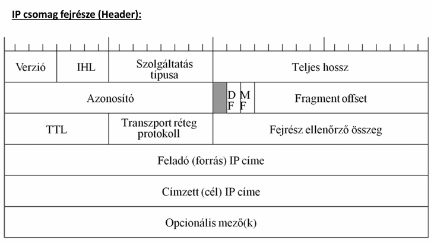
2.  **Payload (Rakrész/Adat):** A szállítási rétegtől kapott adat (pl. egy TCP szegmens). A teljes IP csomag maximális mérete 64 kB (65 535 bájt) lehet.
    - _Fontos:_ Az IP fejrész tartalmaz ellenőrző összeget (Header Checksum), de magára a _rakrészre nincs ellenőrzés_ (ezt a felsőbb rétegeknek kell megoldaniuk).

**Darabolás (Fragmentation):**
A fizikai hálózatoknak van egy maximális keretmérete (MTU - Maximum Transmission Unit, pl. Ethernetnél 1500 bájt). Ha egy IP csomag ennél nagyobb, a forgalomirányító (Router) automatikusan kisebb darabokra vágja (fragmentálja). Az újraösszeszerelést csak a legvégső célállomás végzi el.

---

### IP Címzés (IPv4)

Az IP-cím a hálózati réteg logikai azonosítója.

- **Mit azonosít?** Nem magát a számítógépet, hanem a hálózati interfészt (hálózati kártyát) azonosítja egyértelműen. Egy routernek például annyi IP-címe van, ahány hálózathoz csatlakozik.
- **Kiosztás:** A globális IP-címteret az IANA (Internet Assigned Numbers Authority) nevű szervezet osztja ki és felügyeli.

**A cím szerkezete:**
A 32 bites IP-cím logikailag mindig két részre oszlik:

1.  **Hálózat azonosító (Network ID):** Megmutatja, melyik hálózathoz (broadcast tartományhoz) tartozik a gép.
2.  **Gép azonosító (Host ID):** Egyértelműen azonosítja a konkrét gépet az adott hálózaton belül.

#### Címkezelés és Hálózati Maszk

Hogy a számítógép tudja, hol végződik a hálózat azonosítója és hol kezdődik a gép azonosítója, **alhálózati maszkot (Subnet Mask)** használunk.

- **A `/n` jelölés (CIDR prefix):** Megmondja, hogy a 32 bitből pontosan mennyi (`n` darab) bit jelöli a hálózatot. Például a `/24` azt jelenti, hogy az első 24 bit a hálózaté (ez decimálisan a `255.255.255.0` maszknak felel meg).

#### IP címosztályok (Klasszikus osztályos címzés)

Az internet hajnalán a címeket fix méretű osztályokba sorolták, hogy megkönnyítsék az elosztást:

- **A osztály:**
  - **Cél:** Hatalmas, több millió gépet tartalmazó hálózatoknak (pl. óriásvállalatok, internetszolgáltatók).
  - **Szerkezet:** 8 bit a hálózatnak, 24 bit a gépeknek (Maszk: `/8` vagy `255.0.0.0`).
  - **Kezdő bájt:** 1 – 126.
- **B osztály:**
  - **Cél:** Közepes és nagy hálózatoknak (pl. egyetemek, nagy cégek).
  - **Szerkezet:** 16 bit a hálózatnak, 16 bit a gépeknek (Maszk: `/16` vagy `255.255.0.0`).
  - **Kezdő bájt:** 128 – 191.
- **C osztály:**
  - **Cél:** Kisebb hálózatoknak (pl. irodák, otthonok).
  - **Szerkezet:** 24 bit a hálózatnak, 8 bit a gépeknek (Maszk: `/24` vagy `255.255.255.0`).
  - **Kapacitás:** Egy ilyen hálózatban maximum 254 gép lehet.
  - **Kezdő bájt:** 192 – 223.

---

### IP-vezérlő mechanizmusok: ICMP (Internet Control Message Protocol)

Az IP protokoll önmagában nem garantálja a csomagok célba érést, és hiba esetén nem tud visszajelzést adni a feladónak. Ezt a hiányosságot hivatott megoldani az **ICMP**.

- **Besorolása:** Bár az ICMP üzenetek az IP adatcsomagok belsejében (rakrészként) utaznak – mintha egy felsőbb rétegbeli protokoll lennének –, funkciójukat tekintve a **hálózati réteghez (3. réteg)** tartoznak, mert az IP szoros kiegészítői.
- **Fő feladata:** A hálózati kommunikáció során fellépő problémák (pl. vonalszakadás, torlódás, elérhetetlen célállomás) jelzése, valamint diagnosztikai és ellenőrző funkciók ellátása.

#### Az ICMP üzenet felépítése

Az ICMP csomagok fejrésze egyszerű és az alábbi négy alapvető mezőből áll:

1. **Típus (Type):** Meghatározza az üzenet fő okát vagy kategóriáját.
   - _Példák:_ `Destination Unreachable` (Cél elérhetetlen), `Redirect` (Útvonal-módosítás javaslata), `Echo Request` (Ping kérés).
2. **Kód (Code):** A Típushoz tartozó finomított, részletesebb információ.
   - _Példa:_ Ha a Típus "Cél elérhetetlen", a Kód pontosítja a hiba okát (pl. hálózat elérhetetlen, gép elérhetetlen, vagy a kért port zárt).
3. **Ellenőrző összeg (Checksum):** Biztosítja az ICMP üzenet sértetlenségét. Segítségével a fogadó fél ellenőrizheti, hogy történt-e adatvesztés vagy torzulás az út során.
4. **Adat (Data):** Kiegészítő információkat tartalmaz a hibával kapcsolatban. Hibaüzenet esetén ez a mező általában a hibát okozó eredeti IP-csomag fejrészét és első pár bájtját tartalmazza, így a küldő pontosan be tudja azonosítani, hogy melyik csomagja akadt el.

#### Gyakorlati alkalmazás (Diagnosztika)

A hálózatok üzemeltetése során a leggyakoribb hibakereső parancsok közvetlenül az ICMP protokollra épülnek:

- **Ping:** Egy ICMP visszhangkérést (_Echo Request_) küld a célgépnek. Ha a gép elérhető, egy ICMP visszhangválasszal (_Echo Reply_) reagál. Ezzel tesztelhető a vonal megléte és a válaszidő.
- **Traceroute (tracert):** Az ICMP időtúllépési hibaüzeneteit (_Time Exceeded_) használja fel arra, hogy feltérképezze, pontosan mely routereken keresztül halad át a csomag a célig.

### Forgalomirányítás (Routing)

A forgalomirányítás az a folyamat, amely során a hálózat eldönti, hogy a beérkező csomagok (IP datagramok) milyen útvonalon, merre haladjanak tovább a célállomás felé.

- **Hol történik?** Nemcsak a forgalomirányítók (Routerek), hanem maguk a végpontok (Hostok) is hoznak forgalomirányítási döntéseket (például amikor eldöntik, hogy a csomagot a helyi hálózaton adják át, vagy elküldik az alapértelmezett átjárónak).

#### A forgalomirányítási táblázat (Routing tábla)

Minden forgalomirányítást végző eszköz egy belső adatbázist, az úgynevezett routing táblát használja a döntéshozatalhoz. Ennek tipikus oszlopai:

| Célhálózat (Destination)                | Netmask (Maszk)                    | Kimenő interfész (Interface)                                    | Következő csomópont (Next hop)                               | Metrika (Költség)                                                               |
| :-------------------------------------- | :--------------------------------- | :-------------------------------------------------------------- | :----------------------------------------------------------- | :------------------------------------------------------------------------------ |
| A hálózat IP címe, ahova a csomag tart. | Meghatározza a célhálózat méretét. | A router saját csatlakozója (pl. eth0), amin kiadja a csomagot. | A szomszédos router IP címe, akinek át kell adni a csomagot. | Az útvonal "jósága" (kisebb érték a jobb, pl. ugrások száma vagy sávszélesség). |

_Működési elv (Longest Prefix Match):_ Ha egy beérkező csomag célcíme több bejegyzésre is illeszkedik a táblában, a router mindig a legspecifikusabbat (a leghosszabb maszkkal rendelkezőt) választja.

---

#### Forgalomirányítási osztályok

Az útválasztási táblázat feltöltésének és karbantartásának módja alapján három fő osztályt különböztetünk meg:

**1. Minimális routing**

- **Jellemzője:** Izolált, forgalomirányító (router) nélküli megoldás.
- **Működése:** Csak a közvetlenül csatlakoztatott (egyazon fizikai hálózaton lévő) eszközök közötti kommunikációt teszi lehetővé. Külső hálózatba nem lehet csomagot küldeni.

**2. Statikus routing**

- **Jellemzője:** A routing tábla bejegyzéseit a rendszergazda manuálisan, kézzel viszi be.
- **Előnye:** Nagyon biztonságos, nem terheli a hálózatot extra útválasztási forgalommal, és a router CPU-ját is kíméli.
- **Hátránya:** Nem alkalmazkodik a változásokhoz (ha egy vonal megszakad, a kapcsolat elveszik, amíg a rendszergazda át nem írja a táblát). Csak kisméretű hálózatokban praktikus.

**3. Dinamikus routing**

- **Jellemzője:** A forgalomirányítók speciális routing protokollok segítségével kommunikálnak egymással, és automatikusan építik fel, illetve frissítik a táblázataikat. Hibatűrő, mert vonalszakadás esetén automatikusan új utat keres. Két fő alcsoportja van:
  - **Belső forgalomirányítás (IGP - Interior Gateway Protocol):** Egyetlen autonóm rendszeren (pl. egy egyetem vagy cég saját hálózata) belül keresi a legelőnyösebb útvonalat.
    - _Távolságvektor (Distance Vector) alapú:_ Csak a szomszédaitól kapott információkra támaszkodik, az "ugrások" számát (hop count) méri. (Pl. **RIP**, **EIGRP**).
    - _Link-állapot (Link-State) alapú:_ Minden router ismeri a teljes hálózat topológiáját, és bonyolult matematikai algoritmussal (Dijkstra) számolja ki a legrövidebb utat sávszélesség alapján. (Pl. **OSPF**, **IS-IS**).

  - **Külső forgalomirányítás (EGP - Exterior Gateway Protocol):** Különálló autonóm rendszerek (különböző szolgáltatók, nagyvállalatok) közötti útvonalak meghatározására szolgál.
    - _Útvonalvektor (Path Vector) alapú:_ Nem a leggyorsabb, hanem a szabályozási és gazdasági szempontból legmegfelelőbb utat választja. A jelenlegi Internet alapköve. (Pl. **BGP**).

#### Távolságvektor alapú forgalomirányítás (Distance Vector)

Ennél a módszernél a routing tábla minden egyes célhálózathoz a legjobb (legkisebb költségű) küldési irányt és a hozzá tartozó távolságot (metrikát) tárolja. A működés alapja a **Bellman-Ford algoritmus**.

**A Bellman-Ford algoritmus lépései:**

1.  **Információcserék:** Minden $i$ csomópont megkapja az összes közvetlen $k$ szomszédjától azok távolságvektorait, azaz a $D(k,j)$ értékeket (ahol $D(k,j)$ a szomszéd távolsága a $j$ céltól).
2.  **Metrika számolás:** Az $i$ csomópont kiszámolja, hogy milyen messze lenne a $j$ cél, ha a $k$ szomszédon keresztül menne. A képlet:
    $$x_{i,k,j} := d(i,k) + D(k,j)$$
    _(Saját távolság a szomszédig + szomszéd távolsága a célig)._
3.  **Tábla frissítése:** Ha ez az új számított távolság kisebb, mint az eddig ismert legjobb út ($x_{i,k,j} < D(i,j)$), akkor a $k$ szomszédon át vezető út előnyösebb. A csomópont frissíti a saját tábláját:
    $$D(i,j) := x_{i,k,j}$$
4.  **Ismétlés:** Egy meghatározott ciklusidő várakozás után a folyamat kezdődik elölről az 1. lépéssel.
    _Eredmény:_ Az eljárás véges számú lépés (információcsere) után konvergál, és optimális utat szolgáltat a forrás és a cél csomópontok között.

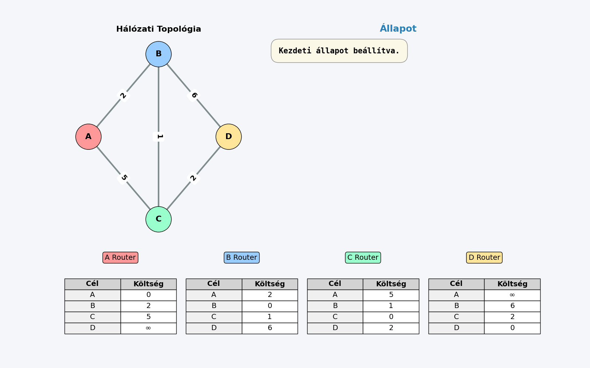

**Problémák és hátrányok:**

- **Túl kicsi kezdőérték:** Ha az eddig használt optimális út megsérül, a hálózat nehezen áll át.
- **Végtelenig számlálás (Count-to-infinity):** A rendszer nagyon lassan reagál a negatív topológiai változásokra (pl. vonalszakadás). A routerek hamis információk alapján folyamatosan növelhetik a távolságot egymás között, mielőtt rájönnének, hogy az út megszűnt.

**Gyakorlati megvalósítások (Protokollok):**

- **RIP (Routing Information Protocol):** Régebbi protokoll, csak kis méretű hálózatokba ajánlott. Alapvető hátránya, hogy nincs benne autentikáció (biztonsági kockázat), és lassan konvergál.
- **EIGRP (Enhanced Interior Gateway Routing Protocol):** A Cisco saját fejlesztésű, fejlett protokollja, elsősorban LAN hálózatokra. Kijavítja a végtelenig számlálás hibáját és gyorsabb reagálást biztosít.

### Link-állapot alapú forgalomirányítás (Link-State Routing)

A Link-állapot alapú forgalomirányítás során minden router rendelkezik a hálózat **teljes térképével** (topológiájával). Nem csak a szomszédoktól kapott távolságadatokra hagyatkoznak, hanem saját maguk számítják ki az optimális útvonalakat.

#### A mechanizmus lépései:

1.  **Szomszédok felfedezése:** A router "Hello" üzenetekkel azonosítja a közvetlenül kapcsolódó szomszédait.
2.  **Költségmérés:** Megméri a szomszédok felé vezető kapcsolatok költségét (késleltetés, sávszélesség).
3.  **LSP (Link State Packet) készítése:** Egy adatcsomagot állít össze, amely tartalmazza a szomszédait és a hozzájuk tartozó költségeket.
4.  **Elárasztás (Flooding):** Az LSP csomagot elküldi az összes többi routernek. Minden router megkapja mindenki más állapotát, így mindenki ugyanazt a topológiai adatbázist építi fel.
5.  **Útvonalszámítás (Dijkstra):** A router lefuttatja a Dijkstra-algoritmust a saját adatbázisán, hogy meghatározza a legrövidebb utakat (feszítőfa készítése).

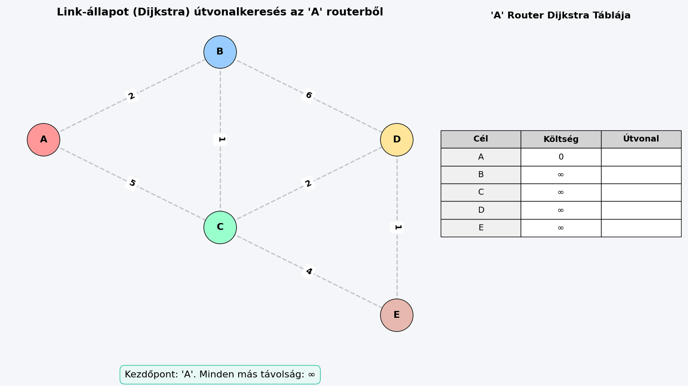

#### Főbb protokollok:

- **OSPF (Open Shortest Path First):** Belső forgalomirányító protokoll (IGP), leginkább vállalati hálózatokban (LAN/MAN) használják. Az IP réteg felett működik.
- **IS-IS (Intermediate System to Intermediate System):** Gerinchálózati protokoll, szolgáltatói környezetben népszerű. Közvetlenül az adatkapcsolati réteg felett fut, így független a hálózati protokolloktól (pl. IPv4/IPv6).

### Transzport protokollok IP felett

A hálózati (IP) réteg felett működő transzport (szállítási) réteg alapvető célja, hogy a végpontok közötti adatátvitelt kiszolgálja, és biztosítsa, hogy az alkalmazási (legfelső) rétegben is szabványos lehessen a kommunikáció.

#### A transzport réteg funkciói

A transzport réteg az alábbi fő feladatokat látja el a hálózati kommunikáció során:

- **Címzés:** A végponti kommunikációt folytató programok (alkalmazások) egyértelmű azonosítása. Bár az IP-cím azonosítja a számítógépet, a transzport réteg (a portszámok segítségével) határozza meg, hogy a beérkező adat pontosan melyik szoftverhez tartozik.
- **Kapcsolat építése és bontása:** A végpontok közötti logikai kapcsolat szabályos felépítése, a szegmenssorozatok (feldarabolt adategységek) küldésének és fogadásának menedzselése, valamint a kommunikáció lezárultával a kapcsolat bontása.
- **Adatfolyam szabályozás:** A hálózati torlódások elkerülése és a forgalomelakadások kezelése (torlódásvezérlés), megakadályozva ezzel a hálózat túlterhelését és az adatvesztést.
- **Multiplexálás:** A hálózati réteg erőforrásainak hatékony kihasználása azáltal, hogy több párhuzamosan futó program adatfolyamát összefogja, és egyetlen hálózati csatornán továbbítja (majd a túloldalon szétválogatja).

#### Transzport protokollok szolgáltatásai

A transzport réteg protokolljai (mint a TCP) a következő szolgáltatásokat nyújtják a felsőbb, alkalmazási rétegek felé:

1. **Szegmensek kézbesítése:** Garantálják a szegmensek megbízható módon történő, sorrendhelyes kézbesítését (nyugtázási mechanizmusokkal és hibajavítással).
2. **Adatfolyam vezérlés:** Szabályozzák az adatáramlás sebességét a küldő és a fogadó fél között, biztosítva, hogy a gyorsabb küldő ne terhelje túl a lassabb fogadót.
3. **Multiplexálás:** Lehetővé teszik, hogy a felsőbb rétegek programjai megosszák a hálózati kapcsolatot, így egy időben több hálózati szolgáltatás is zavartalanul működhet.

---

### UDP (User Datagram Protocol)

Az UDP egy a hálózati réteg (IP) felett működő transzport (szállítási) rétegbeli protokoll. Legfőbb jellemzője az egyszerűség és a gyorsaság.

#### Alapvető jellemzők

- **Összeköttetés nélküli (Connectionless):** Adatküldés előtt nem épít fel kapcsolatot a fogadó féllel. A csomagokat egyszerűen elküldi a célállomás felé.
- **Nem megbízható kapcsolat:**
  - **Nyugta nélküli:** Nem kér és nem is kap visszajelzést (nyugtát) arról, hogy a csomagok sikeresen megérkeztek-e a célhoz.
  - **Nincs beépített hibajavítás:** Maga az UDP protokoll nem javítja a bithibákat, nem kéri újra az elveszett csomagokat, és nem állítja sorba a megkeveredett adatokat.
  - Ha hibajavításra van szükség, azt mindig felsőbb szinten, magának az **alkalmazásnak** kell megoldania.

#### UDP-t használó alkalmazások jellemzői

Az UDP-t olyan programok használják, amelyeknél a sebesség fontosabb a tökéletes megbízhatóságnál:

- **Adatvesztés-tolerancia:** Képesek elviselni, ha egy-egy csomag elvész a hálózaton (pl. élő videó- vagy hangközvetítés).
- **Átviteli ráta érzékenység:** Fontos számukra a folyamatos, gyors adatáramlás és az alacsony késleltetés (valós idejűség).

#### Az UDP szegmens felépítése

Az UDP szegmens két fő részből áll: egy nagyon egyszerű, 8 bájtos fejrészből (Header) és magából az adatból (Rakrész).

**1. Fejrész (Header) szerkezete:**
A fejrész két darab 32 bites (4 bájtos) szóból áll:

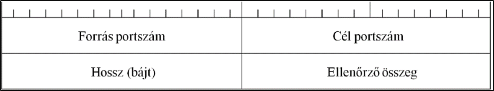

- **1. szó:**
  - **Forrás portszám:** Azonosítja a küldő alkalmazást.
  - **Cél portszám:** Azonosítja a fogadó alkalmazást.
- **2. szó:**
  - **UDP szegmens hossza:** Megadja a teljes szegmens (fejrész + rakrész) együttes hosszát.
  - **Fejrész ellenőrző összeg (Checksum):** Arra szolgál, hogy észlelje a szállítás közben keletkezett esetleges adatsérüléseket.

**2. Rakrész (Payload):**

- **Tartalma:** Tetszőleges adat lehet (bármilyen felsőbb rétegbeli protokoll adategysége, azaz PDU-ja).
- **Előnyök:** Egyszerű felépítése miatt kifejezetten előnyös és gyakran használt tűzfalakon átvezetett (tunneling) protokollok áthidalására.
- **Felelősség:** Az UDP protokoll a rakrészben szállított adat sorsával nem foglalkozik. A bithibák javítását, valamint az egynél több példányban megérkező, vagy a teljesen elveszett (kevesebb példányos) kézbesítések kezelését teljes mértékben a rakrészben szállított felsőbb szintű protokollra (alkalmazásra) bízza.

### TCP (Transmission Control Protocol)

Az UDP "laza" és gyors működésével szemben a TCP egy a hálózati réteg (IP) felett működő, a maximális megbízhatóságra és pontosságra kihegyezett transzport (szállítási) rétegbeli protokoll.

#### Alapvető jellemzők

- **Összeköttetés-alapú (Connection-oriented):** Mielőtt bármilyen tényleges adatot küldene, a két végpont (a kliens és a szerver) logikai kapcsolatot épít ki egymással, ami a szegmenssorozatok küldésének és fogadásának teljes idejére fennáll.
- **Megbízható, nyugtázott kapcsolat:** Minden elküldött adatról visszajelzést (nyugtát) vár. Ha egy csomag elveszik, a TCP automatikusan gondoskodik az újraküldésről.
- **Sorszámozás:** A hálózaton utazó adatok minden egyes bájtját szigorúan sorszámozza (Sequence Number). Ez garantálja, hogy a fogadó oldalon a csomagok helyes sorrendben álljanak össze.
- **Következő várt bájt jelzése:** A kommunikáció során a fogadó fél mindig megüzeni a társának, hogy mi a _soron következő_, általa várt bájt sorszáma.
- **Áramlásszabályozás (Flow control):** A vevő folyamat (processz) folyamatosan visszajelzi a küldőnek a saját befogadó kapacitását (a legközelebbi szegmens megengedett méretét / ablakméretét). Ezzel elkerülik, hogy a gyorsabb fél túlterhelje a lassabbat.

---

#### A TCP szegmens felépítése

A TCP szegmens két részből áll: egy nagyon részletes fejrészből (Header) és a tényleges adatból (Rakrész). A fejrész 32 bites (4 bájtos) "szavakból" épül fel:

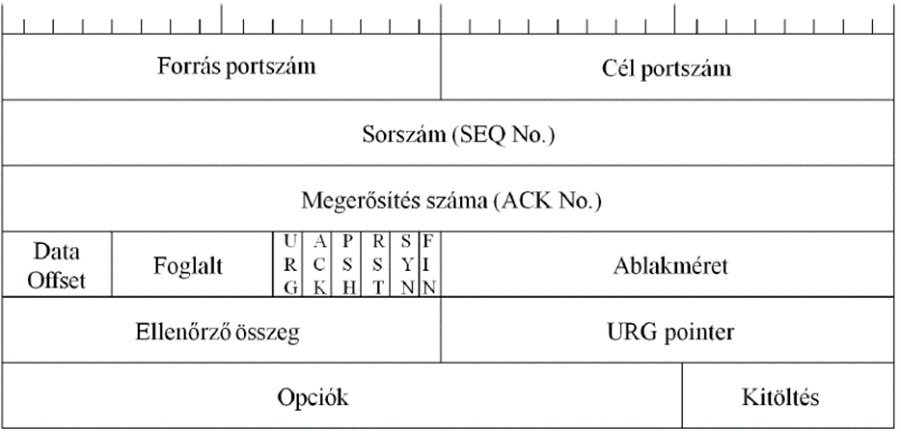

- **1. szó:** **Forrás portszám és Cél portszám:** Azonosítják a kommunikáló alkalmazásokat a két gépen.
- **2. szó:** **Szegmens sorszáma (Sequence Number):**
  - Ha a SYN bit = 0: Ez a szám a szegmensben lévő első adatbájt sorszámát jelöli.
  - Ha a SYN bit = 1: Ez a kapcsolatfelépítéskor használt kezdeti szekvenciaszám (ISN).
- **3. szó:** **Nyugtázási szám (Acknowledgment Number):** A partner által várt következő szekvenciaszám (tehát eddig minden adat hiánytalanul megérkezett).
- **4. szó:**
  - **Adat offset:** Megadja a fejrész hosszát.
  - **Fenntartott mező:** Későbbi fejlesztésekre fenntartva.
  - **Kontroll bitek (Flagek):** A kapcsolat állapotát vezérlő jelzőbitek: `URG`, `ACK` (nyugta), `PSH`, `RST` (megszakítás), `SYN` (szinkronizálás), `FIN` (befejezés).
  - **Ablakméret (Window Size):** A nyugtázott bájtok száma, amelyet a vevő még hajlandó fogadni (ez az áramlásszabályozás alapja).
- **5. szó:**
  - **Ellenőrző összeg (Checksum):** Az adatok sértetlenségének ellenőrzésére.
  - **Sürgősségi mutató (URG pointer):** Jelzi, ha a csomagban azonnal feldolgozandó, sürgős adat van.
- **6. szó:** **Opciók és Kitöltés (Padding):** Kiegészítő beállítások (a kitöltés biztosítja, hogy a fejrész hossza mindig osztható legyen 32 bittel).

---

#### TCP kommunikációs mechanizmusok (Kapcsolatfelépítés)

Mivel a TCP összeköttetés-alapú, a kommunikáció megkezdése előtt egy szigorú protokoll szerint fel kell építeni a kapcsolatot. Ezt a folyamatot **háromutas kézfogásnak (Three-way handshake)** nevezzük, amelynek lépései:

1. **SYN (Kliens ➔ Szerver):** A kliens kezdeményezi a kapcsolat kiépítését. Küld egy szegmenst, amelyben a `SYN` bit be van állítva, és elküldi a saját kezdeti sorszámát.
2. **SYN/ACK (Szerver ➔ Kliens):** A szerver megkapja a kérést, és egy jóváhagyó válaszüzenetet küld vissza. Ebben egyrészt nyugtázza a kliens kérését (az `ACK` bit beállításával), másrészt ő is küld egy szinkronizációs kérést (a `SYN` bit beállításával) a saját kezdeti sorszámával.
3. **ACK (Kliens ➔ Szerver):** A kliens megkapja a szerver válaszát, és egy utolsó nyugtával (`ACK` bit) jóváhagyja azt.

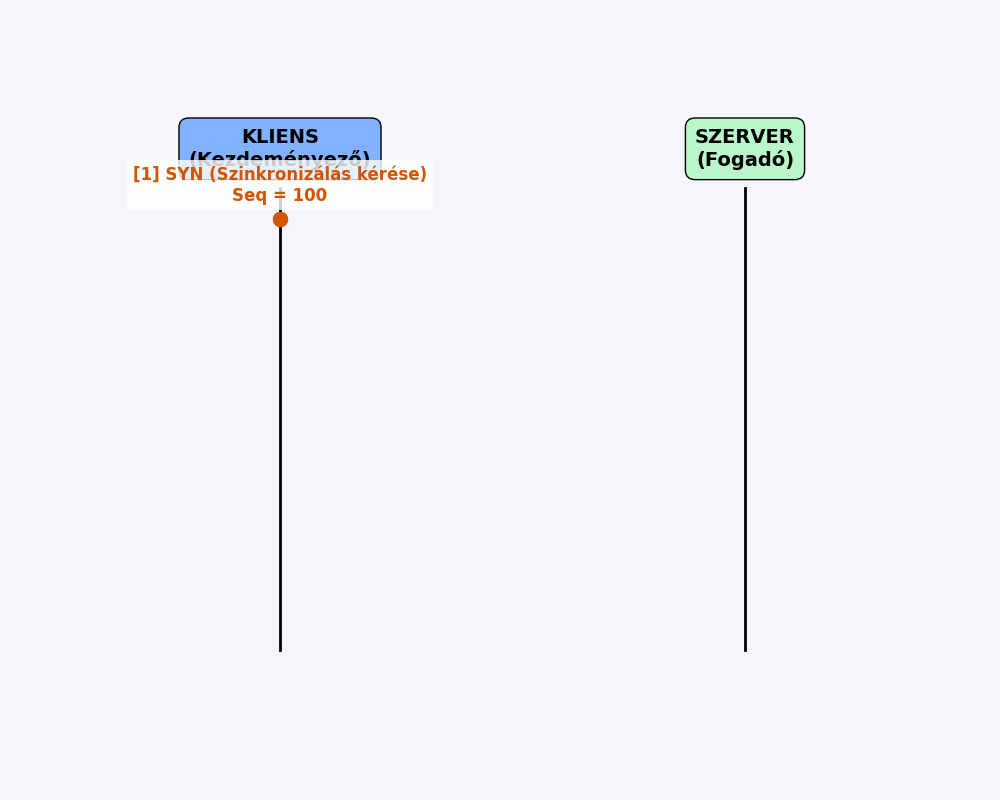

Ezzel a "kézfogással" a kapcsolat sikeresen felépült, és megkezdődhet a tényleges adatok (rakrészek) biztonságos, nyugtázott átvitele.

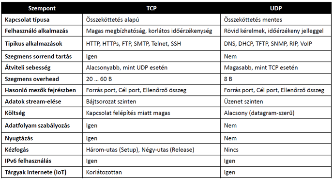
