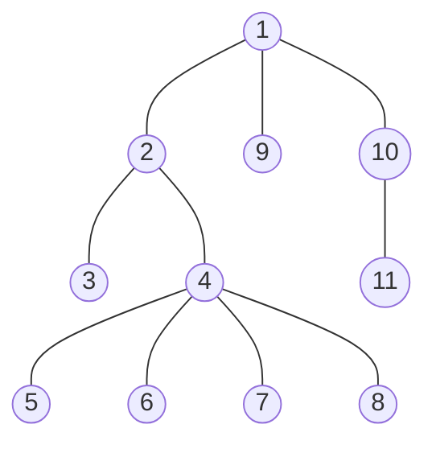
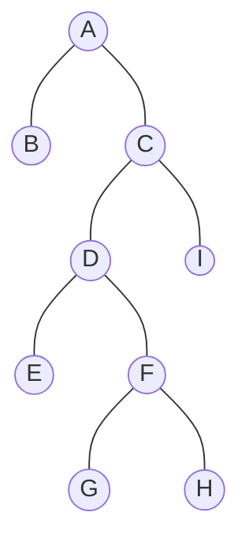
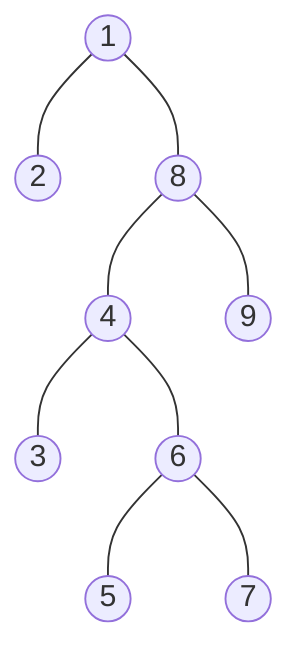
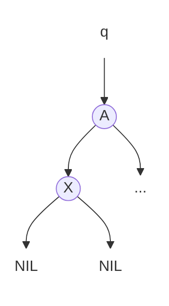
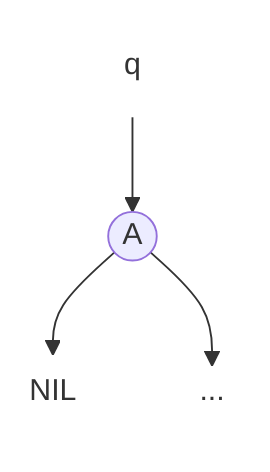
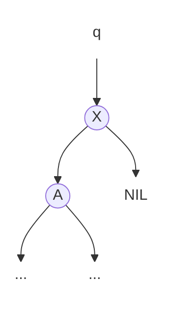
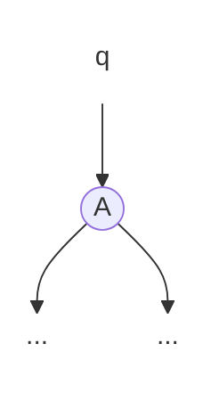
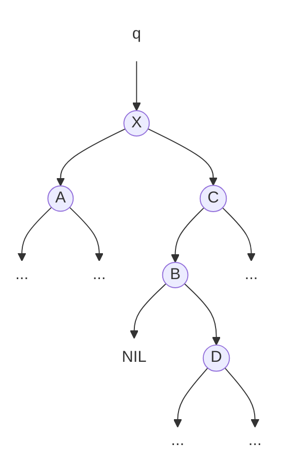
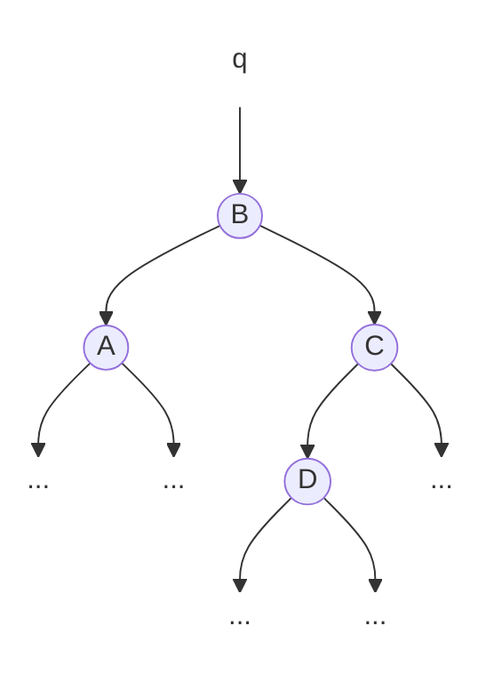

[⬅ Vissza a főoldalra](../../zarovizsga.md)

# 1. tétel

## 1.1. Diszkrét és folytonos valószínűségi eloszlás fogalma. Nevezetes eloszlások: binomiális, Poisson, egyenletes, exponenciális, normális.

---

### Eloszlás

**Definíció:** egy $Ω = \{ω_1,...,ω_N\}$ mintatér esetén a $p_1,...,p_N$ valószínűségeket eloszlásnak nevezünk. Vagyis egy mintatér valószínűségeinek összessége = eloszlás.

**Például**: egy zsákban van 10 golyó, benne van 2 piros, 5 kék, és 3 fehér golyó. Ezeknek az eloszlása így fog kinézni:
$$p_{piros} = 0.2 \quad p_{kék} = 0.5 \quad p_{fehér} = 0.3$$

**Jellemzői:**

- $p_i$ számok nem negatívak
- a valószínűségek összege 1
  $$\sum_{i=1}^Np_i = 1$$

**Valószínűségi változó**: adott $\Omega$ eseménytér, $\mathcal{F}$ eseményhalmaz. A valószínűségi változó egy olyan függvény, amely az eseményhalmazból leképzést készít a valós számok egy megszámlálható halmazává. $X:\mathcal{F} → D$

---

### Diszkrét valószínűségi eloszlás

**Definicíó**: olyan valószínűségi eloszlás, melyben a valószínűségi változók csak véges számú értékeket vehetnek fel, azaz diszkrétek.

**Diszkrét valószínűségi változó**: olyan valószínűségi változó, melynek értékkészlete megszámlálható

Például kockadobás:

$$P(X = 1) = \frac{1}{6}$$
$$P(X = 2) = \frac{1}{6}$$
$$P(X = 3) = \frac{1}{6}$$
$$P(X = 4) = \frac{1}{6}$$
$$P(X = 5) = \frac{1}{6}$$
$$P(X = 6) = \frac{1}{6}$$

---

**Nevezetes diszkrét eloszlások**:

1. **Hipergeometrikus eloszlás**:
   - $X \sim Hyper(N, M, n)$
   - **Jelentése:** Összesen $N$ golyó van a dobozban, benne $M$ piros golyó, $N-M$ fehér golyó. Ki szeretnénk húzni $n$ darabot belőlük **visszatevés nélkül**.
   - **Képlete:**
     $$h_k = P(X = k) = \frac{\binom{M}{k}\binom{N-M}{n-k}}{\binom{N}{n}}$$
     ahol $k$ a kihúzni kívánt piros golyók száma.
   - **Várható értéke:** $E=\frac{Mn}{N}$

2. **Binomiális eloszlás**:
   - $X \sim Binom(n, p)$
   - **Jelentése:** Összesen $N$ golyó van a dobozban, benne $M$ piros golyó, $N-M$ fehér golyó. Ki szeretnénk húzni $n$ darabot belőlük **vissza-tevéssel**. $p = \frac{M}{N}$, vagyis a piros golyók relatív gyakorisága.
   - **Képlete:**
     $$P(X = k) = \binom{n}{k} p^k (1-p)^{n-k}$$
   - **Várható értéke:** $E=n \cdot p$

3. **Poisson-eloszlás**:
   - $X \sim Poisson(\lambda)$
   - **Jelentése:** Akkor használjuk, ha egy adott időintervallumon bekövetkező események számát szeretnénk jellemezni.
   - **Például**: egy telefonközpontba átlagosan $\lambda=5$ hívás érkezik percenként. Mi annak a valószínűsége, hogy egy adott percben pontosan 3 hívás érkezik?
   - **Képlete**:  
     $$P(X = k) = \frac{\lambda^k e^{-\lambda}}{k!}$$
   - **Várható értéke:** $E=\lambda$

4. **Negatív binomiális eloszlás**:
   - $X \sim NB(r, p)$
   - **Jelentése**: Addig figyeljük a sorozatot, amíg $r$ siker nem következik be. Egy siker valószínűsége $p$.
   - **Például**: Addig dobunk dobókockával, amíg 2 darab 6-ost nem dobunk. Itt $p=1/6, r=2$.
     - **Részesete**: Ha $r=1$, akkor **geometrikus eloszlás**ról beszélünk
     - **Képlete**: $P(X = 1+k) = p(1-p)^k$
   - **Várható értéke:** $E=\frac{r}{p}$

---

**Várható érték**: egy valószínűségi változó súlyozott átlaga.

**Képlete**: $\sum_{k=1}^\infty p_kx_k$, ahol $p_k$ a valószínűség, $x_k$ az érték

**Például**: Kockadobások várható értéke: $\frac{1}{6}\cdot1+\frac{1}{6}\cdot2+\frac{1}{6}\cdot3+\frac{1}{6}\cdot4+\frac{1}{6}\cdot5+\frac{1}{6}\cdot6 =3.5$

**Második momentum:** a valószínűségi változó négyzetének várható értéke, szórásnégyzet kiszámításához lesz hasznos.

$$EX^2 = \sum_{k=1}^\infty p_kx^2_k$$

**Jellemzői**:

- Lineáris:
  - $E(X+Y)=EX+EY$
  - $E(cX)=cE(X)$
- Ha $X$ és $Y$ Független, akkor $E(XY) = E(X) \cdot E(Y)$

---

**Szórásnégyzet (variancia)**: a szórásnégyzet, más néven variancia megmutatja, hogy egy valószínűségi változó milyen mértékben szóródik a várható érték körül.

$$D^2X = \text{Var}(X) = EX^2 - E^2X$$

**Tulajdonságai**:

- $\text{Var}(aX+b)=a^2\text{Var}X$

---

**Eloszlásfüggvény**: megadja, hogy a valószínűségi változó egy adott értékig bezárólag mekkora valószínűséggel vesz fel értéket. Diszkrét eloszlásfüggvénynél ez egy lépcsős függvény.

$F_X(x)=P(X<x)$

**Diszkrét eloszlásfüggvény tulajdonságai**:

- A függvény monoton növekvő.
- A függvény bal-folytonos.
- $\lim_{x→\infty}F(x) = 1, \lim_{x→-\infty}F(x) = 0$

**Például:**

Egy érme feldobásánál az eloszlásfüggvény:

$F_x(x) = 0 \text{ a } x < 0 \text{ tartományban }$

$F_x(x) = \frac{1}{2} \text{ a } 0 \leq x < 1 \text{ tartományban }$

$F_x(x) = 1 \text{ a } x \geq 0 \text{ tartományban }$

---

### Folytonos valószínűségi eloszlás

**Definíció**: olyan valószínűségi eloszlás, melyben a valószínűségi változók végtelen számú értéket vehetnek fel, azaz megszámlálhatatlanok.

**Folytonos valószínűségi változó**: olyan valószínűségi változó, melynek értékkészlete megszámlálhatatlan

**Például buszra várás**:

Tegyük fel, hogy a busz pontosan 5 percenként jön (és nem késik :D), mi véletlen időpontban érünk a megállóhoz. Ha $X$ a várakozási idő (percben), akkor:

$$P(0 \leq X \leq 1) = \frac{1}{5}$$
$$P(1 \leq X \leq 2) = \frac{1}{5}$$
$$P(2 \leq X \leq 3) = \frac{1}{5}$$
$$P(3 \leq X \leq 4) = \frac{1}{5}$$
$$P(4 \leq X \leq 5) = \frac{1}{5}$$

---

**Abszolút folytonos eloszlásfüggvény tulajdonságai:**

- $F(b)-F(a)$: Az érték [a, b] intervallumba esésének valószínűsége.

  **Például**: a normális eloszlást felhasználva:

  $$P(-1 \leq X \leq 1) = F_x(1) - F_x(-1)$$

- **Sűrűségfüggvény**

  **Definíció**: Deriváltja az eloszlásfüggvénynek:  
  Legyen $f$ a sűrűségfüggvény, $F$ az eloszlásfüggvény

  $$f(x) = F'(x)$$

  $$F(x) = \int_{-\infty}^xf(x)dx$$

  **Tulajdonságai:**
  - $\lim_{x→-\infty}f(x) = 0$
  - $\lim_{x→\infty}f(x) = 0$
  - $\int_{-\infty}^\infty f(x)dx = 1$

- **Várható érték**

  Itt nem alkalmazható a diszkrét várható érték képletet, mert megszámláhatatlan sok valószínűségi változó van.

  **Képlete:**

  $$EX = \int_{-\infty}^{+\infty} xf(x)dx$$

  **Tulajdonságai:**
  - Ha $X\geq 0$, akkor $EX\geq 0$ (ha egy valószínűségi változó $X$ nem negatív, akkor a várható értéke is nem negatív lesz.)
  - Ha $X\geq Y$, akkor $EX\geq EY$ (ha $X$ minden egyes kimenetele nagyobb vagy egyenlő, mint $Y$ megfelelő kimenetele, akkor az $X$ várható értéke is nagyobb vagy egyenlő lesz, mint $Y$ várható értéke.)
  - Ha $X\geq 0$ és $EX = 0$, akkor $P(X=0)=1$ (ha egy nem negatív valószínűségi változó várható értéke 0, akkor az esemény, hogy $X=0$, teljes valószínűséggel megtörténik)

- **Nagy számok törvénye**

  **Definíció**: Egy minta átlaga nagy mintaszám esetén közelít a várható értékhez.

  **Például**: Tegyük fel, hogy egy érmét dobunk. Ha csak 5 alkalommal dobsz érmét, előfordulhat, hogy 4-szer fej és 1-szer írás lesz. Ha 1,000, 10,000 vagy több alkalommal dobod az érmét, az átlag egyre inkább közelíteni fog a 0.5-höz.

---

### Nevezetes abszolút folytonos eloszlások:

1. **Egyenletes eloszlás**  
   
   
   - **Eloszlásfüggvény**:

     $$F(t) = \begin{cases} 0 & \text{ha } t\leq a \\ \frac{t-a}{b-a} & \text{ha } a \lt t \leq b \\ 1 & \text{ha } b \lt t \end{cases}$$

   - **Sűrűségfüggvény**:

     $$F(t) = \begin{cases} \frac{1}{b-a} & \text{ha } t\in [a,b] \\ 0 & \text{ha } t\notin [a,b]\end{cases}$$

   - **Várható érték**:  
     $$EX = \int_a^b \frac{x}{b-a} = \left[\frac{x^2}{2\cdot(b-a)}\right]_a^b = \frac{b^2-a^2}{2\cdot(b-a)} = \frac{(b-a)\cdot(b+a)}{2\cdot(b-a)} = \frac{a+b}{2}$$
   - **Második momentum:**
     $$EX^2 = \int_a^b \frac{x^2}{b-a} = \left[\frac{x^3}{3\cdot(b-a)}\right]_a^b = \frac{b^3-a^3}{3\cdot(b-a)}$$
   - **Szórásnégyzet**:  
     $$\text{Var}(X) = EX^2 - E^2X = \frac{(b-a)(b^2+ab+a^2)}{3\cdot (b-a)} - \frac{(a+b)^2}{4} = \frac{b^2+ab+a^2}{3} - \frac{a^2+2ab+b^2}{4} = $$

     $$= \frac{4b^2+4ab+4a^2-3a^2-6ab-3b^2}{12} = \frac{b^2-2ab+a^2}{12} = \frac{(b-a)^2}{12}$$

2. **Normális eloszlás (Gauss-eloszlás)**
   - $X \sim N(\mu, \sigma^2)$

     
     

   - **Jelentése és fontossága:** a legfontosabb eloszlás a valószínűségszámításban. A _centrális határeloszlás-tétel_ miatt a természetben nagyon sok dolog (pl. testmagasság, IQ, mérési hibák) normális eloszlást követ, mert ha sok független, apró véletlen hatás adódik össze, az eredményük ehhez az eloszláshoz tart.
   - **Sűrűségfüggvénye (Haranggörbe):**
     $$f(x) = \frac{1}{\sqrt{2\pi\sigma^2}} e^{-\frac{(x-\mu)^2}{2\sigma^2}}$$
     ahol $\mu$ a várható érték, $\sigma$ a szórás ($\sigma^2$ a szórásnégyzet).
     - Szimmetrikus a $\mu$-re (itt veszi fel a maximumát).
     - A $\sigma$ határozza meg a "lapultságot": kis $\sigma$ esetén a harang magas és keskeny, nagy $\sigma$ esetén lapos és széles.
   - **Standard normális eloszlás ($N(0, 1)$):**
     - Ez egy speciális eset, amikor $\mu = 0$ és $\sigma = 1$.
     - Ennek az eloszlásfüggvényét $\Phi(x)$-szel jelöljük. Mivel az integrálja nem fejezhető ki elemi függvényekkel, az értékeket hagyományosan táblázatból (vagy géppel) számolják.
   - **Standardizálás:**
     - Bármilyen általános normális eloszlású változó átalakítható standard normálissá az alábbi transzformációval:
       $$Z = \frac{X - \mu}{\sigma}$$
     - Segítségével a valószínűségek könnyen számolhatók a $\Phi(x)$ táblázatból:
       $$P(a \le X \le b) = \Phi\left(\frac{b-\mu}{\sigma}\right) - \Phi\left(\frac{a-\mu}{\sigma}\right)$$

3. **Exponenciális eloszlás**
   - $X \sim Exp(\lambda)$
     
     
   - **Jelentése:** A Poisson-eloszlás folytonos "párja". Arra ad választ, hogy mennyi idő telik el két egymást követő esemény között (pl. mennyi idő múlva érkezik a következő hívás a telefonközpontba, vagy mennyi ideig működik hibátlanul egy alkatrész).
   - **Például:** tegyük fel, hogy egy ügyfélszolgálaton átlagosan $\lambda = 2$ hívás érkezik óránként. Mivel a hívások teljesen véletlenszerűen és egymástól függetlenül futnak be, a két hívás között eltelt idő exponenciális eloszlást követ. A várható értékből kiszámítható, hogy $\frac{1}{\lambda} = \frac{1}{2}$ óra, vagyis átlagosan 30 percet kell várni két hívás között.
   - **Sűrűségfüggvénye:**
     $$f(x) = \begin{cases} \lambda e^{-\lambda x}, & \text{ha } x \ge 0 \\ 0, & \text{ha } x < 0 \end{cases}$$
   - **Eloszlásfüggvénye:**
     $$F(x) = \begin{cases} 1 - e^{-\lambda x}, & \text{ha } x \ge 0 \\ 0, & \text{ha } x < 0 \end{cases}$$
   - **Várható értéke:** $EX = \frac{1}{\lambda}$
   - **Szórásnégyzete:** $\text{Var}(X) = \frac{1}{\lambda^2}$
   - **Örökifjú tulajdonság (emlékezetnélküliség):**
     $$P(X > t + s \mid X > s) = P(X > t)$$
     - Az eloszlás "nem emlékszik" a múltra. Ha egy gép eddig $s$ ideig nem romlott el, annak az esélye, hogy még további $t$ ideig jó marad, pontosan ugyanannyi, mintha most vettük volna újonnan a boltban.

---

## 1.2. Adatszerkezetekkel kapcsolatos alapfogalmak: absztrakció, absztrakt adatszerkezetek. Elemi adatszerkezetek: lista, verem, sor. Halmaz, multihalmaz, tömb. Fák ábrázolása, bejárások, keresés, beszúrás, törlés.

---

### Alapfogalmak

**Adatszerkezet**: <u>adatelemek + kapcsolatok + műveletek + tárolás (reprezentáció)</u>.

Tehát az adatszerkezet adatokból, a köztük levő kapcsolatokból, a rajtuk végrehajtható műveletekből és a memóriában/háttértáron történő fizikai tárolás megvalósításából áll.

**Absztakció:** egy probléma vagy rendszer leegyszerűsített, általánosított logikai modellje, amely elrejti a konkrét programozási nyelvhez vagy megvalósításhoz kötődő, lényegtelen implementációs részleteket, ezáltal fókuszálva a legfontosabb tulajdonságokra és működési elvekre.

**Például**: egy kávéautómatánál a felhasználónak csak a gombok fontosak,mint például "Espresso kérése". Maga az automata belső működése el van rejtve, mivel ez jelentéktelen a felhasználó részére.

Az **absztrakt adattípus** az adatelemek és a köztük levő kapcsolatok logikai modellje. Független az adattarolás fizikai megvalósításától.
Az adatszerkezet mindezeken túl tartalmazza az adatok fizikai tarolásának a memóriában/háttértáron történő megvalósítását es az adatokat manipuláló műveletek megvalósítását is.

**Műveletek**: adatszerkezet létrehozása, módosítása (hozzáadás, csere, törlés), elérése, néha rendezés, keresés, bejárás, feldolgozás.

**Adatszerkezet reprezentációja** lehet: folytonos (vektorszerű), szétszórt (láncolt)

**Adatszerkezet típusa** lehet: homogén (azonos típusú elemek), heterogén (különböző típusú elemek)

**Adatszerkezet száma** lehet: dinamikus (változik az elemek száma), statikus (fix az elemek száma)

**Homogén adatszerkezet kapcsolata**: struktúra nélküli, asszociatív (kulcs-érték pár), szekvenciális (lista), hierarchikus (fa), hálós (gráf).

| Adatszerkezet | Típus   | Szám      | Kapcsolat         | Reprezentáció         |
| ------------- | ------- | --------- | ----------------- | --------------------- |
| Halmaz        | Homogén | Dinamikus | Struktúra nélküli | Folytonos             |
| Tömb          | Homogén | Statikus  | Asszociatív       | Folytonos             |
| Verem         | Homogén | Dinamikus | Szekvenciális     | Folytonos             |
| Sor           | Homogén | Dinamikus | Szekvenciális     | Folytonos             |
| Láncolt lista | Homogén | Dinamikus | Szekvenciális     | Szétszórt             |
| Táblázat      | Homogén | Dinamikus | Asszociatív       | Folytonos / Szétszórt |
| Fa            | Homogén | Dinamikus | Hierarchikus      | Folytonos / Szétszórt |

---

### Lista

**Tulajdonságai:** homogén, dinamikus, szekvenciális, szétszórt (láncolt) reprezentációval ábrázolt.

A láncolt lista minden eleme két részből áll: **érték**, **mutató (memóriacím)**

Sokféle láncolt lista készíthető, pl.: egyirányban láncolt lista, kétirányban láncolt lista, ciklikus lista, multilista.

**Kétirányban láncolt lista**

- Mutatója két részből áll: **next** és **prev**.
- A lista első elemére az $L.head$ mutat.
- $x.prev = \text{NIL}$ ha $x$ a lista első eleme, $x.next = \text{NIL}$ ha $x$ a lista utolsó eleme.

  $$
  L.head \longrightarrow
  \begin{array}{|c|c|c|} \hline \text{NIL} & \space9\space & \space\space\space \\ \hline \end{array}\rightleftarrows
  \overset{
    \begin{array}{ccc}
      \textit{prev} & \textit{key} & \textit{next} \\
      \downarrow & \downarrow & \downarrow
    \end{array}
  }{
    \begin{array}{|c|c|c|} \hline \space\space\space\space & \space16\space & \space\space\space \\ \hline \end{array}
  }
  \rightleftarrows
  \begin{array}{|c|c|c|} \hline \space\space\space & \space4\space & \space\space\space \\ \hline \end{array}
  \rightleftarrows
  \begin{array}{|c|c|c|} \hline \space\space\space & \space1\space & \text{NIL} \\ \hline \end{array}
  $$

- **Műveletei:**
  - A $\text{List-Search(L, k)}$ művelet megkeresi a $\text{k}$ érték első előfordulását az $\text{L}$ listában, lineáris keresés használatával. Amennyiben a $\text{k}$ érték szerepel a lista elemei között, akkor a visszatérési érték a $\text{k}$ értéket tartalmazó elemre mutató mutató, egyébként pedig $\text{NIL}$.
     
    $\displaystyle \begin{array}{l}
    \textbf{List\text{-}Search}(L, k) \\
    1\quad x = L.head \\
    2\quad \textbf{while } x \neq \text{NIL} \text{ and } x.key \neq k \\
    3\quad \quad \quad  x = x.next \\
    4\quad \textbf{return } x
    \end{array}$
      
  - A $\text{List-Insert(L, x)}$ művelet beszúrja az adott $\text{x}$ elemet az $\text{L}$ lista legelső pozíciójába.
     
    $\displaystyle \begin{array}{l}
    \textbf{List\text{-}Insert}(L, x) \\
    1\quad x.next = L.head \\
    2\quad \textbf{if } L.head \neq \text{NIL}\\
    3\quad \quad \quad L.head.prev = x \\
    4\quad L.head = x \\
    5\quad x.prev = \text{NIL}
    \end{array}$
      
  - A $\text{List-Delete(L, x)}$ művelet eltávolítja az $\text{x}$ elemet az $\text{L}$ listából. Az $\text{x}$ elem megadása a $\text{x}$ elemre történő mutató megadásával történik. Amennyiben egy adott $\text{k}$ értéket szeretnénk törölni, akkor először meg kell keresni az adott $\text{k}$ érték memóriacímét a $\text{List-Search(L, k)}$ művelettel.
     
    $\displaystyle \begin{array}{l}
    \textbf{List\text{-}Delete}(L, x) \\
    1\quad \textbf{if } x.prev \neq \text{NIL} \\
    2\quad \quad \quad x.prev.next = x.next \\
    3\quad \textbf{else } L.head = x.next \\
    4\quad \textbf{if } x.next \neq \text{NIL} \\
    5\quad \quad \quad x.next.prev = x.prev
    \end{array}$
      

---

### Verem

**Tulajdonságai:** homogén, dinamikus, szekvenciális, folytonos reprezentációval ábrázolt.

**Műveletek:** $\text{Push}$ (új elem hozzáadása), $\text{Pop}$ (a verem tetején elhelyezkedő elem törlése)

A legutoljára bekerült elem először fog kikerülni, ezért a verem egy **LIFO** (last in, first out) adattípus.

Az $\text{S.top}$ mondja meg, hogy hány elemet tartalmaz a verem.

A veremhez történő hozzáféréskor két probléma léphet fel:

- Ha a $\text{Pop}$ műveletet szeretnénk alkalmazni üres verem esetén, - ekkor **alulcsordulásról** beszélünk, - illetve
- Ha az $\text{S.top}$ érték nagyobbra nő az $\text{n}$ értékénél, - ekkor pedig **túlcsordulásról** beszélhetünk.

Minden verem művelet leírható pár soros kóddal: 

$\displaystyle \begin{array}{l}
\textbf{Stack-Empty}(S) \\
1 \quad \textbf{if } S.top == 0 \\
2 \quad \quad \quad \textbf{return } \text{TRUE} \\
3 \quad \textbf{else return } \text{FALSE} 
\end{array}$
 

$\displaystyle \begin{array}{l}
\textbf{Push}(S, x) \\
1 \quad S.top == 0 \\
2 \quad S[S.top] = x \\
\end{array}$
 

$\displaystyle \begin{array}{l}
\textbf{Pop}(S) \\
1 \quad \textbf{if } \text{Stack-Empty}(S) \\
2 \quad \quad \quad \textbf{error } "\text{underflow}" \\
3 \quad \textbf{else } S.top = S.top - 1 \\
4 \quad \textbf{return } S[S.top + 1]
\end{array}$
 

| Művelet            |  1  |  2  |  3  |  4  |  5  |  6  | $S.top$ | $\text{Return}$ |
| ------------------ | :-: | :-: | :-: | :-: | :-: | :-: | :-----: | :-------------: |
|                    |     |     |     |     |     |     |    0    |        -        |
| $\text{Push}(S,3)$ |  3  |     |     |     |     |     |    1    |        -        |
| $\text{Push}(S,9)$ |  3  |  9  |     |     |     |     |    2    |        -        |
| $\text{Push}(S,2)$ |  3  |  9  |  2  |     |     |     |    3    |        -        |
| $\text{Pop}(S)$    |  3  |  9  |     |     |     |     |    2    |        2        |
| $\text{Push}(S,1)$ |  3  |  9  |  1  |     |     |     |    3    |        -        |
| $\text{Pop}(S)$    |  3  |  9  |     |     |     |     |    2    |        1        |
| $\text{Pop}(S)$    |  3  |     |     |     |     |     |    1    |        9        |
| $\text{Push}(S,4)$ |  3  |  4  |     |     |     |     |    2    |        -        |
| $\text{Push}(S,7)$ |  3  |  4  |  7  |     |     |     |    3    |        -        |

---

### Sor

**Tulajdonságai:** homogén, dinamikus, szekvenciális, folytonos reprezentációval ábrázolt.

**Műveletek:** $\text{Enqueue}$ (sor végére történő beszúrás), $\text{Dequeue}$ (sor elején lévő elem hozzáférése / eltávolítása)

A legelőszőr bekerült elem előszőr fog kikerülni, ezért a sor egy **FIFO** (first in, first out) adattípus.

Két természetes számot szükséges nyilvántartani: **fej**, **farok**.

**Sor reprezentációi:**

- **Naiv megközelítés:** Elem törlésénél az egész sort eggyel balra kell másolni. A folyamatos adatmozgatás miatt nagyon lassú és költséges.
- **Sétáló sor:** Nincs adatmozgatás. Beszúrásnál a _farok_, törlésnél a _fej_ mutató lép egyet jobbra, így a sor "sétál" a tömb vége felé. Ha a farok eléri az utolsó indexet, a sor elakad, új elemet nem fogad.
- **Ciklikus sor:** A sétáló sor memóriapazarlásának megoldása. A tömb végét logikailag összekötjük az elejével: ha a farok eléri a végét, visszaugrik a 0. indexre (mint egy körgyűrű).
   

  $$
  \begin{array}{ccccccccccccc}
    & 1 & 2 & 3 & 4 & 5 & 6 & 7 & 8 & 9 & 10 & 11 & 12 \\
    Q &
  \boxed{\phantom{00}} & \boxed{\phantom{00}} & \boxed{\phantom{00}} &
  \boxed{\phantom{00}} & \boxed{\phantom{00}} & \boxed{\phantom{00}} &
  \boxed{15} & \boxed{\,6\,} & \boxed{\,9\,} & \boxed{\,8\,} & \boxed{\,4\,} &
  \boxed{\phantom{00}} \\
    & & & & & & & \uparrow & & & & & \uparrow \\
    & & & & & & & & \mathllap{Q.head = 7} & & & \mathrlap{Q.tail = 12} &
  \end{array}
  $$

    

  $$
  \begin{array}{ccccccccccccc}
    & 1 & 2 & 3 & 4 & 5 & 6 & 7 & 8 & 9 & 10 & 11 & 12 \\
    Q &
  \boxed{\,3\,} & \boxed{\,5\,} & \boxed{\phantom{00}} &
  \boxed{\phantom{00}} & \boxed{\phantom{00}} & \boxed{\phantom{00}} &
  \boxed{15} & \boxed{\,6\,} & \boxed{\,9\,} & \boxed{\,8\,} & \boxed{\,4\,} &
  \boxed{17} \\
    & & & \uparrow & & & & \uparrow & & & & & \\
    & & \mathrlap{Q.tail = 3} & & & & & & \mathllap{Q.head = 7} & & & &
  \end{array}
  $$

    

  $$
  \begin{array}{ccccccccccccc}
    & 1 & 2 & 3 & 4 & 5 & 6 & 7 & 8 & 9 & 10 & 11 & 12 \\
    Q &
  \boxed{\,3\,} & \boxed{\,5\,} & \boxed{\phantom{00}} &
  \boxed{\phantom{00}} & \boxed{\phantom{00}} & \boxed{\phantom{00}} &
  \boxed{\phantom{00}} & \boxed{\,6\,} & \boxed{\,9\,} & \boxed{\,8\,} & \boxed{\,4\,} &
  \boxed{17} \\
    & & & \uparrow & & & & & \uparrow & & & & \\
    & & \mathrlap{Q.tail = 3} & & & & & & & \mathllap{Q.head = 8} & & &
  \end{array}
  $$

A sor használata során problémák léphetnek fel:

- ha a $\text{Dequeue}$ utasítást használjuk üres sor esetén, akkor **alulcsordulásról** beszélünk, illetve
- ha a $Q.head = Q.tail + 1$, azaz tele van a sor, és az $\text{Enqueue}$ műveletet használjuk, akkor **túlcsordulásról** beszélünk.

$\displaystyle \begin{array}{l}
\textbf{Enqueue}(Q, x) \\
1 \quad Q[Q.tail] = x \\
2 \quad \textbf{if } Q.tail == Q.length \\
3 \quad \quad \quad Q.tail = 1 \\
4 \quad \textbf{else } Q.tail = Q.tail + 1 
\end{array}$
 

$\displaystyle \begin{array}{l}
\textbf{Dequeue}(Q, x) \\
1 \quad x = Q[Q.head] \\
2 \quad \textbf{if } Q.head == Q.length \\
3 \quad \quad \quad Q.head = 1 \\
4 \quad \textbf{else } Q.head = Q.head + 1 \\
5 \quad \textbf{return } x 
\end{array}$
 

| Művelet               |  1  |  2  |  3  |  4  |  5  |  6  | $\text{Head}$ | $\text{Tail}$ | $\text{Return}$ |
| --------------------- | :-: | :-: | :-: | :-: | :-: | :-: | :-----------: | :-----------: | :-------------: |
| $\text{Enqueue}(Q,4)$ |  4  |     |     |     |     |     |       1       |       2       |        -        |
| $\text{Dequeue}(Q)$   |     |     |     |     |     |     |       2       |       2       |        4        |
| $\text{Enqueue}(Q,7)$ |     |  7  |     |     |     |     |       2       |       3       |        -        |
| $\text{Enqueue}(Q,2)$ |     |  7  |  2  |     |     |     |       2       |       4       |        -        |
| $\text{Enqueue}(Q,9)$ |     |  7  |  2  |  9  |     |     |       2       |       5       |        -        |
| $\text{Enqueue}(Q,5)$ |     |  7  |  2  |  9  |  5  |     |       2       |       6       |        -        |
| $\text{Enqueue}(Q,3)$ |     |  7  |  2  |  9  |  5  |  3  |       2       |       1       |        -        |
| $\text{Dequeue}(Q)$   |     |     |  2  |  9  |  5  |  3  |       3       |       1       |        7        |
| $\text{Enqueue}(Q,1)$ |  1  |     |  2  |  9  |  5  |  3  |       3       |       2       |        -        |

---

### Halmaz

**Tulajdonságai:** homogén, dinamikus, struktúra nélküli, folytonos reprezentációval ábrázolt.

**Halmazműveletek**:

- **Keresés** $\text{O}(n)$
- A és B **metszete** $\text{O}(n^2)$
- A és B **uniója** $\text{O}(n^2 + n)$
- A és B **különbsége** $\text{O}(n^2)$

**Halmazműveletek tulajdonságai**:

- null-elem tulajdonság: $\text{A} \cup \emptyset = \text{A}$
- idempotencia: $\text{A} \cup \text{A} = \text{A}$
- kommutatívitás: $\text{A} \cup \text{B} = \text{B} \cup \text{A}$
- asszociativitás: $(\text{A} \cup \text{B}) \cup \text{C} = \text{A} \cup (\text{B} \cup \text{C})$
- disztributivitás: $\text{A} \cup (\text{B} \cap \text{C}) = (\text{A} \cup \text{B}) \cap (\text{A} \cup \text{C})$

- elnyelés: $\text{A} \cup (\text{A} \cap \text{B}) = \text{A}$

- De-Morgan azonosságok $\overline{\text{A} \cup \text{B}} = \overline{\text{A}} \cap \overline{\text{B}}$

**Az $\text{A}$ halmaz reprezentációja:**

$$
\begin{array}{c}
  \begin{array}{|c|c|c|c|c|c|c|c|c|c|}
    \hline
    \,1\, & \,0\, & \,0\, & \,1\, & \,1\, & \,1\, & \,1\, & \,0\, & \,1\, & \,0\, \\
    \hline
  \end{array}
  \\[1ex]
  \begin{array}{c c c c c c c c c c}
    \space\,0 & \space\,1 & \space\,2 & \space\,3 & \space\,4 & \space\,5 & \space\,6 & \space\,7 & \space\,8 & \space\,9\space
  \end{array}
\end{array}
$$

**A $\text{B}$ halmaz reprezentációja:**

$$
\begin{array}{c}
  \begin{array}{|c|c|c|c|c|c|c|c|c|c|}
    \hline
    \,0\, & \,1\, & \,0\, & \,1\, & \,0\, & \,1\, & \,0\, & \,0\, & \,0\, & \,1\, \\
    \hline
  \end{array}
  \\[1ex]
  \begin{array}{c c c c c c c c c c}
    \space\,0 & \space\,1 & \space\,2 & \space\,3 & \space\,4 & \space\,5 & \space\,6 & \space\,7 & \space\,8 & \space\,9\space
  \end{array}
\end{array}
$$

Az alábbi reprezentációkban az alábbi műveletek:

- **Komplementer**: bitenkénti nem művelet (lineáris idejű)

- **Unió**: bitenkénti vagy művelet (lineáris idejű)

- **Metszet**: bitenkénti és művelet (lineáris idejű)

- **Különbség**: A és nem B (lineáris idejű)

- **Keresés**: konstants idejű

**Multihalmaz**: olyan halmaz, aminek elemei többször előfordulnak.

**Unió**: $\max(A, B)$
**Metszet**: $\min(A, B)$
**Különbség: $\max(A-B,0)$**

---

### Tömb

**Tulajdonságai:** homogén, statikus, asszociatív, folytonos reprezentációval ábrázolt.

**Reprezentációja**: sorfolytonos, oszlopfolytonos

Adott $\text{M}$ mátrix:

$$
\begin{array}{c c}
  &
  \begin{array}{c}
    \begin{array}{c c c c c}
      \,\,\,1\, & \,\,2\,\,\, & \,3\, & \,\,4\,\,\, & \,5\,\,
    \end{array}
  \end{array}
  \\[0ex]
  \begin{array}{c}
    1 \\ 2 \\ 3
  \end{array}
  \hspace{-10pt}
  &
  \begin{array}{|c|c|c|c|c|}
    \hline
    \,6\, & 11 & \,8\, & \,5\, & 22 \\
    \hline
    12 & \,9\, & \,2\, & 21 & \,6\, \\
    \hline
    \,1\, & \,5\, & 24 & \,2\, & \,9\, \\
    \hline
  \end{array}
\end{array}
$$

Sorfolytonos reprezentációja:

$$
\begin{array}{ccccccccccccccc}
  \boxed{\ 6\ } \!\!\!\!\!\! & \boxed{11} \!\!\!\!\!\! & \boxed{\ 8\ } \!\!\!\!\!\! & \boxed{\ 5\ } \!\!\!\!\!\! & \boxed{22} \!\!\!\!\!\! & \boxed{12} \!\!\!\!\!\! & \boxed{\ 9\ } \!\!\!\!\!\! & \boxed{\ 2\ } \!\!\!\!\!\! & \boxed{21} \!\!\!\!\!\! & \boxed{\ 6\ } \!\!\!\!\!\! & \boxed{\ 1\ } \!\!\!\!\!\! & \boxed{\ 5\ } \!\!\!\!\!\! & \boxed{24} \!\!\!\!\!\! & \boxed{\ 2\ } \!\!\!\!\!\! & \boxed{\ 9\ } \\[1ex]
  1 \!\!\!\!\!\!\! & 2 \!\!\!\!\!\!\! & 3 \!\!\!\!\!\! & 4 \!\!\!\!\!\! & 5 \!\!\!\!\!\! & 6 \!\!\!\!\!\! & 7 \!\!\!\!\!\! & 8 \!\!\!\!\!\! & 9 \!\!\!\!\!\! & 10 \!\!\!\!\!\! & 11 \!\!\!\!\!\! & 12 \!\!\!\!\!\! & 13 \!\!\!\!\!\! & 14 \!\!\!\!\!\! & 15
\end{array}
$$

Oszlopfolytonos reprezentációja:

$$
\begin{array}{ccccccccccccccc}
  \boxed{\ 6\ } \!\!\!\!\!\! & \boxed{12} \!\!\!\!\!\! & \boxed{\ 1\ } \!\!\!\!\!\! & \boxed{ 11 } \!\!\!\!\!\! & \boxed{\ 9\ } \!\!\!\!\!\! & \boxed{\ 5\ } \!\!\!\!\!\! & \boxed{\ 8\ } \!\!\!\!\!\! & \boxed{\ 2\ } \!\!\!\!\!\! & \boxed{24} \!\!\!\!\!\! & \boxed{\ 5\ } \!\!\!\!\!\! & \boxed{21} \!\!\!\!\!\! & \boxed{\ 2\ } \!\!\!\!\!\! & \boxed{22} \!\!\!\!\!\! & \boxed{\ 6\ } \!\!\!\!\!\! & \boxed{\ 9\ } \\[1ex]
  1 \!\!\!\!\!\!\! & 2 \!\!\!\!\!\!\! & 3 \!\!\!\!\!\! & 4 \!\!\!\!\!\! & 5 \!\!\!\!\!\! & 6 \!\!\!\!\!\! & 7 \!\!\!\!\!\! & 8 \!\!\!\!\!\! & 9 \!\!\!\!\!\! & 10 \!\!\!\!\!\! & 11 \!\!\!\!\!\! & 12 \!\!\!\!\!\! & 13 \!\!\!\!\!\! & 14 \!\!\!\!\!\! & 15
\end{array}
$$

Mindkét esetben tárolni kell a mátrix méretét: $(3,5)$

**Ritka mátrix**

Legyen $\text{M}$ az alábbi ritka mátrix:

$$
\begin{array}{c c}
  &
  \begin{array}{c}
    \begin{array}{c c c c c c c c c c c c c c}
      \,\,1\,\, & \,\,2\,\, & \,\,3\,\, & \,\,4\,\, & \,\,5\,\, & \,\,6\,\, & \,\,7\,\, & \,\,8\,\, & \,\,9\,\, & \,10\, & \,11\, & \,12\, & \,13\, & \,14\,
    \end{array}
  \end{array}
  \\[0.5ex]
  \begin{array}{c}
    1 \\[0ex] 2 \\[0ex] 3 \\[0ex] 4
  \end{array}
  \hspace{-10pt}
  &
  \begin{array}{|c|c|c|c|c|c|c|c|c|c|c|c|c|c|}
    \hline
    \,\,0\,\, & \,\,0\,\, & \,\,0\,\, & \,\,3\,\, & \,\,0\,\, & \,\,0\,\, & \,\,0\,\, & \,\,0\,\, & \,\,0\,\, & \,\,0\,\, & \,\,0\,\, & \,\,0\,\, & \,\,0\,\, & \,\,0\,\, \\
    \hline
    \,\,0\,\, & \,\,0\,\, & \,\,0\,\, & \,\,0\,\, & \,\,0\,\, & \,\,0\,\, & 11 & \,\,0\,\, & \,\,0\,\, & \,\,0\,\, & \,\,0\,\, & \,\,0\,\, & \,\,9\,\, & \,\,0\,\, \\
    \hline
    \,\,0\,\, & \,\,5\,\, & \,\,0\,\, & \,\,0\,\, & \,\,0\,\, & \,\,0\,\, & \,\,0\,\, & \,\,0\,\, & \,\,0\,\, & \,\,0\,\, & \,\,0\,\, & \,\,0\,\, & \,\,0\,\, & \,\,0\,\, \\
    \hline
    \,\,0\,\, & \,\,0\,\, & \,\,0\,\, & \,\,0\,\, & \,\,0\,\, & \,\,0\,\, & \,\,0\,\, & \,\,0\,\, & \,\,0\,\, & \,\,0\,\, & 25 & \,\,0\,\, & \,\,0\,\, & \,\,0\,\, \\
    \hline
  \end{array}
\end{array}
$$

Ekkor az $\text{M}$ ritka mátrix 3 soros reprezentációja:

$$
\begin{array}{c c}
  \begin{array}{r}
    \text{sor} \\[0ex]
    \text{oszlop} \\[0ex]
    \text{érték}
  \end{array}
  &
  \begin{array}{|c|c|c|c|c|}
    \hline
    \,\,1\,\, & \,\,2\,\, & \,\,2\,\, & \,\,3\,\, & \,\,4\,\, \\
    \hline
    \,\,4\,\, & \,\,7\,\, & 13 & \,\,2\,\, & 11 \\
    \hline
    \,\,3\,\, & 11 & \,\,9\,\, & \,\,5\,\, & 25 \\
    \hline
  \end{array}
\end{array}
$$

Tárolni kell továbbá a mátrix méretét: $(4,14)$, illetve azt, hogy milyen elemekkel van feltöltve: $0$

---

### Fák

**Fa**: csúcsok és a csúcsokat összekötő élek halmaza alkotja. A fa bármely két csúcsa között **pontosan egy út** vezet. Van egy kijelölt csúcs, melyet **gyökérnek** hívunk.

**Tulajdonsága**: homogén, dinamikus, hierarchikus, folytonos/szétszórt reprezentációval ábrázolt.

**Fogalmak**: csúcs (gyökér, közbenső elem, levél), él, szülő, ős, a fa magassága, gyerek, leszármazott, testvér, út, részfa.

**Reprezentációi:**

- Folytonos: $\textcolor{red}{(1}\textcolor{orange}{(2}\textcolor{green}{(3)(4}\textcolor{blue}{(5)(6)(7)(8)}\textcolor{green}{)}\textcolor{orange}{)(9)(10}\textcolor{green}{(11)}\textcolor{orange}{)}\textcolor{red}{)}$
- Láncolt: minden csúcs esetén értéke mellett pontosan 2 mutatót használunk: egyik legbaloldalibb gyerekére mutat, másik pedig a jobboldali testvérére.
  1. $\begin{array}{|c|c|c|} \hline 2 & 1 & \text{NIL} \\ \hline \end{array}$

  2. $\begin{array}{|c|c|c|} \hline 3 & 2 & 9 \\ \hline \end{array}$

  3. $\begin{array}{|c|c|c|} \hline \text{NIL} & 3 & 4 \\ \hline \end{array}$

  4. $\begin{array}{|c|c|c|} \hline 5 & 4 & \text{NIL} \\ \hline \end{array}$

  5. $\begin{array}{|c|c|c|} \hline \text{NIL} & 5 & 6 \\ \hline \end{array}$

  6. $\begin{array}{|c|c|c|} \hline \text{NIL} & 6 & 7 \\ \hline \end{array}$

  7. $\begin{array}{|c|c|c|} \hline \text{NIL} & 7 & 8 \\ \hline \end{array}$

  8. $\begin{array}{|c|c|c|} \hline \text{NIL} & 8 & \text{NIL} \\ \hline \end{array}$

  9. $\begin{array}{|c|c|c|} \hline \text{NIL} & 9 & 10 \\ \hline \end{array}$

  10. $\begin{array}{|c|c|c|} \hline 11 & 10 & \text{NIL} \\ \hline \end{array}$

  11. $\begin{array}{|c|c|c|} \hline \text{NIL} & 11 & \text{NIL} \\ \hline \end{array}$

**Fa bejárása:** olyan eljárás, ahol a fa minden csúcsát pontosan egyszer látogatjuk meg.

Kétféle bejárási algoritmus van:

- **preorder**: $1,2,3,4,5,6,7,8,9,10,11$ (gyökértől megyünk a baloldali gyerekhez, ha meglátogatjuk $\to$ leírjuk)
- **postorder**: $3,5,6,7,8,4,2,9,11,10,1$ (gyökértől megyünk a baloldali gyerekhez, csak akkor írjuk le, ha alatta az összeset leírtuk)

---

**Bináris fa**: olyan fa, ahol minden csúcsnak **legfeljebb** kettő gyereke lehet.

**Reprezentációi:**

- **Láncolt reprezentáció**: nyilvántartjuk minden csúcs értékét, és mindkét gyerekéhez egy rá mutató mutatót
  - $\begin{array}{|c|c|c|} \hline \text{B} & \text{A} & \text{C} \\ \hline \end{array}$

  - $\begin{array}{|c|c|c|} \hline \text{NIL} & \text{B} & \text{NIL} \\ \hline \end{array}$

  - $\begin{array}{|c|c|c|} \hline \text{D} & \text{C} & \text{I} \\ \hline \end{array}$

  - $\begin{array}{|c|c|c|} \hline \text{E} & \text{D} & \text{F} \\ \hline \end{array}$

  - $\begin{array}{|c|c|c|} \hline \text{NIL} & \text{E} & \text{NIL} \\ \hline \end{array}$

  - $\begin{array}{|c|c|c|} \hline \text{G} & \text{F} & \text{H} \\ \hline \end{array}$

  - $\begin{array}{|c|c|c|} \hline \text{NIL} & \text{G} & \text{NIL} \\ \hline \end{array}$

  - $\begin{array}{|c|c|c|} \hline \text{NIL} & \text{H} & \text{NIL} \\ \hline \end{array}$

  - $\begin{array}{|c|c|c|} \hline \text{NIL} & \text{I} & \text{NIL} \\ \hline \end{array}$

- **Folytonos reprezentáció:**

|     | kulcs | bal | jobb | szülő |
| :-: | :---: | :-: | :--: | :---: |
|  1  |   A   |  2  |  3   |   0   |
|  2  |   B   |  0  |  0   |   1   |
|  3  |   C   |  4  |  9   |   1   |
|  4  |   D   |  5  |  6   |   3   |
|  5  |   E   |  0  |  0   |   4   |
|  6  |   F   |  7  |  8   |   4   |
|  7  |   G   |  0  |  0   |   6   |
|  8  |   H   |  0  |  0   |   6   |
|  9  |   I   |  0  |  0   |   3   |

 

 

**Bináris fa bejárása:**

- **Preorder**: A, B, C, D, E, F, G, H, I
- **Postorder**: B, E, G, H, F, D, I, C, A
- **Inorder**: B, A, E, D, G, F, H, C, I, A (akkor írjuk le a csúcsot, ha a baloldali részfáját bejártuk)

A bejárás nem tekinthető folytonos reprezentációnak, mivel nem egyértelmű.

---

**Bináris keresőfa:** olyan bináris fa, melynél az összes csúcs bal oldali leszármazottjainak értéke kisebb, mint a jobb oldali leszármazottaknak.

**Műveletei:** keresés, beszúrás, törlés, minimum, maximum, megelőző elem, rákövetkező elem. Egy teljes bináris keresőfa esetén egy művelet végrehajtásához szükséges idő a legrosszabb esetben $\text{O}(\log_2{n})$.

Egy bináris keresőfa elemének **törlésénél** 3 esetet különböztetünk meg:

1. A törlendő csúcsnak nincs gyereke, akkor egyszerűen eltűnik.

2. A törlendő csúcsnak egy gyereke van, akkor a csúcsot töröljük és létrehozzuk a kapcsolatot a szülője és a gyereke között.

3. A törlendő csúcsnak két gyereke van, akkor megkeressük a legkisebb rákövetkező elemet, és azt betesszük a törlendő csúcs helyére.

