[⬅ Vissza a főoldalra](../../zarovizsga.md)

# 2. tétel

---

## 2.1. Valószínűség fogalma és kiszámításának kombinatorikus módszerei (permutációk, variációk, kombinációk). Feltételes valószínűség, függetlenség, Bayes-formula.

### Valószínűség fogalma

**Definíció:** Egy esemény bekövetkezésének esélye $[0,1]$ intervallumon.

**Valószínűségi mező:** Egy K kisérlet eredményei, amelyeket nem tudunk felosztani kisebb részekre elemi eseményeknek nevezzük. Az elemi eseményeket $\omega$ jelölik. Az összes elemi esemény halmazát mintatérnek (valószínűségi térnek) nevezzük. Jelölése: $\Omega$

**Példa**:
Érmedobás: $\Omega$ = $\text{Fej, Írás}$

**Klasszikus valószínűség:**

- **Definíció:** ha egy kisérlet lehetséges kimenetelei egyenlően valószínűek, akkor $A$ esemény valószínűsége:  
  $$P(A) = \frac{\text{kedvező esetek száma}} {\text{összes lehetséges eset száma}}$$

- **Például**: Feldobunk egy szabályos dobókockát, mennyi a valószínűsége, hogy párost dobunk?

  Kedvező esetek száma: $3 (2, 4, 6)$

  Összes eset száma: $6 (1, 2, 3, 4, 5, 6)$

  $P(\text{páros}) = \frac{3}{6} = 0.5$

### A valószínűség geometriai kiszámítása

$$P(A) = \frac{\lambda(\text{pont})}{\lambda(\text{összes})}$$  
ahol $\lambda$ a hossz, terület vagy térfogat, ha egyenesen, síkon vagy térben vagyunk.

- **Például**: Adott egy egységhosszú négyzet, benne egy fél egység sugarú kör. Mennyi a valószínűsége hogy véletlenszerűen választva egy pontot a pont a kör belsejébe fog esni?

  Négyzet területe: $\lambda(\text{összes}) = 1 \cdot 1 = 1$

  Kör területe: $\lambda(\text{pont}) = \pi r^2 = \pi (\frac{1}{2})^2 = \frac{\pi}{4}$

  $P(\text{körbe esik}) = \frac{\lambda(\text{pont})}{\lambda(\text{összes})} = \frac{\frac{\pi}{4}}{1} = \frac{\pi}{4} \approx 0.785$

### Kombinatorikus módszerek

---

**Permutáció:** $n$ megkülönböztethető eleme összes lehetséges sorrendje

$$P_n = n!$$

**Feladat**: Hányféleképpen lehet 5 különböző könyvet egy polcra sorba rendezni?

$$P_5 = 5! = 120$$

---

**Ismétléses permutáció:** $n$ elem összes lehetséges sorrendje, ha az elemek között vannak egyformák is, és ezek rendre ​$k_1, k_2, ..., k_m$ alkalommal fordulnak elő.

$$P_n^{k_1, k_2, ..., k_m} = \frac{n!}{k_1! \cdot k_2! \cdot ... \cdot k_m!} $$

**Feladat**: Hány különböző szó rakható ki a KAKAS szó betűiből?

Itt 5 betű van, ebből a K és az A kétszer szerepel.

$$P_5^{2,2,1} = \frac{5!}{2!\cdot2!\cdot1!} = 30$$

---

**Variáció**: $n$ darab különböző elemből
$k$ elemet választunk ki úgy, hogy a kiválasztott elemek sorrendje számít, és egy elem legfeljebb egyszer szerepelhet.

$$V_n^k = \frac{n!}{(n-k)!} $$

**Feladat**: 8 tanuló közül hányféleképpen választható ki az első 3 helyezett?

$$V_8^3 = \frac{8!}{(8-3)!} = \frac{8!}{5!} = 8 \cdot 7 \cdot 6 = 336$$

---

**Ismétléses variáció**: $n$ darab különböző elemből $k$ elemet választunk ki úgy, hogy a sorrend számít, és egy elem többször is szerepelhet.
$$V_n^{k,i} = n^k $$

**Feladat**: Hány 4 jegyű kód készíthető a 0–9 számjegyekből, ha egy számjegy többször is szerepelhet?

Minden helyre 10 lehetőség van.

$$V_{10}^{4,i} = 10^4 = 10000$$

---

**Kombináció**: $n$ darab különböző elemből $k$ elemet választunk ki úgy, hogy a sorrend nem számít, és minden elem legfeljebb egyszer választható.  
$$C_n^k = \binom{n}{k} = \frac{n!}{k!(n-k)!}$$

**Feladat**: 12 tanuló közül hányféleképpen választhatunk ki 4 főt egy csapatba?

$$C_{12}^4 = \binom{12}{4} = \frac{12!}{4!\cdot 8!} = 495$$

---

**Ismétléses kombináció**: $n$ darab különböző elemből $k$ elemet választunk ki úgy, hogy a sorrend nem számít, és egy elem többször is választható.

$$C_n^{k,i} = \binom{n+k-1}{k}$$

**Feladat**: Hányféleképpen választhatunk 5 gombóc fagyit 3 féle ízből, ha egy ízből többet is lehet kérni.

$$C_3^{5,i} = \binom{3+5-1}{5} = \binom{7}{5} = 21$$

---

**Binomiális együtthatók szimmetriatulajdonsága:**
$$\binom{n}{k} = \binom{n}{n-k}$$ ha $k,n\in \mathbb{N} \cup \{0\}, n \ge k $

**Binomiális tétel:**
$$(x+y)^n = \sum^n_{k = 0}{\binom{n}{k} x^k \cdot y^{n-k}}$$

---

### Feltételes valószínűség

**Definíció**: a feltételes valószínűség megmutatja $A$ valószínűségét, ha $B$ bekövetkezett:  
$$P(A|B) = \frac{P(A \cap B)}{P(B)}$$

**Például**: Egy urnában van 3 piros, 2 kék, 5 zöld golyó. Mennyi annak a valószínűsége, hogy a kihúzott golyó piros, ha tudjuk hogy egy zöldet sem húztunk?

$$P(B) = P(\text{nem zöld}) = \frac{5}{10}$$

$$P(A \cap B) = P(\text{piros és nem zöld}) = P(\text{piros}) = \frac{3}{10}$$

$$P(A|B) = \frac{P(A \cap B)}{P(B)} = \frac{\frac{3}{10}}{\frac{5}{10}} = \frac{3}{5}$$

---

### Teljes valószínűség tétele

**Definíció**: Legyen $B_1, B_2, ...$ teljes eseményrendszer. Ha $P(B_i)>0$ bármely $i$ esetén, akkor $A$:

$$P(A) = \sum_{i=1}^n P(A|B_i) \cdot P(B_i)$$

**Például**: Egy gyárban három gép gyárt termékeket.
Az első gép a termékek 50%-át gyártja, és a hibás termékek aránya 2%.
A második gép a termékek 30%-át gyártja, és a hibás termékek aránya 3%.
A harmadik gép a termékek 20%-át gyártja, és a hibás termékek aránya 5%.
Mi annak a valószínűsége hogy véletlenszerűen választva hibás terméket húzunk ki?

$P(A):$ Hibás termék
$P(B_i):$ A terméket az $i$. gép gyártja
$P(A|B_i):$ Hibás termék, feltéve, hogy a terméket az $i$. gép gyártotta

|             | Első gép | Második gép | Harmadik gép |
| ----------- | -------- | ----------- | ------------ |
| $P(B_i)$    | $50\%$   | $30\%$      | $20\%$       |
| $P(A\|B_i)$ | $2\%$    | $3\%$       | $5\%$        |

$P(A) = 0.5 \cdot 0.02 + 0.3 \cdot 0.03 + 0.2 \cdot 0.05 = 0.029 = 2.9\%$

**Bayes formula**:

$$P(B|A) = \frac{P(A|B) \cdot P(B)}{P(A)}$$  
**Bayes tétel**:

$$P(B_i|A) = \frac{P(A|B_i)P(B_i)}{\sum_{j=1}^\infty P(A|B_j)P(B_j)}$$

**Például**: Mennyi a valószínűsége, hogy a második gépből húzzuk ki a terméket, ha tudjuk hogy hibás?
$$P(B_2|A) = \frac{0.3 \cdot 0.03}{0.029} \approx 0.3103 = 31.03\% $$

---

### Eseményfüggetlenség

**Definíció**: $A$ esemény független $B$ eseménytől, ha $B$ bekövetkezése nincs hatással $A$ valószínűségére. Azaz:

$$P(A|B) = P(A)$$  
**Definíció**: Azt mondjuk hogy $A$ és $B$ **független**, ha:

$$P(A \cap B) = P(A) \cdot P(B)$$

**Például:** egy szabályos hatoldalú dobókockát feldobunk egyszer, és megvizsgáljuk a következő eseményeket:

$A:\text{a dobott szám páros}$ $(2,4,6)$
$B:\text{a dobott szám nagyobb, mint 3}$ $(4,5,6)$

Független-e $A$ és $B$?
$P(A) = \frac{3}{6} = \frac{1}{2}$
$P(B) = \frac{3}{6} = \frac{1}{2}$
$P(A \cap B) = \frac{2}{6} = \frac{1}{3}$
$P(A \cap B) \not = {P(A) \cdot P(B)}$, tehát a két esemény nem független

#### Páronkénti függetlenség

**Definíció**: Azt mondjuk, hogy az $A_1, A_2, ...$ események **páronként** függetlenek, ha közülük bármely kettő független, azaz:

$$P(A_iA_j) = P(A_i)P(A_j), i\not ={j}$$

#### Teljes függetlenség

**Definíció**: Azt mondjuk, hogy az $A_1, A_2, ...$ események **teljesen** függetlenek, ha bármely eseményszámra és bármely indexű eseményekre független, azaz:

$$P(A_{i_1}A_{i_2}...A_{i_k}) = P(A_{i_1})P(A_{i_2})...P(A_{i_k})$$

$C:\text{a dobott szám 6}$ $(6)$

**Például:** kétszer feldobunk egy pénzérmét.

$A: \text{az első dobás fej}$
$B: \text{a második dobás fej}$
$C: \text{két dobás eredménye azonos}$

Páronként függetlenek az események?
$P(A) = P(B) = P(C) = \frac{1}{2}$
$P(A \cap C) = P(\text{F,F}) = \frac{1}{4} = P(A)P(C)$
Ugyanez igaz $P(A \cap B)$ és $P(B \cap C)$-re is, tehát az események páronként függetlenek.

Teljesen függetlenek az események?
$P(A \cap B \cap C) = P(\text{F, F}) = \frac{1}{4}$
$P(A)P(B)P(C) = \frac{1}{2}\cdot\frac{1}{2}\cdot \frac{1}{2} = \frac{1}{8}$

Tehát ezek az események nem teljesen függetlenek.

## 2.2. Algoritmusok lépésszáma, aszimptotikus jelölések. Beszúrásos rendezés, keresések lineáris és logaritmikus lépésszámmal. Táblázatok, hash függvények, hash táblák. Gráfok, szélességi és mélységi bejárás.

### Algoritmusok lépésszáma

Algoritmusok **futási ideje** egy adott bemenetre végrehajtott alapműveletek, vagy lépések száma. Kényelmes úgy definiálni, hogy a pszeudokód mindegyik sora egy lépés, és minden egyes sorhoz állandó mennyiségű idő szükséges.

Lépések osztályozása:

- **Legjobb eset**: nem lényeges, nem ez alapján választunk
- **Átlag**: jobb, de nem sokat használt
- **Legrosszabb eset**: általában ez alapján választunk

---

### Aszimptotikus jelölések

#### Aszimptotikus felső korlát

**Definíció:** Egy adott $g(n)$ függvény esetén $\mathcal{O}(g(n))$ jelöli a függvényeknek azt a halmazát, amelyre $\mathcal{O}(g(n)) = \{f(n) :$ létezik $c$ és $n_0$ pozitív állandó úgy, hogy $ 0 \le f(n) \le c \cdot g(n)$ teljesül minden $n \ge n_0$ esetén$\}$.

**Magyarázat:**  
Ez azt jelenti, hogy az $f(n)$ függvény nagy $n$ esetén legfeljebb olyan gyorsan nő, mint a $g(n)$ függvény, egy konstans szorzótól eltekintve.

Vagyis egy bizonyos $n_0$ értéktől kezdve az $f(n)$ mindig kisebb vagy egyenlő, mint a $g(n)$ függvény $c$-szerese.

Tehát a $\mathcal{O}(g(n))$ felső becslést ad az $f(n)$ növekedésére.

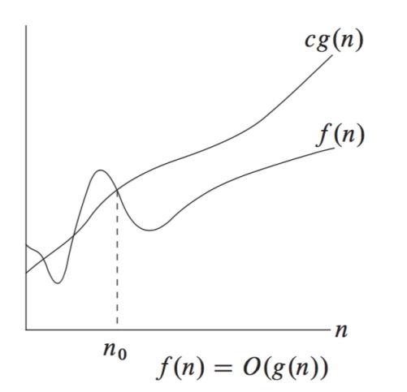

**Példa a használatára:**  
Az aszimptotikus felső korlátot algoritmusok futási idejének vagy memóriaigényének becslésére használjuk.

Ha például egy algoritmus futási ideje $T(n) = 3n^2 + 5n + 2$, akkor azt mondjuk, hogy $T(n) \in \mathcal{O}(n^2)$, mert nagy $n$ esetén a növekedést az $n^2$ tag határozza meg.

---

#### Aszimptotikus alsó korlát

**Definíció:** Egy adott $g(n)$ függvény esetén $\Omega(g(n))$ jelöli a függvényeknek azt a halmazát, amelyre $\Omega(g(n)) = \{f(n) :$ létezik $c$ és $n_0$ pozitív állandó úgy, hogy $0 \le c \cdot g(n) \le f(n)$ teljesül minden $n \ge n_0$ esetén$\}$.

**Magyarázat:**  
Ez azt jelenti, hogy az $f(n)$ függvény nagy $n$ esetén legalább olyan gyorsan nő, mint a $g(n)$ függvény, egy konstans szorzótól eltekintve.

Vagyis egy bizonyos $n_0$ értéktől kezdve az $f(n)$ mindig nagyobb vagy egyenlő, mint a $g(n)$ függvény $c$-szerese.

Tehát az $\Omega(g(n))$ alsó becslést ad az $f(n)$ növekedésére.

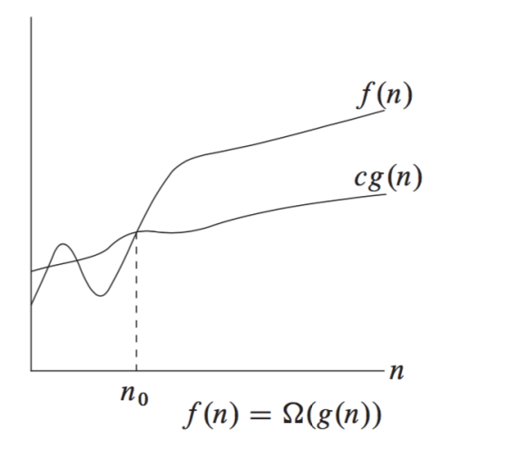

**Példa a használatára:**  
Az aszimptotikus alsó korlátot arra használjuk, hogy megadjuk, egy algoritmus futási ideje vagy memóriaigénye legalább milyen nagyságrendben nő.

Ha például egy algoritmus futási ideje $T(n) = 3n^2 + 5n + 2$, akkor azt mondjuk, hogy $T(n) \in \Omega(n^2)$, mert nagy $n$ esetén a függvény értéke legalább egy konstansszorosa az $n^2$-nek.

---

#### Aszimptotikus éles korlát

**Definíció:** Egy adott $g(n)$ függvény esetén $\Theta(g(n))$ jelöli a függvényeknek azt a halmazát, amelyre $\Theta(g(n)) = \{f(n) :$ létezik $c_1$, $c_2$ és $n_0$ pozitív állandó úgy, hogy $0 \le c_1 \cdot g(n) \le f(n) \le c_2 \cdot g(n)$ teljesül minden $n \ge n_0$ esetén$\}$.

**Magyarázat:**  
Ez azt jelenti, hogy az $f(n)$ függvény nagy $n$ esetén ugyanabban a nagyságrendben nő, mint a $g(n)$ függvény.

Vagyis egy bizonyos $n_0$ értéktől kezdve az $f(n)$ alulról és felülről is becsülhető a $g(n)$ megfelelő konstansszorosaival.

Tehát a $\Theta(g(n))$ azt fejezi ki, hogy az $f(n)$ növekedési rendje lényegében megegyezik a $g(n)$ növekedési rendjével.

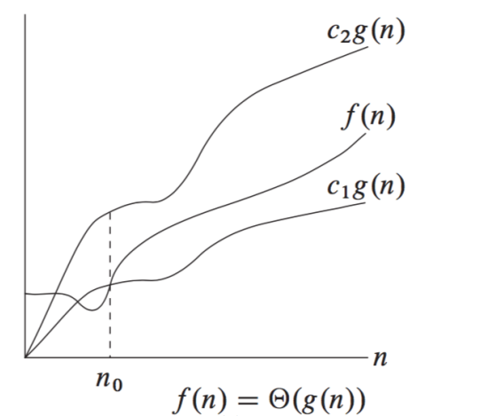

**Példa a használatára:**  
Az aszimptotikus éles korlátot arra használjuk, hogy pontosabban megadjuk egy algoritmus futási idejének vagy memóriaigényének növekedési rendjét.

Ha például egy algoritmus futási ideje $T(n) = 3n^2 + 5n + 2$, akkor azt mondjuk, hogy $T(n) \in \Theta(n^2)$, mert nagy $n$ esetén a függvény értéke alulról és felülről is becsülhető az $n^2$ egy-egy konstansszorosával.

---

### Keresések

#### Lineáris keresés

**Megvalósításához elengedhetetlen**: lineáris adatszerkezet (pl. tömb vagy lista), amelyben az elemek egymás után tárolódnak, de nem kell, hogy rendezettek legyenek.

Beugrik az elejére, és sorban végighalad az elemeken, egyenként vizsgálva, hogy az aktuális elem megegyezik‑e a keresett értékkel. Ha igen, akkor azonnal megáll, és visszaadja az elem indexét. Ha nem, akkor a következő elemre lép, és ezt ismétli addig, amíg el nem éri a tömb végét. Ha a végigmenve sem talál egyezést, akkor valamilyen „nincs benne” jelzést ad vissza (például $-1$)

$\text{int linear\_search(int A[], int n, int x)\{}$
$\text{\quad \quad int i;}$
$\text{\quad \quad for (i = 0; i < n; i++)}$
$\text{\quad \quad \quad \quad if (A[i] == x)}$
$\text{\quad \quad \quad \quad \quad \quad return i;}$
$\text{\quad \quad \quad \quad return -1;}$

**Lépésszám:**

- átlagos: $\frac{n+1}{2}$
- legrosszabb eset: $n$

---

#### Bináris keresés

**Megvalósításához elengedhetetlen**: homogén adatszerkezet, rendezett adatok, folytonos reprezentáció (adatok közvetlen elérése).

Beugrik a közepére, megnézi, hogy az elem nagyobb-e, mint a keresett elem. Ha igen, akkor a tőle balra eső részt eldobja, és a jobb oldali intervallum közepébe ugrik. Ha nem, akkor a tőle jobbra eső részt dobja el, és a bal oldali intervallum közepébe ugrik.

**Lépésszám**:

- legrosszabb eset: $log_2(n)+1$

---

### Beszúrásos rendezés

A beszúrásos rendezés úgy működik, mintha egyenként raknánk sorba a tömb elemeit: a tömb elején mindig egy rendezett rész van, amelyhez a következő elemet sorban a helyére beszúrjuk úgy, hogy az annál nagyobb elemeket eggyel jobbra toljuk. Így a rendezett rész folyamatosan bővül, amíg az egész tömb rendezett nem lesz.

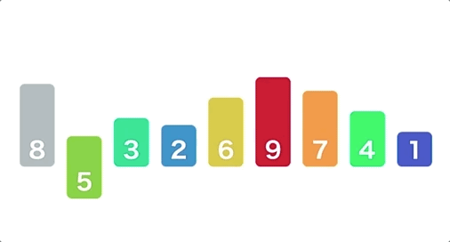

$\displaystyle \begin{array}{l}
\text{Insertion-Sort}(A) \\
1 \quad \textbf{for } j = 2 \textbf{ to } A.length \\
2 \quad \quad \quad key = A[j] \\
3 \quad \quad \quad \text{// Insert } A[j] \text { into the sorted sequence } A[1..j-1] \\
4 \quad \quad \quad i = j - 1 \\
5 \quad \quad \quad \textbf{while } i > 0 \text{ and } A[i] > key \\
6 \quad \quad \quad \quad \quad A[i+1] = A[i] \\
7 \quad \quad \quad \quad \quad i = i - 1 \\
6 \quad \quad \quad A[i+1] = key
\end{array}$

**Legrosszabb eset**: $\mathcal{O}(n^2)$ - ha a tömb csökkenő sorrendben van

---

### Táblázatok

**Tulajdonságok:** homogén, dinamikus, asszociatív, folytonos/szétszórt reprezentációval ábrázolt.

Két részből áll: **kulcs** (egyedi), **érték** (lehet összetett)

Az elemek azonosítása kulcs alapján történik.

**Ismert táblázatok**: soros táblázat, önátrendező táblázat, kulcstranszformációs táblázat (hash tábla)

**Műveletei**: $\text{Insert}$, $\text{Delete}$, $\text{Search}$

#### Önátrendező táblázat

Lényege, hogy a $\text{Search}$ művelet használatakor a megtalált elemet előre hozzuk a táblázat legelső pozíciójába, így a leggyakrabban használt elemek kerülnek a táblázat elejére. Javasolt a láncolt reprezentáció és lineáris keresés.

| Kari büfé reggel |           | \|  | Kari büfé délben |           | \|  | Kari büfé este |           |
| ---------------- | --------- | --- | ---------------- | --------- | --- | -------------- | --------- |
| 200              | coffee    | \|  | 4.800            | steak     | \|  | 290            | beer      |
| 300              | sandwich  | \|  | 200              | coffee    | \|  | 1.120          | cigarette |
| 350              | cola      | \|  | 350              | cola      | \|  | 5.200          | whisky    |
| 150              | tea       | \|  | 400              | cake      | \|  | 4.800          | steak     |
| 1.120            | cigarette | \|  | 290              | beer      | \|  | 350            | cola      |
| 400              | cake      | \|  | 300              | sandwich  | \|  | 300            | sandwich  |
| 5.200            | whiskey   | \|  | 150              | tea       | \|  | 400            | cake      |
| 290              | beer      | \|  | 1.120            | cigarette | \|  | 150            | tea       |
| 4.800            | steak     | \|  | 5.200            | whiskey   | \|  | 200            | coffee    |
| 14.500.000       | BMW       | \|  | 14.500.000       | BMW       | \|  | 14.500.000     | BMW       |

---

### Közvetlen címzésű táblázat

Abban az esetben hatékony ha az $U$ kulcstér viszonylag kicsi.

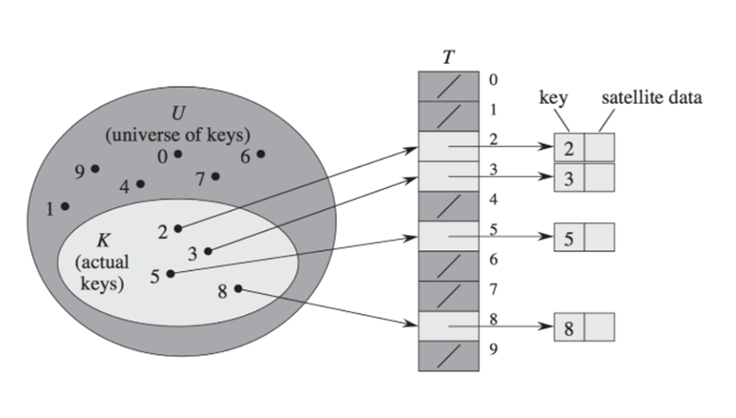

### Hash tábla

Ha a közvetlen címzésű táblázat $U$ kulcstere nagy, akkor a közvetlen tárolás nem hatékony, ezért célszerű a kulcsokat egy hash függvény segítségével egy kisebb, rögzített méretű táblába leképezni. A **hash függvény** feladata, hogy minden kulcsból egy táblaindexet számoljon ki úgy, hogy a kulcsok minél egyenletesebben szóródjanak szét a táblán.

Az osztásos módszerben a hash függvény alakja:

$$h(k) = k \text{ mod } m$$

ahol $k$ a kulcs, $m$ pedig a hash‑tábla mérete.

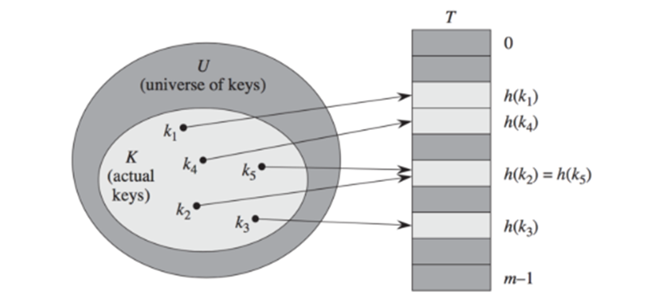

Több különböző kulcshoz is tartozhat ugyanaz a pozíció, ezt az esetet **ütközésnek** hívjuk. Az ütközést fel lehet oldani láncolt lista segítségével.

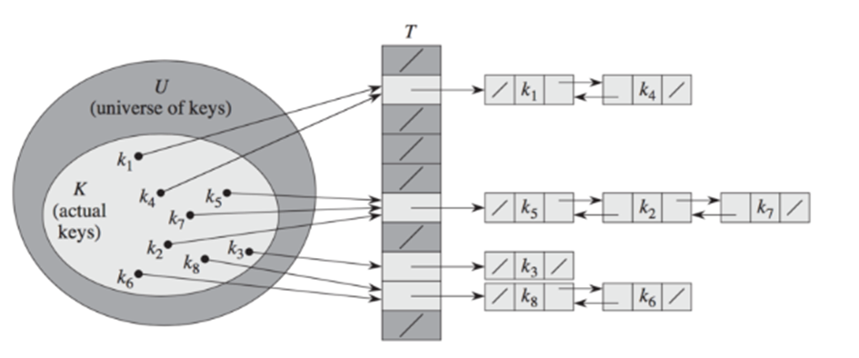

#### Ütközésfeloldás nyílt címzés módszerével

Ilyenkor minden elem magában a táblázatban tárolódik, ezért a táblázat egy pozíciójában vagy egy érték található, vagy pedig $\text{NIL}$. Legfontosabb előnye, hogy nincs szükség más adatszerkezet használatára és mutatók kezelésére.

**Például**: hozzunk létre egy hash táblát nyílt címzés módszerével, ha tudjuk, hogy a hash fügvény: $h(k) = k \text{ mod } 9$

| kulcs | szín   |
| ----- | ------ |
| 19    | blue   |
| 27    | red    |
| 51    | green  |
| 13    | blue   |
| 37    | brown  |
| 31    | pink   |
| 25    | orange |

**Megoldás:**

| Maradék | Kulcs | Szín   | Mutató       |
| ------- | ----- | ------ | ------------ |
| 0       | 27    | red    | $\text{NIL}$ |
| 1       | 19    | blue   | 2            |
| 2       | 37    | brown  | $\text{NIL}$ |
| 3       |       |        |              |
| 4       | 13    | blue   | 5            |
| 5       | 31    | pink   | $\text{NIL}$ |
| 6       | 51    | green  | $\text{NIL}$ |
| 7       | 25    | orange | $\text{NIL}$ |
| 8       |       |        |              |

---

### Gráfok

Az **irányítatlan gráf** csúcsok véges halmazából, és élek véges halmazából áll.

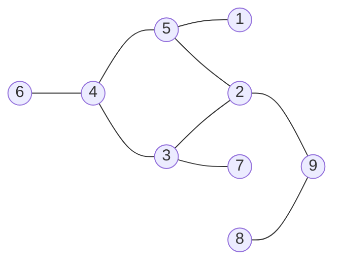

$G = (V, E), \text{ ahol } V = \{1,2,3,4,5,6,7,8,9\}, \text { és }$  
$E = \{(1,5),(2,5),(2,3),(2,9),(3,7),(3,4),(4,5),(4,6),(8,9)\}$

Az **irányított gráf** olyan gráf, ahol az élek halmazát alkotó csúcspárok rendezettek.

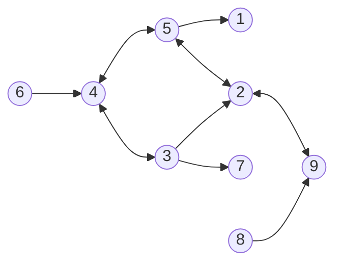

$G = (V, E), \text{ ahol }$  
$V = \{1,2,3,4,5,6,7,8,9\}, \text { és }$  
$E = \{(2,3),(2,5),(2,9),(3,4),(3,2),(3,7),(4,3),$  
$(4,5),(5,2),(5,4),(5,1),(6,4),(8,9),(9,2)\}$

**Alkalmazási területei**: legrövidebb út keresésére, homepagek megkeresése (homapage – csúcs, link - él), ismerősök hálózata szociális médiában (egyén – csúcs, kapcsolat - él), számítógép-hálózatok, hálós adatbázis-kezelő rendszerek.

**Irányítatlan gráf reprezentációja:**

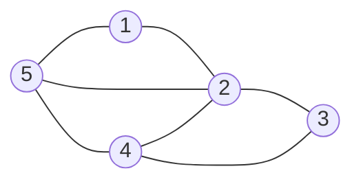

- Szomszédsági lista

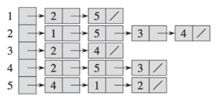

- Szomszédsági mátrix

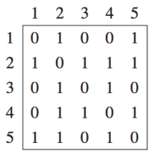

**Irányíott gráf reprezentációja:**

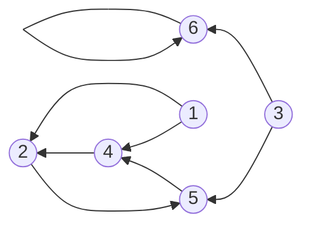

- Szomszédsági lista:

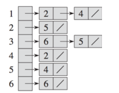

- Szomszédsági mátrix:

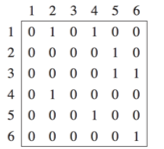

Ritka gráfok esetén a szomszédsági lista használata ajánlott $(|E| < |V|^2)$, sűrű gráfok esetén pedig a szomszédsági mátrix $(|E| > |V|^2)$

**Szomszédsági mátrix:** könnyű ellenőrizni, hogy a két csúcs között vezet-e él  
**Szomszédsági lista:** könnyű végigmenni az egy adott csúcshoz tartozó összes élen

---

#### Szélességi bejárás (BFS)

A szélességi bejárás sor adatszerkezettel dolgozik: a kezdőcsúcsból kiindulva szintenként járja be a gráfot, minden szintet teljesen felfedezve, mielőtt a következő szintre lépne.

**Működése**:

- A kezdőcsúcsot a sor elejére tesszük, megjelölve, hogy látogattuk
- Amíg a sor nem üres:
  - A sor első elemét kiveszzük (ez a kiterjesztendő csúcs)
  - Megnézzük az összes szomszédját
  - Minden még látogatatlan szomszédot jelölünk látogatottnak, és a sor végére tesszük

**Alkalmazás**: legrövidebb út keresése, szintek szerinti feldolgozás.

---

#### Mélységi bejárás (DFS)

A mélységi bejárás verem adatszerkezettel dolgozik: egy ágon minél mélyebbre megy, csak akkor tér vissza, ha elakad.

**Működése**:

- A kezdőcsúcsot a verem tetejére tesszük, megjelölve
- Amíg a verem nem üres:
  - A verem tetejét kiveszzük
  - Ha van még olyan szomszédja, amelyet nem látogattunk meg, azt jelöljük és a verem tetejére tesszük
  - Ha nincs több szomszéd, akkor "befejeztük" ezt az ágat

**Alkalmazás**: ciklusdetektálás, topológiai rendezés, komponensek számlálása.

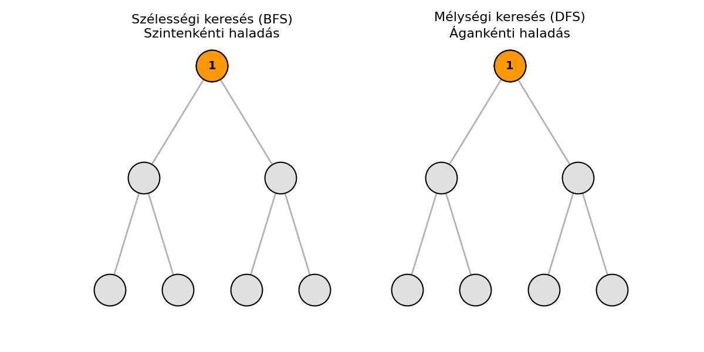
