[⬅ Vissza a főoldalra](../../zarovizsga.md)

# 4. tétel

---

## 4.1. Függvények, görbék, felületek leírása és számítógépes ábrázolása.

**Függvény**: A függvény egy olyan egyértelmű hozzárendelés két halmaz elemei között, amely az első halmaz minden eleméhez a második halmaz pontosan egy elemét rendeli hozzá.

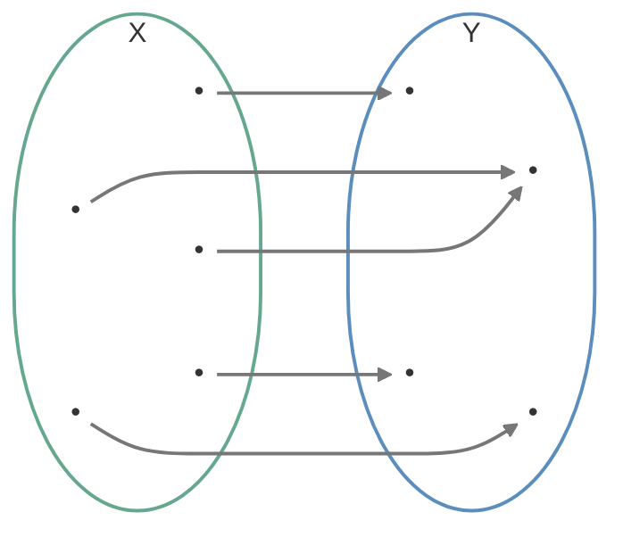

### Függvények és görbék megadásának módjai:

#### 1. Explicit megadási mód

A függő változót közvetlenül kifejezzük a független változóval. Mivel ez a hozzárendelés egyértékű (minden megengedett \(x\)-hez pontosan egy \(y\) tartozik), szigorú értelemben véve ez határoz meg függvényt.

- **Általános alak:** \(y = f(x)\)
- **Példa:** \(y = 3x + 5\)
- **Leképezés jelöléssel:** \(f: \mathbb{R} \to \mathbb{R}, \quad x \mapsto 3x + 5\)

#### 2. Implicit megadási mód

Az összefüggést egy olyan egyenlettel adjuk meg, amelyben \(x\) és \(y\) egy oldalon, együtt szerepelnek. Ez **nem feltétlenül függvény**, mert egy \(x\) helyhez több \(y\) érték is tartozhat (például egy kör esetében). Alapvetően egy két valós számból álló párhoz rendel egy valós számot. Fontos tulajdonsága, hogy nem mindig tudjuk explicit alakra hozni.

- **Általános alak:** \(F(x,y) = 0\)
- **Példa:** \(x^2 + y^2 - 9 = 0\) (origó középpontú, 3 sugarú kör egyenlete)
- **Leképezés jelöléssel:** \(F: \mathbb{R} \times \mathbb{R} \to \mathbb{R}\)

#### 3. Paraméteres (vektoros) megadási mód

A görbét helyvektorokkal adjuk meg, ahol a vektorok végpontjai rajzolják ki magát a görbét. A leképezés egy valós számhoz (a paraméterhez) egy síkbeli helyvektort rendel.

- **Általános alak:** $r(t) = (x(t), y(t))$
- **Példa:** $r(t) = (3\cos(t) + 3\sin(t))$
- **Leképezés jelöléssel:** \(f: \mathbb{R} \to V^2\), ahol egy valós intervallumot (\(\mathbb{R}\)) képezünk le a síkbeli helyvektorok halmazába (\(V^2\)).

---

### Módszerek használata

#### Explicit függvények használata

Az explicit módon megadott függvények, vagyis a \(y=f(x)\) alakú összefüggések, egyszerűen használhatók görbék kirajzolására. A módszer lényege, hogy különböző \(x\) értékekhez meghatározzuk a hozzájuk tartozó \(y\) értékeket, majd ezeket a pontokat megjelenítjük, illetve szakaszokkal összekötjük.

Ez a megközelítés sok esetben hatékony és gyors. Egy egyenesnél, például \(y=3x+5\) esetén nem szükséges minden egyes pontot külön kiszámolni, mert az egyenes alakja már két pontból is egyértelműen meghatározható. Ilyenkor elegendő két pontot megadni, majd közöttük egy szakaszt húzni.

Görbéknél, például \(y=x^2\) esetén, általában nem minden lehetséges \(x\) értéket vizsgálunk meg, hanem csak bizonyos lépésközönként mintavételezünk, például minden 5. vagy 10. értéknél. A kapott pontokat ezután szakaszokkal kötjük össze. Mivel sok esetben nem tökéletes matematikai pontosságra, hanem vizuálisan megfelelő megjelenítésre törekszünk, ez a módszer jelentősen csökkentheti a számítási igényt.

##### Előnyei

- Egyszerű, mert minden \(x\) értékhez közvetlenül meghatározható a megfelelő \(y\).
- Gyorsan kirajzolható, főleg akkor, ha ritkább mintavételezést használunk.
- Kevés erőforrást igényel.
- Könnyen megvalósítható programozás során.
- Szakaszokkal összekötve a pontokat jól használható közelítést ad.

##### Korlátai

- Egy adott \(x\) értékhez csak egyetlen \(y\) érték tartozhat.
- Emiatt nem írható le vele minden görbe egyetlen explicit függvénnyel.
- Nem lehet vele közvetlenül olyan alakzatokat ábrázolni, amelyek „visszafordulnak” az \(x\) tengely irányában.
- Például egy teljes kör vagy egy oldalra nyíló parabola nem adható meg egyetlen \(y=f(x)\) alakban.
- Az ilyen grafikon csak olyan alakot tud leírni, amely balról jobbra haladva minden \(x\)-hez legfeljebb egy pontot rendel.

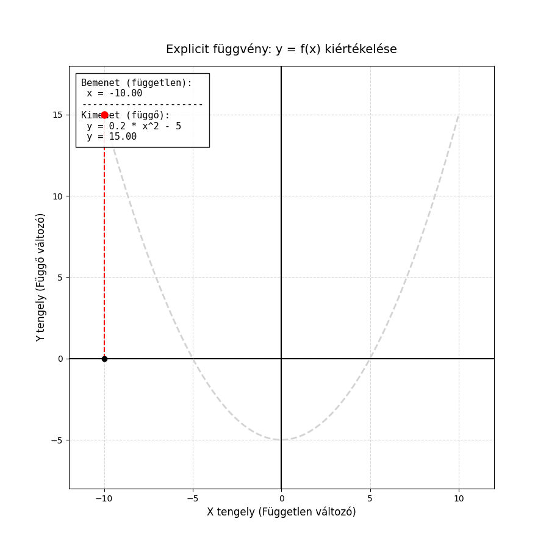

---

#### Implicit görbék használata

Az implicit görbéket általában \(f(x,y)=0\) alakban adjuk meg. Ilyenkor nem közvetlenül számítjuk ki az egyik változót a másikból, hanem azt vizsgáljuk, mely \((x,y)\) pontokra teljesül az egyenlet.

Ez az alak általánosabb, mint az explicit függvény, mert egyetlen \(x\) értékhez több \(y\) érték is tartozhat. Emiatt olyan görbék is leírhatók vele, amelyek explicit formában nem adhatók meg egyszerűen.

A megjelenítés viszont számításigényesebb: a sík sok pontjában kell kiértékelni az egyenletet, hogy kiderüljön, hol fut a görbe. Ez sok erőforrást igényelhet, különösen nagy felbontás vagy bonyolult alak esetén.

##### Előnyei

- Általánosabb leírásmód, mint az explicit forma.
- Olyan görbéket is kezel, amelyekhez egy \(x\)-hez több \(y\) tartozik.
- Sok geometriai alak egyszerűbben írható fel vele.

##### Hátrányai

- A kirajzolása nehezebb és lassabb.
- Naiv megközelítésben sok pontot kell kipróbálni.
- A vizualizáció összetettebb algoritmusokat igényelhet.

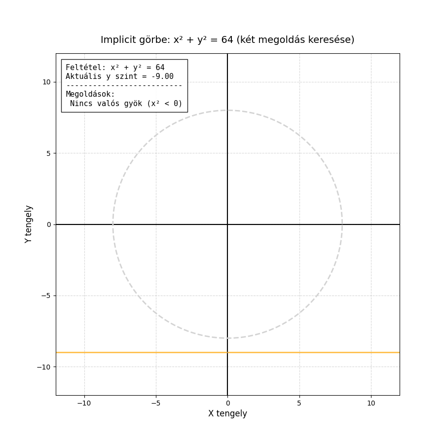

---

#### Paraméteres görbék használata

A paraméteres görbék esetében a pontok koordinátáit nem egyetlen összefüggéssel adjuk meg, hanem külön koordinátafüggvényeket használunk egy független $t$ paraméter (például az idő) függvényében. Minden $t$ értékhez egyértelműen kiszámítható egy $x$ és egy $y$ koordináta.

Megjelenítése szinte olyan egyszerű, mint az explicit függvényeké. A módszer lényege, hogy egy ciklus segítségével lépésről lépésre végighaladunk a $t$ paraméter értelmezési tartományán, és a kapott $(x, y)$ pontokat megjelenítjük, majd szakaszokkal összekötjük. A görbe finomságát és vizuális minőségét kizárólag a $t$ lépésközének sűrűsége határozza meg.

Mivel az $x$ és $y$ értékeket a $t$ paraméter egymástól függetlenül vezérli, a görbe mentesül az explicit függvények korlátaitól. Szabadon „maga alá görbülhet”, alkothat hurkokat vagy teljesen zárt alakzatokat, miközben elkerüli az implicit görbék kirajzolásának nagy erőforrást igénylő, az egész síkot vizsgáló mintavételezését.

##### Előnyei

- Szinte olyan egyszerű a kirajzolása és programozása, mint az explicit függvényeké.
- Rendkívül rugalmas: mivel a tengelyek koordinátái függetlenek, a görbe bátran „visszafordulhat” az $x$ tengely mentén is.
- Közvetlenül és hatékonyan alkalmazható zárt alakzatok (például kör) és bonyolult, önmagukat metsző hurkok leírására.
- Sokkal kevesebb számítási erőforrást igényel a vizualizációja, mint az implicit görbéké, hiszen célzottan csak a görbe pontjait generáljuk le.

##### Korlátai

- Ha a $t$ paraméter lépésköze túl ritka, a kapott alakzat szögletessé, pontatlanná válik.
- Ha a lépésköz túl sűrű, az feleslegesen növeli a számítási időt anélkül, hogy a vizuális eredmény láthatóan javulna.
- Nehezebb lehet meghatározni róla, hogy egy tetszőleges $(x, y)$ pont pontosan rajta van-e a görbén, mint az implicit egyenletek esetében.

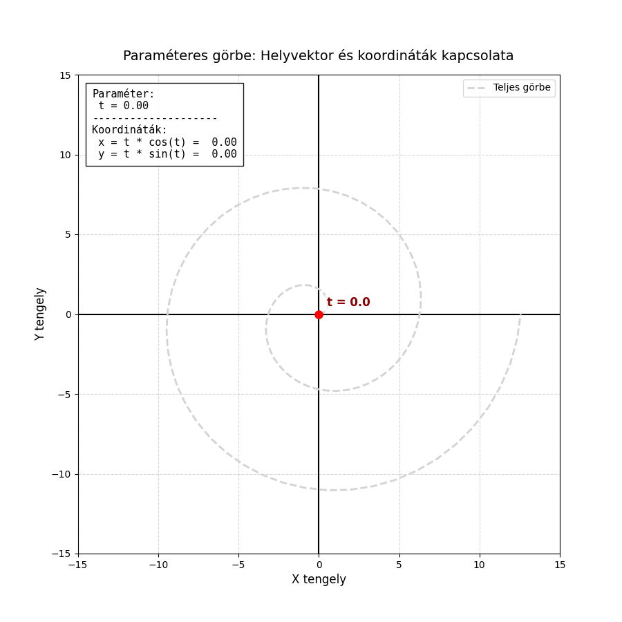

---

### Görbék megadása térben

Csak paraméteres módon lehet őket megadni.

$r(t): \R \mapsto V^3 \quad\quad r(t)=(x(t), y(t), z(t))$

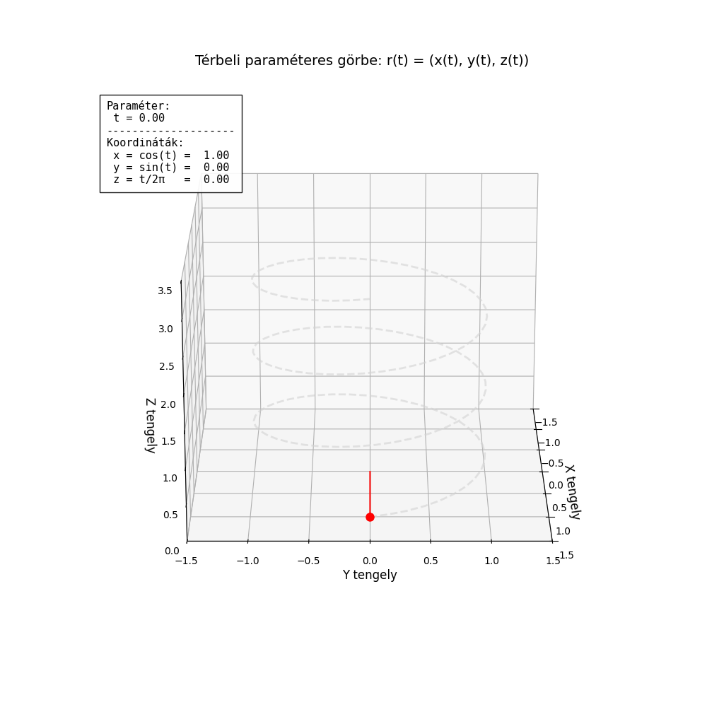

### Explicit felületmegadás

Térbeli felületek legegyszerűbb megadási módja az explicit alak, amelyet $z = f(x,y)$ egyenlettel, matematikai jelöléssel $f: \mathbb{R} \times \mathbb{R} \mapsto \mathbb{R}$ formában írhatunk fel.

Ennek lényege, hogy a vízszintes alapsík (az XY sík) minden egyes $(x, y)$ koordinátapárjához – vagyis a tér egy adott helyzetéhez – a függvény pontosan egy $z$ magassági értéket rendel hozzá. A vizualizáció során a vízszintes síkot egy sűrű rácsra osztjuk fel, minden rácspontra kiszámítjuk a magasságot, majd az így kapott térbeli pontokat összekötjük. Ennek eredményeként egy folytonos, hálószerű felületet kapunk.

#### Előnyei

- **Könnyen programozható és gyors:** Az algoritmus rendkívül egyszerű, hiszen csak végig kell lépkedni az alapsík $x$ és $y$ koordinátáinak hálóján, és a képletbe behelyettesítve azonnal megkapjuk a harmadik dimenziót.
- **Látványos megjelenítés:** Rácsként (drótvázként) vagy árnyékolt felületként megjelenítve nagyon jól értelmezhető, átlátható térbeli képet ad a függvény viselkedéséről.

#### Korlátai

- **Nem tud "maga alá hajolni":** Akárcsak a kétdimenziós explicit görbék esetében, itt is szigorú szabály, hogy egy adott $(x, y)$ alapponthoz kizárólag egyetlen $z$ érték tartozhat.

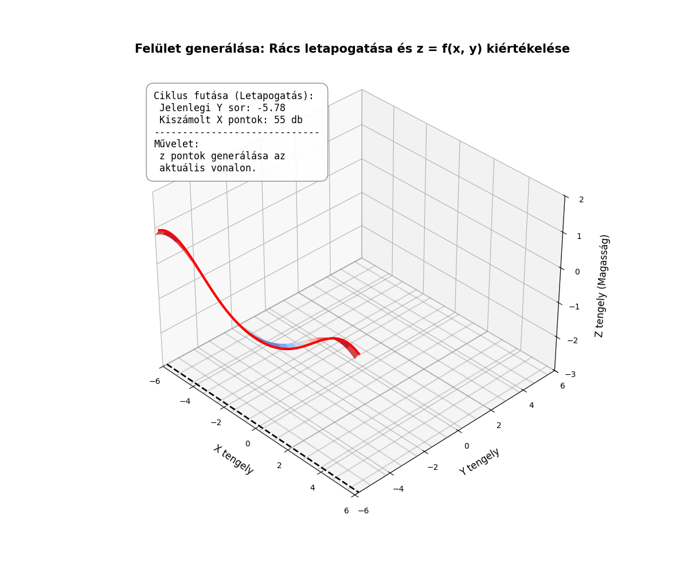

### Implicit felületek használata

Az implicit felületeket egy $f(x,y,z) = 0$ alakú, háromváltozós egyenlettel adjuk meg. Ennél a módszernél nem egy konkrét változót (például a magasságot) számoljuk ki a többiből, hanem a 3D tér pontjairól döntjük el, hogy kielégítik-e a feltételt. Amelyik $(x,y,z)$ pont behelyettesítése után az egyenlet eredménye nulla, az a pont a felület része.

A megjelenítése hagyományos eszközökkel roppant nehézkes. Leggyakrabban réteges (térfogati) megközelítést alkalmaznak: a vizsgált teret felosztják egy 3D-s rácsra (voxelekre), és minden egyes pontban kiértékelik a függvényt. Ahol a függvény értéke átlépi a nullát, oda a program felületet generál (például az ismert Marching Cubes algoritmussal).

#### Előnyei

- **Páratlan rugalmasság:** Egyetlen elegáns egyenlettel leírhatók teljesen zárt, összefüggő alakzatok (például egy gömb: $x^2 + y^2 + z^2 - r^2 = 0$), bonyolult topológiák, vagy akár egymásba olvadó "cseppek" (metaballok).
- Kiválóan alkalmas olyan területeken, ahol a térfogat a lényeg, például orvosi képalkotásnál (CT, MRI rétegek) vagy folyadékszimulációknál.

#### Korlátai

- **Extrém erőforrásigény:** Mivel nemcsak magát a felületet, hanem a tér rengeteg "üres" pontját is végig kell vizsgálni, a számítási idő a felbontás növelésével köbösen nő.
- Emiatt a hagyományos 3D modellezésben és valós idejű megjelenítésben (pl. játékok) önálló módszerként ritkán használják, inkább csak speciális (réteg)megoldásokra korlátozódik.

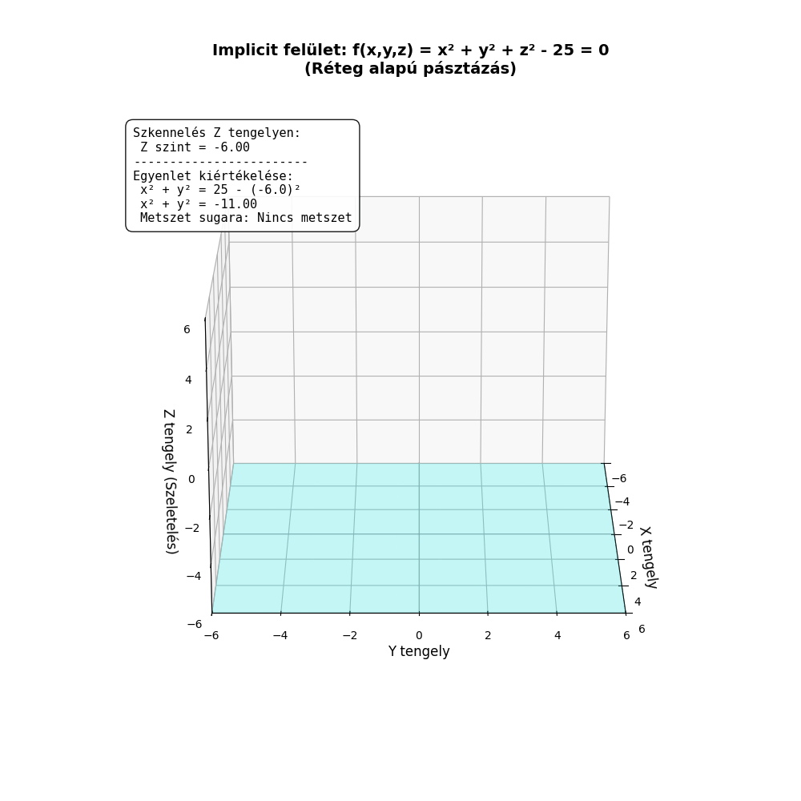

### Paraméteres felületek használata

Mivel térbeli felületekről beszélünk, egyetlen paraméter (amely csak egy vonalat húzna) már nem elegendő. A felületek paraméteres megadásához két független paraméterre van szükségünk, amelyeket általában $s$ és $t$ betűkkel jelölünk. A matematikai felírás vektoros alakban a következő:

$$r(t,s) = \begin{bmatrix} x(t,s) \\ y(t,s) \\ z(t,s) \end{bmatrix}$$

Ebben az esetben az $s$ és $t$ paraméterek egy kétdimenziós "paramétersíkot" alkotnak. A térbeli felület kirajzolásának algoritmusa egy dupla ciklusra épül: a külső ciklus végigmegy az egyiken (pl. $s$), a belső ciklus pedig a másikon (pl. $t$). Ahogy bejárjuk ezt a 2D-s paraméter-rácsot, a koordinátafüggvények minden $(s,t)$ párt "kivetítenek" a 3D-s tér egy $(x,y,z)$ pontjára. Mivel a felületet rácspontok hálózatából építjük fel, az eredmény egy térbeli, rácsszerű drótváz vagy felület lesz.

#### Előnyei

- **Szabad topológia (maga alá hajolhat):** Szemben az explicit ($z = f(x,y)$) felületekkel, itt a tér mindhárom koordinátáját a független $s$ és $t$ paraméterek irányítják. Emiatt a felület gond nélkül visszahajolhat önmaga alá, alkothat hurkokat, vagy leírhat teljesen zárt testeket (például gömböt vagy tóruszt).
- **Rendkívül gyors és hatékony:** Csak azokat a pontokat számoljuk ki, amelyek ténylegesen a felületen vannak (nincs felesleges üres tér vizsgálat, mint az implicitnél).
- **Kiválóan programozható:** A dupla ciklusos módszer és az általa generált négyszöges rácsháló tökéletesen illeszkedik a modern 3D grafikus motorok (pl. OpenGL, DirectX) poligon-alapú működéséhez.

#### Korlátai

- Ha a paraméteres rács felbontása nem egyenletes (a képletek torzítanak), a felület bizonyos pontokon túl sűrű, máshol túl ritka, "szögletes" lehet.
- Bonyolultabb matematikai felírást igényel a koordinátafüggvények megtervezése, mint egy sima explicit egyenlet.

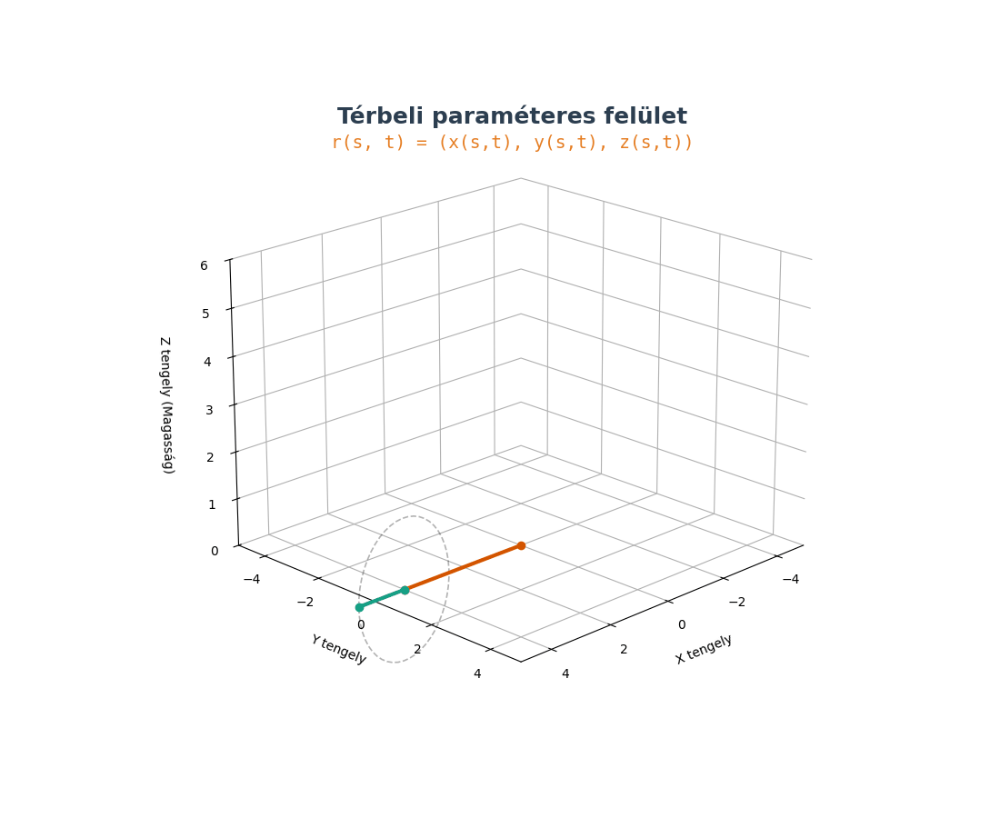

### Extra (lehet nem kell)

#### Lagrange-interpoláció

A Lagrange-interpoláció egy klasszikus módszer, amelynek célja, hogy adott $n+1$ számú kontrollpontra egy olyan $n$-edfokú polinomot illesszen, amely **minden ponton pontosan áthalad**.

##### Alapelvek és megadási módok

A módszer lényege, hogy a görbét pontok súlyozott összegeként állítja elő. Megadható:

- **Explicit módon:** $y = P(x)$ alakban, ahol a polinom közvetlenül az $y$ értéket határozza meg.
- **Paraméteres módon:** $x(t)$ és $y(t)$ koordinátafüggvényeket határozunk meg külön-külön. Ez lehetővé teszi önmagába visszatérő vagy "hurok" alakzatok leírását is.

##### Paraméter meghatározása (Paraméteres esetben)

Mivel a pontokhoz egy $t$ paramétert kell rendelnünk, két fő stratégiát alkalmazunk:

1. **Uniform (egyenletes):** A $t$ paraméter értékei egyenletesen követik egymást ($0, 1, 2...$). Egyszerű, de torzíthat, ha a pontok térbeli távolsága nem egyenletes.
2. **Húrhossz szerinti (Chord-length):** A paraméterközöket a szomszédos pontok közötti tényleges távolság alapján osztjuk ki, ami természetesebb görbületet eredményez.

##### Előnyei

- **Mindig működik:** Matematikailag bizonyítható, hogy adott pontokhoz pontosan egy ilyen minimális fokszámú polinom létezik.
- **Általános és algoritmizálható:** Direkt képlettel számolható, nem igényel bonyolult iterációt.
- **Pontosság:** Garantáltan érinti az összes megadott alappontot.

##### Hátrányai

- **Magas fokszámú polinomok:** Sok pont esetén a polinom fokszáma megnő, ami számításigényessé teszi.
- **Oszcilláció (Runge-jelenség):** A Lagrange-interpoláció legnagyobb hibája, hogy nagyszámú pont esetén a görbe a széleken vadul lengeni (oszcillálni) kezd.
- **Instabilitás:** Egyetlen pont kismértékű elmozdulása a görbe távoli szakaszait is drasztikusan megváltoztathatja.
- **Bonyolult egyenletrendszer:** Nagy adatállományoknál a polinom együtthatóinak meghatározása instabillá válhat.

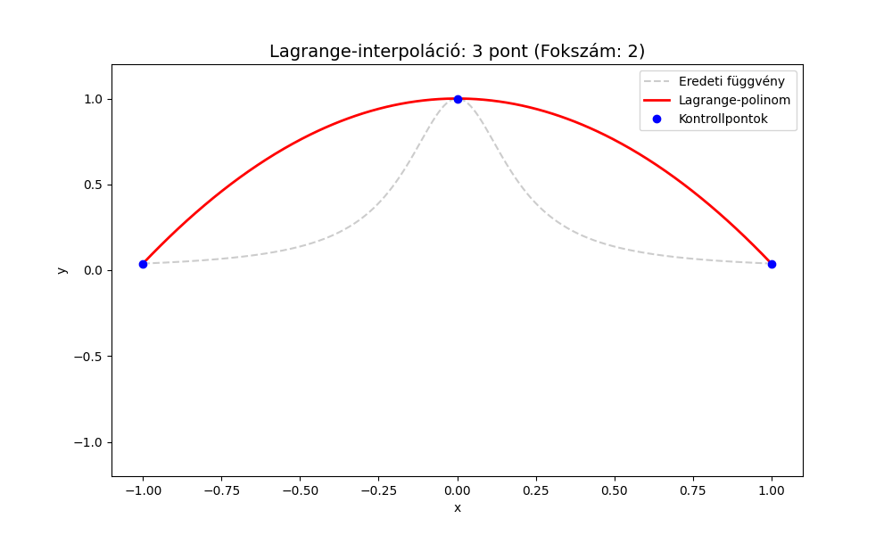

---

#### Hermite-interpoláció

A Hermite interpoláció a görbeillesztés egy olyan módszere, amely nemcsak a megadott pontokon halad át pontosan, hanem **a pontokban előírt érintővektorokat (levezetetteket) is tiszteletben tartja**.

Miközben a Lagrange-interpoláció oszcillációs problémákkal küzd, ha sok pontot használunk, a Hermite módszer ezt egy okos trükkel kerüli meg: **szakaszokra (darabokra) bontja a feladatot**. Ahelyett, hogy egyetlen, hatalmas fokszámú polinomot illesztene az összes pontra, mindig **csak két szomszédos pont között rajzol egy alacsony fokszámú görbét**.

**Hogyan működik?**
Két szomszédos pont, $P_i$ és $P_{i+1}$ között egy **köbös (harmadfokú) polinomot** feszítünk ki. Egy köbös polinomnak 4 szabadságfoka van (a $t^3, t^2, t, 1$ együtthatói). A 4 feltétel, ami egyértelműen meghatározza ezt a szakaszt:

1.  A görbe a $t=0$ időpillanatban a $P_i$ pontban indul.
2.  A görbe a $t=1$ időpillanatban a $P_{i+1}$ pontba érkezik.
3.  A görbe kezdősebessége ($t=0$) megegyezik a $V_i$ érintővektorral.
4.  A görbe végsebessége ($t=1$) megegyezik a $V_{i+1}$ érintővektorral.

A teljes görbe ezekből a kis, egymáshoz fűzött köbös darabokból áll össze.

| **Előnyök**                                                                                                                                  | **Hátrányok**                                                                                                                                                       |
| :------------------------------------------------------------------------------------------------------------------------------------------- | :------------------------------------------------------------------------------------------------------------------------------------------------------------------ |
| **Nincs oszcilláció:** A szakaszos felépítés miatt elkerülhető a Runge-jelenség.                                                             | **Hiányzó adatok:** A módszer megköveteli az érintővektorokat, amelyek gyakran nem állnak rendelkezésre.                                                            |
| **Helyi vezérlés:** Egy pont vagy érintő módosítása csak a szomszédos szakaszokat érinti, nem az egész görbét.                               | **Felhasználói hiba:** Ha a felhasználónak kell megadnia az érintőket, előfordulhat, hogy rosszul, természetellenesen adja meg őket, ami "töréseket" okoz a görbén. |
| **Sima átmenet:** Garantálható a $C^1$ folytonosság (azaz a görbe nemcsak folytonos, de az érintője is simán változik a pontokon áthaladva). | **Látványos hibák:** Rosszul megválasztott érintők esetén a görbe furcsán megrándulhat a pontok között.                                                             |

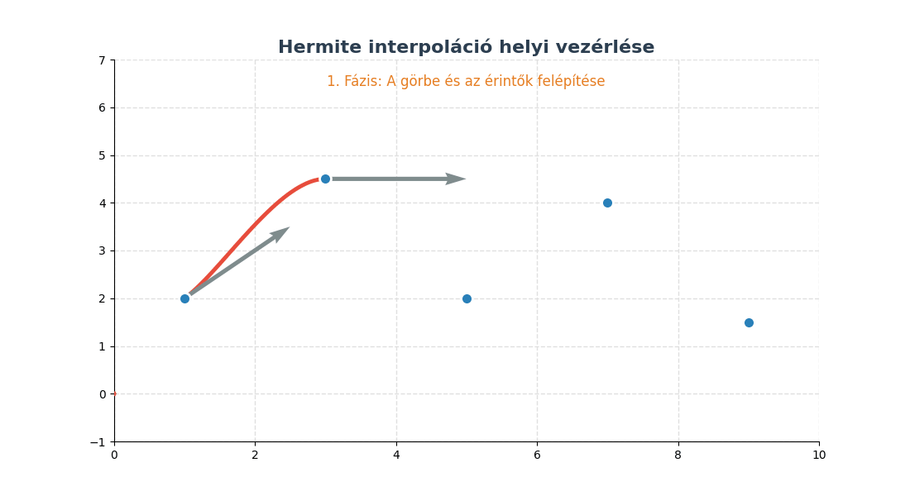

---

#### Bézier-görbe

A Bézier-görbe a számítógépes grafika (pl. Illustrator, Photoshop, SVG, fontok) legnépszerűbb görbeillesztési módszere. A Hermite-interpoláció alapjaira épül, de a nehezen kezelhető érintővektorokat vizuálisan könnyebben mozgatható **kontrollpontokkal** helyettesíti.

##### A köbös (harmadfokú) Bézier-görbe

A legelterjedtebb változatot 4 pont határozza meg:

1.  **$P_0$ (Kezdőpont):** Innen indul a görbe ($t=0$).
2.  **$P_1$ (Első kontrollpont):** Meghatározza a kezdőpontból kilépő érintő irányát és "erősségét".
3.  **$P_2$ (Második kontrollpont):** Meghatározza a végpontba érkező érintő irányát.
4.  **$P_3$ (Végpont):** Ide érkezik a görbe ($t=1$).

_Fontos:_ A görbe csak a $P_0$ és $P_3$ pontokon halad át, a $P_1$ és $P_2$ pontok csak mágnesként húzzák maguk felé a vonalat.

##### Általánosítás és Spline-ok

- **Általánosítás (n-edfokú):** A módszer tetszőleges számú pontra kiterjeszthető. Hátránya, hogy sok pontnál a görbe ellaposodik, és egyetlen pont mozgatása az _egész_ görbére hatással van (nincs lokális vezérlés).
- **Bézier-Spline:** Az előbbi probléma miatt a gyakorlatban rövid, harmadfokú (4 pontos) Bézier-szakaszokat fűznek egymás után.
- **Folytonosság ($C^1$):** Két Bézier-szakasz akkor csatlakozik simán (törésmentesen), ha a csatlakozási pont és a két szomszédos kontrollpontja egyetlen közös egyenesre esik.

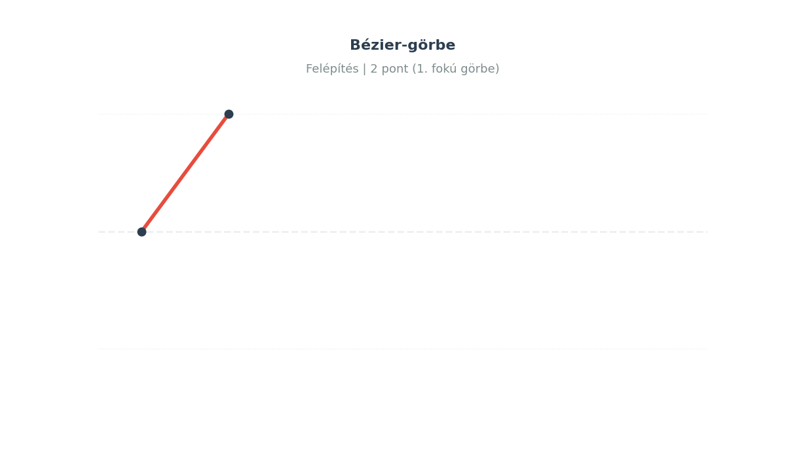

---

## 4.2. Problémák reprezentálása állapottéren. A megoldás keresése visszalépéssel. Szisztematikus és heurisztikus fa- és gráfkereső eljárások.
