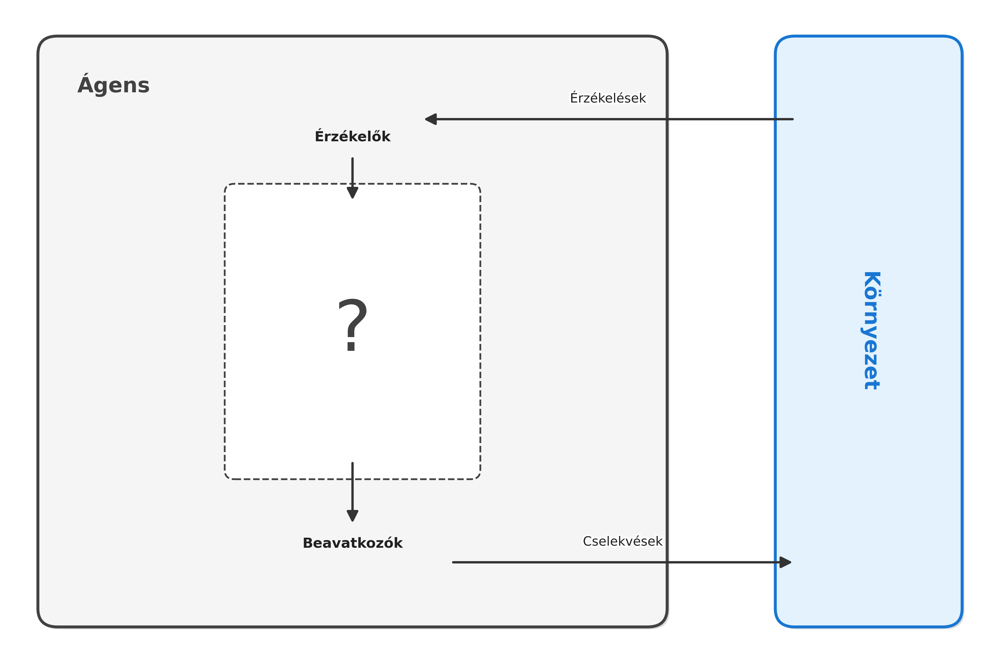
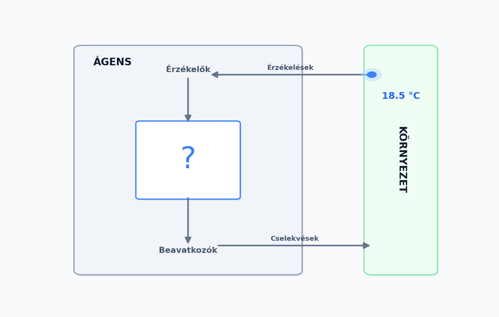
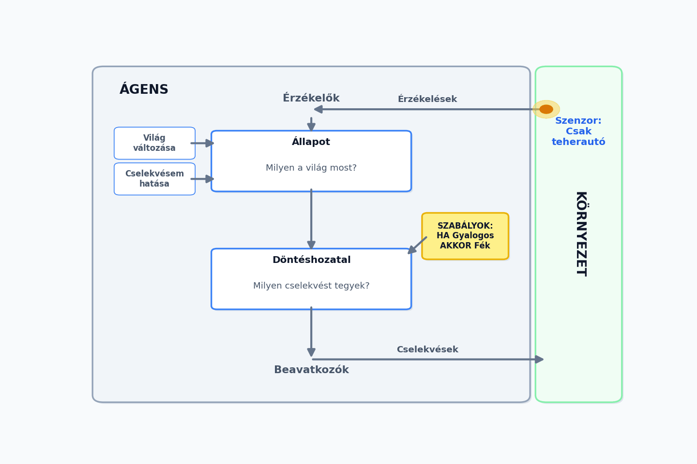
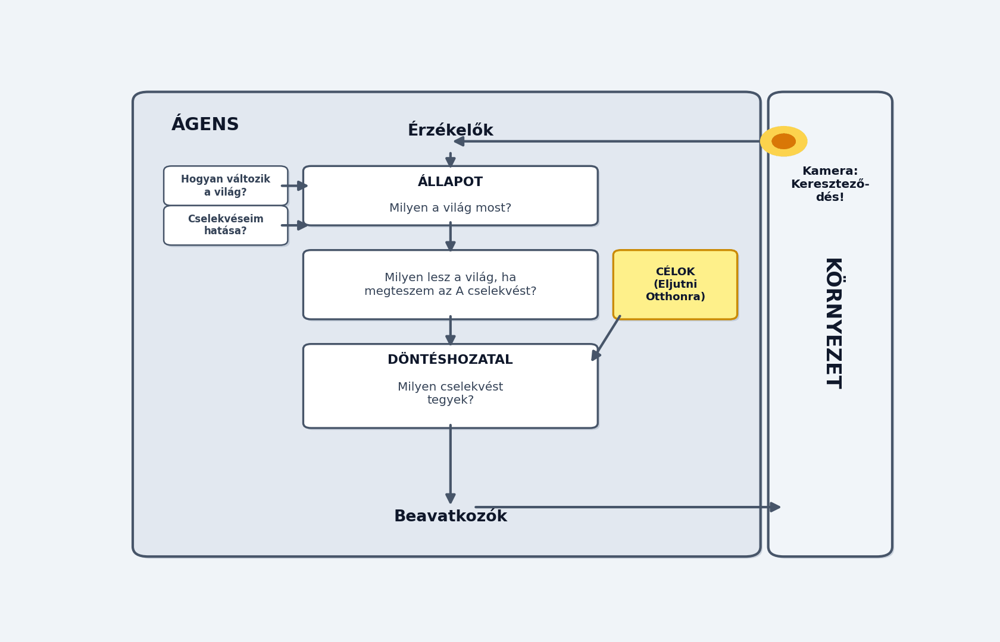
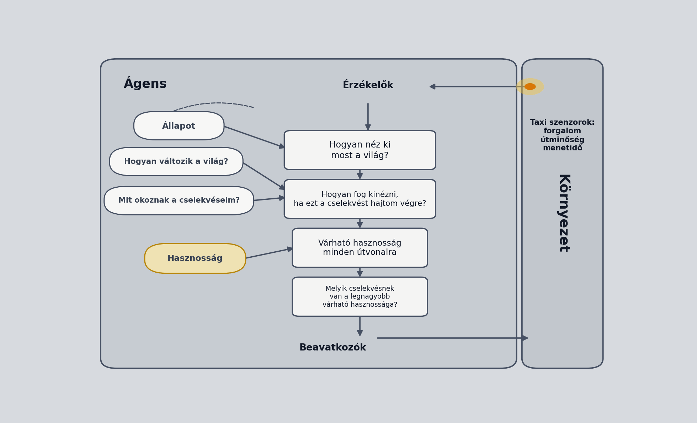
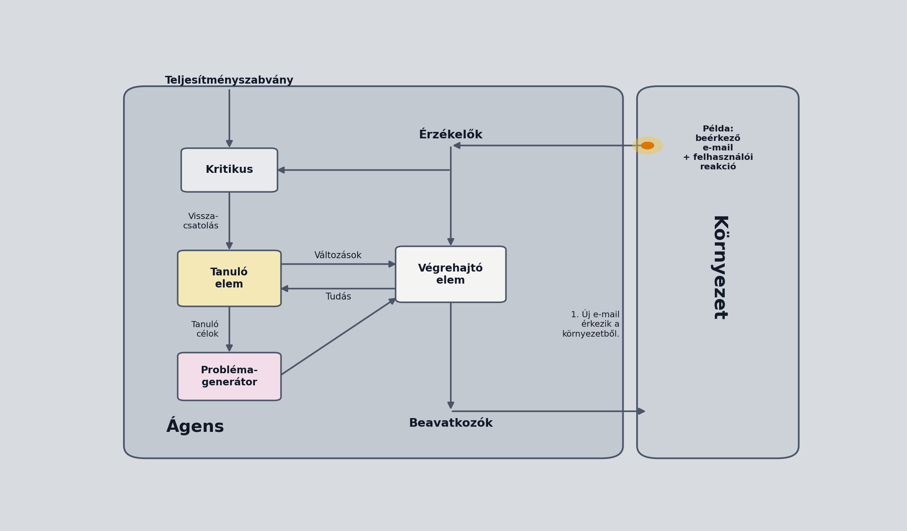
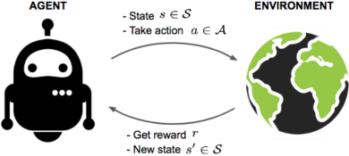

[⬅ Vissza a főoldalra](../../zarovizsga.md)

## 5. tétel

---

### 5.1. Mátrix fogalma, műveletek, determináns, rang. Speciális mátrixok, inverz. Mátrix, mint lineáris transzformáció. Sajátérték, sajátvektor.

#### Mátrix fogalma

Egy $m$ sorral és $n$ oszloppal rendelkező számtáblázatot $m \times n$-es mátrixnak nevezünk.

$$A = \begin{bmatrix}a_{11} & a_{12} & \dots & a_{1n} \\ a_{21} & a_{22} & \dots & a_{2n} \\ \vdots & \vdots & & \vdots \\ a_{m1} & a_{m2} & \dots & a_{mn}\end{bmatrix}$$

- $A$ elemei: $a_{ij}$
- $m$: sorok száma, $n$: oszlopok száma
- Az összes $m \times n$-es valós mátrix halmazát $\R^{m\times n}$-nel jelöljük, az összes $m \times n$-es komplex mátrix halmazát pedig $\mathbb{C}^{m \times n}$-nel.

- Ha $n = m$, akkor a mátrix **négyzetes** vagy **kvadratikus**.
- Egy mátrix **főátlója** alatt az $(a_{11}, a_{22}, a_{33}, \dots , a_{kk})$ szám $k$-ast értjük $(k=\text{min}\{m,n\})$
- Két mátrix **egyenlő**, ha azonos típusúak (ugyanannyi soruk és oszlopuk van), és megfelelő elemeik megegyeznek.
- Azon $n \times n$-es mátrixot, melynek főátlójában csupa 1-es áll, minden más eleme 0, **n-edrendű** vagy **n-dimenziós egységmátrix**nak nevezzük.
  Jele: $E_n$ vagy $I_n$.

  $$E_2 = \begin{bmatrix}1&0\\0&1\end{bmatrix} \quad E_3 = \begin{bmatrix}1&0&0\\0&1&0\\0&0&1\end{bmatrix}$$

---

#### Műveletek

##### Összeadás

Csak azonos típusú mátrixokat tudunk összeadni. Legyenek $A = (a_{ij}), B = (b_{ij}), C = (c_{ij})$ $m \times n$ mátrixok. Ekkor $C = A + B$, ha $c_{ij} = a_{ij} + b_{ij}$. Azaz megfelelő indexen lévő elemeket összeadjuk.

Például:

$$\begin{bmatrix}1&2\\2&3\end{bmatrix} + \begin{bmatrix}2&4\\6&8\end{bmatrix} = \begin{bmatrix}1+2&2+4\\2+6&3+8\end{bmatrix} = \begin{bmatrix}3&6\\8&11\end{bmatrix}$$

---

##### Skalárral való szorzás:

Elemenként végezzük, azaz, ha $\lambda$ skalár, $A = (a_{ij})$ egy $m \times n$ mátrix, akkor $\lambda A = (\lambda a_{ij})$. Azaz minden elemet megszorzunk az adott skalárral.

Például:

$$2\times\begin{bmatrix}1&2\\2&3\end{bmatrix} = \begin{bmatrix}2\times1&2\times2\\2\times2&2\times3\end{bmatrix} = \begin{bmatrix}2&4\\4&6\end{bmatrix}$$

---

##### Mátrixszorzás:

Legyen $A = (a_{ij})$ egy $m \times k, B = (b_{ij})$ egy $k \times n$ típusú mátrix. Ekkor $A$ és $B$ szorzata az a $C = (c_{ij})$ $m\times n$ típusú mátrix, amelyre

$$c_{ij}=\sum^k_{r=1}{a_{ir}b_{rj}}$$

**Elvégezhető mátrixszorzások:**

$$A = \begin{bmatrix}1&-4\\3&3\\2&1\end{bmatrix} \qquad B = \begin{bmatrix}3&-1&1&2\\0&-2&2&0\end{bmatrix}$$

$A \rightarrow 3\times 2 \qquad B \rightarrow 2\times 4$

$AB$ elvégezhető, ez egy $3\times 4$ mátrixot eredményez. $BA$ viszont nem végezhető el.

**Tulajdonságai:**

- Ha $A$ $m \times n$ típusú, akkor $E_m \cdot A = A$ és $A \cdot E_n = A$.
- Legyenek $A, B$ mátrixok és tegyük fel, hogy létezik $AB$. Ha $\lambda$ tetszőleges skalár, akkor $\lambda(AB) = (\lambda A)B = A(\lambda B)$
- Ha $A, B, C$ olyan mátrixok, hogy $AB$ és $BC$ létezik, akkor $(AB)C = A(BC)$. (asszociatívitás)
- Ha $A$ és $B$ azonos típusú mátrixok és létezik $AC$, akkor $BC$ is létezik és $(A+B)C = AC+BC$. (disztributivitás)
- A mátrixszorzás nem kommutatív, azaz általában $AB \neq BA$.

---

#### Speciális mátrixok

##### Transzponált mátrix

Legyen $A$ egy $m \times n$-es mátrix. Azt az $A^T$-vel jelölt $n\times m$ mátrixot, amelynek sorai $A$ oszlopai, $A$ **transzponáltjának** nevezzük. Ha $A^T = A$ akkor $A$-t szimmetrikus mátrixnak nevezzük.

**Tulajdonságok:**

- $(A^T)^T = A$
- $(AB)^T = B^T \cdot A^T$

##### Diagonális mátrix

Egy olyan $n$-ed rendű mátrix, melynek főátlóján kívűl az összes eleme 0.

##### Nullmátrix / Egymátrix

Egy mátrix, melynek minden eleme $0/1$.

---

#### Mátrixok inverze

Az $A$ n-edrendű mátrix **invertálható**, vagy létezik **inverze**, ha létezik olyan $B$ n-edrendű mátrix, hogy $AB = BA = E_n$

Ha $A$ invertálható, akkor inverze egyértelmű (nincs több inverze).

Például:
$$A = \begin{bmatrix}4&3\\7&5\end{bmatrix} \qquad A^{-1} = \begin{bmatrix}-5&3\\7&-4\end{bmatrix}$$

**Tulajdonságai**:

- $(A^{-1})^{-1} = A$
- $AB$ ha létezik, $(AB)^{-1} = B^{-1} \cdot A^{-1}$
- $A^T$ ha invertálható, $(A^{-1})^T = (A^T)^{-1}$

---

#### Determináns (Leibinz-formula, glhf)

Legyen $n \in \N$ és jelölje $\sigma$ az $\{1,2,\dots, n\}$ halmaz egy permutációját, azaz legyen

$$\sigma:\{1,2,\dots,n\} \rightarrow \{1,2,\dots,n\}, i \mapsto \sigma(i)$$

bijektív függvény. ($\sigma(i)$ jelüli a permutációban az $i.$ helyen álló elemet).

> Például vegyük az $\{1,2,3\}$ halmazt, ennek egy lehetséges permutációja: $3,1,2$. Ilyenkor:
> $\sigma(1) = 3$
> $\sigma(2) = 1$
> $\sigma(3) = 2$

Azt mondjuk, hogy a $\sigma$ permutációnál az $i$ és $j$ elem **inverzióban áll**, ha $i < j$ és $\sigma(i) > \sigma(j)$. Egy $\sigma$ permutáció **páros**, ha benne az inverzióban álló párok száma páros, és **páratlan**, ha ez a szám páratlan.

> Például a $3,1,2$ permutációban összehasonlítjuk az összes számpárt balról jobbra:
>
> - $3$ és $1$: az első hely megelőzi a másodikat, de az első helyen lévő szám, nagyobb mint a második helyen lévő szám. Azaz $1 < 2$, de $\sigma(1)>\sigma(2)$ vagyis $3 > 1$, ami egy inverziót eredményez.
> - $3$ és $2$: $1 < 3$, de $\sigma(1) > \sigma(3)$ vagyis $3>2$, ami még egy inverzió.
> - $1$ és $2$: $2 < 3$ és $\sigma(2) < \sigma(3)$, itt nincs inverzió.

> Összesen 2 darab inverzió van a permutációban, így a permutáció páros.

Legyen $A = (a_{ij})$ egy $n \times n$-es kvadratikus mátrix. az $A$ $n^2$ eleméből válasszunk ki úgy $n$ elemet, hogy minden sorból és oszlopból pontosan egyet választunk. A kiválasztott elemek alakja:

$$a_{1\sigma(1)}, a_{2\sigma(2)}, \dots, a_{n\sigma(n)}$$

Az $A$ mátrix determinánsa:
$$\text{det}(A) = |{A}| = \sum_{\sigma} \epsilon(\sigma)a_{1\sigma(1)}a_{2\sigma(2)}\dots a_{n\sigma(n)}$$

Ez az összeg $n!$ tagú. Itt: $\epsilon(\sigma) = \begin{cases}1,& \text{ha } \sigma \text{ páros,} \\ -1, & \text{ha } \sigma \text{ páratlan.}\end{cases}$

> Legyen:
> $$A = \begin{bmatrix} 4 & 7 \\ 2 & 3 \end{bmatrix}$$
>
> Ebben az esetben $n = 2$, tehát $2! = 2 \cdot 1 = 2$ darab szorzatot fogunk összeadni/kivonni. Az oszlopindexek lehetséges permutációi: $(1, 2)$ és $(2, 1)$.
>
> **1. Tag: Az alapállapot ($\sigma_1 = 1, 2$)**
> Ebben az esetben a sorrend a természetes növekvő sorrend.
>
> - **Kiválasztott elemek:** $a_{1,1} = 4$ és $a_{2,2} = 3$.
> - **Permutáció:** $\sigma(1)=1, \sigma(2)=2$.
> - **Inverziók:** Nincs inverzió ($0$ darab), mert a kisebb szám megelőzi a nagyobbat.
> - **Előjel ($\epsilon$):** Mivel a $0$ páros, az előjel: $+1$.
> - **Érték:** $+1 \cdot (4 \cdot 3) = {12}$.
>
> **2. Tag: A felcserélt állapot ($\sigma_2 = 2, 1$)**
> Itt az oszlopindexeket megcseréltük.
>
> - **Kiválasztott elemek:** $a_{1,2} = 7$ és $a_{2,1} = 2$.
> - **Permutáció:** $\sigma(1)=2, \sigma(2)=1$.
> - **Inverziók:** Egy inverzió van ($1$ darab), mert a $2$ megelőzi az $1$-et ($2 > 1$).
> - **Előjel ($\epsilon$):** Mivel az $1$ páratlan, az előjel: $-1$.
> - **Érték:** $-1 \cdot (7 \cdot 2) = -14$.
>
> **A determináns kiszámítása**
>
> A definíció szerint összeadjuk a kapott tagokat:
>
> $$\text{det}(A) = \sum_{\sigma} \epsilon(\sigma) a_{1\sigma(1)} a_{2\sigma(2)} = 12 + (-14) = -2$$

---

#### Determináns kiszámítása

- **Sarrus szabály**
  - $n = 2: \text{det}(A) = |A| = \textcolor{red}{a_{11}a_{22}} - \textcolor{blue}{a_{12}a_{21}}$, vagyis főátló elemeinek szorzatából kivonjuk a mellékátló elemeinek szorzatát.
    $$\begin{bmatrix}\textcolor{red}{a_{11}} & \textcolor{blue}{a_{12}} \\ \textcolor{blue}{a_{21}} & \textcolor{red}{a_{22}}\end{bmatrix}$$

  - $n = 3: \text{det}(A) = \textcolor{red}{a_{11}a_{22}a_{33}} + \textcolor{blue}{a_{12}a_{23}a_{31}} + \textcolor{green}{a_{13}a_{21}a_{32}}-\textcolor{brown}{a_{13}a_{22}a_{31}}-\textcolor{purple}{a_{11}a_{23}a_{32}}-\textcolor{teal}{a_{12}a_{21}a_{33}}$

  $$\begin{bmatrix}\textcolor{red}{a_{11}}&\textcolor{blue}{a_{12}}&\textcolor{green}{a_{13}}\\ a_{21}&\textcolor{red}{a_{22}}&\textcolor{blue}{a_{23}}\\ a_{31}&a_{32}&\textcolor{red}{a_{33}}\end{bmatrix}\begin{matrix}a_{11}&a_{12}\\\textcolor{green}{a_{21}}&a_{22}\\\textcolor{blue}{a_{31}}&\textcolor{green}{a_{32}}\end{matrix}$$

  $$\begin{bmatrix}a_{11}&a_{12}&\textcolor{brown}{a_{13}}\\ a_{21}&\textcolor{brown}{a_{22}}&\textcolor{purple}{a_{23}}\\ \textcolor{brown}{a_{31}}&\textcolor{purple}{a_{32}}&\textcolor{teal}{a_{33}}\end{bmatrix}\begin{matrix}\textcolor{purple}{a_{11}}&\textcolor{teal}{a_{12}}\\\textcolor{teal}{a_{21}}&a_{22}\\a_{31}&a_{32}\end{matrix}$$

- **Gauss-elimináció:**

  **Cél:** Olyan mátrixot alakítsunk ki, amely egy felső háromszögmátrix.

  $$\begin{bmatrix}a_{11}&a_{12}&a_{13}&\dots&a_{1n-1}&a_{1n}\\0&a_{22}&a_{23}&\dots&a_{2n-1}&a_{2n}\\0&0&a_{33}&\dots&a_{3n-1}&a_{3n}\\ \vdots & \vdots & \vdots & & \vdots & \vdots \\ 0&0&0&\dots&0&a_{nn}\end{bmatrix}$$

  Ilyenkor a mátrix determinánsa: $\text{det}(A) = a_{11}a_{22}a_{33}\dots a_{nn}$

  > Példa:
  >
  > $$\begin{bmatrix}2&1&-1\\-4&4&1\\-2&5&2\end{bmatrix} \xrightarrow{\text{II}+2\cdot\text{I}}\begin{bmatrix}2&1&-1\\0&6&-1\\-2&5&2\end{bmatrix} \xrightarrow{\text{III}+\text{I}} \begin{bmatrix}2&1&-1\\0&6&-1\\0&6&1\end{bmatrix} \xrightarrow{\text{III}-\text{II}} \begin{bmatrix}2&1&-1\\0&6&-1\\0&0&2\end{bmatrix}$$
  >
  > $\text{det}(A)=2\cdot6\cdot2=24$

- **Kifejtési tétel:**
  Legyen $A$ egy n-edrendű mátrix. Kiválasztjuk $A$ egy tetszőleges sorát (vagy oszlopát), ennek minden elemét megszorozzuk az elemhez tartozó algebrai aldeterminánsal, majd a kapott szorzatokat összeadjuk.

  Az $a_{ij}$ elemhez tartozó algebrai aldetermináns $(-1)^{i+j}A_{ij}$, ahol $A_{ij}$ annak az $(n-1)$-edrendű determinánsának az értéke, amelyet $A$-ból az $i.$ sor és $j.$ oszlop kihúzásával kapunk.

  > Példa:
  >
  > $A = \begin{bmatrix}-4&-1&-5\\2&2&3\\\textcolor{black}{-2}&\textcolor{black}{4}&\textcolor{black}{0}\end{bmatrix}$
  >
  > $\text{det}(A) = \textcolor{black}{(-2)}\cdot (-1)^{3+1} \cdot \begin{bmatrix}-1&-5\\2&3\end{bmatrix} + \textcolor{black}{4} \cdot (-1)^{3+2} \cdot \begin{bmatrix}-4&-5\\2&3\end{bmatrix} + \textcolor{black}{0} \cdot (-1)^{3+3}\cdot\begin{bmatrix}-4&-1\\2&2\end{bmatrix} = -14 + 8 = 6$

---

#### Determináns tulajdonságai

- Egységmátrix determinánsa 1.
- Diagonális mátrix determinánsa a főátló elemeinek szorzata.
- Háromszögmátrix determinánsa a főátlóban lévő elemek szorzata (Gauss-elimináció)
- $\text{det}(A) = \text{det}(A^T)$
- Ha $A$ valamely sora csupa $0$ elemből áll, akkor $\text{det}(A) = 0$
- Ha $A$ két sorát felcseréljük, a determináns $-1$-szeresére változik.
- Ha $A$ két sora egyenlő, akkor $\text{det}(A)=0$
- Ha $A$ valamely sorát megszorozzuk egy $\lambda$ skalárral, akkor az így kapott mátrix determinánsa $\lambda \cdot \text{det}(A)$
- Ha $A$ minden sorát megszorozzuk egy $\lambda$ skalárral és $A$ n-edrendű, akkor a kapott mátrix determinánsa $\lambda^n\cdot\text{det}(A)$
- Ha $A$ két sora egymás skalárszorosa, akkor $\text{det}(A) = 0$
- Egy mátrix determinánsa nem változik, ha valamely sorához hozzáadjuk egy másik sor $\lambda$-szorosát.
- Ha $A$ valamely sora előállítható a többi sor lineáris kombinációjaként, akkor $\text{det}(A) = 0$
- A fentiek igazak sorok helyett oszlopokra is.

**Determináns szorzástétele**: Ha $A$ és $B$ azonos rendű négyzetes mátrixok, akkor $\text{det}(AB) = \text{det}(A) \cdot \text{det}(B)$

**Tulajdonságok következményei**: Ha egy mátrix determinánsa nem $0$, akkor a mátrix sorai és oszlopai lineárisan független vektorok. Ha $A$ $n\times n$-es, sorai $\R^n$ egy bázisát alkotják.

---

#### Determináns és invertálás kapcsolata

A négyzetes mátrix **szinguláris**, ha $\text{det}(A)=0$, ellenkező esetben $A$ **reguláris**.

**Tétel**: egy négyzetes mátrix pontosan akkor **invertálható**, ha **reguláris**.

$\text{det}(A) \cdot \text{det}(A^{-1}) = \text{det}(E) = 1$

$\text{det}(A)^{-1} = \text{det}(A^{-1})$

---

#### Mátrix rangja

Egy mátrix rangja alatt a mátrix sorai/oszlopai mint vektorok által alkotott vektorrendszer rangját értjük. A mátrix rangja megegyezik a lineárisan független oszlopok számával. A rangot is Gauss-elimináció segítségével tudjuk kiszámolni.

Az alábbi átalakítások nem változtatják meg a mátrix rangját:

- Egy sor szorzása $\lambda \ne 0$-val.
- Egy sorhoz hozzáadni egy másik sor $\lambda$-szorosát.
- Sorok sorrendjének megváltoztatása.

---

#### Mátrix, mint lineáris transzformáció

Ha $A \in \R^{m \times n}$, akkor $A$ minden $n$ elemű oszlopvektorhoz hozzárendelt egy $m$ elemű oszlopvektort.

> Magyarul, ha veszünk egy $m \times n$-es mátrixot, akkor ha ezt megszorozzuk egy $n$ elemű oszlopvektorral, akkor kapunk egy $m$ elemű oszlopvektort.
>
> $$A = \begin{bmatrix}1 & 4 \\ 2 & 5 \\ 3 & 6\end{bmatrix} \qquad u = \begin{bmatrix}10\\20\end{bmatrix}$$
>
> $$A \cdot u = \begin{bmatrix}1\cdot10+4\cdot20\\2\cdot10+5\cdot20\\3\cdot10+6\cdot20\end{bmatrix} = \begin{bmatrix}90\\120\\150\end{bmatrix}$$

Legyenek $V$ és $W$ vektorterek $\R$ felett. $\varphi: V \rightarrow W$ **lineáris leképezés**, ha:

- **additív**, azaz $\forall{u,v} \in V: \varphi(u+v)=\varphi(u)+\varphi(v)$
- **homogén**, azaz $\forall{v} \in V, \lambda \in \R: \varphi(\lambda v) = \lambda\varphi(v)$
  Ha $V = W$, akkor a lineáris leképezést lineáris transzformációnak hívjuk.

Így $A \in \R^{m\times n}$, esetén $\varphi(u) = Au$ lineáris leképzés $\R^n$-ből $\R^m$-be.

> Ez a mátrix megváltoztatja a vektor dimenzióját. Például a legelső példában szereplő $3 \times 2$-es $A$ mátrix pontosan egy ilyen lineáris leképezés, mert a 2 dimenziós bemenetből ($\R^2$) egy 3 dimenziós kimenetet ($\R^3$) csinált.

Ha $A \in \R^{n \times n}$, akkor $\varphi(u) = Au$ lineáris transzformáció.

> Magyarul, mivel a bemenet és a kimenet dimenziója megegyezik ($V=W$, azaz négyzetes a mátrix), a transzformáció csak "mozgatja" a teret (pl. forgat, nyújt, tükröz), de nem lép ki belőle.
>
> Például egy 90 fokos forgatás a 2D-s síkon ($\R^2 \rightarrow \R^2$):
>
> $$A = \begin{bmatrix} 0 & -1 \\ 1 & 0 \end{bmatrix} \qquad u = \begin{bmatrix} 2 \\ 0 \end{bmatrix}$$
>
> $$\varphi(u) = A \cdot u = \begin{bmatrix} 0\cdot2 + (-1)\cdot0 \\ 1\cdot2 + 0\cdot0 \end{bmatrix} = \begin{bmatrix} 0 \\ 2 \end{bmatrix}$$
>
> Itt a mátrix az X-tengelyen fekvő $(2,0)$ vektort sikeresen elforgatta az Y-tengelyre a $(0,2)$ pontba. A dimenzió nem változott, csak a vektor pozíciója transzformálódott.

---

#### Sajátérték, sajátvektor

Legyen $A$ egy $n \times n$-es mátrix. Egy nemnulla $x$ vektor az $A$ **sajátvektor**a, ha létezik olyan $\lambda$ skalár, hogy

$$Ax = \lambda x$$

Ekkor $\lambda$ az $A$ mátrix $x$ sajátvektorához tartozó **sajátérték**e.

##### A karakterisztikus egyenlet levezetése

Induljunk ki a sajátérték-probléma definíciójából:
$$Ax = \lambda x$$

1. **Rendezés:** Hozzuk az egyenletet egy oldalra!
   $$Ax - \lambda x = 0$$

2. **Az egységmátrix ($E$) bevezetése:** Ahhoz, hogy ki tudjuk emelni az $x$ vektort, a $\lambda$ számot "mátrixosítanunk" kell az egységmátrixszal ($x = Ex$).
   $$Ax - \lambda Ex = 0$$

3. **Kiemelés:** Emeljük ki az $x$ oszlopvektort (szigorúan **jobbra**)!
   $$(A - \lambda E)x = 0$$

> **Magyarul a levezetésről:** Kaptunk egy $(A-\lambda E)x = 0$ alakú homogén lineáris egyenletrendszert. Ennek mindig van egy "triviális" (unalmas) megoldása, az $x = 0$ (nullvektor). Mivel a sajátvektor definíció szerint nem lehet a nullvektor, nekünk a **nemtriviális megoldásokat** kell megtalálnunk.

##### A karakterisztikus egyenlet

Egy homogén lineáris egyenletrendszernek pontosan akkor létezik nemtriviális (nullvektortól eltérő) megoldása, ha az egyenletrendszer együtthatómátrixa "kilapítja a teret", azaz a determinánsa nulla.

Tehát az $x \neq 0$ megoldás létezésének feltétele:
$$\text{det}(A - \lambda E) = 0$$

Ezt az egyenletet nevezzük a mátrix **karakterisztikus egyenletének**. Ennek a megoldásai (a gyökei) adják meg a mátrix sajátértékeit ($\lambda$).

Ha a $\lambda$ értéke megvan, azt visszahelyettesítve az $(A-\lambda E)x = 0$ egyenletbe megkapjuk a hozzá tartozó $x$ sajátvektort.

> Adott az alábbi mátrix:
> $$A = \begin{bmatrix}1 & -4 \\ 2 & -5\end{bmatrix}$$
>
> Írjuk fel a karakterisztikus egyenletet: $\text{det}(A - \lambda E) = 0$
>
> $$\begin{vmatrix} 1-\lambda & -4 \\ 2 & -5-\lambda \end{vmatrix} = (1-\lambda)(-5-\lambda) - (-4 \cdot 2) = (\lambda^2 + > 4\lambda - 5) + 8 = \lambda^2 + 4\lambda + 3 = 0$$
>
> Oldjuk meg a másodfokú egyenletet:
> $$\lambda_{1,2} = \frac{-4 \pm \sqrt{16-12}}{2} = \frac{-4 \pm 2}{2}$$
>
> A két sajátérték tehát: $\lambda_1 = -1$ és $\lambda_2 = -3$.
>
> **Ha $\lambda_1 = -1$:**
> Megoldjuk az $(A - (-1)E)x = 0$, azaz az $(A + E)x = 0$ egyenletet:
> $$\begin{bmatrix} 2 & -4 \\ 2 & -4 \end{bmatrix} \begin{bmatrix} x_1 \\ x_2 \end{bmatrix} = \begin{bmatrix} 0 \\ 0 \end{bmatrix}$$
>
> A mátrixszorzásból kapott egyenlet:
> $$2x_1 - 4x_2 = 0 \implies 2x_1 = 4x_2 \implies x_1 = 2x_2$$
>
> Ha $x_2$-t egy szabad $t$ paraméternek választjuk ($t \neq 0$), akkor $x_1 = 2t$. A sajátvektor:
> $$x^{(1)} = \begin{bmatrix} 2t \\ t \end{bmatrix} = t \cdot \begin{bmatrix} 2 \\ 1 \end{bmatrix}$$
>
> **Ha $\lambda_2 = -3$:**
> Megoldjuk az $(A - (-3)E)x = 0$, azaz az $(A + 3E)x = 0$ egyenletet:
> $$\begin{bmatrix} 4 & -4 \\ 2 & -2 \end{bmatrix} \begin{bmatrix} x_1 \\ x_2 \end{bmatrix} = \begin{bmatrix} 0 \\ 0 \end{bmatrix}$$
>
> Mindkét sor ugyanazt az egyenletet adja (a második sor fele az elsőnek):
> $$2x_1 - 2x_2 = 0 \implies 2x_1 = 2x_2 \implies x_1 = x_2$$
>
> Ha $x_2$-t egy szabad $t$ paraméternek választjuk ($t \neq 0$), akkor $x_1 = t$. A sajátvektor:
> $$x^{(2)} = \begin{bmatrix} t \\ t \end{bmatrix} = t \cdot \begin{bmatrix} 1 \\ 1 \end{bmatrix}$$

#### Megjegyzés

- Egy $n \times n$-es mátrix sajátértékeinek meghatározásához egy n-edfokú polinom gyökeit kell megkeresnünk.
- Egy $A \in \R^{n\times n}$ mátrix karakterisztikus polinomja egy valós együtthatós n-edofkú polinom $\implies$ egy $A \in \R^{n \times n}$ mátrixnak a komplex számos körében multiplicitással számolva $n$ darab sajátértéke van.
- Ha egy komplex szám sajátértéke az $A \in \R^{n \times n}$ mátrixnak, akkor a konjugáltja is sajátérték lesz.
- Ha $x$ az $A$ mátrix $\lambda$ sajátértékéhez tartozó sajátvektora, akkor $c \dot x$ is a $\lambda$ sajátértékéhez tartozó sajátvektor.
- Diagonális- és háromszögmátrix sajátértékei a főátlóban álló számok.
- Egy mátrix pontosan akkor invertálható, ha a $0$ nem szerepel a sajátértékei között.
- Ha $A \in \R^{n \times n}$ egy szimmetrikus mátrix, akkor minden sajátértéke valós.

**Miért kell ez?**
Segítségükkel bonyolult mátrixszorzások egyszerű hatványozásra egyszerűsödnek, Google PageRank algoritmusa (weblapok fontossági sorrendje erre épül).

---

### 5.2. Intelligens ágensek, ágensek típusai, ágensek környezetét leíró tulajdonságok. Markov döntési folyamatok és adaptív dinamikus programozás alapú ágens. Időbeli különbség (TD-temporal difference) alapon hasznosságot tanuló ágens. Aktív megerősítéses tanuló ágens, felfedezés és kihasználás (exploration és exploitation) módszere. Q-tanuló ágens.

#### Az ágens fogalma

Az ágens matematikai értelemben egy **függvény**, amely egy érzékeléssorozatot (az eddig tapasztaltakat) egy adott cselekvésre képez le:
$$f: P^* \rightarrow A$$
ahol $P^*$ az érzékeléssorozat, $A$ pedig a cselekvés

A valóságban az ágens egy fizikai **architektúrán** (hardveren) futó **ágensprogram** segítségével valósítja meg ezt a függvényt.

**Ágens = Architektúra + Ágensprogram**

#### Intelligens / Racionális ágens

A racionalitás alapja egy rögzített **teljesítménymérték**, amely az ágens környezetben elért eredményeit (viselkedését) értékeli.

**A racionális ágens definíciója:**
Olyan ágens, amely az eddigi érzékeléssorozata és beépített tudása alapján mindig azt a cselekvést választja, amellyel **maximalizálja a várható teljesítményértéket**.

**A racionalitás fontos feltételei:**

- **Felfedezés:** Új információk gyűjtése a környezetről.
- **Tanulás:** A tapasztalatok beépítése a jövőbeli döntésekbe.
- **Autonómia:** Képesség az önálló működésre és a beépített tudás tapasztalati úton történő kiegészítésére.

##### Racionalitás vs. Mindentudás

- **Nem mindentudó:** Az ágens csak az érzékelőin keresztül kap információt, amik nem feltétlenül fedik le a valóság 100%-át. Nem lát a jövőbe.
- **Nem garantáltan sikeres:** Mivel az érzékelőkből származó információk hiányosak vagy tökéletlenek lehetnek, egy racionálisan meghozott döntés is végződhet kudarccal. A racionalitás a _várható_ legjobb eredményre törekszik, nem a tévedhetetlenségre.

#### Racionális ágens tervezése

Egy racionális ágens tervezésekor először a feladatkörnyezetet kell definiálni a következő négy elem megadásával:

1.  **Teljesítménymérték**
2.  **Környezet**
3.  **Beavatkozók**
4.  **Érzékelők**

**Példa: Automata taxi**

- **Teljesítménymérték:** Biztonság, szabálykövetés, komfort, útvonal hossza/ideje.
- **Környezet:** Városi közlekedés, autópálya, gyalogosok, időjárási hatások.
- **Beavatkozók:** Kormánykerék, gázpedál, fék, duda, hangszóró, képernyő.
- **Érzékelők:** Videókamera, gyorsulásmérő, mozgásérzékelő, motorszenzorok, billentyűzet, GPS.

---

#### Az ágensek környezetét leíró tulajdonságok

A feladatkörnyezetek természete határozza meg, hogy milyen ágensprogramot kell terveznünk. A környezeteket az alábbi hat fő dimenzió mentén jellemezhetjük:

**1. Megfigyelhetőség**
Az ágens szenzorai képesek-e a teljes környezet (minden releváns adat) megismerésére egy adott pillanatban.

- **Teljesen megfigyelhető:** Az ágens minden olyan információt lát, ami a döntéshez szükséges.
  - _Példa:_ Sakk (a táblán lévő összes bábu helyzete ismert).
- **Részben megfigyelhető:** A zajos vagy pontatlan szenzorok miatt bizonyos adatok rejtve maradnak.
  - _Példa:_ Póker (az ellenfél lapjai nem ismertek), vagy egy önvezető autó ködben.

**2. Determinisztikusság / Sztochasztikusság**
A környezet következő állapotát egyértelműen meghatározza-e az aktuális állapot és az ágens által végrehajtott cselekedet.

- **Determinisztikus:** Nincs véletlen faktor; a cselekvés kimenetele biztos.
  - _Példa:_ Egy képkirakó (puzzle) összerakása.
- **Sztochasztikus:** A kimenetel bizonytalan, véletlenszerű események befolyásolják (gyakran valószínűségekkel írható le).
  - _Példa:_ Kockapóker (a dobás eredménye véletlenszerű).
- **Stratégiai:** A környezet alapvetően determinisztikus lenne, de a többi ágens lépései miatt bizonytalanság lép fel.
  - _Példa:_ Sakk (nincs kockadobás, de az ellenfél lépését nem tudjuk biztosra).

**3. Epizódszerűség / Sorozatszerűség**
Az ágens tapasztalata független "epizódokra" bontható-e, vagy a múltbeli döntések kihatnak a jövőre.

- **Epizódszerű:** Minden epizód egy észlelésből és egy cselekvésből áll. A következő epizód független az előzőtől.
  - _Példa:_ Egy futószalagon lévő alkatrészeket osztályozó kamera (egyik tárgy besorolása nem befolyásolja a következőt).
- **Sorozatszerű:** A jelenlegi döntés hatással van a jövőbeli állapotokra és döntésekre.
  - _Példa:_ Autóvezetés (ha most rossz sávba sorolunk be, az később hátrányt okoz).

**4. Statikusság / Dinamikusság**
A környezet megváltozhat-e az alatt az idő alatt, amíg az ágens gondolkodik (kiválasztja a következő műveletet).

- **Statikus:** A környezet változatlan marad a döntéshozatal közben.
  - _Példa:_ Keresztrejtvény kitöltése (a betűk nem mozdulnak el, amíg gondolkodsz).
- **Dinamikus:** A környezet folyamatosan változik az ágens döntésétől függetlenül.
  - _Példa:_ Drón navigálása szélviharban vagy autóvezetés forgalomban.
- **Szemidinamikus:** A környezet állapota nem változik, de az ágens _teljesítménymértéke_ romlik az idő múlásával.
  - _Példa:_ Sakk időre (a tábla nem változik, de ha sokat gondolkodsz, lepereg az órád és veszítesz).

**5. Diszkrét / Folytonos**
Hogyan értelmezzük a környezet állapotait, az idő múlását, valamint az ágens észleléseit és cselekvéseit.

- **Diszkrét:** Véges számú, jól elkülöníthető állapot, észlelés és cselekvés létezik.
  - _Példa:_ Sakk (pontosan 64 mező van, és csak meghatározott, véges számú lépés tehető).
- **Folytonos:** Az állapotok vagy cselekvések végtelen (folytonos) értékeket vehetnek fel.
  - _Példa:_ Repülőgép robotpilótája (a magasság, a sebesség és a kormányszög folytonos értékek).

**6. Ágensek száma**
Hány (az ágensek szempontjából releváns) entitás található a környezetben.

- **Egyágenses:** Az ágens egyedül tevékenykedik a környezetben.
  - _Példa:_ Sudoku megoldó program.
- **Többágenses:** Más ágensek is jelen vannak, amelyekkel az ágens kooperálhat (együttműködhet) vagy kompetitálhat (versenghet).
  - _Példa:_ Több játékos bevonásával zajló online videójáték.

> A valós világ a legnehezebb besorolású környezet: **részben megfigyelhető, sztochasztikus, sorozatszerű, dinamikus, folytonos és többágenses.** Emiatt a valós világba szánt ágensek (pl. robotok, önvezető autók) fejlesztése a legkomplexebb mesterséges intelligencia kihívás.

#### Példák konkrét környezetek jellemzésére

| Környezet (Feladat)   | Megfigyelhetőség | Determinisztikusság | Epizód. / Sorozat. | Statikusság | Diszkrét / Folyt. | Ágensek száma |
| :-------------------- | :--------------- | :------------------ | :----------------- | :---------- | :---------------- | :------------ |
| **Sakk (óra nélkül)** | Teljesen         | Stratégiai          | Sorozatszerű       | Statikus    | Diszkrét          | Többágenses   |
| **Póker**             | Részben          | Sztochasztikus      | Sorozatszerű       | Statikus    | Diszkrét          | Többágenses   |
| **Automata Taxi**     | Részben          | Sztochasztikus      | Sorozatszerű       | Dinamikus   | Folytonos         | Többágenses   |
| **Képosztályozás**    | Teljesen         | Determinisztikus    | Epizódszerű        | Statikus    | Folytonos         | Egyágenses    |

---

### Ágensek típusai

#### 1. Egyszerű reflexszerű ágens (Simple Reflex Agent)

A legegyszerűbb típus, amelynek nincs memóriája, csak a pillanatnyi helyzetre reagál.

- **Működési elv:** Feltétel-cselekvés (**HA-AKKOR**) szabályok alapján működik. Kiértékeli az aktuális észlelést, és azonnal végrehajtja a szabálybázisban hozzárendelt cselekvést.
- **Környezet:** Csak **teljesen megfigyelhető** környezetben működik megbízhatóan.
- **Korlátok:** Mivel nincs múltja (memóriája), részben megfigyelhető környezetben könnyen végtelen ciklusokba ragad (nem tud különbséget tenni két, a szenzorok számára azonosnak tűnő, de valójában eltérő állapot között).
- **Példa:** Intelligens termosztát (HA hőmérséklet < 20°C $\rightarrow$ AKKOR fűtés be).

#### 2. Modellalapú reflexszerű ágens (Model-based Reflex Agent)

Képes kezelni a bizonytalanságot azáltal, hogy megjegyzi a múltat.

- **Működési elv:** Rendelkezik **belső állapottal (memóriával)**, és felépít egy belső **modellt** a világról. A HA-AKKOR szabályokat már erre a frissített belső állapotra alkalmazza.
- **A modell fenntartásához szükséges tudás:**
  1.  Hogyan változik a környezet az ágenstől függetlenül.
  2.  Hogyan hatnak az ágens cselekvései a környezetre.
- **Környezet:** **Részben megfigyelhető** környezetben is működőképes.
- **Példa:** Önvezető autó radarja. Ha a kamera előtt elhalad egy teherautó és kitakarja a gyalogost, az ágens belső modellje "emlékszik", hogy a gyalogos ott van, és fenntartja a fékezési szabályt.

#### 3. Célorientált ágens (Goal-based Agent)

Nem csak a jelent és a múltat ismeri, hanem a jövőbe tekint: tudja, mit akar elérni.

- **Működési elv:** A modell mellett **célokkal** is rendelkezik. A célok olyan kívánt állapotok, amelyeket az ágens el akar érni. HA-AKKOR szabályok helyett **keresést és tervezést** használ.
- **Döntéshozatal:** Szimulálja a jövőt ("Mi történik, ha ezt vagy azt teszem?"), és olyan cselekvéssorozatot választ, amely a célállapotba vezet.
- **Előny:** Rugalmasabb a reflex ágenseknél. Ha változik a környezet, automatikusan újratervez anélkül, hogy a szabályait újra kellene írni.
- **Példa:** GPS útvonaltervező. Ismeri a modellt (térkép), tudja a célt, és kiszámolja az odavezető cselekvéssorozatot (kanyarodások).

#### 4. Hasznosságalapú ágens (Utility-based Agent)

A célok elérése mellett a hatékonyságot is maximalizálni akarja.

- **Működési elv:** A bináris célok (elértem/nem értem el) helyett egy folytonos **hasznosságfüggvényt (utility function)** használ, ami minden állapothoz egy jósági értéket (valós számot) rendel.
- **Döntéshozatal:** Bizonytalan kimenetelű (sztochasztikus) környezetben kiszámítja a **várható hasznosságot**, és azt a cselekvést választja, ami ezt maximalizálja. Ez segít a konfliktusok (pl. gyorsaság vs. biztonság) feloldásában.
- **Példa:** Önvezető taxi. A cél az eljutás a címre, de a hasznosság maximalizálása miatt olyan utat választ, ami gyors, kevésbé rázós az utasnak, és spórol az üzemanyaggal.

#### 5. Tanuló ágens (Learning Agent)

Képes saját tapasztalatai alapján fejlődni, így a kezdeti, tervezők által beépített tudás korlátait átlépni.

- **Működési elv:** Bármelyik fenti ágens kiegészíthető tanulási képességgel. Négy fő komponense van:
  1.  **Végrehajtó elem (Performance Element):** Maga az alap ágens (ami a döntéseket hozza a jelenlegi tudás alapján).
  2.  **Kritikus (Critic):** Objektív teljesítményszabványok alapján figyeli és értékeli a környezetből érkező visszajelzéseket (jól vagy rosszul cselekedtünk-e).
  3.  **Tanuló elem (Learning Element):** A kritikus visszajelzései alapján módosítja a végrehajtó elem belső szabályait, modelljét vagy hasznosságfüggvényét.
  4.  **Problémagenerátor (Problem Generator):** Új, felfedező jellegű (szuboptimális, de információgazdag) cselekvéseket javasol az új tapasztalatok szerzése érdekében.
- **Példa:** E-mail spamszűrő. A felhasználó (kritikus) "Spam" gombra kattintása alapján a tanuló elem módosítja a súlyozásokat, így a végrehajtó elem legközelebb ügyesebben szűr.

---

### Megerősítéses tanulás

A **megerősítéses tanulás** a gépi tanulás egy olyan paradigmája, amelyben egy intelligens ágens próbálkozások és hibák útján tanulja meg, hogyan cselekedjen egy környezetben úgy, hogy az elért kumulatív összjutalmat maximalizálja.

#### Alapvető építőkövek

- **Ágens (Agent):** A tanuló és döntéshozó entitás.
- **Környezet (Environment):** A külső világ, amellyel az ágens interakcióba lép.
- **Állapot ($s$):** A környezet aktuális jellemzőinek leírása.
- **Cselekvés ($a$):** Az ágens által választható művelet, amellyel befolyásolja a környezetet.
- **Jutalom ($r$):** Visszajelzés a környezettől, amely értékeli az ágens legutóbbi cselekedetét.

**A folyamat dinamikája**
A folyamat diszkrét időlépésekben ($t$) zajlik. Az ágens egy $S_0$ kezdőállapotból indul. A $t$. időpillanatban érzékeli az $S_t$ állapotot, amire válaszul végrehajt egy $a_t$ cselekvést. A környezet reagál: átlép az $S_{t+1}$ új állapotba, és ad egy $r_{t+1}$ azonnali jutalmat.

#### Hozam és összjutalom

A megerősítéses tanulásban az ágens célja nem az, hogy mindig a pillanatnyilag legnagyobb jutalmat válassza, hanem az, hogy maximalizálja a jövőbeli jutalmak teljes, diszkontált összegét. Ezt nevezzük **hozamnak** vagy kumulatív összjutalomnak.

A $t$ időpillanattól számított hozam:
$$G_t = r_{t+1} + \gamma r_{t+2} + \gamma^2 r_{t+3} + \gamma^3 r_{t+4} + \dots$$

A képletben a **$\gamma$ (diszkonttényező)** egy $0$ és $1$ közötti érték, amely megadja, hogy a későbbi jutalmak milyen súllyal számítanak bele az összjutalomba.

- Ha $\gamma = 0$, az ágens csak az azonnali jutalmat veszi figyelembe.
- Ha $\gamma$ közel van $1$-hez, az ágens a távoli jövő jutalmait is fontosnak tartja.

> **Példa:** Két útvonal közül kell választani. Az egyik azonnal $+2$ jutalmat ad, de később zsákutcába vezet. A másik az első lépésben $-1$ jutalmat ad, de néhány lépés múlva $+10$-hez vezet. Kis $\gamma$ esetén az ágens az első utat választhatja, míg nagy $\gamma$ esetén a második út lesz a kedvezőbb.

---

### Markov döntési folyamat (MDP)

A Markov-döntési folyamat a megerősítéses tanulás matematikai keretrendszere. Alapja a **Markov-tulajdonság**, mely szerint a jövőbeli állapot kizárólag a jelenlegi állapottól és a választott cselekvéstől függ (a múltbeli események sorozata nem hordoz többletinformációt).

**Alkotóelemek ($S, A, R, P, \gamma$):**

- **$S$ (Állapotok):** A megfigyelt világ összes lehetséges állapotának halmaza (lehet véges/végtelen, diszkrét/folytonos).
- **$A$ (Cselekvések):** Megadja, hogy az ágens mit léphet az adott állapotban.
- **$R$ (Jutalomfüggvény):** Kiértékeli az ágens cselekvését.
- **$\gamma$ (Diszkonttényező):** A fentebb tárgyalt jövőbeli súlyozás.
- **$P$ (Állapot-átmenet modell):** Megadja annak a valószínűségét, hogy az ágens az $s$ állapotból az $a$ cselekvés hatására az $s'$ állapotba jut ($P(s' \mid s,a)$).

**Miért van szükség a $P$ állapot-átmenet modellre?**
A környezet sokszor nem determinisztikus, ugyanaz a cselekvés nem mindig ugyanahhoz a következményhez vezet. Ez a modell egy teljes valószínűségi eloszlást ad meg a lehetséges utóállapotok fölött.

> **Példa:** Egy csúszós pályán a „jobbra” akció lehet, hogy $0.8$ valószínűséggel valóban jobbra visz, de $0.1$ valószínűséggel felfelé, és $0.1$ valószínűséggel lefelé sodródunk. Ezt a bizonytalanságot írja le az állapot-átmenet modell.

### Értékfüggvények és a Bellman-egyenlet

Ahhoz, hogy az ágens tudja, melyik döntés a legjobb, minden állapothoz (vagy állapot-cselekvés párhoz) hozzá kell rendelnie egy értéket, amely kifejezi annak hosszú távú jóságát.

- **$V(s)$ - Állapotérték-függvény:** Megadja, hogy az $s$ állapot összességében mennyire kedvező.
- **$Q(s,a)$ - Akcióérték-függvény:** Megadja, hogy az $s$ állapotban egy konkrét $a$ cselekvés végrehajtása mennyire kedvező.

> **Példa:** Ha egy mezőről balra vagy jobbra is lehet menni, a $V(s)$ azt mondja meg, hogy maga a mező mennyire jó helyzet, míg a $Q(s,\text{balra})$ és $Q(s,\text{jobbra})$ azt mutatja meg, hogy onnan melyik konkrét lépés éri meg jobban.

A hosszú távú hasznosságot a **Bellman-egyenlet** írja le rekurzív formában. Azt fejezi ki, hogy egy állapot értéke az azonnali jutalomból és a következő állapotok várható, diszkontált értékéből áll:
$$V(s) = \mathbb{E}\left[r_{t+1} + \gamma V(S_{t+1}) \mid S_t = s \right]$$

---

### Megközelítések (Hogyan tanul az ágens?)

A megerősítéses tanulási algoritmusokat aszerint csoportosítjuk, hogy az ágens mit próbál közvetlenül megragadni a tanulás során:

- **Irányelvalapú (Policy-based):** Közvetlenül egy stratégiát tanul meg, ami megmondja, mit lépjen az adott állapotban.
- **Értékalapú (Value-based):** Egy értékfüggvényt ($V$ vagy $Q$) tanul meg, ami az állapotok/cselekvések hosszú távú jóságát mutatja.
- **Modellalapú (Model-based):** A környezet működésének modelljét ($P$ és $R$) tanulja meg.

> **Példa (A robot a rácshálón):** Cél $+10$, veszély $-10$, sima lépés $-1$.
>
> - _Policy-based:_ Azt tanuljuk, hogy az egyes mezőkön merre kell lépni.
> - _Value-based:_ Azt tanuljuk, melyik mező/lépés mennyire jó pontszámot ér.
> - _Model-based:_ Azt is megtanuljuk, hogy a "jobbra" lépés vajon tényleg jobbra visz-e.

---

### Passzív tanulás (Amikor csak megfigyelünk)

Passzív tanulás esetén az ágensnek **nincs szabad választása**. Van egy előre rögzített stratégiája ($\pi$), és csak azt hajtja végre. A feladata pusztán annyi, hogy kiértékelje ezt a stratégiát, azaz kiszámítsa az állapotok $V^\pi(s)$ értékét.

> **Példa:** A robot rögzített szabálya: „ha lehet, menj jobbra, különben menj lefelé”. A kérdés itt nem az, hogy ez-e a legjobb stratégia, hanem hogy ha ezt követi, várhatóan mennyi összjutalmat fog szerezni.

#### Adaptív Dinamikus Programozás (ADP)

Az ADP egy modellalapú eljárás a passzív tanulásra. Lépései:

1.  **Megfigyelés:** Az ágens rögzíti az állapot-átmeneteket és a kapott jutalmakat.
2.  **Modellbecslés:** A tapasztalatokból megbecsüli az állapot-átmeneti valószínűségeket és a jutalomfüggvényt. _(Pl. megtanulja, hogy az esetek $80\%$-ában célba érünk, $20\%$-ában visszacsúszunk)._
3.  **Kiértékelés:** A felépített modellt behelyettesíti a Bellman-egyenletbe, és kiszámítja az állapotok pontos értékét.

---

### Aktív tanulás (Amikor cselekedni is kell)

Az aktív ágensnek már nincs rögzített szabályrendszere: neki kell eldöntenie, mit lépjen, és fel kell térképeznie a környezet teljes modelljét a lehetséges cselekvésekkel együtt.

#### A felfedezés és kihasználás dilemmája (Exploration vs. Exploitation)

Veszélyes, ha az ágens túlzottan "mohó", és beleragad egy elsőre jónak tűnő, de szuboptimális stratégiába. Ennek elkerülésére egyensúlyozni kell:

- **Kihasználás (Exploitation):** A már felépített modell alapján a legjobbnak vélt döntést hozza a biztos haszonért.
- **Felfedezés (Exploration):** Szándékosan ismeretlen cselekvéseket próbál ki új lehetőségek után kutatva.
  > **Példa:** Kihasználás, amikor a kedvenc bevált éttermedbe mész. Felfedezés, amikor kipróbálsz egy újat. Ha sosem fedezel fel, sosem találod meg a potenciálisan még jobb helyeket.

**Az Epsilon-mohó ($\epsilon$-greedy) stratégia:**
Az esetek $1-\epsilon$ valószínűséggel a kihasználást, míg apró, $\epsilon$ valószínűséggel a véletlenszerű felfedezést választja az ágens. Az $\epsilon$ értékét a tanulás során érdemes folyamatosan csökkenteni (kezdetben sok vaktában próbálkozás, később egyre inkább a tudásra támaszkodás).

#### Időbeli különbség alapú (Temporal Difference, TD) ágens

A TD-módszer lényege, hogy az ágens nem várja meg a folyamat végét, és nem is kell ismernie a környezet teljes modelljét. **Minden időlépésben frissíti az aktuális állapot értékét**, méghozzá a jelenlegi becslés és az egy lépéssel későbbi becslés különbsége (TD-hiba) alapján.

A frissítési szabály:
$$V(s_t) = V(s_t) + \alpha \cdot \left[r_{t+1} + \gamma \cdot V(s_{t+1}) - V(s_t)\right]$$

- **$\alpha$:** Tanulási ráta (milyen mértékben írja felül az új infó a régit).
- **Szögletes zárójel (TD-hiba):** Ha pozitív, az állapot jobb volt a vártnál (növeljük $V$-t). Ha negatív, rosszabb volt (csökkentjük $V$-t).
  > **Példa:** A jelenlegi becslés $V(s_t)=5$. A lépés után kapunk $r=2$ jutalmat, és a következő állapot becslése $V(s_{t+1})=6$. Ha $\gamma = 0.9$, a célérték $2 + 0.9 \cdot 6 = 7.4$. Mivel ez nagyobb, mint $5$, a TD-hiba pozitív, az ágens növeli az állapot értékét.

#### Q-tanuló ágens

A Q-tanulás a TD-módszer kiterjesztése. Míg a sima TD-eljárás csak az állapotok általános jóságát ($V(s)$) tanulja, a Q-tanulás közvetlenül az **állapot–cselekvés párokhoz** ($Q(s,a)$) rendel értéket. Ez megmondja, hogy adott helyzetben a lehetséges lépések közül (pl. fel, le, balra, jobbra) pontosan melyiket érdemes választani.

A Q-tanulás frissítési szabálya:
$$Q(s_t,a_t) = Q(s_t,a_t) + \alpha \cdot \left[r_{t+1} + \gamma \cdot \max_a Q(s_{t+1},a) - Q(s_t,a_t)\right]$$
A $\max_a Q(s_{t+1},a)$ elem azért kulcsfontosságú, mert a módszer mindig azzal számol, hogy a következő állapotból a lehető legjobb folytatást fogjuk választani, így közvetlenül az optimális viselkedés felé konvergál.

> **Példa:** Labirintusban "jobbra" lépünk, eddigi becslésünk $Q=3$. Kapunk $1$ jutalmat, majd egy olyan állapotba érünk, ahol a legjobb elérhető lépés értéke $5$. A $\gamma=0.9$ esettel számolva az új célérték $1 + 0.9 \cdot 5 = 5.5$. Mivel ez nagyobb, mint $3$, az ágens megtanulja, hogy a "jobbra" lépés valójában sokkal jobb, mint hitte.
