[⬅ Vissza a főoldalra](../../zarovizsga.md)

## 6. tétel

---

### 6.1. Gráf fogalma és megadásának módjai. Egyszerű, irányított és irányítatlan gráfok. Séta, út, összefüggőség. Nevezetes gráfok: páros gráf, teljes gráf, fa, kör, súlyozott gráf.

#### Alapfogalmak és Definíciók

**Definíció**: A $G = (V, E)$ matematikai struktúrát gráfnak nevezzük, ahol:

- **$V$ (Csúcsok vagy Pontok):** A csúcsok nem üres halmaza.
- **$E$ (Élek):** Az élek halmaza. Minden él a csúcsok halmazából választott kételemű halmaz (irányítatlan gráf esetén) vagy rendezett pár (irányított gráf esetén).

**Fokszám**: Egy adott csúcshoz kapcsolódó élek száma.

- **Irányítatlan gráfban:** Egy csúcs fokszáma a rá illeszkedő élek száma. Jelölése: $d(v)$.
- **Irányított gráfban:** Megkülönböztetünk **kifokot** (kimenő élek száma, $d^+(v)$) és **befokot** (bemenő élek száma, $d^-(v)$).

---

#### Gráfok típusai irányítottság szerint

##### Irányítatlan gráf

Az élek halmazát alkotó csúcspárok rendezetlenek. Ha van egy él $A$ és $B$ között, akkor a kapcsolat kölcsönös (olyan, mint egy kétirányú utca).

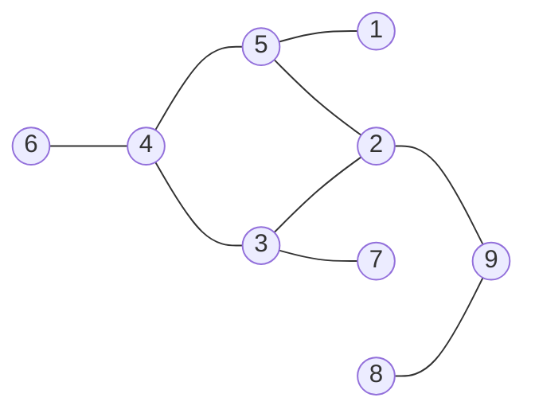

> $G = (V, E)$, ahol $V = \{1,2,3,4,5,6,7,8,9\}$
> $E = \{(1,5), (2,5), (2,3), (2,9), (3,7), (3,4), (4,5), (4,6), (8,9)\}$

##### Irányított gráf

Az élek halmazát alkotó csúcspárok rendezettek. Az $(A, B)$ él azt jelenti, hogy az él $A$-ból $B$-be mutat (olyan, mint egy egyirányú utca vagy egy internetes hivatkozás).

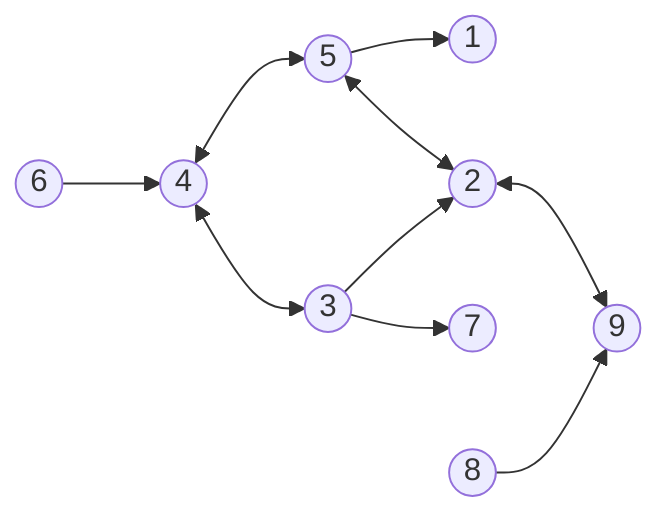

> $G = (V, E)$, ahol $V = \{1,2,3,4,5,6,7,8,9\}$, és az élek halmaza:
> $E = \{(2,3), (2,5), (2,9), (3,4), (3,2), (3,7), (4,3), (4,5), (5,2), (5,4), (5,1), (6,4), (8,9), (9,2)\}$

---

#### Gráfok ábrázolási és megadási módjai

##### Irányítatlan gráf reprezentációja

Vegyünk egy egyszerű példát (5 csúccsal):

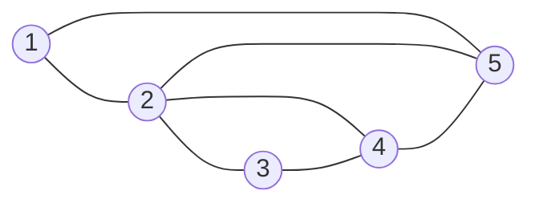

- **Szomszédsági lista:** Minden csúcshoz felsoroljuk a vele közvetlenül összekötött szomszédokat.
  - **1** $\rightarrow$ [2, 5]
  - **2** $\rightarrow$ [1, 3, 4, 5]
  - **3** $\rightarrow$ [2, 4]
  - **4** $\rightarrow$ [2, 3, 5]
  - **5** $\rightarrow$ [1, 2, 4]

- **Szomszédsági mátrix:** Egy $n \times n$-es mátrix, ahol az $i.$ sor $j.$ oszlopában $1$ szerepel, ha van él a két csúcs között, és $0$, ha nincs. _(Irányítatlan gráfnál a mátrix mindig szimmetrikus a főátlóra!)_

  | Csúcs |  1  |  2  |  3  |  4  |  5  |
  | :---: | :-: | :-: | :-: | :-: | :-: |
  | **1** |  0  |  1  |  0  |  0  |  1  |
  | **2** |  1  |  0  |  1  |  1  |  1  |
  | **3** |  0  |  1  |  0  |  1  |  0  |
  | **4** |  0  |  1  |  1  |  0  |  1  |
  | **5** |  1  |  1  |  0  |  1  |  0  |

##### Irányított gráf reprezentációja

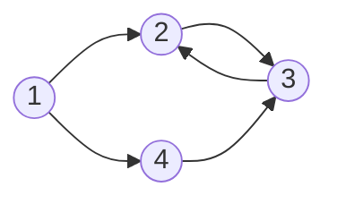

- **Szomszédsági lista:** Csak a kimenő (mutató) éleket soroljuk fel.
  - **1** $\rightarrow$ [2, 4]
  - **2** $\rightarrow$ [3]
  - **3** $\rightarrow$ [2]
  - **4** $\rightarrow$ [3]

- **Szomszédsági mátrix:** Nem szimmetrikus, az $1 \rightarrow 2$ él csak az 1. sor 2. oszlopában ad 1-est.

| Csúcs |  1  |  2  |  3  |  4  |
| :---: | :-: | :-: | :-: | :-: |
| **1** |  0  |  1  |  0  |  1  |
| **2** |  0  |  0  |  1  |  0  |
| **3** |  0  |  1  |  0  |  0  |
| **4** |  0  |  0  |  1  |  0  |

> **Mikor melyiket használjuk?**
>
> - **Szomszédsági lista:** Ritka gráfok esetén ajánlott ($|E| \ll |V|^2$). Könnyű végigmenni egy adott csúcs szomszédjain.
> - **Szomszédsági mátrix:** Sűrű gráfok esetén ajánlott ($|E| \approx |V|^2$). Azonnal ellenőrizhető, hogy vezet-e él két adott csúcs között.

---

#### Útvonalak és Összefüggőség

##### Útvonal fogalmak

- **Séta:** Csúcsok és élek váltakozó sorozata. Szabadon ismétlődhet benne csúcs is és él is. (Zárt séta: a kezdő- és végpontja megegyezik).
- **Vonal (Egyszerű séta):** Olyan séta, amelyben **egyetlen él sem ismétlődik** (de csúcsot érinthetünk többször is).
- **Út:** Olyan séta, amelyben **egyetlen csúcs sem ismétlődik** (ezáltal él sem ismétlődhet). Ennek hossza az útban szereplő élek száma.
- **Kör:** Zárt út. Olyan út, amelynek a kezdő- és végpontja megegyezik, de ezen kívül semelyik másik csúcsot nem érinti kétszer.

##### Különleges vonalak és körök (Euler-gráfok)

- **Euler-vonal:** Olyan séta, amely a gráf **minden élét pontosan egyszer** érinti. _(Feltétele: A gráf összefüggő, és pontosan 0 vagy 2 darab páratlan fokszámú csúcsa van)._
- **Euler-kör:** Olyan zárt séta, amely a gráf **minden élét pontosan egyszer** érinti (vagyis a kezdőpontba érkezik vissza). _(Feltétele: A gráf összefüggő, és **minden csúcsának fokszáma páros**)._

_(Megjegyzés: A minden csúcsot pontosan egyszer érintő utat Hamilton-útnak, a zárt változatát Hamilton-körnek nevezzük)._

##### Összefüggőség

- **Összefüggő gráf** (Irányítatlan): Bármely két csúcsa között létezik út. Nincsenek leszakadt, izolált részek.
- **Irányított gráfoknál:**
  - _Gyengén összefüggő:_ Ha az élirányokat figyelmen kívül hagyva (irányítatlanként tekintve rá) a gráf összefüggő.
  - _Erősen összefüggő:_ Ha bármelyik $A$ csúcsból el lehet jutni az összes többi csúcsba az élek irányát követve, és ez visszafelé is igaz.

---

#### Nevezetes gráfok (Típusok és Példák)

- **Egyszerű gráf:** Nincsenek benne hurokélek (önmagába visszatérő él) és többszörös élek (két csúcs között több azonos irányú él).

##### Páros gráf

A csúcshalmaz két diszjunkt halmazra ($A$ és $B$) osztható fel úgy, hogy minden él kizárólag egy $A$-beli és egy $B$-beli csúcsot köt össze. Halmazon belüli élek nincsenek. _(Jellemzője: nincsenek benne páratlan hosszúságú körök.)_

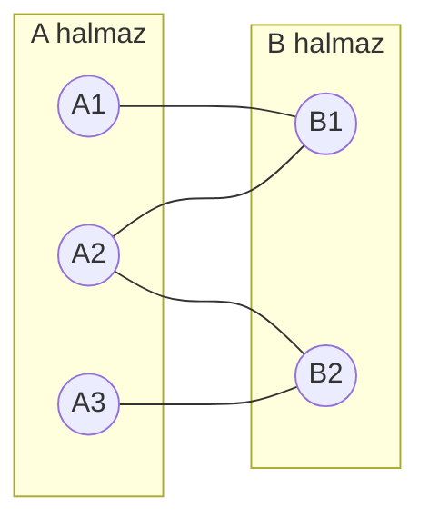

##### Teljes gráf

Olyan egyszerű gráf, amelynek **bármely** két csúcsa között pontosan egy él van (mindenki ismeri egymást). $n$ csúcs esetén a jelölése $K_n$, és éleinek száma:
$$|E| = \frac{n(n-1)}{2}$$

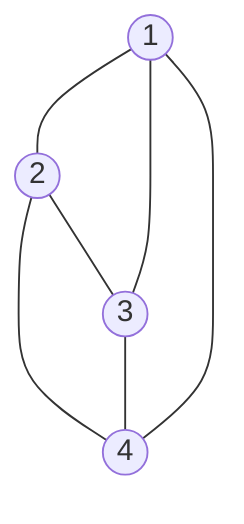

##### Fa

Olyan irányítatlan gráf, amely **összefüggő és körmentes**. Bármely két csúcsa között pontosan egyetlen út vezet. Az élek száma mindig pontosan eggyel kevesebb a csúcsok számánál: $|E| = |V| - 1$.

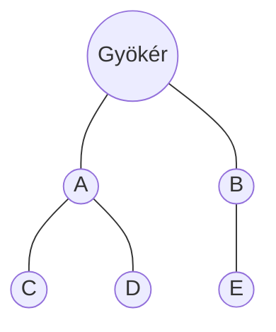

##### Körgráf

Olyan összefüggő gráf, amelyben minden csúcs fokszáma pontosan 2. Egyetlen nagy zárt láncot alkot.

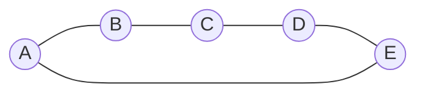

##### Súlyozott gráf

Minden élhez hozzá van rendelve egy érték (súly vagy költség). Ez az algoritmusokban gyakran távolságot, időt vagy hálózati kapacitást jelöl.

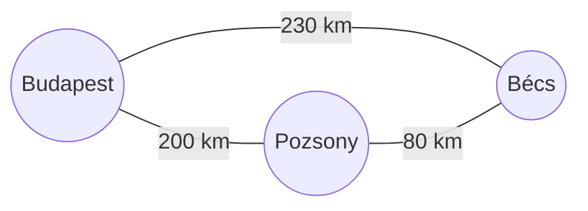

---

### 6.2. Determinisztikus és nemdeterminisztikus véges automaták, reguláris nyelvek. Környezetfüggetlen grammatikák és környezetfüggetlen nyelvek, veremautomaták.

#### Véges automaták (determinisztikus)

Egy determinisztikus véges automata (DFA) olyan matematikai modell, amely memóriával nem rendelkezik, csupán véges számú állapot között vált a bemenet alapján. Formálisan egy $M = (Q, \Sigma, q_0, A, \delta)$ ötös, ahol:

- $Q$: véges állapothalmaz (a gép lehetséges belső állapotai)
- $\Sigma$: véges bemeneti ábécé (az elfogadható szimbólumok halmaza, pl. $\{a, b\}$)
- $q_0$: $q_0 \in Q \Rightarrow$ kezdőállapot (innen indul a jelsorozat feldolgozása)
- $A$: $A \subseteq Q \Rightarrow$ végállapotok, azaz az elfogadó állapotok halmaza
- $\delta$: $Q \times \Sigma \rightarrow Q \Rightarrow$ állapot-átmenet függvény (megmondja, hogy egy adott állapotból egy adott betű beolvasása után pontosan melyik új állapotba lép a gép)

**Példa a működésre:**
_(A lenti automata pontosan azokat a szavakat fogadja el, amelyek "aa"-ra végződnek)._

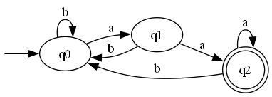

$M = (\{q_0, q_1, q_2\}, \{a, b\}, q_0, \{q_2\}, \delta)$, ahol az átmenetfüggvény ($\delta$) az ábra alapján a következőképpen alakul:

- $\delta(q_0, a) = q_1$
- $\delta(q_0, b) = q_0$
- $\delta(q_1, a) = q_2$
- $\delta(q_1, b) = q_0$
- $\delta(q_2, a) = q_2$
- $\delta(q_2, b) = q_0$

##### Kiterjesztett állapotátmenet függvény ($\delta^*$)

Míg a sima $\delta$ csak egyetlen karakter beolvasását írja le, a kiterjesztett változat ($\delta^*$) egy teljes szó sorozatos feldolgozását mutatja meg.
Példa: $\delta^*(q_0, abaa) = q_2$. Ez azt jelenti, hogy a $q_0$ kezdőállapotból indulva, az "abaa" szót karakterenként beolvasva a gép lépésről lépésre halad ($q_0 \xrightarrow{a} q_1 \xrightarrow{b} q_0 \xrightarrow{a} q_1 \xrightarrow{a} q_2$), és végül a $q_2$ állapotban áll meg.

##### Elfogadott szó

Az $M$ automata akkor fogad el egy adott $x$ szót, ha a szó legutolsó betűjének feldolgozása után a gép egy elfogadó állapotban áll meg.
Formálisan: $M$ elfogadja $x$-et, ha $\delta^*(q_0, x) \in A$.

##### Elfogadott nyelv

Az automata által elfogadott nyelv (jelölése $L(M)$) nem más, mint az összes olyan szó halmaza, amelyre a fenti feltétel igaz.
$$L(M) = \{x \in \Sigma^* \mid \delta^*(q_0, x) \in A\}$$

---

#### Szavak megkülönböztetése

**Definíció**: $x$ és $y$ szavak **megkülönböztethetőek** egy $L$ nyelvre nézve, ha létezik olyan $z$ szó, hogy:

- $xz \in L$ és $yz \notin L$
- **VAGY** $xz \notin L$ és $yz \in L$

_A $z$ szó egy olyan "utótag", amely kihozza a gép számára a különbséget $x$ és $y$ között. Ha az automata az $x$ és $y$ beolvasása után ugyanabba az állapotba kerülne, akkor nem tudná helyesen eldönteni, hogy a $z$ folytatás után elfogadja-e a kapott szót, vagy sem. Ebből logikusan következik, hogy $x$ és $y$ olvasása után a gépnek külön állapotban kell lennie._

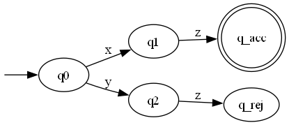

A megkülönböztethetőség alapján a szavakat úgynevezett **ekvivalenciaosztályokba** sorolhatjuk. Az egy osztályba tartozó szavak nem megkülönböztethetőek egymástól (az automata szempontjából "ugyanolyanok").

**Szabály**: Egy $L$ nyelvet elfogadó véges automatának pontosan annyi állapotra van szüksége, mint az $L$ szerinti megkülönböztethetőség ekvivalenciaosztályainak (azaz az egymástól megkülönböztethető szavak csoportjainak) száma.

##### Tétel a véges automaták korlátjáról

**Tétel**: Ha egy $L$ nyelvre nézve **végtelen sok** páronként $L$-megkülönböztethető szó van, akkor az $L$ nyelv semmilyen $M$ véges automatával nem fogadható el.

_Mivel minden egyes megkülönböztethető szóhoz – vagyis minden ekvivalenciaosztályhoz – az automatának egy külön állapotot kellene fenntartania, végtelen sok páronként megkülönböztethető szó esetén végtelen sok állapotra lenne szükség. Mivel az automata definíció szerint **véges**, ezt a feltételt lehetetlen teljesíteni._

---

#### Nemdeterminisztikus véges automata

**Alapkoncepció:** Egy determinisztikus automatánál minden állapothoz és bemeneti szimbólumhoz pontosan egy következő állapot tartozik. Ezzel szemben a nemdeterminisztikus automatánál a gép működése során elágazhat: ugyanarra a bemenetre többféleképpen is reagálhat, így egyetlen jelsorozat feldolgozása során párhuzamos útvonalakat járhat be. Ezen felül képes úgynevezett $\lambda$-átmenetekre (üres átmenetekre) is, amikor bemeneti szimbólum beolvasása nélkül is állapotot válthat.

**Formális definíció:**
A matematikai modell hasonló a determinisztikushoz: $M = (Q, \Sigma, q_0, A, \delta)$. A különbség a determinisztikus esethez képest az átmenetfüggvény ($\delta$) értelmezési tartományában és értékkészletében rejlik:
$$\delta: Q \times (\Sigma \cup \{\lambda\}) \rightarrow 2^Q$$

_(Magyarázat: Ez az összefüggés azt jelenti, hogy az automata egy adott állapotból egy szimbólum, vagy a $\lambda$ üres szó beolvasása után nem egyetlen fix állapotba kerül, hanem állapotok egy **halmazába** ($2^Q$ a hatványhalmazt jelöli). Ez a halmaz lehet üres (az útvonal elakad), állhat egy elemből, vagy tartalmazhat több állapotot is, ami az elágazásokat jelenti)._

---

##### A $\lambda$-lezárt ($E(S)$)

Mivel az automata bemenet olvasása nélkül is képes állapotot váltani a $\lambda$-átmeneteken keresztül, definiálnunk kell a $\lambda$-lezártat. Ez megadja az összes olyan állapotot, amely egy adott pontból kiindulva "ingyen", azaz bemenet fogyasztása nélkül elérhető.

**Definíció**: Legyen $S \subseteq Q$ egy állapothalmaz. Az $E(S)$ halmaz a következőket tartalmazza:

1. Magát a kiinduló halmazt: $S \subseteq E(S)$ (hiszen nulla lépéssel eleve ott vagyunk).
2. Minden olyan állapotot, amely az eddig megtalált $E(S)$-beli állapotokból pusztán $\lambda$-átmenetekkel elérhető. Formálisan: ha $q \in E(S)$, akkor $\delta(q, \lambda) \subseteq E(S)$.

---

##### Kiterjesztett állapotátmenet függvény ($\delta^*$)

Ez a függvény írja le az automata teljes működését egy $w$ szó beolvasása során. Megmutatja, hogy egy adott kezdőállapotból indulva, a szó végére pontosan mely lehetséges állapotokba juthat el a gép, figyelembe véve az összes lehetséges elágazást és üres átmenetet.

**Formális felépítése:**

- **Alapeset (üres szó)**: $\delta^*(q, \lambda) = E(\{q\})$
  _(Magyarázat: Ha a bemenet üres, a gép akkor is eljuthat azokra a helyekre, ahová a $\lambda$-átmenetek a kezdőpontból elvezetik)._
- **Lépés (egy $xa$ szóra, ahol $x$ a szó eleje, $a$ az utolsó betű)**: $\delta^*(q, xa) = E( \bigcup_{p \in \delta^*(q, x)} \delta(p, a) )$
  _(Magyarázat: Ahhoz, hogy megtudjuk, hol áll az automata a teljes szó elolvasása után, először megnézzük, milyen állapotokba jutott az '$x$' szakasz feldolgozásával. Ezekből a pontokból végrehajtjuk az '$a$' betűhöz tartozó összes lehetséges lépést, majd az így kapott új állapotokhoz hozzávesszük a belőlük nyíló $\lambda$-átmeneteket is)._

---

##### Szó és nyelv elfogadása

Az NFA működésének legfontosabb sajátossága az elfogadási feltétel: a sok lehetséges útvonal közül elegendő egyetlen sikeres ahhoz, hogy a gép elfogadja a bemenetet.

- **Elfogadott szó**: Egy $w$ szót az automata akkor fogad el, ha a beolvasás során bejárható párhuzamos útvonalak közül **létezik legalább egy olyan**, amely a folyamat végén elfogadó állapotba (végállapotba) fut ki. (A többi, zsákutcába jutó vagy elutasító állapotban végződő útvonal nem befolyásolja az elfogadást).
- **Elfogadott nyelv ($L(M)$)**: Azon $w$ szavak halmaza, amelyekre igaz a feltétel. Ezt halmazelméletileg így írjuk fel:
  $$L(M) = \{w \in \Sigma^* \mid \delta^*(q_0, w) \cap A \neq \emptyset\}$$

_(Magyarázat: Ez a formula azt fejezi ki, hogy a $q_0$ kezdőállapotból a $w$ szóval elérhető összes állapot halmazának ($\delta^*(q_0, w)$) és az elfogadó állapotok halmazának ($A$) a metszete nem üres. Tehát az elérhető állapotok között van legalább egy elfogadó állapot)._

---

##### Példa

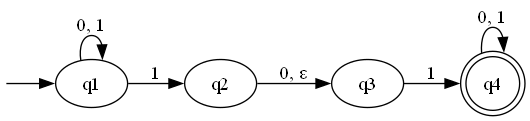

Két dolog teszi nemdeterminisztikussá:

1. **Több lehetőség ugyanarra a betűre**: A $q_1$ állapotban ha "1"-est olvasunk, a gép maradhat $q_1$-ben is, de átléphet $q_2$-be is.
2. **Üres átmenet**: A $q_2$ állapotból $q_3$-ba úgy is át lehet lépni, hogy nem olvasunk be semmit (ezt az ábra $\epsilon$-nal jelöli, ami pontosan ugyanazt jelenti, mint a definícióban szereplő $\lambda$).

#### Nemdeterminisztikusság kiküszöbölése

**Alaptétel**: Minden nemdeterminisztikus véges automatához készíthető egy vele ekvivalens determinisztikus véges automata, amely pontosan ugyanazt a nyelvet fogadja el.

Ezt az eljárást **részhalmaz-konstrukciónak** (vagy hatványhalmaz-konstrukciónak) nevezzük.

##### A működés lényege

- **Összevonás:** A determinisztikus véges automata egyetlen állapota a nemdeterminisztikus véges automata lehetséges állapotainak egy **halmazát** képviseli. Ha a nemdeterminisztikus gép egy betű hatására egyszerre több állapotba is léphetne (elágazna), akkor a determinisztikus gépben ezek az opciók egyetlen közös "makro-állapotba" olvadnak össze.
- **Kezdő- és végállapotok kezelése:**
  - A determinisztikus automata **kezdőpontja** a nemdeterminisztikus gép kezdőállapotából üres lépésekkel ($\lambda$-átmenetekkel) elérhető összes állapot halmaza.
  - A determinisztikus automatában minden olyan halmaz **végállapot (elfogadó)** lesz, amely tartalmaz _legalább egy_ eredeti nemdeterminisztikus végállapotot.
- **Az eljárás ára (Komplexitás):** Ha a nemdeterminisztikus automatának $n$ darab állapota van, a determinisztikus változatnak elméletileg maximum $2^n$ állapota lehet. Ez a gyakorlatban azt jelenti, hogy a nemdeterminisztikusság megszüntetése az állapotok számának **exponenciális növekedését** okozhatja.

---

#### Reguláris nyelvek és kifejezések

**Definíció**: Legyen $\Sigma$ egy tetszőleges véges ábécé. A $\Sigma$ ábécé feletti **reguláris nyelvek** halmazát (jelöljük $R$-rel) az alábbi induktív szabályok határozzák meg:

1. **Alaplépés (Bázis):**
   - $\emptyset \in R$ (az üres nyelv reguláris).
   - $\{a\} \in R$ minden $a \in \Sigma \cup \{\lambda\}$ esetén (minden egyetlen betűből álló nyelv, valamint az üres szót tartalmazó nyelv is reguláris).
2. **Induktív lépés (Zártság a reguláris műveletekre):** Ha $L_1 \in R$ és $L_2 \in R$ reguláris nyelvek, akkor az alábbi műveletek eredményei is regulárisak lesznek:
   - **Unió:** $L_1 \cup L_2 \in R$
   - **Konkatenáció (összefűzés):** $L_1 \cdot L_2 \in R$
   - **Kleene-csillag (iteráció/lezárás):** $L_1^* \in R$

##### Reguláris nyelvek és kifejezések kapcsolata (Példákkal)

| Reguláris nyelv                                    | Reguláris kifejezés                         | Példa / Jelentés                                                                                                                   |
| :------------------------------------------------------------------------------------------- | :------------------------------------------------------------------------------------ | :--------------------------------------------------------------------------------------------------------------------------------- |
| $\emptyset$                                        | $\emptyset$                                 | Üres nyelv (egyetlen szót sem tartalmaz)                                                                                           |
| $\lambda$                                          | $\lambda$                                   | Üres szó ($\lambda$)                                                                                                               |
| $\{a,b\}^*$                                        | $(a + b)^*$                                 | $\lambda, a, b, aa, bb, ab, aaa, bbb, aab, ...$  _(Az összes $a$ és $b$ betűből képezhető szó)_                                 |
| $\{aab\}^*\{a,ab\}$                                | $(aab)^*(a + ab)$                           | $a, ab, aaba, aabab, aabaaba, aabaabab, ...$  _(Tetszőleges számú "aab" után egy "a" vagy egy "ab" áll)_                        |
| $(\{aa,bb\} \cup \{ab,ba\}\{aa,bb\}^*\{ab,ba\})^*$ | $(aa + bb + (ab + ba)(aa + bb)^*(ab+ba))^*$ | $\lambda, aa, bb, aaaa, bbbb, aabb, abab, abba, ...$  _(Minden olyan szó, amelyben **páros darab $a$ és páros darab $b$** van)_ |

##### Megoldhatóság véges automatával

**Tétel**: Egy nyelv pontosan akkor reguláris, ha elfogadható valamilyen **véges automatával** (legyen az determinisztikus vagy nemdeterminisztikus véges automata).

Ez azt jelenti, hogy a reguláris kifejezésekkel leírható nyelvek és a véges automatákkal megoldható problémák köre **teljesen megegyezik**. A nyelvek felépítéséhez használt három alapvető **reguláris művelet**:

- **Unió ($\cup$ vagy $+$):** Logikai "VAGY" kapcsolat, az alternatív utak választását teszi lehetővé az automatában.
- **Konkatenáció ($\cdot$ vagy egymás mellé írás):** Szavak egymás után fűzése, az automatában ez egymás utáni állapotátmeneteket jelent.
- **Iteráció / Kleene-lezárás ($^*$):** Egy blokk tetszőleges számú (akár 0-szoros) ismétlése, ami az automaták szintjén a visszamutató éleknek és köröknek felel meg.

---

#### Pumpálási lemma reguláris nyelvekben

**Alapgondolat:** Ha egy véges automata által elfogadott szó "elég hosszú" (több betűből áll, mint ahány állapota az automatának összesen van), akkor a gép a szó feldolgozása során kénytelen legalább egy állapotot többször is felvenni. Ez egy kört (hurkot) hoz létre az automatában, amit ezután tetszőlegesen sokszor körbejárhatunk – ezt a folyamatot nevezzük **pumpálásnak**.

**A tétel formálisan:** Ha az $L \subseteq \Sigma^*$ nyelvet elfogadja egy $M$ véges automata, melynek állapotszáma $n = |Q|$, akkor minden olyan $x \in L$ szó, amelyre $|x| \geq n$, felírható $x = uvw$ alakban úgy, hogy teljesülnek az alábbi feltételek:

1. **$|uv| \leq n$**: A szó eleje (a bevezető szakasz és a pumpált rész együtt) nem lehet hosszabb, mint az automata állapotszáma.
2. **$|v| > 0$**: A középső, azaz a pumpálható rész nem lehet üres (tartalmaznia kell legalább egy betűt).
3. **Minden $i \geq 0$ esetén $uv^iw \in L$**: A $v$ részt tetszőleges számú alkalommal ismételhetjük (akár ki is hagyhatjuk, ha $i=0$), a kapott új szó továbbra is a nyelvben marad.

---

##### A lemma jelentősége és alkalmazása

A pumpálási lemma egy **szükséges, de nem elégséges feltétel** a reguláris nyelvekre nézve:

- **Ha NEM teljesül** a lemma egy nyelvre, akkor az a nyelv **biztosan nem reguláris** (lehetetlen hozzá véges automatát tervezni).
- **Ha teljesül** a lemma, abból még _nem_ következik egyértelműen, hogy a nyelv reguláris.

##### Véges automaták és reguláris kifejezések ekvivalenciája

A reguláris kifejezések formális nyelvtana és a véges automaták szerkezete között **teljes ekvivalencia (kölcsönös megfeleltetés)** áll fenn. A két világ között oda-vissza átjárás biztosított:

- **Reguláris kifejezés $\rightarrow$ Véges automata:** Bármilyen reguláris kifejezésből szisztematikus algoritmusok segítségével felépíthető egy olyan nemdeterminisztikus véges automata (majd abból részhalmaz-konstrukcióval determinisztikus), amely pontosan a kifejezés által leírt nyelvet fogadja el.
- **Véges automata $\rightarrow$ Reguláris kifejezés:** Bármely véges automatából kiindulva felírható egy egyenletrendszer a reguláris kifejezések nyelvi műveleteivel.

---

#### Generatív grammatika

**Alapelv**: A generatív grammatika egy olyan matematikai szabályrendszer, amely pontosan meghatározza, hogyan lehet egy adott formális nyelv összes helyes szavát (és csakis azokat) "legenerálni" vagy levezetni.

**Formálisan**: Egy grammatika egy $G = (N, \Sigma, S, P)$ matematikai négyes, ahol:

- **$N$ (Nemterminális ábécé)**: A segédszimbólumok vagy változók véges halmaza. Ezek az átmeneti betűk, amiket a levezetés során használunk, de a végső szóban már nem szerepelhetnek (általában nagybetűkkel jelöljük: $S, A, B$).
- **$\Sigma$ (Terminális ábécé)**: A tényleges nyelv ábécéje. Ezekből a betűkből állnak a kész szavak (általában kisbetűkkel vagy számokkal jelöljük: $a, b, 0, 1$). _Fontos: $N$ és $\Sigma$ halmazoknak nem lehet közös eleme!_
- **$S$ (Kezdőszimbólum)**: $S \in N$. Ebből az egyetlen speciális segédszimbólumból indul ki minden szó generálása.
- **$P$ (Helyettesítési szabályok / Produkciók)**: A szabályok véges halmaza, amelyek megmondják, mit mire lehet átírni. (Például: $S \rightarrow aSb$, vagy $S \rightarrow \lambda$, ahol $\lambda$ az üres szót jelöli).

##### Közvetlen levezethetőség

Adott egy $G$ grammatika. Azt mondjuk, hogy egy $u$ szó **közvetlenül levezethető** egy $v$ szóból (jelölése: $v \Rightarrow u$), ha a $v$ szóban találunk egy $\alpha$ részt, amit egy létező $\alpha \rightarrow \beta$ szabály alapján kicserélünk $\beta$-ra, és így kapjuk meg $u$-t.

- Képlettel: $v = v_1 \alpha v_2$ és $u = v_1 \beta v_2$. (Ahol $v_1$ és $v_2$ az érintetlenül hagyott környezet).

> **Példa a közvetlen levezethetőségre:**
> Legyen $v = aSb$.
> Alkalmazzuk az $S \rightarrow aSb$ szabályt (itt $\alpha = S$, $\beta = aSb$, $v_1 = a$, $v_2 = b$).
> Ekkor a kapott új szó: $u = aaSbb$.
> Tehát: $aSb \Rightarrow aaSbb$ (közvetlenül levezethető).

##### Levezetés (Lépések sorozata)

Szavak egy $w_1, w_2, \dots, w_n$ sorozatára azt mondjuk, hogy a **$w_n$ levezetése $w_1$-ből** (jelölése: $w_1 \Rightarrow^* w_n$), ha minden lépésben alkalmaztunk egy érvényes szabályt, azaz:
$$w_1 \Rightarrow w_2 \Rightarrow \dots \Rightarrow w_n$$
A csillag ($*$) azt jelenti: "levezethető 0 vagy több lépésben".

> **Példa a levezetésre:**
> Vezessük le az $aabb$ szót a kezdőszimbólumból ($S$)!
> Szabályok: $S \rightarrow aSb$, $S \rightarrow \lambda$
>
> 1. $S \Rightarrow aSb$
> 2. $aSb \Rightarrow aaSbb$
> 3. $aaSbb \Rightarrow aabb$
>
> A teljes sorozat: $S \Rightarrow aSb \Rightarrow aaSbb \Rightarrow aabb$.
> Röviden leírva: $S \Rightarrow^* aabb$ (Az $aabb$ levezethető $S$-ből).

##### A generált nyelv ($L(G)$)

Egy $G$ grammatika által generált nyelv azoknak, és **csak is azoknak** a szavaknak a halmaza, amelyek kizárólag terminális jelekből állnak (nincs bennük nagybetű), és levezethetőek a kezdőszimbólumból ($S$).
$$L(G) = \{w \in \Sigma^* \mid S \Rightarrow^* w\}$$

> **Példa a generált nyelvre:**
> Milyen nyelvet generál az előző gramatika?
>
> - Ha rögtön az $S \rightarrow \lambda$ szabályt alkalmazzuk: $S \Rightarrow \lambda$ (üres szó).
> - Ha egyszer az elsőt, majd a másodikat: $S \Rightarrow aSb \Rightarrow ab$.
> - Ha kétszer az elsőt, majd a másodikat: $S \Rightarrow aSb \Rightarrow aaSbb \Rightarrow aabb$.
>
> Látható, hogy ez a nyelv az $L(G) = \{a^n b^n \mid n \ge 0\}$ nyelv (ahol pontosan ugyanannyi $a$ van a szó elején, mint amennyi $b$ a szó végén).

---

#### Környezetfüggetlen grammatika

**Alapelv**: A környezetfüggetlen grammatikákban a helyettesítési szabályok bal oldalán mindig **egyetlen magányos nemterminális szimbólum** áll. Ez azt jelenti, hogy az adott változó átírása teljesen független attól, hogy mi áll körülötte a szóban.

**Formálisan**: Egy $G$ grammatika környezetfüggetlen, ha minden szabály alakja:
$$A \rightarrow \alpha$$
Ahol:

- $A \in N$ (egyetlen nemterminális szimbólum).
- $\alpha \in (N \cup \Sigma)^*$ (terminálisok és nemterminálisok tetszőleges sorozata, akár az üres szó ($\lambda$) is).

---

#### Reguláris grammatika

**Alapelv**: A reguláris grammatika a környezetfüggetlen grammatika egy szigorúbb, még korlátozottabb alkategóriája. Itt a szabályok jobb oldala csak nagyon kötött formát ölthet.

**Formálisan**: A $G$ környezetfüggetlen grammatika **reguláris**, ha minden levezetési szabálya kizárólag az alábbi három alak valamelyikét követi:

- $A \rightarrow aB$ (egy terminálist egy nemterminális követ)
- $A \rightarrow a$ (egyetlen terminális)
- $A \rightarrow \lambda$ (törlés / üres szó)

> **Tétel:**
> Egy $L \subset \Sigma^*$ nyelv **akkor és csak akkor reguláris** (azaz ismerhető fel véges automatával), ha generálható reguláris grammatikával.
> $$L \text{ reguláris} \iff \exists G \text{ reguláris grammatika}, \text{ hogy } L = L(G)$$

##### Kifejezőerő: Miért van szükség a környezetfüggetlenre?

A környezetfüggetlen grammatikák jóval nagyobb kifejezőerővel bírnak, mint a regulárisok. Segítségükkel olyan nyelvek is leírhatók, amelyeket véges automatákkal (reguláris kifejezésekkel) **lehetetlen** lenne megadni. Ilyen például a korábban látott $L = \{a^n b^n \mid n \ge 0\}$ beágyazott nyelv is, amelyhez "memóriára" (egy veremre) van szükség a nyitó és záró karakterek számolásához.

---

#### Grammatika egyértelműsége

**Alapelv**: Egy nyelv szavait többféleképpen is le lehet vezetni. Egy grammatikát akkor nevezünk **nem egyértelműnek**, ha létezik a nyelvben legalább egy olyan szó, amelyhez **több, lényegesen különböző levezetési fa** (szintaxisfa) tartozik.

_Fontos: Nem az számít, hogy a szabályokat milyen sorrendben alkalmazzuk, hanem az, hogy a végső strukturális fa megváltozik-e._

> **Példa a nem egyértelműségre:**
> Tekintsük az alábbi szabályrendszert:
>
> - $S \rightarrow SA \mid AB \mid 1$
> - $A \rightarrow BS \mid 1$
> - $B \rightarrow SA \mid 1$
>
> Mutassuk meg, hogy az `1111` szó nem egyértelműen vezethető le! Mivel az `1111` szóhoz két szerkezetileg eltérő fát is fel tudunk rajzolni, a grammatika **nem egyértelmű**.

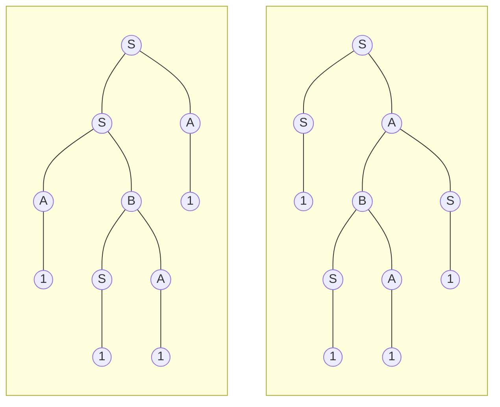

---

#### Chomsky-féle normálforma

Egy grammatika Chomsky normálformábanvan, ha csak $A \rightarrow BC$ és $A \rightarrow a$ alakú szabályokat tartalmaz.

Minden grammatikában létezik normálforma, csak törlőszabály nélküli. Ez azért jó, mert a CYK (Cocke-Younger-Kasami) algoritmus meg tudja állapíani egy chomsky normálformában lévő $G$ generálható-e egy bármely $w$ szó.

**Példa**: $G = (\{S, A, B\}, \{0, 1\}, S, H)$, ahol $H$ szabályai:

- $S \rightarrow SA \mid AB \mid 1$
- $A \rightarrow BS \mid 1$
- $B \rightarrow SA \mid 0$

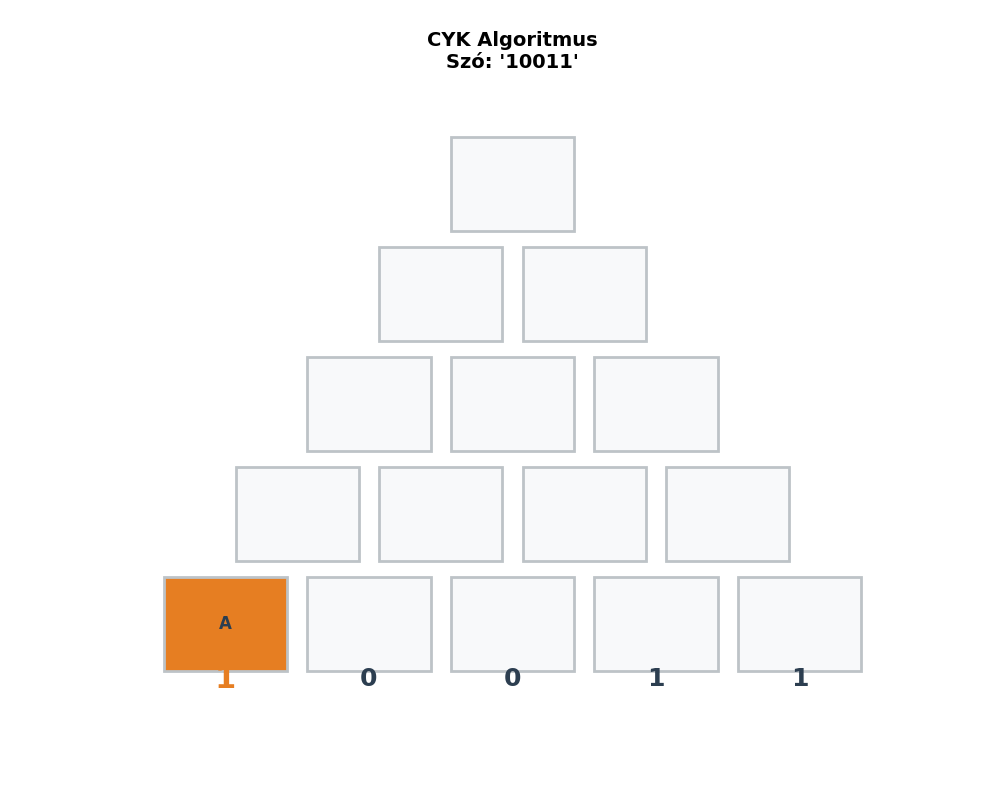

---

#### Pumpálási lemma környezetfüggetlenség bizonyítására

Ugyanaz, csak 5 részre osztjuk és 2 pumpálható rész van.

Ha $L$ környezetfüggelen akkor létezik $p$, hogy ha $s \in L$ és $|s|>p$, akkor $s$ felírható $s=uvxyz$ alakba, ahol

1. $|vxy| \leq p$
2. $|vy| > 0$
3. $uv^ixy^iz \in L$ minden $i \geq 0-ra$

---

#### Veremautomaták

Véges automatákkal csak reguláris környezetfüggetlen grammatikát tudunk elfogadni, ezzel szemben veremautomatákkal nem reguláris nyelv is elfogadható.

Veremautomata $M=(Q, \Sigma, \Gamma, q_0, z_0, \delta, F)$ (memóriája verem)

- $Q$ - állapothalmaz
- $\Sigma$ - bemeneti ábécé
- $\Gamma$ - veremábécé
- $q_0 \in Q$ - kezdőállapot
- $z_0 \in \Gamma$ - kezdeti veremtartalom
- $\delta$ - állapot-átmenet függvény
- $F \subseteq Q$ - végállapotok halmaza

Például: $L = \{a^nb^n \mid n \geq 1\}$

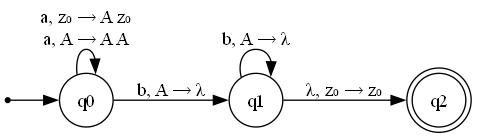

$aabb$ szó elfogadása:
| Lépés | Állapot | Hátralévő szó | Verem |
|-|-------|---------|-------|
| 0. | $q_0$ | $aabb$ | $z_0$ |
| 1. | $q_0$ | $abb$ | $Az_0$ |
| 2. | $q_0$ | $bb$ | $AAz_0$ |
| 3. | $q_1$ | $b$ | $Az_0$ |
| 4. | $q_1$ | $\lambda$ | $z_0$ |
| 5. | $q_2$ | $\lambda$ | $z_0$ |

##### Nemdeterminisztikus veremautomata

Általában nem igaz, hogy minden környezetfüggetlen nyelvekre lehet determinisztikus veremautomatát konstruálni.

---

#### Előrenézés

**Alapelv**: A determinisztikus veremautomaták képezik a modern programozási nyelvek fordítóprogramjainak alapját. A környezetfüggetlen grammatikák feldolgozása során az elemző balról jobbra olvassa a bemeneti szimbólumokat.

**A probléma**: "Vak" (előrenézés nélküli) elemzés esetén a gép gyakran nemdeterminisztikus döntési helyzetekbe kerülne. Ilyenkor tippelnie kellene a lehetséges folytatások között, hibás tipp esetén pedig vissza kellene lépnie (backtracking), ami rendkívül lassúvá és memóriapazarlóvá tenné az elemzést.

**A megoldás**: Az előrenézés azt jelenti, hogy az automata a döntés meghozatala előtt előrenéz a bemeneti szalagon a következő $k$ darab beolvasatlan szimbólumra. Ez az extra információ (jellemzően $k=1$) feloldja a kétértelműséget, és biztosítja a determinisztikus, lineáris idejű ($O(n)$) végrehajtást.

A verem és az előrenézés kezelése alapján két fő elemzői (parser) kategóriát különböztetünk meg:

##### LL(k) Elemzés (Felülről lefelé / Top-Down)

Az LL elemzők a kezdőszimbólumból indulnak ki, és a levezetési fát a gyökértől a levelek felé építik fel. A veremben a még kifejtésre váró nemterminálisok (szabályok bal oldalai) helyezkednek el.

- **A konfliktus jellege:** _Melyik szabállyal bontsam ki a verem tetején lévő nemterminálist?_
- **Példa a feloldásra:**
  Adott egy egyszerűsített programozási nyelvtan az utasításokra:
  1. $S \rightarrow \text{id} = E$ _(Értékadás, pl. `x = 5`)_
  2. $S \rightarrow \text{id} ( E )$ _(Függvényhívás, pl. `f(5)`)_

  _Szituáció:_ A verem tetején az $S$ áll. A jelenleg olvasott bemeneti token az `id` (változónév).
  _Előrenézés nélkül:_ Mindkét szabály `id`-val kezdődik, így a gép nem tudja eldönteni, hogy értékadás vagy függvényhívás következik-e.
  _Előrenézéssel (k=1):_ Az automata megvizsgálja az `id` utáni következő tokent. Ha ez egy egyenlőségjel (`=`), akkor determinisztikusan az 1. szabályt választja. Ha nyitó zárójel (`(`), akkor a 2. szabályt.

##### LR(k) Elemzés (Alulról felfelé / Bottom-Up)

Az LR elemzők a nyers bemeneti szimbólumokból indulnak ki, és azokat vonják össze (redukálják) egyre nagyobb struktúrákká, amíg el nem érik a kezdőszimbólumot. Sokkal nagyobb kifejezőerővel bírnak, mint az LL elemzők.

- **A konfliktus jellege:** A gép folyamatosan karaktereket tol a verembe (**Shift**). Ha a verem tetején felismer egy szabály-jobboldalt, azt lecserélheti a hozzá tartozó bal oldalra. A fő kérdés a **Shift-Reduce konfliktus**: _További karaktereket olvassak be a verembe, vagy a meglévőket már vonjam össze?_
- **Példa a feloldásra:**
  Adott egy matematikai kifejezéseket leíró nyelvtan:
  1. $E \rightarrow E + E$
  2. $E \rightarrow E \times E$
  3. $E \rightarrow \text{id}$

  _Szituáció:_ A teljes bemenet `id + id * id`. Az eddigi lépések során az automata az első `id + id` részt már feldolgozta, így a veremben jelenleg az `E + E` struktúra található. A következő (még beolvasatlan) karakter a szorzásjel (`*`).
  _Előrenézés nélkül:_ A gép felismeri az `E + E` mintát a verem tetején. Azonnal redukálhatná egyetlen $E$-vé, de ez szemantikailag hibás fát eredményezne.
  _Előrenézéssel (k=1):_ Az automata előrenéz, és látja a `*` operátort. Mivel a szorzás precedenciája magasabb, mint az összeadásé, a gép tudja, hogy az összeadást még **nem szabad végrehajtania**. Ehelyett a léptetést választja: betolja a `*`-ot a verembe, hogy a szorzás operandusait egy szorosabb egységbe tudja vonni a fában, biztosítva a matematikailag helyes kiértékelést.
