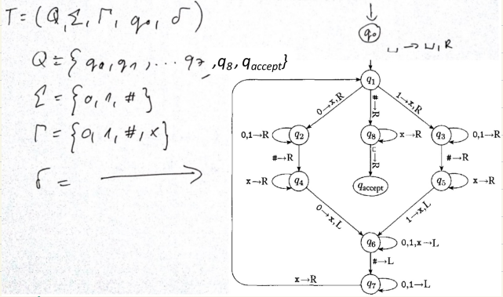
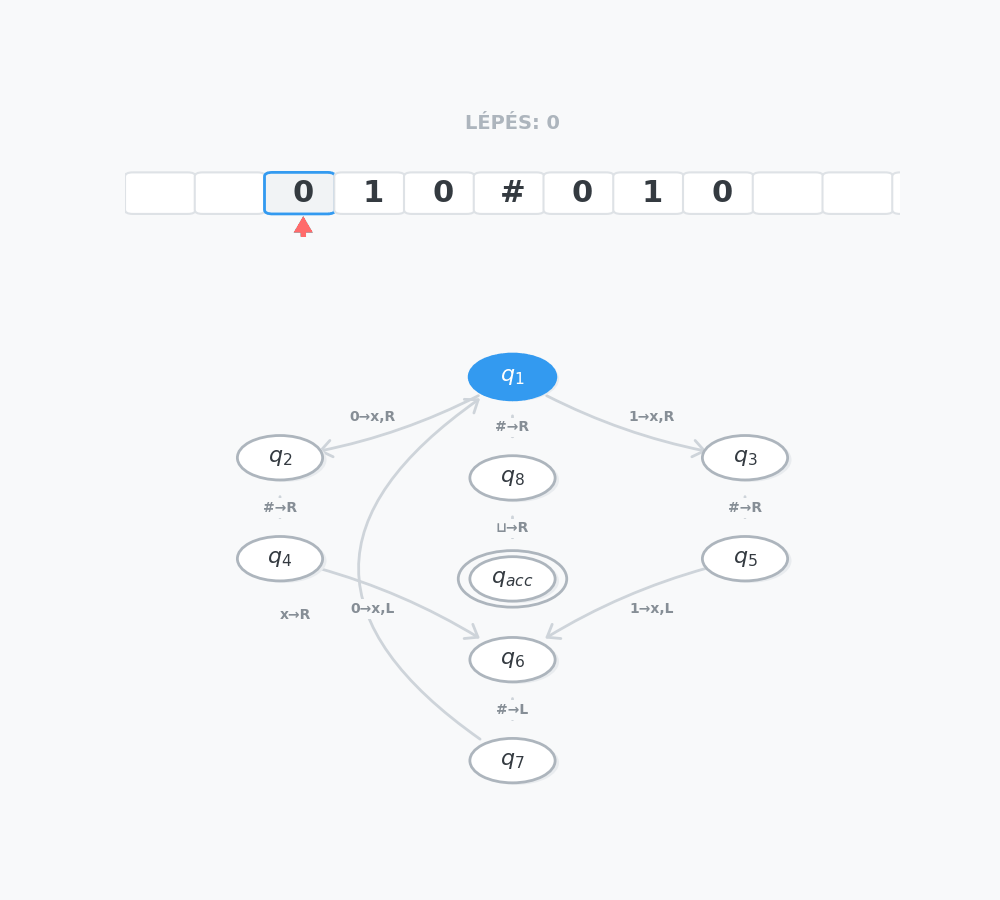

[⬅ Vissza a főoldalra](../../zarovizsga.md)

## 7. tétel

### 7.1. Lineáris egyenletrendszer fogalma és megoldása Gauss eliminációval.

#### Lineáris egyenletrendszer fogalma

Az

$$
\begin{aligned}
a_{11}x_1 + a_{12}x_2 + \dots + a_{1n}x_n &= b_1 \\
a_{21}x_1 + a_{22}x_2 + \dots + a_{2n}x_n &= b_1 \\
\vdots \qquad \qquad \qquad \qquad \vdots \\
a_{m1}x_1 + a_{m2}x_2 + \dots + a_{mn}x_n &= b_m
\end{aligned}
$$

alakú egyelnetrendszert, ahol az $a_{ij} (i \in \{1, \dots, m\}, j \in \{1, \dots, n\})$ számok ismertek, $x_1, \dots, x_n$ ismeretlenek, lineáris egyenletrendszernek nevezzük.

- $a_{ij}$: az egyenletrendszer együtthatói
- $b_k$: szabad tagok, vagy konstansok

##### Mátrix alapú

Az egyenletrendszer alapmátrixa, illetve kibővített mátrixa:

$$
A = \begin{bmatrix}a_{11} & \dots & a_{1n} \\
a_{21} & \dots & a_{2n} \\ \vdots &  & \vdots \\ a_{m1} & \dots & a_{mn}\end{bmatrix} \qquad \text{és } \qquad (A | b) = \left[ \begin{array}{ccc|c}
a_{11} & \dots & a_{1n} & b_1 \\
a_{21} & \dots & a_{2n} & b_2 \\
\vdots &       & \vdots & \vdots \\
a_{m1} & \dots & a_{mn} & b_m
\end{array} \right]
$$

Az egyenletrendszer jobboldali vektora és ismeretlen vektora

$$b = \begin{bmatrix}b_1 \\ b_2 \\ \vdots \\ b_m\end{bmatrix} \in \R^m \qquad \text{és} \qquad x = \begin{bmatrix}x_1 \\ x_2 \\ \vdots \\ x_n\end{bmatrix} \in \R^n$$

A lineáris egyenletrendszer mátrixos alakja: $Ax = b$

#### Lineáris egyenletrendszerek megoldhatósága

**Alapelv**: Egy lineáris egyenletrendszer megoldható, ha létezik legalább egy olyan $x$ vektor, amely kielégíti az egyenletet.

**A megoldások száma alapján egy egyenletrendszer háromféle lehet:**

- **Határozott**: Pontosan $1$ megoldása van.
- **Határozatlan**: Végtelen sok megoldása van.
- **Ellentmondásos**: Nem létezik (nincs) megoldása.

##### Vektortér-szemlélet (Oszlopvektorok szerinti megközelítés)

Egy lineáris egyenletrendszer pontosan akkor oldható meg, ha a $b$ vektor (az eredményvektor) előállítható az $A$ mátrix oszlopvektorainak lineáris kombinációjaként. Más szóval: a $b$ vektor benne van az $A$ oszlopvektorai által felfeszített térben.

- **Egyértelmű előállítás (Határozott rendszer)**: Ha az $A$ mátrix oszlopvektorai _lineárisan függetlenek_, akkor a $b$ vektor pontosan egyféleképpen állítható elő, így az egyenletrendszernek pontosan $1$ megoldása van.
- **Többféle előállítás (Határozatlan rendszer)**: Ha az $A$ mátrix oszlopvektorai _lineárisan függőek_, akkor a $b$ vektor előállítása nem egyértelmű, így a rendszernek végtelen sok megoldása van.

---

#### Mátrix rangja

**Definíció**: Egy mátrix rangja alatt a benne lévő **lineárisan független** sor- vagy oszlopvektorok maximális számát értjük.
_(Fontos matematikai tétel, hogy egy mátrix sorrangja és oszloprangja mindig megegyezik, így egyszerűen csak a mátrix rangjáról beszélünk)._

---

#### Rangkritérium

**Alapelv**: Ez a tétel adja meg a legbiztosabb módszert egy egyenletrendszer megoldhatóságának vizsgálatára. A tételben szereplő $(A | b)$ az úgynevezett **kibővített mátrix**, amelyet úgy kapunk, hogy az $A$ alapmátrix mellé utolsó oszlopként odaírjuk a $b$ eredményvektort.

Egy lineáris egyenletrendszer pontosan akkor oldható meg, ha az alapmátrix rangja megegyezik a kibővített mátrix rangjával:
$$\text{Rang}(A) = \text{Rang}(A | b)$$

_(Szemléletes magyarázat: Ha a rang nem nő meg a $b$ vektor hozzáadásával, az pontosan azt jelenti, hogy a $b$ vektor nem hoz be új dimenziót, azaz benne van az eredeti oszlopvektorok által felfeszített térben)._

**Döntési eljárás (legyen $n$ az ismeretlenek száma):**

1.  **Nincs megoldás (Ellentmondás)**:
    Ha a kibővített mátrix rangja nagyobb, mint az alapmátrixé.
    $$\text{Rang}(A) \neq \text{Rang}(A | b)$$
2.  **Pontosan $1$ megoldás (Határozott)**:
    Ha a két rang megegyezik, és maximális (egyenlő az ismeretlenek számával).
    $$\text{Rang}(A) = \text{Rang}(A | b) = n$$
3.  **Végtelen sok megoldás (Határozatlan)**:
    Ha a két rang megegyezik, de nem maximális (kisebb, mint az ismeretlenek száma).
    $$\text{Rang}(A) = \text{Rang}(A | b) < n$$

#### Lineáris egyenletrendszer megoldáshalmaza

Egy lineáris egyenletrendszert a $b$ vektor értéke alapján két fő kategóriába sorolhatunk: **homogén** és **inhomogén** rendszerekre.

##### Homogén lineáris egyenletrendszer ($Ax = 0$)

**Definíció**: Egy lineáris egyenletrendszer homogén, ha a $b$ vektor minden eleme nulla ($b = 0$). Mátrixos alakja: $Ax = 0$.

**A triviális megoldás:**
Egy homogén egyenletrendszernek **sosem ellentmondásos**. A nullvektor mindig megoldása a rendszernek, hiszen bármilyen $A$ mátrixot szorzunk nullvektorral, az eredmény nullvektor lesz. Ezt nevezzük **triviális megoldásnak**.

**Mikor van a triviálistól különböző megoldása?**
Egy homogén rendszernek pontosan akkor van a csupa nullától eltérő (nem triviális) megoldása, ha az $A$ mátrix oszlopvektorai **lineárisan függőek**. Ilyenkor végtelen sok megoldás létezik.

**A megoldástér (Alterek):**
Ha egy valós együtthatós homogén rendszernek végtelen sok megoldása van, akkor ezek a megoldásvektorok egy úgynevezett **megoldásteret** (egy alteret) alkotnak az $\mathbb{R}^n$ térben (ahol $n$ az ismeretlenek száma).

- **Dimenzió-tétel**: Ennek a megoldástérnek a dimenziója: $d = n - \text{Rang}(A)$.
  _(Ez a dimenziószám mutatja meg, hogy hány darab szabad paramétert (pl. $t_1, t_2$) kell bevezetnünk a végtelen sok megoldás felírásához)._

##### Inhomogén lineáris egyenletrendszer ($Ax = b$)

**Definíció**: Egy lineáris egyenletrendszer inhomogén, ha a $b$ vektor nem a nullvektor (van benne legalább egy nem nulla elem).

**A megoldáshalmaz szerkezete:**
Ha egy inhomogén $Ax = b$ rendszer megoldható, akkor a megoldások szerkezete mindig felírható az alábbi összegként:
$$x = x^* + y$$

A képlet elemei:

- $x^*$: Az inhomogén rendszer egyetlen, tetszőlegesen rögzített megoldása.
- $y$: Az inhomogén rendszerhez tartozó (az abból származtatott) $Ax = 0$ **homogén rendszer** összes lehetséges (általános) megoldása.

> **Példa az $x = x^* + y$ felbontásra**
>
> Adott az alábbi inhomogén egyenletrendszer (2 egyenlet, 3 ismeretlen):
>
> 1. $x_1 + x_2 + x_3 = 3$
> 2. $x_1 - x_2 = 1$
>
> **1. Lépés: Partikuláris megoldás ($x^*$)**
> Keressünk egyetlen tetszőleges számhármast, ami igazzá teszi mindkét egyenletet!
> Látjuk, hogy a 2. egyenletben a különbség 1. Legyen $x_1 = 1$ és $x_2 = 0$.
> Ezt behelyettesítve az 1. egyenletbe: $1 + 0 + x_3 = 3 \implies x_3 = 2$.
> Egy lehetséges kezdőpont tehát:
> $$x^* = \begin{bmatrix} 1 \\ 0 \\ 2 \end{bmatrix}$$
>
> **2. Lépés: Homogén megoldás ($y$)**
> Nullázzuk le az egyenletek jobb oldalát ($Ax = 0$), és oldjuk meg így is:
>
> 1. $x_1 + x_2 + x_3 = 0$
> 2. $x_1 - x_2 = 0 \implies x_1 = x_2$
>
> Mivel végtelen sok megoldás van, bevezetünk egy $t$ szabad paramétert.
> Legyen $x_2 = t$. Ekkor $x_1 = t$ is igaz.
> Helyettesítsük be az 1. egyenletbe: $t + t + x_3 = 0 \implies x_3 = -2t$.
> A homogén rendszer általános megoldása:
> $$y = \begin{bmatrix} t \\ t \\ -2t \end{bmatrix} = t \cdot \begin{bmatrix} 1 \\ 1 \\ -2 \end {bmatrix}$$
>
> **3. Lépés: A teljes megoldáshalmaz ($x = x^* + y$)**
> A tétel alapján a teljes megoldáshalmazt a rögzített kezdőpont és a homogén irányvektor összege > adja meg:
> $$x = \begin{bmatrix} 1 \\ 0 \\ 2 \end{bmatrix} + t \cdot \begin{bmatrix} 1 \\ 1 \\ -2 \end {bmatrix}$$
> _(Ahol $t \in \mathbb{R}$ bármilyen tetszőleges valós szám)._

#### Egyenletrendszer megoldása Gauss-eliminációval

**Alapelv**: Az ekvivalens átalakítások nem változtatják meg a lineáris egyenletrendszer megoldáshalmazát. A cél, hogy ezekkel a lépésekkel a kibővített mátrixban a főátló alatti elemeket kinullázzuk (felső háromszögmátrixot, azaz lépcsős alakot kapjunk).

**Megengedett átalakítások:**

- Egyenlet (sor) szorzása nem nulla skalárral.
- Egy egyenlethez (sorhoz) hozzáadni egy másik egyenlet skalárszorosát.
- Egyenletek (sorok) sorrendjének megváltoztatása.
- Elhagyni olyan egyenletet, amely egy másik egyenlet skalárszorosa (vagy csupa nulla).
- Ismeretlenek felcserélése együtthatóikkal együtt minden egyenletben (ez az alapmátrixban oszlopcserét jelent, de figyelni kell a változók sorrendjének adminisztrálására!).

##### Megoldás leolvasása a lépcsős alakból

A kinullázás után visszahelyettesítéssel adódnak a megoldások.

- **Ellentmondás (nincs megoldás)**: Ha van olyan sor, ahol a bal oldal csupa nulla, de a jobb oldal nem nulla ($0 \dots 0 | c$, ahol $c \neq 0$).
- **Határozott (1 megoldás)**: Ha az eljárás végén $n$ darab (az ismeretlenek számával megegyező) nem csupa nulla sor marad.
- **Határozatlan (végtelen sok megoldás)**: Ha az eljárás végén kevesebb mint $n$ darab nem csupa nulla sor marad (és nincs ellentmondás).

> **Példa Gauss-eliminációra:**
> $$\begin{bmatrix}2&1&-1\\-4&4&1\\-2&5&2\end{bmatrix} \xrightarrow{\text{II}+2\cdot\text{I}} \begin{bmatrix}2&1&-1\\0&6&-1\\-2&5&2\end{bmatrix} \xrightarrow{\text{III}+\text{I}} \begin{bmatrix}2&1&-1\\0&6&-1\\0&6&1\end{bmatrix} \xrightarrow{\text{III}-\text{II}} \begin{bmatrix}2&1&-1\\0&6&-1\\0&0&2\end{bmatrix}$$

##### Mátrix rangja és Determinánsa Gauss-eliminációval

A Gauss-elimináció lépcsős alakja sok mindent elárul a mátrixról.

**1. Mátrix rangja:**
A mátrix rangját a Gauss-elimináció végén kapott **nem csupa nulla sorok száma** adja meg.
A mátrix rangját **nem** változtatja meg:

- Sor szorzása nem nulla skalárral.
- Egy sorhoz hozzáadni egy másik sor skalárszorosát.
- Sorok sorrendjének felcserélése.

**2. Mátrix determinánsa:**
Négyzetes mátrixok esetén, ha eljutottunk a felső háromszögmátrix (lépcsős) alakig, a determináns egyszerűen a **főátlóban lévő elemek szorzata**.
Hogyan változik a determináns az átalakítások során?

- **Nem változik**: Ha egy sorához hozzáadjuk egy másik sor skalárszorosát (ez a leggyakoribb lépés).
- **$(-1)$-szeresére változik**: Ha két sort megcserélünk egymással (minden sorcsere megfordítja az előjelet).
- **$c$-szeresére változik**: Ha egy sort megszorzunk egy $c$ konstanssal (ezt észben kell tartani a végeredménynél).

##### Mátrix inverze és Műveletigény

**Mátrix inverzének kiszámítása (Gauss-Jordan elimináció):**
Legyen $A \in \mathbb{R}^{n \times n}$ egy invertálható mátrix, inverze $X$ (azaz $A^{-1}$). Az inverz meghatározása valójában $n$ darab szimultán lineáris egyenletrendszer megoldását jelenti. Az $(A | E)$ mátrixból indulunk (ahol $E$ az egységmátrix), és addig végezzük a Gauss-eliminációt (felfelé is kinullázva az elemeket és a főátlót 1-re normálva), amíg a bal oldalon meg nem kapjuk az egységmátrixot:
$$(A | E) \rightarrow \dots \rightarrow (E | A^{-1})$$

**A Gauss-elimináció műveletigénye (Aszimptotikus komplexitás):**

- Az $A$ alapmátrix felső háromszögalakra hozása: $\approx \frac{n^3}{3} + \mathcal{O}(n^2)$ lebegőpontos művelet.
- A $b$ vektor átalakítása és a visszahelyettesítés: $\approx n^2$ művelet.

#### Mátrixfelbontások

##### 1. LU-felbontás (Lower-Upper)

Sorcsere nélküli Gauss-elimináció, amely egy $A$ mátrixot egy alsó ($L$) és egy felső ($U$) háromszögmátrix szorzatára bontja: **$A = L \cdot U$**.

- **Tárigény előnye**: Mivel a Gauss-elimináció során az $U$ mátrix alatt csupa nulla keletkezik ("felesleges információ"), ebbe az üresen maradó alsó háromszögbe letárolhatjuk azokat a szorzókat ($l_{ij}$), amelyekkel a kinullázást végeztük. Ebből azonnal megkapjuk az $L$ mátrixot (amelynek főátlója csupa 1).
- **Mire jó?**: Ha az $Ax = b$ egyenletet sok különböző $b$ vektorra kell megoldani, de az $A$ mátrix fix. Az $Ax = b \Rightarrow LUx = b$ helyettesítéssel a feladat két gyors visszahelyettesítésre (egy $Ly = b$ és egy $Ux = y$) bomlik. Az LU-felbontást csak egyszer, az elején kell elvégezni.

> **Példa LU-felbontásra:**
> $$\begin{bmatrix}-2&-1&4\\2&3&-1\\-4&-10&-5\end{bmatrix} \xrightarrow{\begin{aligned}l_{21}=-1 \\ l_{31}=2\end{aligned}} \begin{bmatrix}-2&-1&4\\0&2&3\\0&-8&-13\end{bmatrix} \xrightarrow{l_{32}=-4} \begin{bmatrix}-2&-1&4\\0&2&3\\0&0&-1\end{bmatrix} = U$$
> A kinullázó szorzókból ($l_{ij}$) felépítjük az $L$ mátrixot (főátlóban 1-esekkel):
>
> $L = \begin{bmatrix}1&0&0\\-1&1&0\\2&-4&1\end{bmatrix} \quad \text{és} \quad U = \begin{bmatrix}-2&-1&4\\0&2&3\\0&0&-1\end{bmatrix}$

##### 2. PLU-felbontás (Permutációs LU)

A sima LU-felbontás elakad, ha a Gauss-elimináció során egy főátlóbeli elem (a generáló elem / pivot) pontosan $0$ lesz, mert nullával nem tudunk osztani. Ilyenkor sorcserére van szükség. Ezt kezeli a $P$ (Permutációs) mátrix.

- A felbontás alakja: **$P \cdot A = L \cdot U$** (Ahol $P$ az egységmátrix sorcserélt változata, ami nyilvántartja, hogyan cseréltük meg az eredeti $A$ mátrix sorait).

##### 3. Cholesky-felbontás

A Cholesky-felbontás az LU-felbontás egy speciális, rendkívül hatékony esete, amit **csak szimmetrikus, pozitív definit mátrixoknál** lehet alkalmazni.

- **A felbontás alakja**: Mivel a mátrix szimmetrikus, nincs szükség külön $U$ mátrixra. Az $A$ mátrix felírható egy $L$ alsó háromszögmátrix és annak transzponáltjának szorzataként:
  **$A = L \cdot L^T$**
- **Előnyei**:
  1.  **Memóriatakarékos**: Csak az $L$ mátrixot kell kiszámolni és eltárolni.
  2.  **Gyors**: A műveletigénye a Gauss/LU-felbontásnak pontosan a fele (kb. $\frac{n^3}{6}$).
  3.  **Numerikusan stabil**: Matematikai okokból sosem kell sorcserét alkalmazni (nincs szükség $P$ mátrixra).

> **Példa Cholesky-felbontásra:**
> Adott a szimmetrikus $A$ mátrix. Olyan $L$ mátrixot keresünk, amelyre $A = L \cdot L^T$:
> $$A = \begin{bmatrix} 4 & 12 & -16 \\ 12 & 37 & -43 \\ -16 & -43 & 98 \end{bmatrix} \quad \Rightarrow \quad L = \begin{bmatrix} 2 & 0 & 0 \\ 6 & 1 & 0 \\ -8 & 5 & 3 \end{bmatrix}$$
> _(Ellenőrzésképp: Az $L$ mátrix első sorát önmagával skalárisan szorozva: $2\cdot2 = 4$, ami pont $A_{11}$. A második sort az elsővel szorozva $6\cdot2 = 12$, ami pont $A_{21}$, és így tovább az explicit képletek alapján).\_

---

### 7.2. Turing-gépek, algoritmikus eldönthetőség, eldönthetetlen problémák, rekurzív és rekurzívan felsorolható nyelvek. Generatív grammatikák és nevezetes nyelvosztályok, a Chomsky hierarchia.

#### A Turing-gép

**Az alapkoncepció**:
A Turing-gép egy absztrakt matematikai modell. Egy olyan elméleti számítógépként fogható fel, amelynek nincs hagyományos memóriája, helyette egy **végtelenül hosszú, cellákra osztott szalagot** használ az adatok tárolására. Ezen a szalagon mozog egy olvasó/író fej balra vagy jobbra. A gép mindig csak egyetlen cellát lát. A belső állapotától és az éppen olvasott jeltől függően határozza meg, hogy mit írjon az adott cellába, merre lépjen, és mi legyen a következő állapota. A cél egy speciális "elfogadó" állapot elérése.

---

**Formális definíció**:
A Turing-gép egy $T = (Q, \Sigma, \Gamma, q_0, \delta)$ matematikai struktúra, ahol:

- $Q$: A lehetséges belső állapotok véges halmaza.
- $\Sigma$: Bemeneti ábécé (azok a szimbólumok, amelyekből a vizsgálandó szó állhat, pl. $\{0, 1\}$).
- $\Gamma$: Szalagábécé. Tartalmazza a bemeneti ábécét, a $\Delta$ (üres cella) jelet, és a gép saját kiegészítő/segédjeleit ($\Sigma \subset \Gamma$).
- $q_0$: A kezdőállapot ($q_0 \in Q$). A működés innen indul.
- $\delta$: Az **átmenetfüggvény** (a gép "programkódja").
  Formálisan: $\delta: Q \times \Gamma \rightarrow (Q \cup \{q_{acc}, q_{rej}\}) \times \Gamma \times \{L, R, S\}$
  _Jelentése: (Jelenlegi állapot, Olvasott jel) $\rightarrow$ (Új állapot, Új jel, Fej mozgásának iránya: Left/Right/Stay)._

---

**Működés és Elfogadás**:

A gép működése **konfigurációk** (pillanatképek) sorozatával írható le. Egy konfiguráció megmutatja a szalag tartalmát, a fej pozícióját és a gép aktuális állapotát. Formátuma például $(u, q, v)$, ahol $u$ a fejtől balra lévő jelsorozat, $v$ a fejtől jobbra lévő (az aktuális cellával kezdődő) jelsorozat, $q$ pedig az aktuális állapot.

Egy $T$ Turing-gép akkor fogad el egy $w \in \Sigma^*$ szót, ha létezik olyan $c_1, c_2, \dots, c_k$ konfiguráció-sorozat, amelyre az alábbiak teljesülnek:

1.  **Kezdő konfiguráció**: $c_1 = (q_0, \Delta w)$ (A gép a $q_0$ állapotban van, és elkezdi olvasni a bemeneti szót).
2.  **Lépések**: $c_i \Rightarrow c_{i+1} \quad (0 \leq i \leq k-1)$ (Minden lépés az átmenetfüggvény szabályainak megfelelően történik).
3.  **Végállapot**: A $c_k$ egy elfogadó konfiguráció, vagyis a gép eléri a $q_{acc}$ (elfogadó) állapotot. Pld: $c_k = (u, q_{acc}, v)$.

$L(T)$-vel jelöljük az elfogadott szavakból álló **nyelvet** (az összes olyan szó halmazát, amelyre a gép elfogadó állapotban áll meg).

**Elutasítás**:
Ha a gép nem fogad el egy szót, az kétféleképpen végződhet:

1.  Szabályosan megáll egy elutasító ($q_{rej}$) vagy egy nem-elfogadó állapotban.
2.  Végtelen ciklusba kerül (a gép a végtelenségig lépked anélkül, hogy valaha is megállna).

### Példa a Turing-gép működésére: $L = \{w\#w \mid w \in \{0,1\}^*\}$

Ez a Turing-gép olyan szavakat fogad el, ahol egy tetszőleges (nullákból és egyesekből álló) szó megismétlődik egy `#` elválasztó karakter után.
_(A gép logikája: a `#` előtti első karaktert megjelöli, átmegy a `#` túloldalára, megkeresi az első jelöletlen karaktert, és ellenőrzi, hogy a kettő megegyezik-e. Ezt ismétli végig)._

**Szemléltetés ($010\#010$ szó elfogadása):**

---

#### Bővített Turing-gép modellek

A klasszikus Turing-gépet többféleképpen is tovább lehet gondolni, azonban ezen módosítások egyike sem növeli meg a gép "számítási erejét" (azaz nem tudnak olyan problémát megoldani, amit az eredeti gép ne tudna).

##### 1. Többszalagos Turing-gépek

Kiterjesztett modell, amelyben a gép $k$ darab szalaggal rendelkezik, és mindegyikhez külön író/olvasó fej tartozik. Kifejezetten praktikus és gyors például két szó ekvivalenciájának (egyezőségének) megállapítására.

- **Ekvivalencia Tétel:** Minden $k$-szalagos $T_1$ Turing-géphez létezik olyan hagyományos, $1$-szalagos $T_2$ Turing-gép, amelyre igaz, hogy $L(T_1) = L(T_2)$. _(A többszalagos gép csupán gyorsabb/kényelmesebb, de számítási szempontból nem erősebb)._

##### 2. Nemdeterminisztikus Turing-gépek

Olyan gépek, ahol egy adott állapotból és olvasott jelből az átmenetfüggvény nem csak egy, hanem többféle lehetséges folytatást (lépést) is megenged.

- **Ekvivalencia Tétel:** Minden nemdeterminisztikus Turing-gép átalakítható determinisztikussá úgy, hogy az általa elfogadott nyelv **nem változik**.

##### 3. Univerzális Turing-gép

Egy olyan speciális Turing-gép, amely **képes tetszőleges másik Turing-gép működését szimulálni**. Bemenetként megkapja a szimulálandó gép leírását (a szabályrendszerét) és az eredeti bemeneti szót, majd végrehajtja rajta a lépéseket. _(Ez a mai általános célú, programozható számítógépek elméleti alapja)._

---

#### A Turing-gép mint számítási modell

A Turing-gép a számítástudományban egy általános célú, programozható, matematikailag teljesen precíz számítási modell. Bármit is írunk ma Pythonban, C++-ban vagy futtatunk egy szuperszámítógépen, az elméletben egy Turing-gépre vezethető vissza.

##### A Church–Turing-tézis

Ez a tétel az informatika egyik legfontosabb alapelve, amely összeköti az intuitív "algoritmus" fogalmát a Turing-gépekkel:

- Egy probléma pontosan akkor oldható meg algoritmussal (mechanikus eljárással) véges sok lépésben, **ha megoldható Turing-géppel is**.
- **Következmény (A korlát):** Ha egy problémát egy Turing-géppel nem lehet megoldani, akkor arra _egyáltalán nincs és nem is létezhet_ semmilyen algoritmus vagy mechanikus eljárás, függetlenül attól, hogy milyen modern számítógépet használunk.

---

#### Generatív grammatika

**Alapelv**: A generatív grammatika egy olyan matematikai szabályrendszer, amely pontosan meghatározza, hogyan lehet egy adott formális nyelv összes helyes szavát (és csakis azokat) "legenerálni" vagy levezetni.

**Formálisan**: Egy grammatika egy $G = (N, \Sigma, S, P)$ matematikai négyes, ahol:

- **$N$ (Nemterminális ábécé)**: A segédszimbólumok vagy változók véges halmaza. Ezek az átmeneti betűk, amiket a levezetés során használunk, de a végső szóban már nem szerepelhetnek (általában nagybetűkkel jelöljük: $S, A, B$).
- **$\Sigma$ (Terminális ábécé)**: A tényleges nyelv ábécéje. Ezekből a betűkből állnak a kész szavak (általában kisbetűkkel vagy számokkal jelöljük: $a, b, 0, 1$). _Fontos: $N$ és $\Sigma$ halmazoknak nem lehet közös eleme!_
- **$S$ (Kezdőszimbólum)**: $S \in N$. Ebből az egyetlen speciális segédszimbólumból indul ki minden szó generálása.
- **$P$ (Helyettesítési szabályok / Produkciók)**: A szabályok véges halmaza, amelyek megmondják, mit mire lehet átírni. (Például: $S \rightarrow aSb$, vagy $S \rightarrow \lambda$, ahol $\lambda$ az üres szót jelöli).

##### Közvetlen levezethetőség

Adott egy $G$ grammatika. Azt mondjuk, hogy egy $u$ szó **közvetlenül levezethető** egy $v$ szóból (jelölése: $v \Rightarrow u$), ha a $v$ szóban találunk egy $\alpha$ részt, amit egy létező $\alpha \rightarrow \beta$ szabály alapján kicserélünk $\beta$-ra, és így kapjuk meg $u$-t.

- Képlettel: $v = v_1 \alpha v_2$ és $u = v_1 \beta v_2$. (Ahol $v_1$ és $v_2$ az érintetlenül hagyott környezet).

> **Példa a közvetlen levezethetőségre:**
> Legyen $v = aSb$.
> Alkalmazzuk az $S \rightarrow aSb$ szabályt (itt $\alpha = S$, $\beta = aSb$, $v_1 = a$, $v_2 = b$).
> Ekkor a kapott új szó: $u = aaSbb$.
> Tehát: $aSb \Rightarrow aaSbb$ (közvetlenül levezethető).

##### Levezetés (Lépések sorozata)

Szavak egy $w_1, w_2, \dots, w_n$ sorozatára azt mondjuk, hogy a **$w_n$ levezetése $w_1$-ből** (jelölése: $w_1 \Rightarrow^* w_n$), ha minden lépésben alkalmaztunk egy érvényes szabályt, azaz:
$$w_1 \Rightarrow w_2 \Rightarrow \dots \Rightarrow w_n$$
A csillag ($*$) azt jelenti: "levezethető 0 vagy több lépésben".

> **Példa a levezetésre:**
> Vezessük le az $aabb$ szót a kezdőszimbólumból ($S$)!
> Szabályok: $S \rightarrow aSb$, $S \rightarrow \lambda$
>
> 1. $S \Rightarrow aSb$
> 2. $aSb \Rightarrow aaSbb$
> 3. $aaSbb \Rightarrow aabb$
>
> A teljes sorozat: $S \Rightarrow aSb \Rightarrow aaSbb \Rightarrow aabb$.
> Röviden leírva: $S \Rightarrow^* aabb$ (Az $aabb$ levezethető $S$-ből).

##### A generált nyelv ($L(G)$)

Egy $G$ grammatika által generált nyelv azoknak, és **csak is azoknak** a szavaknak a halmaza, amelyek kizárólag terminális jelekből állnak (nincs bennük nagybetű), és levezethetőek a kezdőszimbólumból ($S$).
$$L(G) = \{w \in \Sigma^* \mid S \Rightarrow^* w\}$$

> **Példa a generált nyelvre:**
> Milyen nyelvet generál az előző gramatika?
>
> - Ha rögtön az $S \rightarrow \lambda$ szabályt alkalmazzuk: $S \Rightarrow \lambda$ (üres szó).
> - Ha egyszer az elsőt, majd a másodikat: $S \Rightarrow aSb \Rightarrow ab$.
> - Ha kétszer az elsőt, majd a másodikat: $S \Rightarrow aSb \Rightarrow aaSbb \Rightarrow aabb$.
>
> Látható, hogy ez a nyelv az $L(G) = \{a^n b^n \mid n \ge 0\}$ nyelv (ahol pontosan ugyanannyi $a$ van a szó elején, mint amennyi $b$ a szó végén).

---

#### Nevezetes nyelvosztályok

A formális nyelveket aszerint csoportosítjuk (osztályozzuk), hogy mennyire "bonyolultak", azaz milyen típusú elméleti számítógépre (automatára) van szükség a szavaik felismeréséhez. A legegyszerűbbtől a legbonyolultabb felé haladva az alábbi osztályokat különböztetjük meg:

##### Reguláris nyelvek

- **Definíció**: Olyan nyelvek, amelyek **véges automatával** elfogadhatóak.
- **Gyakorlati jelentés**: Nincs memóriájuk, nem tudnak számolni. Csak egyszerű mintákat ismernek fel (pl. _"tartalmazza a 'cica' szót"_, vagy _"csak 0-kból áll"_). A programozásban a reguláris kifejezések (Regex) alapulnak ezen.

##### Környezetfüggetlen nyelvek

- **Definíció**: Olyan nyelvek, amelyek **veremautomatával** (Pushdown Automata) elfogadhatóak.
- **Gyakorlati jelentés**: Itt már van egy egyszerű (LIFO - utolsónak be, elsőnek ki) memóriája a gépnek, amivel tud számolni, de csak korlátozottan. Tökéletes például a párosított zárójelek ellenőrzésére: `((()))`. A legtöbb modern programozási nyelv (C++, Java, Python) szintaktikája környezetfüggetlen nyelvtanra épül.

A következő két osztályhoz már a legokosabb gép, a **Turing-gép** szükséges. Itt a fő kérdés már nem az, hogy a gép meg tudja-e oldani a feladatot, hanem az, hogy _garantáltan befejezi-e_.

##### Rekurzív (Eldönthető) nyelvek

- **Definíció**: Egy $L$ nyelv rekurzív, ha létezik egy olyan $T$ Turing-gép, amely **MINDEN bemeneten megáll** (véges időn belül).
  - Ha a bemeneti szó $w \in L$ (helyes szó), a gép _elfogadó_ állapotban áll meg.
  - Ha a bemeneti szó $w \notin L$ (hibás szó), a gép _elutasító_ állapotban áll meg.
- **Terminológia**: Ha létezik ilyen gép, akkor azt mondjuk, hogy a $T$ gép **eldönti** az $L$ nyelvet. A probléma mindig garantáltan, biztosan megoldható.

##### Rekurzívan felsorolható (Felismerhető) nyelvek

- **Definíció**: Egy $L$ nyelv rekurzívan felsorolható, ha létezik olyan $T$ Turing-gép, amely az érvényes $w \in L$ szavakra biztosan megáll és elfogadja azokat. Azonban a $w \notin L$ (hibás) szavak esetén két dolog történhet:
  - Vagy szabályosan megáll és elutasít.
  - **Vagy egyáltalán nem áll meg** (végtelen ciklusba esik).
- **Terminológia**: Ha $L = L(T)$ igaz egy $T$ gépre, akkor azt mondjuk, hogy a $T$ gép **elfogadja** (vagy felismeri) az $L$ nyelvet, de nem feltétlenül dönti el!

##### A nagy különbség: Rekurzív vs. Rekurzívan felsorolható

A gyakorlatban, ha elindítunk egy rekurzívan felsorolható Turing-gépet egy hibás szóval, és az már 10 perce (vagy 10 éve) fut, **sosem tudhatjuk biztosan, mi történik**.

- Lehet, hogy csak nagyon bonyolult a számítás, és 11 perc múlva megáll, hogy kimondja: "NEM".
- De az is lehet, hogy a gép végtelen ciklusba került, és az idők végezetéig futni fog.

Tehát:

- A **rekurzív (eldönthető)** gépek mindig, 100% bizonyossággal adnak egy végső IGEN vagy NEM választ.
- A **rekurzívan felsorolható** gépek IGEN válasza biztos, de a NEM válasz helyett sokszor csak a végtelen némaságot kapjuk (nincs garancia a megállásra).

---

#### Chomsky-hierarchia

Míg az előző felosztás a felismerő automatákra fókuszált, a Chomsky-hierarchia ugyanezeket a nyelveket a **generatív nyelvtanuk (a szabályaik szigorúsága)** alapján rendezi egymásba ágyazott halmazokba.

**A hierarchia (matematikai részhalmazok):** $\text{REG} \subset \text{CF} \subset \text{CS} \subseteq \text{RE}$

##### Reguláris nyelvek (REG)

- **Szabályok (Produkciók):** A legszigorúbb. A bal oldalon csak 1 nemterminális (Nagybetű) állhat. A jobb oldalon maximum 1 terminális (kisbetű), amit maximum 1 nemterminális követhet. (Pl.: $A \rightarrow aB$, vagy $A \rightarrow a$).
- **Felismerő gép:** Véges automata.
- **Formális példa:** $a^*b^*$ (tetszőleges számú 'a' és 'b').

##### Környezetfüggetlen nyelvek (CF)

- **Szabályok:** Bal oldalon 1 nemterminális állhat, de az környezetétől függetlenül **bármilyen hosszú és összetételű szóra** átírható. (Pl.: $A \rightarrow aAbc$).
- **Felismerő gép:** Veremautomata.
- **Formális példa:** $a^n b^n$ (pontosan ugyanannyi 'a', mint 'b'). A verem képes az egyszeres párosításra.

##### Környezetfüggő nyelvek (CS - Context-Sensitive)

- **Szabályok:** Egy szimbólumot csak egy **megadott környezetben** lehet átírni ($\alpha A \beta \rightarrow \alpha \gamma \beta$). Szigorú megkötés, hogy a levezetés során a szó hossza nem csökkenhet (a jobb oldal mindig legalább olyan hosszú, mint a bal).
- **Felismerő gép:** Lineárisan korlátos automata (LBA)
- **Formális példa:** $a^n b^n c^n$ (hármas feltétel, amit a verem már elfelejtene, de az LBA végig tudja ellenőrizni a szalagon).

##### Rekurzívan felsorolható nyelvek (RE)

- **Szabályok:** Semmilyen megkötés nincs. Bármilyen karaktersorozat szabadon átírható egy másikra ($\alpha \rightarrow \beta$), és a szó akár rövidülhet is.
- **Felismerő gép:** Turing-gép.
- **Formális példa:** Bármilyen kiszámítható probléma vagy algoritmus.

---

#### Algoritmikus eldönthetőség és Eldönthetetlen problémák

**Eldöntési problémák**: Olyan matematikai vagy informatikai problémák, amelyekre egyértelmű **IGEN vagy NEM** válasz adható.

- Matematikailag: Adott egy $M \subseteq \mathbb{N}$ részhalmaz (egy tulajdonság). A kérdés az, hogy egy tetszőleges $n$ számra igaz-e, hogy $n \in M$.
- **Példák algoritmikusan megoldható (eldönthető) problémákra**:
  - $(\mathbb{N}, \text{páros})$: A szám páros-e?
  - $(\mathbb{N}, \text{prím})$: A szám prím-e?

##### Turing-gép általi "Elfogadás" vs. "Eldöntés"

Nagyon fontos különbséget tenni a kettő között (ez a rekurzívan felsorolható és a rekurzív nyelvek közötti különbség alapja):

**1. Elfogadás (Felismerés)**
Egy Turing-gép _elfogadja_ az $M$ halmazt (a problémát), ha:

- Amikor a bemenet helyes ($n \in M$), a gép véges időn belül megáll és **elfogadó** állapotba kerül ("IGEN").
- Amikor a bemenet hibás ($n \notin M$), a gép vagy megáll egy **nem elfogadó** állapotban ("NEM"), **vagy végtelen ideig "dolgozik" (sosem áll meg)**.

**2. Eldöntés (A tökéletes megoldás)**
Egy probléma akkor algoritmikusan **eldönthető**, ha létezik rá olyan Turing-gép, ami **minden bemeneten megáll**.

- A **Church–Turing-tézis** kimondja: az algoritmikusan megoldható feladatok pontosan azok, amelyek Turing-géppel eldönthetőek.
- Ezekhez a feladatokhoz a hierarchiában a **rekurzív nyelvek** tartoznak.

---

#### Eldönthetetlen problémák és a Megállási probléma (Halting Problem)

Vannak olyan problémák, amelyeket **matematikailag lehetetlen** egy általános algoritmussal megoldani. A leghíresebb ilyen az Alan Turing által bizonyított **Megállási probléma**.

- **A probléma definíciója**: Lehetséges-e írni egy olyan általános elemző programot, ami kap egy tetszőleges másik programkódot és egy bemenetet, és megmondja róla, hogy az a program **le fog-e futni és megáll-e**, vagy **végtelen ciklusba fagy**?
- **A válasz**: Nem lehetséges. Nincs és nem is létezhet ilyen algoritmus.
- **Miért eldönthetetlen?** Mert a programok megállásának problémája csak _rekurzívan felsorolható_ nyelv. Ha az általunk vizsgált program végtelen ciklusban van, a mi ellenőrző algoritmusunknak is a végtelenségig kéne futtatnia (szimulálnia) azt, hogy rájöjjön erre. Mivel sosem áll meg, sosem kapjuk meg a "NEM" (nem áll meg) választ. Nem tudjuk megkülönböztetni a végtelen ciklust attól az esettől, amikor a program csak nagyon-nagyon sokáig számol.
