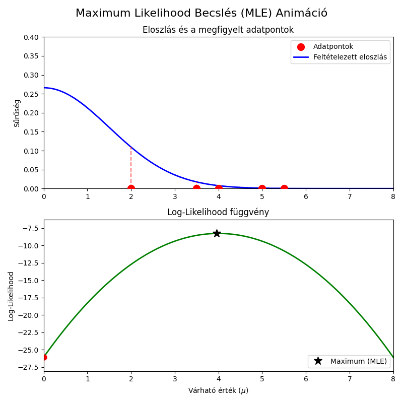
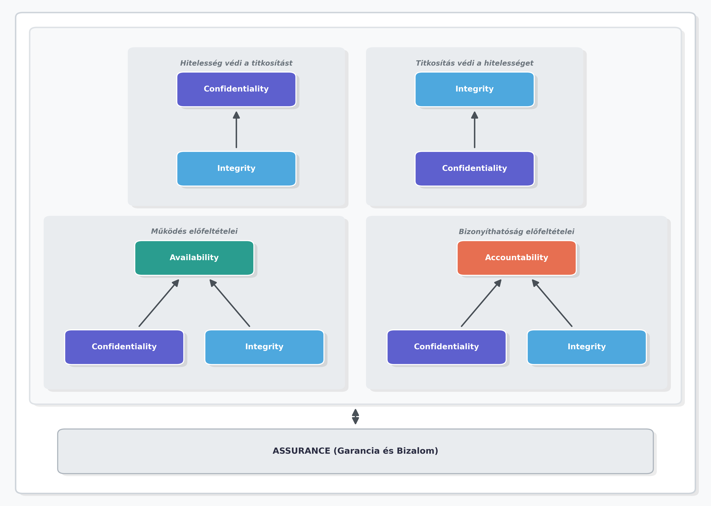
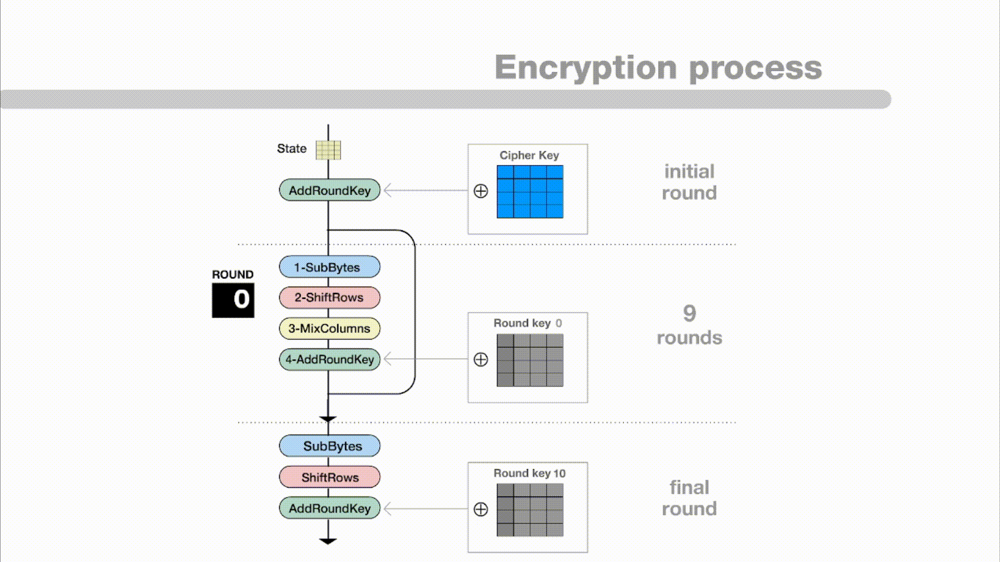

[⬅ Vissza a főoldalra](../../zarovizsga.md)

## 8. tétel

---

### 8.1. Statisztikai minta és becslések, átlag és szórás. Konfidenciaintervallumok. Az u-próba.

#### Statisztikai minta

**Alapelv**: A matematikai statisztika szemléletmódja szerint a megfigyelhető mennyiség valószínűségi változó. Jelöljük ezt $X$-szel.

**Definíció**: Ha $X$ egy valószínűségi változó, akkor $X$-re vett **minta** alatt $X$-szel azonos eloszlású, független $X_1, X_2, \dots, X_n$ valószínűségi változókat értjük.

**Például**: Ha meg akarjuk vizsgálni egy gyárban készült csavarok hosszát, a vizsgált $X$ mennyiség a csavar hossza. Ha kiválasztunk 5 csavart, az elméleti $X_1, \dots, X_5$ változók magát a mintát alkotják, még mielőtt a konkrét méréseket elvégeznénk.

**Jellemzői:**

- az $X_i$ változók megfigyelése $n$-szer, egymástól teljesen függetlenül történik
- az $X_i$ változók eloszlása megegyezik az alapul szolgáló $X$ eloszlásával
- a minta elméleti fogalom, amely az összes lehetséges realizációt magában foglalja

---

#### Minta realizáció

**Definíció**: Rögzített $\omega \in \Omega$ (elemi esemény) esetén a mintát alkotó valószínűségi változók által felvett konkrét értékeket, azaz az $x_1 = X_1(\omega), x_2 = X_2(\omega), \dots, x_n = X_n(\omega)$ szám $n$-est **minta realizációnak** nevezzük.

**Például**: Ha az előző csavaros példában ténylegesen lemérjük az 5 kiválasztott csavart, és a kapott eredmények milliméterben:
$$x_1 = 10.1 \quad x_2 = 9.9 \quad x_3 = 10.0 \quad x_4 = 10.2 \quad x_5 = 9.8$$
Ez a konkrét számötös egy minta realizáció.

**Jellemzői:**

- a gyakorlatban mindig csak minta realizációkat (konkrét számadatokat) figyelünk meg
- a megfigyelési eredmények (realizációk) megfigyeléssorozatonként (kísérletenként) különböznek
- **jelölése**: a nagybetűk ($X_i$) a valószínűségi változókat (a mintát), míg a kisbetűk ($x_i$) a konkrét felvett értékeket (a realizációt) jelölik

---

### Mintaátlag (Empirikus közép)

**Definíció**: Legyen $X_1, \dots, X_n$ egy $X$-re vett statisztikai minta. Az alábbi valószínűségi változót empirikus középnek, más néven **mintaátlagnak** nevezzük:
$$\bar{X} = \frac{1}{n} \sum_{i=1}^n X_i = \frac{X_1 + X_2 + \dots + X_n}{n}$$

**Jelentése**: Tegyük fel, hogy az $X$ valószínűségi változónak létezik várható értéke ($m = EX$). Amennyiben ez az elméleti várható érték a gyakorlatban nem ismert, úgy a minta alapján meghatározott $\bar{X}$ mintaátlag segítségével következtethetünk rá (azaz becsülhetjük azt).

**Jellemzői:**

- **Várható értéke**: A mintaátlag várható értéke pontosan megegyezik az eredeti változó elméleti várható értékével ($m$).
  $$E\bar{X} = \frac{1}{n} \sum_{i=1}^n EX_i = m$$
- **Szórásnégyzete**: A mintaátlag szórásnégyzete az eredeti változó elméleti szórásnégyzetének (jelöljük $\sigma^2 = D^2X$-szel) az $n$-ed része. Ahogy a mintaelemszám ($n$) nő, a mintaátlag szórása úgy csökken.
  $$D^2\bar{X} = \frac{1}{n^2} \sum_{i=1}^n D^2X_i = \frac{\sigma^2}{n}$$

---

### Empirikus szórásnégyzet (Mintaszórásnégyzet)

**Definíció**: Legyen $X_1, \dots, X_n$ egy statisztikai minta, és $\bar{X}$ a mintaátlag. Az alábbi valószínűségi változót **empirikus szórásnégyzetnek** nevezzük:
$$s_n^2 = \frac{1}{n} \sum_{i=1}^n (X_i-\bar{X})^2$$

**Jelentése**: Ennek a statisztikának a segítségével következtethetünk az eredeti $X$ valószínűségi változó elméleti szórásnégyzetére ($\sigma^2$), amennyiben az a gyakorlatban nem ismert.

---

### Korrigált empirikus szórásnégyzet

**Definíció**: Az elméleti szórásnégyzet pontosabb közelítésére (becslésére) egy módosított képletet, a **korrigált empirikus szórásnégyzetet** használjuk, ahol az osztó $n$ helyett $n-1$:
$$s_n^{*2} = \frac{1}{n-1} \sum_{i=1}^n (X_i-\bar{X})^2$$

**Jellemzői:**

- **Várható értéke**: A korrigált empirikus szórásnégyzet várható értéke pontosan megegyezik az elméleti szórásnégyzettel ($Es_n^{*2} = \sigma^2$). Éppen ezért ez a formula sokkal alkalmasabb a szórásnégyzet becslésére, mint a sima empirikus szórásnégyzet.
- A gyakorlatban, ha statisztikai szoftverekkel "mintaszórást" számolunk, szinte mindig ezt a korrigált, $n-1$-gyel osztó képletet alkalmazzák.

---

### Steiner-formula

**Definíció**: Az empirikus szórásnégyzet numerikus kiszámolását (a kézi vagy gépi számolás egyszerűsítését) és az elméleti vizsgálatokat megkönnyítő azonosság a **Steiner-formula**:
$$n \cdot s_n^2 = \sum_{i=1}^n (X_i-a)^2 - n(\bar{X}-a)^2$$
ahol $a$ egy tetszőleges valós szám.

**Jellemzői:**

- Ha a képletbe az $a$ helyére az $m$-et (az elméleti várható értéket) helyettesítjük, akkor ennek segítségével viszonylag egyszerűen kiszámíthatjuk és bizonyíthatjuk, hogy a korrigált empirikus szórásnégyzet várható értéke valóban az elméleti szórásnégyzet lesz.

---

### Statisztikai becslések

A statisztikában a "becslés" azt jelenti, hogy a gyakorlatban megfigyelt minta alapján történik kísérlet a teljes sokaság egy ismeretlen, elméleti paraméterének (például a valódi átlagnak vagy a szórásnak) a meghatározására. A becslések jóságát különböző tulajdonságokkal mérik.

---

#### 1. Torzítatlan becslés

**Definíció**: Egy $T$ statisztikát (kiszámolt értéket) az ismeretlen $t$ paraméter **torzítatlan becslésének** nevezünk, ha a várható értéke megegyezik a becsülni kívánt paraméterrel:
$$ET = t$$

**Szemléletes jelentése**: Ha a kísérletet (a mintavételt) végtelen sokszor megismételnék, és minden alkalommal kiszámítanák a becslést, akkor ezeknek a becsléseknek az átlaga hajszálpontosan kiadná a valódi, keresett értéket. A becslés nem "húz" szisztematikusan sem felfelé, sem lefelé; a valódi érték körül ingadozik.

**Például**: Egy klasszikus példa a céllövő esete, aki a céltábla közepét (a $t$ paramétert) célozza. Bár nem találja el mindig pontosan a közepét, a lövései szimmetrikusan szóródnak a középpont körül. A statisztikában jó példa erre a **mintaátlag** ($\bar{X}$), ami a valódi várható érték ($m$) torzítatlan becslése, mert $E\bar{X} = m$.

---

#### 2. Konzisztens (Erősen konzisztens) becslés

**Definíció**: Egy $T_n$ (az $n$ mintaelemszámtól függő) becsléssorozatot a $t$ paraméter **konzisztens becslésének** nevezünk, ha a mintaelemszám növekedésével a becslés (sztochasztikusan) tart a valódi paraméterhez: $T_n \rightarrow t$.

**Szemléletes jelentése**: Ahogy egyre több adat áll rendelkezésre (az $n$ egyre nagyobb lesz), a becslés egyre pontosabbá válik, és "rásimul" a valódi értékre. Ha végtelen sok adat állna rendelkezésre, a becslés tévedése nullára csökkenne.

**Például**: Egy aszimmetrikus (cinkelt) érme esetén az a cél, hogy kiderüljön, milyen eséllyel esik a fejre (ez az ismeretlen $t$). Ha csak 3 dobás történik, és abból 2 fej, a becslés $2/3 \approx 66\%$. Ha azonban 10 000 dobásból 7 450 a fej, a becslés $74.5\%$. Minél több a megfigyelés (a dobások száma), a relatív gyakoriság annál jobban megközelíti a valódi, elméleti valószínűséget.

---

### Maximum-Likelihood becslés (MLE)

**Alapelv**: Ez egy statisztikai módszer a "legjobb" becslés megtalálására. Azt a "visszafelé" gondolkodást alkalmazza, hogy: _Adott egy konkrét, már megfigyelt minta. Milyen elméleti paraméter (pl. várható érték) mellett lenne a LEGNAGYOBB az esélye annak, hogy pont ez a minta adódjon kimenetelként?_

A Maximum Likelihood nem más, mint a **legjobban illeszkedő elméleti modell megkeresése a már meglévő tényekhez.**

**A logaritmikus trükk (számítási mód)**:
A számításhoz felírják az úgynevezett Likelihood-függvényt (jelölése: $L$), ami megadja a minta valószínűségét a keresett paraméter (jelöljük $\vartheta$-val) függvényében. A cél az $L$ függvény csúcsának (maximumának) megtalálása $\vartheta$ szerint.

Mivel a valószínűségek (vagy sűrűségfüggvény-értékek) szorzásával számolni nehéz (és deriválni is bonyolult), a gyakorlatban egy matematikai trükköt alkalmaznak: veszik a függvény természetes alapú logaritmusát ($l = \ln L$). Mivel a logaritmus függvény folyamatosan növekvő (szigorúan monoton), ahol az eredeti $L$ függvénynek maximuma van, pontosan ugyanott lesz az $l$ (log-likelihood) függvénynek is a maximuma. Így elegendő az $l$ maximumhelyét meghatározni.

**Szemléletes példa (Haranggörbe illesztése)**:
Adott egy megfigyeléssorozat (például 5 mért testmagasság adat), de a teljes vizsgált sokaság várható értéke ($\mu$) ismeretlen. A becslés elvégzése során egy normál eloszlás haranggörbéjének helyzetét (a $\mu$ paramétert) változtatják az adatpontok felett. A Likelihood (illeszkedés jósága) annál nagyobb, minél magasabb sűrűségértékeket vesz fel a görbe a megfigyelt pontoknál. Az eljárás végén azt a $\mu$ értéket fogadják el a sokaság becsült várható értékének, ahol ez az együttes sűrűség (a Likelihood függvény) eléri a maximumát.

---

### Konfidencia intervallum (Megbízhatósági tartomány)

**Alapelv**: A pontbecslések (amikor egyetlen számot adunk meg becslésként) hátránya, hogy szinte biztosan nem találják el hajszálpontosan a valódi, ismeretlen paramétert. Ehelyett a statisztika egy intervallumot határoz meg, és ahhoz rendel egy valószínűséget.

**Definíció**: Legyen $\vartheta$ egy ismeretlen elméleti paraméter. Legyen $T_1$ és $T_2$ a megfigyelt mintából kiszámított két statisztika (az alsó és felső határ). Azt mondjuk, hogy a $[T_1, T_2]$ intervallum egy $1 - \alpha$ megbízhatósági szintű konfidencia intervallum a $\vartheta$ paraméterre, ha igaz a következő összefüggés:
$$P(T_1 \le \vartheta \le T_2) \ge 1 - \alpha$$

**Szemléletes jelentése (A halászháló analógia)**:
Képzeljük el, hogy a tenger fenekén van egy kincsesláda (ez az ismeretlen $\vartheta$ paraméter). A láda fix, nem mozog. A statisztikai mintavétel olyan, mintha a hajóról ledobnánk egy halászhálót (ez az intervallum: $[T_1, T_2]$), abban a reményben, hogy a háló ráesik a ládára.

- Az $\alpha$ a hiba esélye (általában 0.05, azaz 5%).
- Az $1 - \alpha$ a megbízhatósági szint (általában 0.95, azaz 95%).

Ha a kísérletet végtelen sokszor megismételnénk (végtelen sok hálót dobnánk le azonos módszerrel), akkor **a kiszámított intervallumok (hálók) 95%-a sikeresen magában foglalná a valódi, fix paramétert (a ládát)**, és 5%-uk teljesen mellémenne.

**Az intervallum szélessége és a bizonytalanság**:

- A konfidencia intervallum szélessége a becslés bizonytalanságát méri.
- **Széles intervallum**: Nagyobb biztonsággal tartalmazza a paramétert (széles háló), de kevésbé informatív (nem tudjuk pontosan, hol a láda).
- **Keskeny intervallum**: Nagyon pontos információt ad, de nagyobb az esélye, hogy tévedünk (kicsi a háló).
- A mintaelemszám ($n$) növelésével az intervallum általában szűkül, azaz a becslés pontosabbá válik anélkül, hogy a megbízhatóság csökkenne.

#### Gyakorlati példa: Minőségellenőrzés a gyártásban

**A probléma felvetése**
Egy gyár új típusú LED izzókat gyárt. A menedzsment tudni szeretné, hogy a legyártott izzók teljes sokaságának (több millió darabnak) mennyi a tényleges, elméleti átlagos élettartama (ez a keresett, ismeretlen $\vartheta$ paraméter).

**1. A mintavétel**
Mivel lehetetlen minden egyes izzót tönkremenetelig tesztelni, a minőségellenőrök véletlenszerűen kiválasztanak $n = 100$ darab izzót a futószalagról. A tesztelés végén kiszámolják a megfigyelt élettartamok mintaátlagát, ami $\bar{X} = 1500$ óra lett.
_(Tegyük fel, hogy a korábbi gyártási tapasztalatok alapján ismert, hogy a szórás $\sigma = 120$ óra)._

**2. A hibahatár kiszámítása**
A gyár egy 95%-os megbízhatósági szintű ($1 - \alpha = 0.95$) konfidencia intervallumot szeretne. A statisztika matematikai elmélete (a normális eloszlás táblázata) alapján a 95%-os megbízhatósághoz egy szorzószám (ún. $z$-érték) tartozik, ami megközelítőleg 1.96.

Az intervallum sugarát (a statisztikai hibahatárt) az alábbi képlettel kapjuk meg:
$$\text{Hibahatár} = z \cdot \frac{\sigma}{\sqrt{n}} = 1.96 \cdot \frac{120}{\sqrt{100}} = 1.96 \cdot \frac{120}{10} = 1.96 \cdot 12 = 23.52 \text{ óra}$$

**3. Az intervallum felírása és értelmezése**
A konfidencia intervallum alsó és felső határa a mintaátlag $\pm$ a kiszámolt hibahatár:
$$[1500 - 23.52, \ 1500 + 23.52] = [1476.48, \ 1523.52]$$

**Hogyan értelmezzük ezt az eredményt?**
A gyár vezetősége 95%-os magabiztossággal állíthatja, hogy az _összes_ legyártott és a jövőben legyártandó izzó valódi átlagos élettartama 1476.5 óra és 1523.5 óra közé esik. Bár a konkrét 1500 órás pontbecslés szinte biztosan nem egyezik meg hajszálpontosan a valódi átlaggal, ez az intervallum már elég szűk és megbízható ahhoz, hogy a dobozra nyugodt szívvel ráírhassanak egy 1450 órás élettartam-garanciát.

**Mi történne, ha megváltoztatnánk a feltételeket?**

- **Nagyobb megbízhatóság:** Ha a gyár 99%-ig biztos akarna lenni a dolgában, a "halászhálót" szélesebbre kellene húzni. A képletben lévő $z$-érték megnőne, ezáltal a hibahatár nagyobb lenne (pl. $\pm 31$ óra). Az intervallum kiszélesedne.
- **Több tesztelt izzó (Nagyobb minta):** Ha az ellenőrök 100 helyett 400 izzót tesztelnének le ($n = 400$), akkor a $\sqrt{n}$ osztó kétszeresére nőne (10 helyett 20 lenne). Ez a hibahatárt kapásból a felére (kb. $\pm 11.76$ órára) csökkentené. Az intervallum szűkülne, a becslés sokkal pontosabbá válna, miközben a 95%-os megbízhatóság továbbra is megmarad.

---

### Hipotézisvizsgálat: Az u-próba (Egymintás z-próba)

**Alapelv**: A hipotézisvizsgálat a statisztika "bírósági tárgyalása". Van egy feltételezésünk a világ működéséről (például, hogy a gép jól van beállítva), és a megfigyelt minta (bizonyítékok) alapján döntjük el, hogy ezt a feltételezést elvetjük-e vagy sem. Az **u-próba** a legegyszerűbb paraméteres próba, amit akkor használunk, ha egy sokaság várható értékét ($m$) vizsgáljuk, és a sokaság szórása ($\sigma$) előre **ismert**.

**Definíció és Hipotézisek**:
Tegyük fel, hogy $X_1, \dots, X_n$ egy normális eloszlású minta, ismert $\sigma$ szórással. A vizsgált elméleti paraméter a várható érték ($m$). A meglévő, elvárt érték legyen $m_0$.

- **Nullhipotézis ($H_0$)**: $m = m_0$ (Nincs változás, a gép jól működik, az elmélet igaz).
- **Ellenhipotézis ($H_1$)**: $m \neq m_0$ (Valami megváltozott, az elmélet nem igaz. Ezt nevezzük kétoldali ellenhipotézisnek).

**A próbastatisztika ($u$)**:
Ha a nullhipotézis igaz (tehát tényleg $m = m_0$), akkor a megfigyelt mintaátlagból ($\bar{X}$) képzett alábbi statisztika pontosan **standard normális eloszlású** ($N(0,1)$) lesz:
$$u = \frac{\bar{X} - m_0}{\sigma} \sqrt{n}$$

**A döntés logikája (Elfogadó és Kritikus tartomány)**:
Mivel tudjuk, hogy $H_0$ esetén az $u$ értéke standard normális eloszlást követ, felrajzolhatunk egy haranggörbét (ahol a nulla van középen).

- Rögzítünk egy hiba-esélyt (ezt hívják szignifikanciaszintnek, jelölése $\alpha$, általában $0.05$ vagy $5\%$). Ekkora eséllyel fogjuk véletlenül elvetni a jó $H_0$-t (elsőfajú hiba).
- Ebből az $\alpha$-ból a statisztikai táblázat segítségével meghatározunk egy határértéket ($u_{\alpha/2}$). Ezzel a határértékkel a haranggörbét három részre vágjuk:
  1.  **Elfogadó tartomány** $[-u_{\alpha/2}, u_{\alpha/2}]$: Ha a kiszámolt $u$ ide esik (a nulla közelébe), akkor a minta nem mond ellent a nullhipotézisnek. $H_0$-t megtartjuk.
  2.  **Kritikus (elvetési) tartomány**: Ha az $u$ kilóg ebből a sávból (akár jobbra, akár balra), az azt jelenti, hogy nagyon valószínűtlen, hogy ez a minta egy $m_0$ várható értékű sokaságból származzon. $H_0$-t elvetjük $H_1$ javára.

#### A hipotézisvizsgálat 4 lépése a gyakorlatban

1.  **Hipotézisek felállítása**: Megfogalmazzuk $H_0$-t (pl. az átlag 500) és $H_1$-et (pl. az átlag nem 500), valamint rögzítjük az $\alpha$ szignifikanciaszintet (pl. $0.05$).
2.  **Kritikus tartomány meghatározása**: Az $\alpha$ alapján kikeressük a táblázatból a határt jelentő $u_{\alpha/2}$ értéket (0.05 esetén ez $\approx 1.96$). Ezzel kijelöljük, hogy hol húzódik a határ az elfogadás és elvetés között.
3.  **Próbastatisztika kiszámítása**: A kapott konkrét minta realizációból (a mérésekből) kiszámoljuk az $\bar{X}$ mintaátlagot, majd behelyettesítünk az $u$ képletébe.
4.  **Döntés**: Megnézzük, hová esik az $u$ érték. Ha benne van az elfogadó tartományban (a határok között), akkor nincs okunk elvetni $H_0$-t. Ha kilóg, elvetjük $H_0$-t $(1-\alpha)$ megbízhatósággal.

#### Gyakorlati példa: Minőségellenőrzés a pékségben (u-próba)

**A probléma felvetése**
Képzeljünk el egy pékséget, ahol egy automata gép elméletileg pontosan 500 grammos kenyereket süt. A korábbi minőségellenőrzésekből ismert, hogy a gép működésének szórása $\sigma = 10$ gramm. Egy ellenőr arra gyanakszik, hogy a gép elállítódott, ezért lemér $n = 25$ véletlenszerűen kiválasztott kenyeret. A mérések átlaga $\bar{X} = 505$ gramm lett.
Vajon elromlott a gép, vagy ez az 5 grammos eltérés még az elfogadható véletlen ingadozás része?

**1. Hipotézisek és szignifikanciaszint felállítása**

- **Nullhipotézis ($H_0$)**: $m = 500$ (A gép jól van beállítva, a kenyerek valódi átlaga 500g).
- **Ellenhipotézis ($H_1$)**: $m \neq 500$ (A gép elállítódott, a valódi átlag nem 500g).
- **Szignifikanciaszint ($\alpha$)**: Legyen $0.05$ (azaz 95%-os megbízhatósággal hozunk döntést).

**2. A kritikus tartomány meghatározása**
Mivel a szórás ismert, u-próbát végzünk. A standard normális eloszlás táblázatából kinézzük az $\alpha = 0.05$-höz tartozó (kétoldali) határértéket, ami $u_{\alpha/2} = 1.96$.

- **Elfogadó tartomány**: $[-1.96, \ 1.96]$
- **Kritikus tartomány**: Minden, ami ezen kívül esik ($-1.96$-nál kisebb, vagy $1.96$-nál nagyobb értékek).

**3. A próbastatisztika ($u$) kiszámítása**
A képletbe behelyettesítjük a megfigyelt adatokat ($\bar{X} = 505$, $m_0 = 500$, $\sigma = 10$, $n = 25$):
$$u = \frac{\bar{X} - m_0}{\sigma} \sqrt{n} = \frac{505 - 500}{10} \sqrt{25} = \frac{5}{10} \cdot 5 = 0.5 \cdot 5 = 2.5$$

**4. Döntés és értelmezés**
Megvizsgáljuk a kiszámolt próbastatisztikát: a $2.5$ **nem esik bele** a $[-1.96, \ 1.96]$ elfogadó tartományba, annál nagyobb, tehát a kritikus tartományban van.

- **Statisztikai döntés**: A nullhipotézist ($H_0$) $5\%$-os szignifikanciaszinten elvetjük az ellenhipotézissel ($H_1$) szemben.
- **Gyakorlati jelentés**: Az ellenőr 95%-ig biztos lehet benne, hogy a gép valóban elállítódott, és szignifikánsan túlsúlyos kenyereket gyárt. A tapasztalt 5 grammos eltérés túl nagy ahhoz, hogy puszta véletlen legyen (ennek esélye kisebb, mint 5%).

### A t-próba (Amikor a szórás ismeretlen)

A valós életben szinte **sosem ismerjük** a teljes sokaság pontos $\sigma$ szórását (ha a várható értéket nem ismerjük, a szórást miért ismernénk?). Ilyenkor az u-próba nem használható. Helyette a **t-próbát** (egymintás t-próba) alkalmazzuk.

**A különbség**:

- Az elméleti, ismert $\sigma$ helyett a mintából kiszámolt **korrigált empirikus szórást ($s_n^*$)** kell használnunk a képletben.
- Mivel a szórás becslése egy újabb bizonytalanságot visz a rendszerbe, a próbastatisztika (amit itt $t$-nek hívunk) már nem lesz szép standard normális eloszlású. Helyette úgynevezett **Student-féle t-eloszlást** fog követni (amelynek a paramétere a szabadságfok: $f = n - 1$).
- A számolás és a döntés lépései teljesen megegyeznek, csak az $u$-táblázat helyett a $t$-táblázatból nézzük ki a határértékeket.

$$t = \frac{\bar{X} - m_0}{s_n^*} \sqrt{n}$$

---

### 8.2. Az informatikai biztonság fogalma, legfontosabb biztonsági célok. Fizikai védelem, kártékony programok, osztályozásuk terjedési módjuk és büntető rutinjuk szerint. Algoritmikus védelem eszközei: titkosítás, digitális aláírás, hash függvények. Az AES és RSA algoritmusok.

#### Az informatikai biztonság fogalma

**Definíció:** Az informatikai biztonság egy informatikai rendszer olyan állapota, amelyben a kezelt adatok **bizalmassága, sértetlensége és rendelkezésre állása** biztosított. Emellett magának a rendszernek (hardver, szoftver, hálózat) a sértetlensége és rendelkezésre állása szempontjából a védelem megfelel az alábbi négy alapelvnek:

- **Zárt védelem:** A védelem az _összes_ releváns (számításba vehető) fenyegetést figyelembe veszi, nincsenek "elfelejtett" kiskapuk.
- **Teljeskörű védelem:** A védelmi intézkedések a rendszer _minden_ elemére (szerverek, kliensgépek, hálózat, fizikai beléptetés, sőt maguk az alkalmazottak) kiterjednek.
- **Folytonos védelem:** Az időben változó körülmények (pl. éjszaka, hétvége, áramszünet, rendszerfrissítés) nem okozhatnak kiesést a védelemben.
- **Kockázatokkal arányos:** A védelemre szánt költség és erőforrás egyenesen arányos a megvédendő adat értékével és a potenciális kárértékkel. _(Például: egy diákjegyzeteket tároló szerverre nem veszünk 10 millió forintos tűzfalat, de egy banki adatbázisra igen)._

---

#### Fogalmi elhatárolások

- **Információbiztonság:** Mindenféle információ védelmére vonatkozik, **függetlenül a hordozó médiumtól**. Ide tartozik az informatikai védelem is, de ugyanígy a papíralapú szerződések páncélszekrényben tartása, vagy az is, hogy a cégvezetők nem beszélnek titkos projektekről egy nyilvános kávézóban.
- **Informatikai biztonság:** Az információbiztonság része, szigorúan a _számítógépes rendszerekben_ feldolgozott, tárolt és továbbított adatok, illetve maguknak a rendszereknek a védelme.
- **Adatbiztonság:** Az informatikai biztonság része. Konkrét műszaki és szervezési intézkedések összessége, amelyek meggátolják az adatok jogosulatlan megszerzését, módosítását vagy megsemmisülését (pl. titkosítás, jelszavak, biztonsági mentések).
- **Adatvédelem:** A _személyes adatok_ jogszerű kezelését, az érintettek jogainak érvényesülését jelenti (pl. GDPR). Nem technikai, hanem jogi kategória. _(Példa: Ha egy cég titkosítva tárolja a vásárlói adatokat, az adatbiztonságilag kiváló. De ha ezeket az adatokat a felhasználó beleegyezése nélkül eladja egy reklámügynökségnek, akkor súlyosan megsérti az adatvédelmet)._

---

#### A legfontosabb biztonsági célok: A CIA + AA modell

A modern információbiztonság erre az 5 alappillérre épül:

##### Confidentiality (Bizalmasság)

A titkos vagy személyes információkhoz, erőforrásokhoz csak az arra jogosultak férhetnek hozzá. Ezt az adatok tárolásánál, feldolgozásánál és továbbításánál is biztosítani kell.

- **Példa:** Amikor bejelentkezünk egy netbankba, a hálózati forgalom titkosítva van (HTTPS/TLS), így a wifit lehallgató hacker nem látja a jelszavadat vagy az egyenlegedet.

##### Integrity (Sértetlenség)

Két ága van, mindkettő azt garantálja, hogy a dolgok "eredetiek" és "hibátlanok" maradnak:

- **Adatintegritás:** Az adat nem módosul, nem sérül és nem semmisül meg sem a tárolás, sem a továbbítás során. _(Példa: Utalunk 10 000 Ft-ot, és a banki rendszerben nem változik át az összeg véletlenül 100 000 Ft-ra hálózati hiba vagy hackertámadás miatt)._
- **Rendszerintegritás:** A rendszer pontosan az elvártak és a specifikációk szerint működik, mentes a jogosulatlan (például kártékony kódok, trójai vírusok általi) módosításoktól.

##### Availability (Rendelkezésre állás)

A szolgáltatás (és a benne lévő adat) a _jogosultak számára_ a szükséges időben és a szükséges ideig mindig használható és elérhető.

- **Példa:** Egy webáruház szerverei Black Friday alatt sem omlanak össze a terheléstől (vagy egy DDoS támadástól), így a vásárlók tudnak rendelést leadni. Ennek biztosítására használnak pl. redundáns (többszörözött) szervereket.

##### Accountability (Nyomonkövethetőség / Letagadhatatlanság)

A rendszerben végzett minden releváns tevékenység egyértelműen visszakövethető egy konkrét felhasználóhoz vagy folyamathoz.

- **Példa:** Ha egy banki alkalmazott jogosulatlanul lekérdezi egy híres ember számlaadatait, a rendszer naplófájljai megmásíthatatlanul rögzítik, hogy az ő azonosítójával, pontosan mikor, melyik gépről történt a lekérdezés. Így utólag nem tagadhatja le a tettét.

##### Assurance (Biztosíték / Garancia)

A megrendelő/felhasználó megalapozott bizalma abban, hogy a rendszer védelmi mechanizmusai valóban úgy és ott működnek, ahogy azt tervezték, és képesek teljesíteni a fenti 4 célt.

- **Példa:** A cég nem csak "bemondásra" állítja, hogy biztonságos, hanem független kiberbiztonsági cégekkel auditáltatja magát, behatolásvizsgálatot (etikus hackelést) végeztet, vagy megszerzi az ISO 27001-es információbiztonsági tanúsítványt.

---

#### Kapcsolat a célok között

---

#### Sérülési szintek

A biztonsági incidensek hatásait általában három fő kategóriába soroljuk:

##### 1. Alacsony szintű sérülés

- **Hatás**: Korlátozott, lokális vagy kisebb fennakadást okozó hatás.
- **Működés**: A szervezet képes a legfőbb feladatait továbbra is végrehajtani, a kritikus üzleti folyamatok nem állnak le.
- **Kár**: Csak minimális anyagi kár keletkezik, a bevételkiesés elhanyagolható vagy tárgytalan. Az esetleges személyi sérülés vagy hírnévvesztés minimális.
- _Példa_: Egy cég belső, ritkán használt dokumentummegosztó szervere leáll 2 órára. A dolgozók addig e-mailben küldik át az anyagokat egymásnak. A kár csekély, a cég külső működése zavartalan marad.

##### 2. Közepes szintű sérülés

- **Hatás**: Komoly, jól érezhető negatív hatás.
- **Működés**: A szervezet még képes ellátni az alapvető feladatait, de a hatásfoka (hatékonysága) jelentősen csökken. A folyamatok lelassulnak, esetleg alternatív (például papíralapú vagy manuális) megoldásokra kell ideiglenesen átállni.
- **Kár**: Jelentős anyagi kár és mérhető bevételcsökkenés jelentkezik. A cég hírneve rövid távon csorbulhat, komolyabb partneri reklamációk érkezhetnek.
- _Példa_: Egy webáruház bankkártyás fizetési rendszere leáll egy fél napra. A vásárlók csak utánvéttel tudnak rendelni. A cég elesik a megrendelések egy részétől, az ügyfélszolgálat túlterhelődik, de a cég alapvetően túléli a hibát.

##### 3. Magas szintű sérülés

- **Hatás**: Végzetes, kritikus, katasztrofális hatás.
- **Működés**: A szervezet **nem képes** ellátni a legfőbb feladatait. Az alapvető üzleti vagy szolgáltatási funkciók teljesen megbénulnak.
- **Kár**: Katasztrofális anyagi kár, amely akár a cég csődjéhez vagy megszűnéséhez is vezethet. Súlyos jogi és büntetőjogi következmények, helyrehozhatatlan hírnévvesztés, vagy ami a legrosszabb: a személyi biztonság (élet, testi épség) súlyos veszélyeztetése.
- _Példa_: Egy kórház teljes informatikai hálózatát megbénítja egy zsarolóvírus, a biztonsági mentéseket is letörlik. Az orvosok nem férnek hozzá a betegek leleteihez, a gépek leállnak, a műtéteket el kell halasztani. A szervezet alapfunkciója leáll, ami emberéleteket sodor közvetlen veszélybe.

---

#### Fizikai védelem

**Alapelv**: A fizikai védelem feladata az informatikai rendszereket kiszolgáló fizikai erőforrások és a teljes infrastruktúra megóvása a fizikai térben történő károkozástól.

A védelmi intézkedések céljuk szerint két fő csoportba sorolhatók:

- **Preventív (megelőző)**: Célja a kár bekövetkezésének megakadályozása (pl. masszív zárak).
- **Detektív (észlelő)**: Célja a már bekövetkezett, vagy épp zajló esemény azonnali észlelése és riasztás küldése (pl. mozgásérzékelő).

##### A védendő fizikai infrastruktúra elemei

A védelemnek az alábbi négy pillérre egyaránt ki kell terjednie:

- **Informatikai hardver:** Szerverek, kliensgépek, hálózati eszközök (routerek, switchek), adathordozók.
- **Épületek:** Maga az irodaház, a szerverterem és az azt védő falak, nyílászárók.
- **Kiszolgáló rendszerek:** Áramellátás, klímaberendezések, kábelezés, tűzoltó rendszerek.
- **Személyzet:** Az üzemeltető és felhasználó emberek testi épségének és biztonságának garantálása (ez mindig a legmagasabb prioritás).

##### Fenyegetések kategóriái

A fizikai rendszereket érő támadások és veszélyek három fő forrásból érkezhetnek:

- **Környezeti / Természeti csapások:** Tornádó, ciklon, földrengés, vihar, villámcsapás vagy árvíz. (Ezek ellen a megfelelő építészeti tervezéssel és helyszínválasztással lehet védekezni).
- **Technikai fenyegetések:** Feszültséghiány (áramszünet), túlfeszültség (ami kiégetheti a hardvereket), elektromágneses interferencia (EMI - ami megzavarhatja a hálózati kommunikációt vagy az adathordozókat).
- **Emberi fenyegetések:** Jogosulatlan fizikai hozzáférés (betörés, eszközök ellopása), szándékos szabotázs, vagy a személyzet véletlen hibája (pl. egy kritikus kábel véletlen kihúzása).

##### Tipikus védelmi intézkedések (Kontrollok)

A fenti fenyegetések ellen az alábbi konkrét megoldásokat alkalmazzák:

- **Preventív (Megelőző) kontrollok:**
  - **UPS (Szünetmentes tápegység):** Technikai fenyegetések ellen véd; áramszünet vagy feszültségingadozás esetén is folyamatos áramot biztosít a szervereknek.
  - **Felhőhasználat és Backup (Biztonsági mentés):** Katasztrófa (pl. az épület leégése) esetén garantálja, hogy az adatok fizikailag máshol is meglegyenek, így megelőzi a végleges adatvesztést.
  - **Beléptetőrendszerek:** Kártyás vagy kódos zárak az emberi behatolás megelőzésére.
- **Detektív (Észlelő) kontrollok:**
  - **Környezeti szenzorok:** Tűz-, víz- és porérzékelők, amelyek azonnal riasztanak (és esetleg elindítják az oltórendszert), ha baj van a szerverteremben.

---

#### Kártékony programok osztályozása terjedési mód szerint

##### Vírus (Terjedés fertőzött fájl futtatásával)

**Alapelv**: A vírus egy olyan kártékony kód, amely önmagában nem életképes; szüksége van egy "gazdaprogramra" (egy végrehajtható fájlra vagy dokumentumra), amit megfertőz. Terjedéséhez és aktiválódásához elengedhetetlen a felhasználói interakció (pl. a fájl megnyitása, futtatása).

**Miket fertőzhet meg?**

- Alkalmazásokat (futtatható `.exe`, `.com` fájlokat)
- Rendszerfájlokat
- Rendszerindításkor (bootoláskor) lefutó programokat
- Gyakori hordozók: szkript kódokat tartalmazó dokumentumok (MS Office fájlok, Adobe PDF-ek).

**A vírus 3 fő logikai része:**

1. **Fertőző mechanizmus (Infection vector):** Az a módszer, ahogyan a vírus terjed és sokszorosítja önmagát más fájlokba.
2. **Indíték / Aktivátor (Trigger):** Egy logikai feltétel vagy esemény (pl. egy adott dátum, vagy egy program 10. elindítása), amely meghatározza, hogy mikor induljon el a kártékony folyamat (ezt logikai bombának is hívják).
3. **Büntető rutin (Payload):** Maga a kárt okozó tevékenység (pl. fájlok törlése, adatok titkosítása, rendszer lassítása).

**Vírusok csoportosítása célpont szerint:**

- **Boot vírusok:** A háttértárak (merevlemez, pendrive) indító (boot) szektorába ágyazódnak be. Még az operációs rendszer betöltődése előtt aktiválódnak, és minden csatlakoztatott háttértárat megfertőznek.
- **Alkalmazásvírusok:** Betöltődnek a memóriába, és megfertőzik a futó programokat. Típusai a _hozzáfűző_ (append) és a _felülíró_ (replace) vírusok.
- **Makróvírusok:** Olyan dokumentumszerkesztőket támadnak, amelyek támogatják a makrókat (pl. Word, Excel). Terjedésükhöz elég megnyitni a fertőzött dokumentumot (ide tartoznak a levelező vírusok is).
- **Összetett vírusok:** Többféle célpontot is képesek egyszerre támadni (pl. alkalmazásokat és a boot szektort is).

**Vírusok rejtőzködési stratégiái:**

- **Titkosított vírus:** Titkosítja a saját kódját, hogy a vírusirtók ne ismerjék fel a szignatúráját.
- **Lopakodó vírus:** A memóriában maradva kicselezi az operációs rendszert és az antivírus szoftvereket. Képes meghamisítani a fájlméreteket vagy a könyvtárstruktúrát. _Szorosan ide kötődnek a Rootkitek, amelyek a legmagasabb (root/adminisztrátor) jogosultság megszerzése után rejtik el a kártékony folyamatokat._
- **Polimorf vírus:** Minden egyes fertőzési ciklusban (másolódáskor) megváltoztatja a megjelenési formáját, így a hagyományos vírusirtóknak nagyon nehéz felismerni. Egy mutációs motor felel a kulcsgenerálásért és a titkosításért.
- **Metamorf vírus:** A legfejlettebb típus; terjedéskor nem csak titkosít, hanem a saját forráskódját minden alkalommal teljesen újraírja és átstrukturálja, miközben a funkciója ugyanaz marad.

---

##### Féreg (Terjedés sebezhetőségek kihasználásával)

**Alapelv**: A féreg a vírussal ellentétben **önálló program**. Nem igényel gazdafájlt, és (gyakran) felhasználói interakciót sem. Kliens- és szerveroldali sérülékenységeket kihasználva, a számítógép-hálózatokon keresztül terjed, önmagát lemásolva a távoli rendszerekre.

**Hálózati célpont-keresési stratégiák (Hogyan talál új áldozatot?):**

- **Véletlen (Random):** Véletlenszerű IP-címeket generál és próbál megfertőzni. Hátránya a támadó szempontjából, hogy hatalmas és feltűnő hálózati forgalmat generál.
- **Hit-lista:** A féreg indulása előtt a támadó összegyűjti a sebezhető gépek listáját. A féreg ezeken fut végig, a megfertőzött gépek pedig azonnal bekapcsolódnak a további keresésbe. Nagyon gyors és nehezen észrevehető indulást tesz lehetővé.
- **Topológia:** A már megfertőzött gép helyi információi (pl. hálózati kapcsolatok, címjegyzék) alapján keresi a következő célpontokat.
- **Helyi alhálózat:** Ha a féreg bejutott egy belső (tűzfal mögötti) hálózatba, akkor az adott alhálózat címstruktúráját használva fertőz meg további, tűzfal mögötti gépeket.

**A modern férgek jellemzői:**

- **Multiplatform:** Többféle operációs rendszert (Windows, Linux, macOS) és környezetet képesek támadni.
- **Multikihasználás:** Egyszerre többféle behatolási módszert és sérülékenységet próbálnak ki.
- **Ultragyors terjedés:** Képesek perceken belül globális hálózatokat megfertőzni.
- **Polimorf/Metamorf:** A vírusokhoz hasonlóan képesek alakot váltani.
- **Szállítóeszköz funkció:** Gyakran csak a behatolást végzik el, majd "letöltik" a tényleges büntető rutint (ami lehet egy zsarolóvírus, DDoS botnet kliens, kémprogram vagy rootkit).
- **Nulladik napi támadás:** Olyan vadonatúj szoftverhibákat (sebezhetőségeket) használnak ki, amelyeket a szoftver gyártója még nem is ismer, így nincs is rájuk javítás (patch).

**Kliens oldali sebezhetőségek**

Ezek a módszerek gyakran szolgálnak a férgek és trójai programok bejutási pontjául:

- **Drive-by-downloads:** A felhasználó tudta és beleegyezése nélküli, csendes letöltés és telepítés. Elég egy kártékony weboldalt (vagy egy feltört, legális weboldalt) meglátogatni, és a böngésző sebezhetőségét kihasználva a malware a háttérben azonnal települ.
- **Malvertising:** Kártékony hirdetések elhelyezése legális weboldalakon. A hirdetésre kattintva (vagy sokszor akár kattintás nélkül is, csak a hirdetés betöltődésével) lefut a kártékony kód.
- **Szoftver-bugok kihasználása:** E-mail kliensek vagy PDF olvasók sebezhetőségeinek kiaknázása (pl. egy speciálisan szerkesztett PDF, ami megnyitáskor kódot futtat a memóriában).
- **Clickjacking:** Egy rosszindulatú technika, ahol a weblapon a gombok vagy linkek fölé láthatatlan rétegeket tesznek. A felhasználó azt hiszi, hogy egy videót indít el, de valójában egy rejtett gombra kattint (ami pl. letölt egy malware-t vagy elindít egy tranzakciót).

##### Pszichológiai manipuláció (Social Engineering)

A kártékony kódok terjesztésének leggyakoribb módja ma már nem a szoftveres sebezhetőségek keresése, hanem az emberi hiszékenység és figyelmetlenség kihasználása.

- **Adathalászat (Phishing):** Olyan spam e-mailek, amelyek megbízható forrásnak (pl. banknak, szolgáltatónak) álcázzák magukat. Céljuk, hogy a felhasználó aktív részvételével (kattintás, adatok megadása, csatolmány megnyitása) juttassák be a gépre a kártevőt (például egy trójait).
- **Trójai faló (Trojan):** Olyan program, amely látszólag hasznos (pl. egy ingyenes játék vagy segédprogram), de a háttérben rejtett, rosszindulatú funkciókat hajt végre (például nyit egy hátsó ajtót a támadónak).

---

#### Kártékony programok osztályozása büntető rutin szerint

A büntető rutin (payload) az a része a kártékony kódnak, amely a tényleges károkozást végzi, miután a program sikeresen bejutott a rendszerbe.

##### A rendszer károsítása és szabotázs

Ezek a rutinok a rendszer integritását és rendelkezésre állását támadják. Céljuk az adatok tönkretétele vagy elérhetetlenné tétele.

- **Adatok megsemmisítése (Wipers):** A fertőzött rendszeren lévő fájlok végleges törlése vagy felülírása (pl. az 1988-as _Csernobil vírus_, vagy a 2001-es _Klez féreg_).
- **Zsarolóvírus (Ransomware):** Lezárja a felhasználó fájljait vagy az egész rendszert, és a hozzáférés visszaállításáért (dekódoló kulcsért) váltságdíjat követel (általában kriptovalutában).
  - _Titkosító (Crypto):_ Erős titkosítással kódolja a felhasználó személyes fájljait.
  - _Képernyőzáró (Locker / Nem titkosító):_ Nem titkosít, de magát az operációs rendszert teszi használhatatlanná. Gyakran illegális tartalmak letöltésére hivatkozva (pl. "Rendőrségi blokkolás") ijeszt rá az áldozatra.
  - _Böngészőzáró:_ JavaScript alapú kód, ami végtelen ciklusokkal vagy felugró ablakokkal blokkolja a böngésző bezárását.
  - _Hírhedt példák:_ **WannaCry (2017)** (az EternalBlue Windows sérülékenységet kihasználva terjedt), **Petya/NotPetya (2016)**.
- **Logikai bomba:** A kód "alszik" a gépben, és csak egy előre meghatározott feltétel (pl. egy konkrét dátum elérése, vagy egy alkalmazott törlése a bérszámfejtő rendszerből) teljesülése esetén "robban" (töröl adatokat vagy leállítja a rendszert).
- **Fizikai szabotázs:** Hardveres vagy fizikai károkozás szoftveres úton. _(Példa: A Stuxnet féreg, amely kimondottan iráni urándúsító centrifugák motorjait pörgette túl, fizikai megsemmisülést okozva)._

##### Támadó ügynök (Botnetek)

A kártékony kód csendben átveszi az irányítást a gép felett, hogy a támadó távolról felhasználhassa a számítógép erőforrásait (processzor, hálózat). Az ilyen, távolról irányított fertőzött gépeket **Zombiknak**, az ezekből álló hatalmas hálózatokat **Botneteknek** nevezzük.

**Mire használják a zombikat a bűnözők?**

- **DDoS (Elosztott túlterheléses támadás):** Több ezer zombi gép egyszerre küld kérést egy weboldalnak, ami a terheléstől összeomlik.
- **Spam küldés:** Kéretlen reklámlevelek és adathalász e-mailek terjesztése, elrejtve a valódi feladót.
- **Csalások:** Online szavazások, játékok manipulálása, vagy hirdetésekre való hamis kattintások generálása (Adware).
- **Továbbfertőzés:** Újabb kártékony szoftverek terjesztése a zombi hálózaton keresztül.

##### Információszerzés és kémkedés

Célja a fertőzött gépeken tárolt adatok megszerzése (a Bizalmasság megsértése). Pénzügyi vagy ipari kémkedésre használják.

- **Kémprogramok (Spyware) és Keyloggerelek:** A keylogger rögzít minden egyes leütött billentyűt (így lopva el a jelszavakat és bankkártyaadatokat), a spyware pedig a böngészési szokásokat és személyes fájlokat figyeli.
- **Célzott adathalászat (Spear Phishing):** Ellentétben a sima adathalászattal, itt a támadó előzetesen felderíti a célpontot (pl. a cég pénzügyi igazgatóját), és egy nagyon precízen testreszabott, hitelesnek tűnő e-mailt küld neki (Social Engineering).
- **Megszemélyesítés:** Ellopott hitelesítő adatok (Credentials) felhasználása a belső hálózatokon való további, immár "legálisnak" tűnő mozgáshoz.

##### Lopakodás és rejtőzködés

Ezek a rutinok nem okoznak közvetlen kárt, de elrejtik a többi kártevő jelenlétét, és fenntartják a támadó tartós hozzáférését (perzisztencia).

- **Hátsó ajtó (Backdoor):** Egy program vagy rendszer titkos belépési pontja. A támadó ezen keresztül a hivatalos biztonsági hitelesítés (jelszó megadása) megkerülésével tud belépni. _(Megjegyzés: Ritkán, de a programozók is hagyhatnak benne hátsó ajtót tesztelési vagy hibakeresési célból, ami hatalmas biztonsági kockázat)._
- **Rootkit:** Egy olyan fejlett programcsomag, amely a legmélyebb (rendszergazdai/root) jogosultságok megszerzése után teljesen elrejti a támadó folyamatait, fájljait és hálózati kapcsolatait mind a felhasználó, mind a vírusirtó elől.
  - _Perzisztens:_ Beépül az operációs rendszer indulási folyamatába (pl. a Windows Registry-be), így újraindítás után is aktív marad.
  - _Memória alapú:_ Nem hagy nyomot a merevlemezen, csak a RAM-ban él. Újraindításkor eltűnik, de működés közben szinte lehetetlen detektálni.
  - _Működési szint szerint:_ Lehet _Felhasználói (User-mode)_, vagy sokkal veszélyesebb, az operációs rendszer magjába beépülő _Kernel-mode_ rootkit.

---

#### Algoritmikus védelem eszközei: Titkosítás

A kriptográfia (titkosítás) az algoritmikus védelem alapköve. Célja, hogy az adatok (nyílt üzenetek) illetéktelenek számára olvashatatlanná váljanak, és csak a megfelelő kulcs birtokában lehessen azokat visszafejteni. Két fő logikai megközelítést különböztetünk meg:

##### Szimmetrikus titkosítási séma

**Alapelv**: A titkosításhoz és a visszafejtéshez a felek **ugyanazt a kulcsot** használják (vagy a titkosító kulcsból könnyen, polinomiális időn belül kiszámítható a visszafejtő kulcs).

**Matematikai modell**:
Egy szimmetrikus titkosítási séma felírható egy $SE = (Key, Enc, Dec)$ hármasként, ahol:

- **$Key$ (Kulcsgeneráló algoritmus)**: Egy $k$ biztonsági paraméter alapján előállít egy $K$ titkos kulcsot (Secret Key).
- **$Enc$ (Titkosító algoritmus)**: Egy $m$ nyílt üzenetből és a $K$ titkos kulcsból generál egy $c$ titkosított üzenetet (Ciphertext).
  $$c = Enc_K(m)$$
- **$Dec$ (Visszafejtő algoritmus)**: A $c$ titkosított üzenetből a $K$ titkos kulcs segítségével determinisztikus módon visszaállítja az eredeti $m$ nyílt üzenetet.
  $$m = Dec_K(c)$$

**Az alapvető összefüggés**:
$$Dec_K(Enc_K(m)) = m$$
_Megjegyzés: A titkosítási folyamat gyakran tartalmaz egy $r$ véletlen (random) tényezőt, így ugyanaz az üzenet többször letitkosítva más-más kódszöveget ad. A visszafejtő algoritmus azonban mindig szigorúan determinisztikus, hogy az eredeti szöveget kapjuk vissza._

##### Aszimmetrikus titkosítási séma

**Alapelv**: A titkosító és a visszafejtő kulcs **különbözik**. A rendszer egy kulcspárt használ: ami az egyikkel letitkosítható, azt _csak és kizárólag_ a másikkal lehet visszafejteni. A titkos (visszafejtő) kulcsot a nyilvános kulcs ismeretében gyakorlatilag lehetetlen (csak nem polinomiális időben lehetne) kiszámítani.

**Matematikai modell**:
Egy aszimmetrikus titkosítási séma felírható egy $AE = (Key, Enc, Dec)$ hármasként, ahol:

- **$Key$ (Kulcsgeneráló algoritmus)**: Egy $k$ biztonsági paraméter alapján előállít egy kulcspárt: egy $PK$ nyilvános kulcsot (Public Key) és egy $SK$ titkos kulcsot (Secret Key).
- **$Enc$ (Titkosító algoritmus)**: Egy $m$ nyílt üzenetből és a címzett $PK$ nyilvános kulcsából generál egy $c$ titkosított üzenetet.
  $$c = Enc_{PK}(m)$$
- **$Dec$ (Visszafejtő algoritmus)**: A $c$ titkosított üzenetből a címzett a saját $SK$ titkos kulcsának segítségével visszaállítja az eredeti $m$ nyílt üzenetet.
  $$m = Dec_{SK}(c)$$

**Az alapvető összefüggés**:
$$Dec_{SK}(Enc_{PK}(m)) = m$$

##### Összehasonlítás: Szimmetrikus vs. Aszimmetrikus

| Jellemző             | Szimmetrikus titkosítás                                  | Aszimmetrikus titkosítás                                                   |
| :------------------- | :------------------------------------------------------- | :------------------------------------------------------------------------- |
| **Kulcsok fajtája**  | Csak egyetlen közös, titkos kulcs van ($K$).             | Kulcspár: Nyilvános ($PK$) és Titkos ($SK$).                               |
| **Kulcsok kezelése** | Biztonságos kulcscsere algoritmusokat igényel.           | Nyilvános kulcs infrastruktúra (PKI) segítségével menedzselik.             |
| **Időigény**         | Nagyon **gyors** algoritmusok.                           | Nagyon **lassú** (erőforrás-igényes) algoritmusok.                         |
| **Üzenetek mérete**  | **Nagy** méretű adatok (fájlok, streamek) titkosítására. | **Kis** méretű adatok (pl. szimmetrikus kulcsok, jelszavak) titkosítására. |
| **Gyakori példák**   | TDES, AES, ChaCha20                                      | RSA, ElGamal, Elliptikus görbe titkosítás (ECC)                            |

#### Digitális aláírás

**Alapelv**: A digitális aláírás egy aszimmetrikus kriptográfiai sémát használó eljárás. Célja **nem** az üzenet elrejtése (titkosítása), hanem az üzenet **hitelességének**, **sértetlenségének** és **letagadhatatlanságának** garantálása.
_A logikája pont fordítottja a titkosításnak: Itt a feladó a saját **titkos kulcsával** ír alá (amit csak ő tud megtenni), a fogadó (vagy bárki más) pedig a feladó **nyilvános kulcsával** ellenőrzi az aláírás érvényességét._

**Matematikai modell**:
Egy digitális aláírási séma felírható egy $DS = (Key, Sign, Ver)$ hármasként, ahol:

- **$Key$ (Kulcsgeneráló algoritmus)**: Egy $k$ biztonsági paraméter alapján előállít egy kulcspárt: egy $PK$ nyilvános kulcsot (Public Key) és egy $SK$ titkos kulcsot (Secret Key).
- **$Sign$ (Aláíró algoritmus)**: Egy tetszőleges $m$ üzenethez és a feladó $SK$ titkos kulcsához generál egy $S$ digitális aláírást.
  $$S = Sign_{SK}(m)$$
- **$Ver$ (Ellenőrző algoritmus)**: Megkapja a gyanús $m$ üzenetet, a hozzá tartozó $S$ aláírást és a feladó $PK$ nyilvános kulcsát. Kimenete egy Igaz (True) vagy Hamis (False) logikai érték attól függően, hogy az aláírás érvényes-e az adott üzenetre.
  $$Ver_{PK}(m, S) \rightarrow True / False$$

---

#### Kriptográfiai hash függvény

**Alapelv**: A hash függvény egy olyan matematikai algoritmus, amely egy tetszőlegesen hosszú bemeneti adatból (legyen az egy 3 betűs szó vagy egy 10 gigabájtos videófájl) egy **fix, állandó hosszúságú** kimenetet, úgynevezett hash-t (lenyomatot, fingerprintet) készít. A kimenet hossza (pl. 256 bit) csakis az alkalmazott algoritmustól (pl. SHA-256) függ.

**Mire használjuk?**
Elsősorban az **adatintegritás** (sértetlenség) ellenőrzésére.
_Folyamat_: Küldés előtt lefuttatjuk a hash függvényt a fájlon, és a fájllal együtt elküldjük ezt a rövid hash-értéket is. A fogadó letölti a fájlt, ő maga is lefuttatja rajta ugyanazt a hash algoritmust, majd összehasonlítja a kapott eredményt a mi hash-értékünkkel. Ha a kettő hajszálpontosan megegyezik, a fájl nem sérült és nem módosították.

**A Lavinahatás (Avalanche effect)**:
A jó hash függvény legfontosabb tulajdonsága. Ha a bemeneten akár csak **egyetlen egy bitet** (például egy vesszőt egy pontra) megváltoztatunk, a kimeneti hash érték drasztikusan, felismerhetetlenségig megváltozik (legalább a bitek fele átfordul). Ez teszi azonnal észrevehetővé a legkisebb adatmódosítást is.

**A kriptográfiai hash függvényekkel szembeni elvárások (Biztonsági kritériumok):**

1. **Egyirányúság / Őskép-ellenállás (Pre-image resistance):**
   Adott egy $y$ hash érték. Számításigényes (gyakorlatilag lehetetlen) legyen visszakövetkeztetni belőle az eredeti $x$ bemenetre, amelyre igaz, hogy $H(x) = y$. _(Analógia: A darálthúsból nem lehet visszacsinálni a tehenet)._
2. **Második őskép-ellenállás (Second pre-image resistance):**
   Adott egy $x$ bemenet. Számításigényes legyen találni egy tőle különböző $x'$ bemenetet ($x \ne x'$), aminek a hash értéke megegyezik az eredetivel: $H(x) = H(x')$. _(Azaz nem tudok egy kártékony fájlt úgy módosítani, hogy a lenyomata pont kiadja egy eredeti, tiszta fájl lenyomatát)._
3. **Ütközés-ellenállás / Ütközésmentesség (Collision resistance):**
   Számításigényes legyen találni _bármilyen_ két különböző $x$ és $x'$ bemenetet, amelyekre ugyanaz a hash érték jön ki: $H(x) = H(x')$. Mivel végtelen sok bemenet van, de a kimenetek hossza fix (véges), matematikai tény, hogy léteznek ütközések, de ezek megtalálása emberi ésszel/számítógéppel belátható időn belül nem lehetséges.

#### AES (Advanced Encryption Standard) - Szimmetrikus titkosítás

**Alapelv:** Az AES a világ egyik legelterjedtebb szimmetrikus titkosítási algoritmusa. Az adatokat nem bájtonként, hanem blokkokban (128 bites, azaz 16 bájtos blokkokban) titkosítja. Ezt a 16 bájtot egy $4 \times 4$-es mátrixként (ezt nevezzük **Állapotnak** vagy **State**-nek) képzeljük el.

**A titkosítás globális menete (AES-128 esetén):**

1. **Kezdeti lépés:** Az első körkulcs hozzáadása az eredeti bejövő állapothoz.
2. **9 Szabványos kör:** Mind a 9 körben 4 specifikus transzformáció fut le.
3. **Záró kör:** Majdnem ugyanez, de a _MixColumns_ lépés kimarad belőle, és egy utolsó körkulcs-hozzáadással zárul.

##### A szabványos kör 4 lépése

Minden egyes körben az alábbi transzformációs sorozat hajtódik végre az Állapot mátrixon:

1. **SubBytes (Bájt-helyettesítés):** Egy előre definiált helyettesítési tábla (az ún. S-Box) alapján az állapot minden egyes celláját (bájtját) egy teljesen másik bájtra cseréljük. Ez biztosítja az algoritmus nem-linearitását (a zavarosítást).
   
2. **ShiftRows (Sorok eltolása):** A mátrix sorait balra forgatjuk (körkörösen eltoljuk):
   - $1$. sor: Nem változik.
   - $2$. sor: 1 bájttal balra tolva.
   - $3$. sor: 2 bájttal balra tolva.
   - $4$. sor: 3 bájttal balra tolva.
     
3. **MixColumns (Oszlopok keverése):** A mátrix minden oszlopát külön-külön, egy speciális matematikai művelettel (Galois-mező feletti mátrixszorzással) összekeverjük. Így az oszlop minden bájtja hatással lesz az oszlop összes többi bájtjára (ez az elterjesztés).
   
4. **AddRoundKey (Körkulcs hozzáadása):** A lépés végén az így kapott állapotot XOR (kizáró vagy) művelettel bájtonként összeadjuk az aktuális körhöz tartozó körkulccsal.
   

##### Kulcskiterjesztés (Körkulcsok előállítása)

Mivel az AES-nek 10 köre van (+1 a kezdeti lépés), az eredeti 16 bájtos (128 bites) titkos kulcsból összesen 11 darab különböző körkulcsot kell generálnunk.
A körkulcsokat szintén 4 oszlopos (szavas) egységekben állítjuk elő a következő logikával:

**Új körkulcs első oszlopának generálása (A "g" függvény):**
Amikor egy új körkulcsot kezdünk generálni, az előző körkulcs legutolsó (4.) oszlopát vesszük alapul:

1. **Forgatás (RotWord):** Az oszlop bájtjait eggyel felfelé körkörösen eltoljuk (a legfelső bájt kerül legalulra).
2. **Helyettesítés (SubWord):** A kapott bájtokat kicseréljük az S-Box alapján (ugyanúgy, mint a SubBytes-nál).
3. **Konstans XOR (Rcon):** A kapott eredményt XOR-ozzuk a kör állandójával (Rcon).
4. **Végső XOR:** Ezt az eredményt XOR-ozzuk az _előző körkulcs első oszlopával_. Ezzel megkaptuk az **új körkulcs 1. oszlopát**.

**A többi oszlop generálása (Sokkal egyszerűbb):**
Miután az 1. oszlop megvan, a többit láncreakció-szerűen számoljuk ki:

- **2. oszlop** = Előző körkulcs 2. oszlopa XOR Új körkulcs 1. oszlopa
- **3. oszlop** = Előző körkulcs 3. oszlopa XOR Új körkulcs 2. oszlopa
- **4. oszlop** = Előző körkulcs 4. oszlopa XOR Új körkulcs 3. oszlopa

Ez az algoritmus ismétlődik addig, amíg az összes szükséges körkulcs el nem készül.

---

#### RSA Algoritmus

**Alapelv**: Az RSA a legismertebb és legelterjedtebb aszimmetrikus (nyilvános kulcsú) kriptográfiai algoritmus. Különlegessége, hogy a matematikai felépítésének köszönhetően **titkosításra és digitális aláírásra egyaránt** használható.

##### Kulcsgenerálás folyamata

A kulcspár (nyilvános és titkos kulcs) előállítása a következő matematikai lépésekből áll:

1. **Prímszámok választása**: Választunk két nagyon nagy és véletlenszerű prímszámot: $p$ és $q$.
2. **RSA modulus kiszámítása**: Ezek szorzatából megkapjuk az $n$ modulust, amely a nyilvános és titkos kulcsnak is része lesz.
   $$n = p \cdot q$$
3. **Euler-féle $\varphi$ függvény**: Kiszámítjuk a modulushoz tartozó Euler-függvény értékét, ami megadja az $n$-hez relatív prímek számát.
   $$\varphi(n) = (p - 1) \cdot (q - 1)$$
4. **Nyilvános kitevő ($e$) választása**: Választunk egy $e$ egész számot, amelyre igaz, hogy $1 < e < \varphi(n)$, és az $e$ relatív prím a $\varphi(n)$-hez (azaz legnagyobb közös osztójuk 1).
5. **Titkos kitevő ($d$) kiszámítása**: Meghatározzuk azt a $d$ értéket, amely az $e$ multiplikatív inverze modulo $\varphi(n)$. Ez azt jelenti, hogy:
   $$e \cdot d \equiv 1 \pmod{\varphi(n)}$$

- **Nyilvános kulcs ($PK$)**: $(n, e)$ - Ezt bárki megkaphatja.
- **Titkos kulcs ($SK$)**: $(n, d)$ - Ezt szigorúan titokban kell tartani.

##### RSA Titkosítás és Visszafejtés

Ha valaki titkosított üzenetet akar nekünk küldeni, a mi nyilvános kulcsunkat ($PK$) használja. A visszafejtést mi végezzük a titkos kulcsunkkal ($SK$).

- **Titkosítás ($Enc$)**:
  $$c = m^e \bmod n$$
- **Visszafejtés ($Dec$)**:
  $$m = c^d \bmod n$$

##### RSA Digitális Aláírás

Az RSA szimmetriája miatt a folyamat megfordítható. Ha mi írunk alá egy üzenetet, azt a **saját titkos kulcsunkkal** tesszük (amit más nem tud megtenni). A címzett a mi **nyilvános kulcsunkkal** ellenőrzi, hogy tényleg mi küldtük-e.

- **Aláírás ($Sign$)**:
  $$S = m^d \bmod n$$
- **Aláírás ellenőrzése ($Ver$)**:
  $$Ver_{PK}(m, S) = \begin{cases} True & \text{ha } S^e \equiv m \pmod n \\ False & \text{egyébként }\end{cases}$$

##### A háttérben használt matematikai algoritmusok

Az RSA működéséhez hatalmas számokkal (több száz számjegyes értékekkel) kell számolni, ehhez speciális algoritmusokra van szükség:

- **Miller-Rabin prímteszt**: A kezdeti $p$ és $q$ hatalmas prímek gyors és biztonságos generálására és ellenőrzésére.
- **Kibővített euklideszi algoritmus**: A titkos $d$ kulcs (a multiplikatív inverz) gyors kiszámítására az $e$ és a $\varphi(n)$ ismeretében.
- **Gyorshatványozás**: A titkosítás és az aláírás ellenőrzése során használt hatalmas hatványok ($m^e$ vagy $S^e$) hatékony, időtakarékos kiszámítására.
- **Kínai maradéktétel**: A visszafejtés és az aláírás folyamatának felgyorsítására használják (a számítási időt akár a negyedére csökkentheti).

##### Biztonság és Kulcsméret

- **Matematikai alap**: Az RSA biztonsága azon a feltételezésen alapul, hogy egy hatalmas számról (az $n$ modulusról) számításigényes feladat megmondani, hogy melyik két prím ($p$ és $q$) szorzata. Ezt nevezzük **prímfaktorizációnak**. Bár nagyon nehéz probléma, a számítástudományban _nem bizonyított_, hogy polinomiális időben megoldhatatlan (nem bizonyítottan NP-nehéz), a klasszikus számítógépek számára mégis kivitelezhetetlen.
- **Modulus (kulcs) mérete**: A számítási kapacitások fejlődése miatt az **1024 bites RSA kulcs ma már hivatalosan elavultnak és nem biztonságosnak** minősül. A modern szabványok szerint a minimálisan elvárt biztonsági szint a **2048 bites** kulcsméret, de kritikus rendszerek esetén 3072 vagy 4096 bit alkalmazása az ajánlott.
