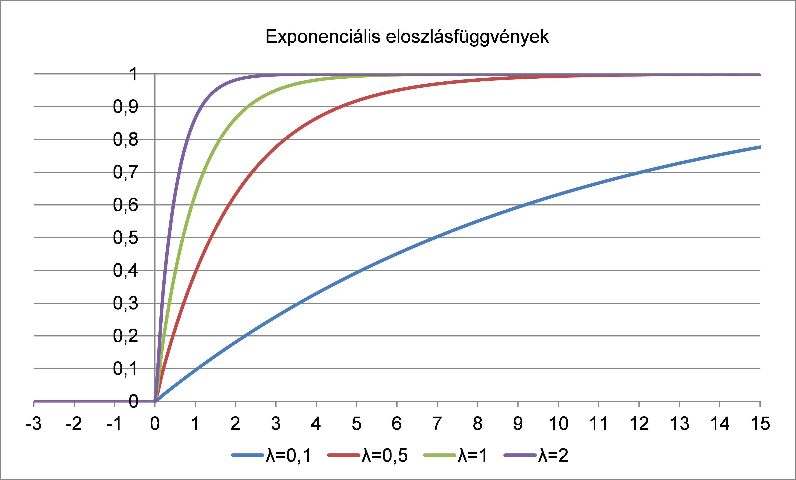
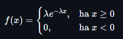
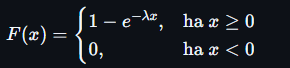

# Matek

## Görög betűk kiejtése

| Kisbetű    | Nagybetű  | Kiejtés  | Kisbetű    | Nagybetű   | Kiejtés  |
| ---------- | --------- | -------- | ---------- | ---------- | -------- |
| $\alpha$   | $A$       | Alfa     | $\nu$      | $N$        | Nű       |
| $\beta$    | $B$       | Béta     | $\xi$      | $\Xi$      | Kszi     |
| $\gamma$   | $\Gamma$  | Gamma    | $\omicron$ | $O$        | Omikron  |
| $\delta$   | $\Delta$  | Delta    | $\pi$      | $\Pi$      | Pi       |
| $\epsilon$ | $E$       | Epszilon | $\rho$     | $P$        | Rhó      |
| $\zeta$    | $Z$       | Zéta     | $\sigma$   | $\Sigma$   | Szigma   |
| $\eta$     | $H$       | Éta      | $\tau$     | $T$        | Tau      |
| $\theta$   | $\Theta$  | Théta    | $\upsilon$ | $\Upsilon$ | Üpszilon |
| $\iota$    | $I$       | Iota     | $\phi$     | $\Phi$     | Fí       |
| $\kappa$   | $K$       | Kappa    | $\chi$     | $X$        | Khí      |
| $\lambda$  | $\Lambda$ | Lambda   | $\psi$     | $\Psi$     | Pszí     |
| $\mu$      | $M$       | Mű       | $\omega$   | $\Omega$   | Omega    |

## 1. tétel

### 1.1. Diszkrét és folytonos valószínűségi eloszlás fogalma. Nevezetes eloszlások: binomiális, Poisson, egyenletes, exponenciális, normális.

---

#### **Eloszlás**

**Definíció:** egy $Ω = \{ω_1,...,ω_N\}$ mintatér esetén a $p_1,...,p_N$ valószínűségeket eloszlásnak nevezünk. Vagyis egy mintatér valószínűségeinek összessége = eloszlás.

**Például**: egy zsákban van 10 golyó, benne van 2 piros, 5 kék, és 3 fehér golyó. Ezeknek az eloszlása így fog kinézni:
$$p_{piros} = 0.2 \quad p_{kék} = 0.5 \quad p_{fehér} = 0.3$$

**Jellemzői:**

- $p_i$ számok nem negatívak
- a valószínűségek összege 1
  $$\sum_{i=1}^Np_i = 1$$

**Valószínűségi változó**: adott $\Omega$ eseménytér, $\mathcal{F}$ eseményhalmaz. A valószínűségi változó egy olyan függvény, amely az eseményhalmazból leképzést készít a valós számok egy megszámlálható halmazává. $X:\mathcal{F} → D$

---

#### **Diszkrét valószínűségi eloszlás**

**Definicíó**: olyan valószínűségi eloszlás, melyben a valószínűségi változók csak véges számú értékeket vehetnek fel, azaz diszkrétek.

**Diszkrét valószínűségi változó**: olyan valószínűségi változó, melynek értékkészlete megszámlálható

Például kockadobás:

$$P(X = 1) = \frac{1}{6}$$
$$P(X = 2) = \frac{1}{6}$$
$$P(X = 3) = \frac{1}{6}$$
$$P(X = 4) = \frac{1}{6}$$
$$P(X = 5) = \frac{1}{6}$$
$$P(X = 6) = \frac{1}{6}$$

---

**Nevezetes diszkrét eloszlások**:

1. **Hipergeometrikus eloszlás**:
   - $X \sim Hyper(N, M, n)$
   - **Jelentése:** Összesen $N$ golyó van a dobozban, benne $M$ piros golyó, $N-M$ fehér golyó. Ki szeretnénk húzni $n$ darabot belőlük **visszatevés nélkül**.
   - **Képlete:**
     $$h_k = P(X = k) = \frac{\binom{M}{k}\binom{N-M}{n-k}}{\binom{N}{n}}$$
     ahol $k$ a kihúzni kívánt piros golyók száma.
   - **Várható értéke:** $E=\frac{Mn}{N}$

2. **Binomiális eloszlás**:
   - $X \sim Binom(n, p)$
   - **Jelentése:** Összesen $N$ golyó van a dobozban, benne $M$ piros golyó, $N-M$ fehér golyó. Ki szeretnénk húzni $n$ darabot belőlük **visszatevéssel**. $p = \frac{M}{N}$, vagyis a piros golyók relatív gyakorisága.
   - **Képlete:**
     $$P(X = k) = \binom{n}{k} p^k (1-p)^{n-k}$$
   - **Várható értéke:** $E=n \cdot p$

3. **Poisson-eloszlás**:
   - $X \sim Poisson(\lambda)$
   - **Jelentése:** Akkor használjuk, ha egy adott időintervallumon bekövetkező események számát szeretnénk jellemezni.
   - **Például**: egy telefonközpontba átlagosan $\lambda=5$ hívás érkezik percenként. Mi annak a valószínűsége, hogy egy adott percben pontosan 3 hívás érkezik?
   - **Képlete**:  
     $$P(X = k) = \frac{\lambda^k e^{-\lambda}}{k!}$$
   - **Várható értéke:** $E=\lambda$

4. **Negatív binomiális eloszlás**:
   - $X \sim NB(r, p)$
   - **Jelentése**: Addig figyeljük a sorozatot, amíg $r$ siker nem következik be. Egy siker valószínűsége $p$.
   - **Például**: Addig dobunk dobókockával, amíg 2 darab 6-ost nem dobunk. Itt $p=1/6, r=2$.
     - **Részesete**: Ha $r=1$, akkor **geometrikus eloszlás**ról beszélünk
     - **Képlete**: $P(X = 1+k) = p(1-p)^k$
   - **Várható értéke:** $E=\frac{r}{p}$

---

**Várható érték**: egy valószínűségi változó súlyozott átlaga.

**Képlete**: $\sum_{k=1}^\infty p_kx_k$, ahol $p_k$ a valószínűség, $x_k$ az érték

**Például**: Kockadobások várható értéke: $\frac{1}{6}\cdot1+\frac{1}{6}\cdot2+\frac{1}{6}\cdot3+\frac{1}{6}\cdot4+\frac{1}{6}\cdot5+\frac{1}{6}\cdot6 =3.5$

**Második momentum:** a valószínűségi változó négyzetének várható értéke, szórásnégyzet kiszámításához lesz hasznos.

$$EX^2 = \sum_{k=1}^\infty p_kx^2_k$$

**Jellemzői**:

- Lineáris:
  - $E(X+Y)=EX+EY$
  - $E(cX)=cE(X)$
- Ha $X$ és $Y$ Független, akkor $E(XY) = E(X) \cdot E(Y)$

---

**Szórásnégyzet (variancia)**: a szórásnégyzet, más néven variancia megmutatja, hogy egy valószínűségi változó milyen mértékben szóródik a várható érték körül.

$$D^2X = \text{Var}(X) = EX^2 - E^2X$$

**Tulajdonságai**:

- $\text{Var}(aX+b)=a^2\text{Var}X$

---

**Eloszlásfüggvény**: megadja, hogy a valószínűségi változó egy adott értékig bezárólag mekkora valószínűséggel vesz fel értéket. Diszkrét eloszlásfüggvénynél ez egy lépcsős függvény.

$F_X(x)=P(X<x)$

**Diszkrét eloszlásfüggvény tulajdonságai**:

- A függvény monoton növekvő.
- A függvény bal-folytonos.
- $\lim_{x→\infty}F(x) = 1, \lim_{x→-\infty}F(x) = 0$

**Például:**

Egy érme feldobásánál az eloszlásfüggvény:

$F_x(x) = 0 \text{ a } x < 0 \text{ tartományban }$

$F_x(x) = \frac{1}{2} \text{ a } 0 \leq x < 1 \text{ tartományban }$

$F_x(x) = 1 \text{ a } x \geq 0 \text{ tartományban }$

---

#### **Folytonos valószínűségi eloszlás**

**Definíció**: olyan valószínűségi eloszlás, melyben a valószínűségi változók végtelen számú értéket vehetnek fel, azaz megszámlálhatatlanok.

**Folytonos valószínűségi változó**: olyan valószínűségi változó, melynek értékkészlete megszámlálhatatlan

**Például buszra várás**:

Tegyük fel, hogy a busz pontosan 5 percenként jön (és nem késik :D), mi véletlen időpontban érünk a megállóhoz. Ha $X$ a várakozási idő (percben), akkor:

$$P(0 \leq X \leq 1) = \frac{1}{5}$$
$$P(1 \leq X \leq 2) = \frac{1}{5}$$
$$P(2 \leq X \leq 3) = \frac{1}{5}$$
$$P(3 \leq X \leq 4) = \frac{1}{5}$$
$$P(4 \leq X \leq 5) = \frac{1}{5}$$

---

**Abszolút folytonos eloszlásfüggvény tulajdonságai:**

- $F(b)-F(a)$: Az érték [a, b] intervallumba esésének valószínűsége.

  **Például**: a normális eloszlást felhasználva:

  $$P(-1 \leq X \leq 1) = F_x(1) - F_x(-1)$$

- **Sűrűségfüggvény**

  **Definíció**: Deriváltja az eloszlásfüggvénynek:  
  Legyen $f$ a sűrűségfüggvény, $F$ az eloszlásfüggvény

  $$f(x) = F'(x)$$

  $$F(x) = \int_{-\infty}^xf(x)dx$$

  **Tulajdonságai:**
  - $\lim_{x→-\infty}f(x) = 0$
  - $\lim_{x→\infty}f(x) = 0$
  - $\int_{-\infty}^\infty f(x)dx = 1$

- **Várható érték**

  Itt nem alkalmazható a diszkrét várható érték képletet, mert megszámláhatatlan sok valószínűségi változó van.

  **Képlete:**

  $$EX = \int_{-\infty}^{+\infty} xf(x)dx$$

  **Tulajdonságai:**
  - Ha $X\geq 0$, akkor $EX\geq 0$ (ha egy valószínűségi változó $X$ nem negatív, akkor a várható értéke is nem negatív lesz.)
  - Ha $X\geq Y$, akkor $EX\geq EY$ (ha $X$ minden egyes kimenetele nagyobb vagy egyenlő, mint $Y$ megfelelő kimenetele, akkor az $X$ várható értéke is nagyobb vagy egyenlő lesz, mint $Y$ várható értéke.)
  - Ha $X\geq 0$ és $EX = 0$, akkor $P(X=0)=1$ (ha egy nem negatív valószínűségi változó várható értéke 0, akkor az esemény, hogy $X=0$, teljes valószínűséggel megtörténik)

- **Nagy számok törvénye**

  **Definíció**: Egy minta átlaga nagy mintaszám esetén közelít a várható értékhez.

  **Például**: Tegyük fel, hogy egy érmét dobunk. Ha csak 5 alkalommal dobsz érmét, előfordulhat, hogy 4-szer fej és 1-szer írás lesz. Ha 1,000, 10,000 vagy több alkalommal dobod az érmét, az átlag egyre inkább közelíteni fog a 0.5-höz.

---

**Nevezetes abszolút folytonos eloszlások:**

1. **Egyenletes eloszlás**  
   
   
   - **Eloszlásfüggvény**:

     

   - **Sűrűségfüggvény**:

     

   - **Várható érték**:  
     $$EX = \int_a^b \frac{x}{b-a} = \left[\frac{x^2}{2\cdot(b-a)}\right]_a^b = \frac{b^2-a^2}{2\cdot(b-a)} = \frac{(b-a)\cdot(b+a)}{2\cdot(b-a)} = \frac{a+b}{2}$$
   - **Második momentum:**
     $$EX^2 = \int_a^b \frac{x^2}{b-a} = \left[\frac{x^3}{3\cdot(b-a)}\right]_a^b = \frac{b^3-a^3}{3\cdot(b-a)}$$
   - **Szórásnégyzet**:  
     $$\text{Var}(X) = EX^2 - E^2X = \frac{(b-a)(b^2+ab+a^2)}{3\cdot (b-a)} - \frac{(a+b)^2}{4} = \frac{b^2+ab+a^2}{3} - \frac{a^2+2ab+b^2}{4} = $$

     $$= \frac{4b^2+4ab+4a^2-3a^2-6ab-3b^2}{12} = \frac{b^2-2ab+a^2}{12} = \frac{(b-a)^2}{12}$$

2. **Normális eloszlás (Gauss-eloszlás)**
   - $X \sim N(\mu, \sigma^2)$

     
     

   - **Jelentése és fontossága:** a legfontosabb eloszlás a valószínűségszámításban. A _centrális határeloszlás-tétel_ miatt a természetben nagyon sok dolog (pl. testmagasság, IQ, mérési hibák) normális eloszlást követ, mert ha sok független, apró véletlen hatás adódik össze, az eredményük ehhez az eloszláshoz tart.
   - **Sűrűségfüggvénye (Haranggörbe): :skull:**
     $$f(x) = \frac{1}{\sqrt{2\pi\sigma^2}} e^{-\frac{(x-\mu)^2}{2\sigma^2}}$$
     ahol $\mu$ a várható érték, $\sigma$ a szórás ($\sigma^2$ a szórásnégyzet).
     - Szimmetrikus a $\mu$-re (itt veszi fel a maximumát).
     - A $\sigma$ határozza meg a "lapultságot": kis $\sigma$ esetén a harang magas és keskeny, nagy $\sigma$ esetén lapos és széles.
   - **Standard normális eloszlás ($N(0, 1)$):**
     - Ez egy speciális eset, amikor $\mu = 0$ és $\sigma = 1$.
     - Ennek az eloszlásfüggvényét $\Phi(x)$-szel jelöljük. Mivel az integrálja nem fejezhető ki elemi függvényekkel, az értékeket hagyományosan táblázatból (vagy géppel) számolják.
   - **Standardizálás:**
     - Bármilyen általános normális eloszlású változó átalakítható standard normálissá az alábbi transzformációval:
       $$Z = \frac{X - \mu}{\sigma}$$
     - Segítségével a valószínűségek könnyen számolhatók a $\Phi(x)$ táblázatból:
       $$P(a \le X \le b) = \Phi\left(\frac{b-\mu}{\sigma}\right) - \Phi\left(\frac{a-\mu}{\sigma}\right)$$

3. **Exponenciális eloszlás**
   - $X \sim Exp(\lambda)$
     
     
   - **Jelentése:** A Poisson-eloszlás folytonos "párja". Arra ad választ, hogy mennyi idő telik el két egymást követő esemény között (pl. mennyi idő múlva érkezik a következő hívás a telefonközpontba, vagy mennyi ideig működik hibátlanul egy alkatrész).
   - **Például:** tegyük fel, hogy egy ügyfélszolgálaton átlagosan $\lambda = 2$ hívás érkezik óránként. Mivel a hívások teljesen véletlenszerűen és egymástól függetlenül futnak be, a két hívás között eltelt idő exponenciális eloszlást követ. A várható értékből kiszámítható, hogy $\frac{1}{\lambda} = \frac{1}{2}$ óra, vagyis átlagosan 30 percet kell várni két hívás között.
   - **Sűrűségfüggvénye:**
     
   - **Eloszlásfüggvénye:**
     
   - **Várható értéke:** $EX = \frac{1}{\lambda}$
   - **Szórásnégyzete:** $\text{Var}(X) = \frac{1}{\lambda^2}$
   - **Örökifjú tulajdonság (emlékezetnélküliség):**
     $$P(X > t + s \mid X > s) = P(X > t)$$
     - Az eloszlás "nem emlékszik" a múltra. Ha egy gép eddig $s$ ideig nem romlott el, annak az esélye, hogy még további $t$ ideig jó marad, pontosan ugyanannyi, mintha most vettük volna újonnan a boltban.

### 1.2. Adatszerkezetekkel kapcsolatos alapfogalmak: absztrakció, absztrakt adatszerkezetek. Elemi adatszerkezetek: lista, verem, sor. Halmaz, multihalmaz, tömb. Fák ábrázolása, bejárások, keresés, beszúrás, törlés.
